--- title: "Affiliate 2.0"    
labels:
- android
- affiliate
- feature
- documentation
---   

| **Status** |  <!--start status:GREEN-->RELEASE<!--end status--> |    
| --- | --- |    
| **Project Lead** | [Zishan Rashid](https://tokopedia.atlassian.net/wiki/people/5c53e2323290dd17112962f7?ref=confluence)  |    
| Product Manager | [Ahmad Hilman Prasetya](https://tokopedia.atlassian.net/wiki/people/5fd6f86c208dbf0107bfb16c?ref=confluence) [Nadiah Pristania](https://tokopedia.atlassian.net/wiki/people/6240e50cf6a26900695b05dc?ref=confluence)  |    
| Team | [Deepesh Tiwari](https://tokopedia.atlassian.net/wiki/people/62873f7b56b84700697907e2?ref=confluence) [Khushal Uttam](https://tokopedia.atlassian.net/wiki/people/62c7bdf25f45f3d3b7b7c19a?ref=confluence)  |    
| Release date |  |    
| Module type | <!--start status:YELLOW-->FEATURE<!--end status--> |    
| Product PRD | [https://tokopedia.atlassian.net/wiki/spaces/AF](/wiki/spaces/AF)  |    
| Module Location | `features/category/affiliate_toko` |    

## Table of Contents

<!--toc-->    

## Overview

An affiliate marketing program for Tokopedia. It allows individuals and businesses to earn commission by promoting Tokopedia’s products, shops and campaigns on their website, blog or social media accounts.      
It also provides reporting and analytics to affiliates, allowing them to track their earning and optimise their promotions for better results.

## Background

Through the platform, we shall:

- Empower content creators and influencers to monetize their traffic
- Connect Tokopedia with shopping outside of our app
- Bring more traffic and orders to Tokopedia
- Help merchants promote their products better

## Project Description

The Affiliate feature module consists following pages -

- Home - Contains user info, different analytics and product, shops, and campaign listing that can be promoted.
- Promosikan - Contains Search, Gami, SSA and Discovery Entry points. It also contains recently seen and recently bought listings.
- Promo Search - Users can search for any product and shop using the respective link and create an affiliate link to promote it.
- Transaction History - Contains transaction history and Withdraw Actions.
- Education - Contains different affiliate program-related education resources.

## Tech Stack

- SSE (Server Side Events)

- Getting real-time *total click* count using SSE.
## Navigation

*Tokopedia main page →* *Hamburger Menu → Affiliate Entry Point*

You can go to the affiliate by clicking on the *hamburger menu* and then the *affiliate menu*.

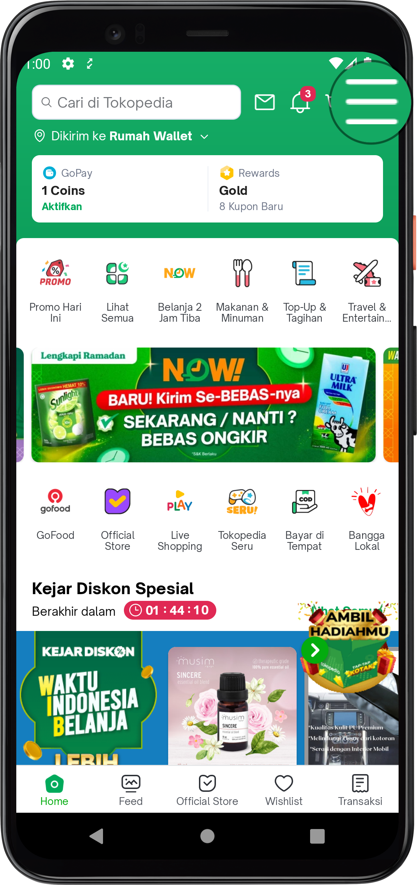

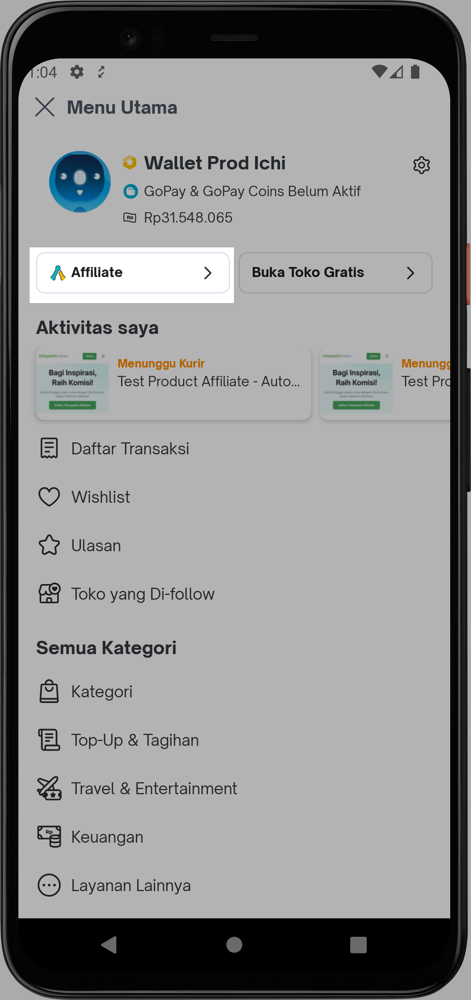

## How-to

| **Page** | **Description** | **Video/Image/Figma** | **GQL/PRD** |    
| --- | --- | --- | --- |    
| Registration *Tokopedia affiliate entry-point → Affiliate registration page* | - *As affiliate registrants, Users can register as tokopedia affiliates. So that, they can start promoting a product and monetize the traffic.* - Onboarding page (promotion channel input)  - *As an affiliate registrant, Users can fill in their promotion channel account. So that, people know where they’re going to promote the products.* - Onboarding page (TnC agreement)     - *As an affiliate registrant, Users can read the terms and conditions and then agree to them. So that, They are aware of the rules and consequences.*  | <https://www.figma.com/file/WZC97qtIfGEx4cnKE3bXeN/%5BAffiliate%5D-Mobile-Portal?node-id=2703-134899&t=5iamqJZsvrwx4oaF-0> 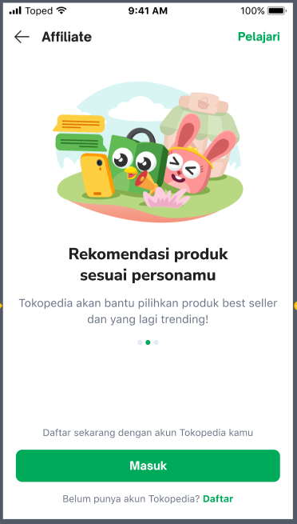 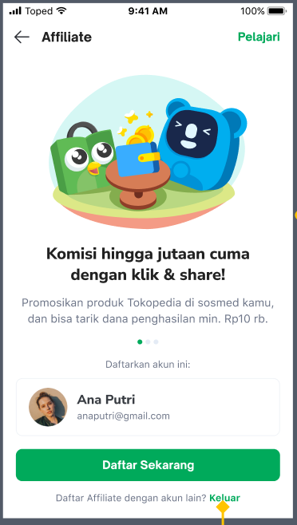 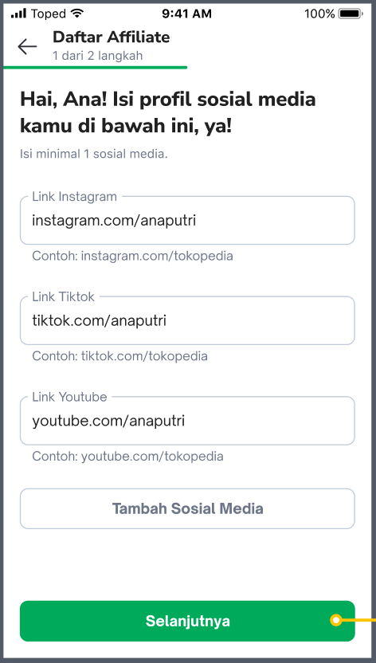 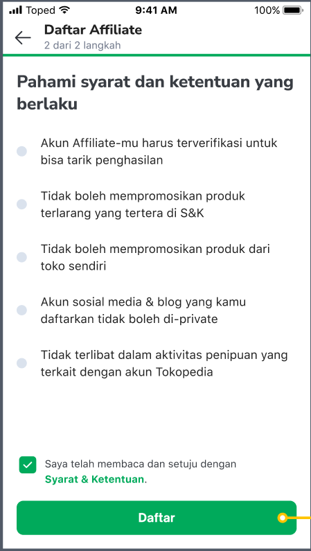  | [GoTo Seamless Login API Docs](/wiki/spaces/AUT/pages/1955725733/GoTo+Seamless+Login+API+Docs) [Validate Affiliate User Status](/wiki/spaces/AF/pages/1693717006/Validate+Affiliate+User+Status) [Affiliate On-boarding](/wiki/spaces/AF/pages/1693717576/Affiliate+On-boarding)  |    
| Promosikan  *Promosikan page (home page)* OR `tokopedia://affiliate/promosikan`   `tokopedia://affiliate` | - Copy/Paste info   - *Users can see copy-paste information on how to search for a product or shop* - Gami and SSA Entry Points    - *Users can go to Gamification or SSA Shop list by clicking respective entry points.* - Discovery Banner  - *Users can see discovery campaign banners and can go to more listings by clicking on “lihat semua“.* - Recommendations   - *Users can see recommended products based on their recent view and last purchase. So that, they can promote products that they were interested in and/or have tried and experienced so that others can also purchase it*  |  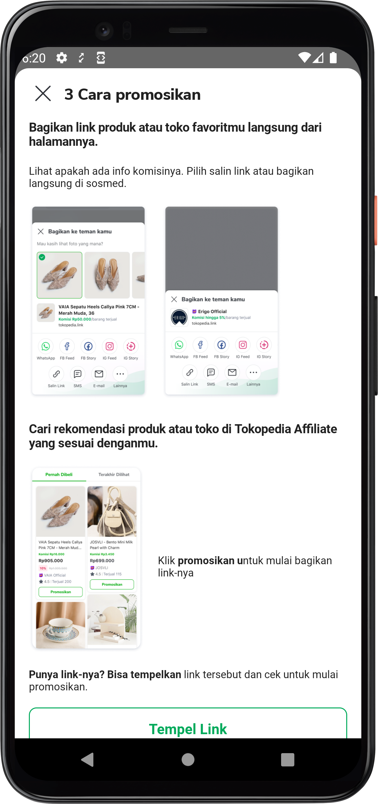  | [Fetch Recommended Discovery Campaign](/wiki/spaces/AF/pages/2110980968/Fetch+Recommended+Discovery+Campaign) [Fetch Recommended Product](/wiki/spaces/AF/pages/1695812925/Fetch+Recommended+Product) [Fetch Recommended Product for SSA Active Campaigns](/wiki/spaces/AF/pages/2130252720/Fetch+Recommended+Product+for+SSA+Active+Campaigns) [Validate Affiliate User Status](/wiki/spaces/AF/pages/1693717006/Validate+Affiliate+User+Status) [Get Announcements V2](/wiki/spaces/AF/pages/1948816403/Get+Announcements+V2) [Generate Affiliate Link GQL](/wiki/spaces/AF/pages/1693684315/Generate+Affiliate+Link+GQL)  |    
| Discover Banner List *Home → Discovery Banner Lihat Semua* OR `tokopedia://affiliate/discopage-list` | - *Users can see all discovery campaign banners and promote them by generating and sharing attribution links*  |   | [Fetch Recommended Discovery Campaign](/wiki/spaces/AF/pages/2110980968/Fetch+Recommended+Discovery+Campaign) [Generate Affiliate Link GQL](/wiki/spaces/AF/pages/1693684315/Generate+Affiliate+Link+GQL)  |    
| SSA Shop list   *Home → SSA entry point* OR `tokopedia://affiliate/shoplist-dipromosikan-affiliate` | - *Users can see all shops that are eligible for extra commission so that they can promote by generating and sharing attribution links.*  | 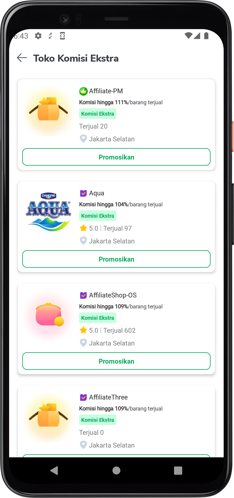  | [ShopList Contract for SSA](/wiki/spaces/AF/pages/2092436785/ShopList+Contract+for+SSA) [Generate Affiliate Link GQL](/wiki/spaces/AF/pages/1693684315/Generate+Affiliate+Link+GQL)  |    
| Search  *Home → Copy/Paste info → Tempel Link* | - Search   - *Users can search for products or shops that are eligible for the program using a product or shop link. So that, they can easily browse and generate the affiliate link.* - *Search results*     - *Users can see the search results after doing the product/shop search. So that, They can directly generate the affiliate link.*  | 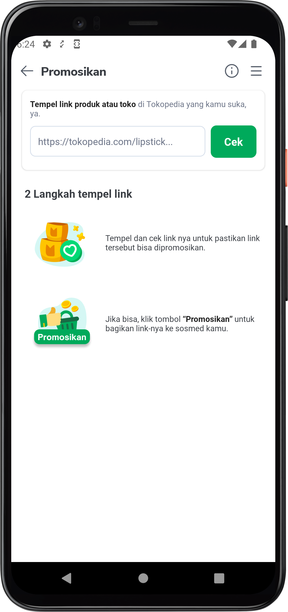 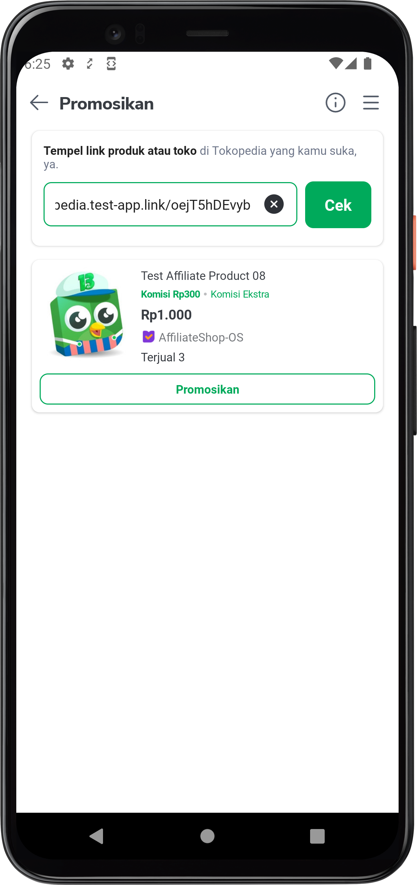  | [Search GQL](/wiki/spaces/AF/pages/1693914043/Search+GQL) [Generate Affiliate Link GQL](/wiki/spaces/AF/pages/1693684315/Generate+Affiliate+Link+GQL)  |    
| Affiliate Performa Page  *Home → Performa Page (accessed from bottom nav-bar)* OR `tokopedia://affiliate/performa` | - Performance   - *Users can see the affiliate homepage with their summary performance listed. So that, They can get a glance at their performance so far.* - Information Tooltip  - *Users can see information regarding metrics definition.* - Filter date bottom-sheet     - *Users can filter the performance based on the range of date they need. So that, They can track the performance based on the needed period.* - Filter Chip   - *Users can filter performance listings on basis of Products, Shops and Events.* - Performance Listing    - *Users can see attributed Products, Shops and Events Listings and their performance data with.* - Share Bottom Sheet     - *Users can generate and share attribution links for Products, Shops and Events for different platforms by clicking them.*  | <https://www.figma.com/file/WZC97qtIfGEx4cnKE3bXeN/%5BAffiliate%5D-Mobile-Portal?node-id=2671-131697&t=NBYNk84LhM5GJe33-0> 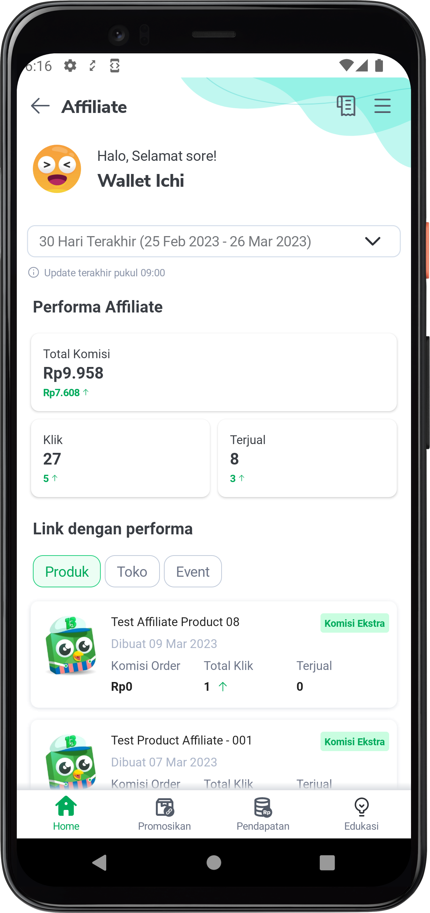 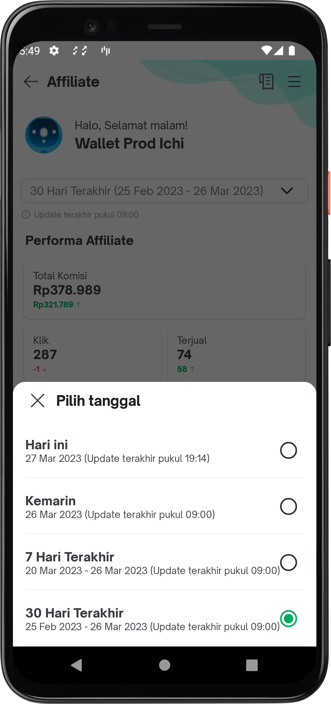 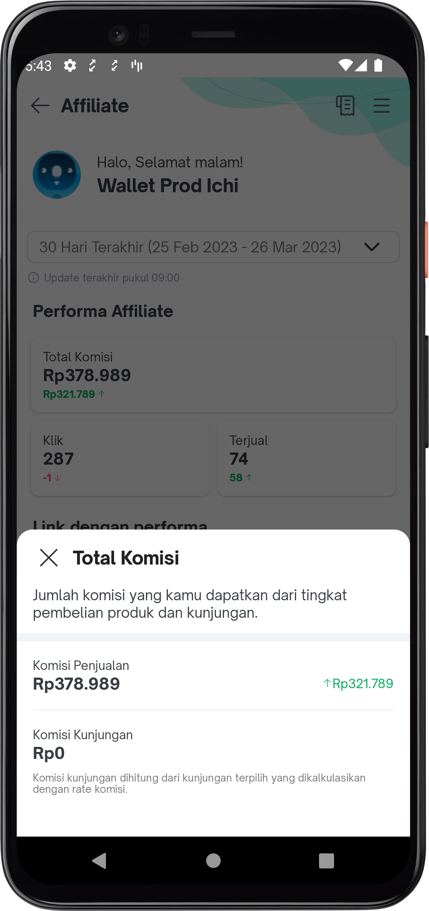 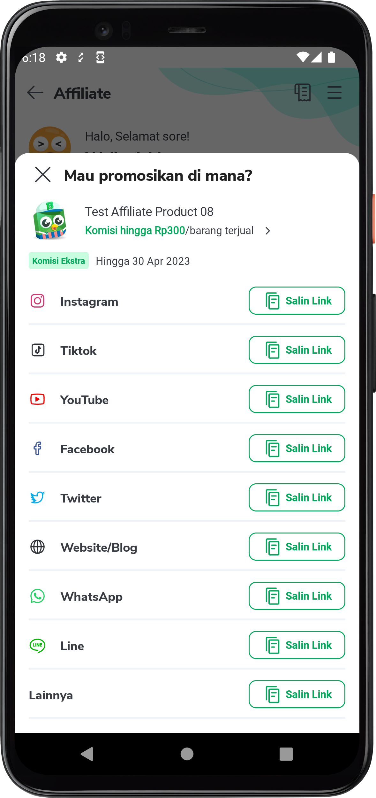  | [GetAffiliatePerformanceList for SSA](/wiki/spaces/AF/pages/2092567954/GetAffiliatePerformanceList+for+SSA) [Get Affiliate Performance List Query](/wiki/spaces/AF/pages/1836355566/Get+Affiliate+Performance+List+Query) [Fetch Item Type List](/wiki/spaces/AF/pages/1981973705/Fetch+Item+Type+List) [Get Affiliate Performance Query](/wiki/spaces/AF/pages/1693717676/Get+Affiliate+Performance+Query) [Get Announcements V2](/wiki/spaces/AF/pages/1948816403/Get+Announcements+V2) [Validate Affiliate User Status](/wiki/spaces/AF/pages/1693717006/Validate+Affiliate+User+Status) [Date Range for Home PDP](/wiki/spaces/AF/pages/1932890204/Date+Range+for+Home+PDP) [Generate Affiliate Link GQL](/wiki/spaces/AF/pages/1693684315/Generate+Affiliate+Link+GQL)  |   
| Transaction History  *Home → Pendapatan (accessed from bottom nav-bar)* OR `tokopedia://affiliate/transaction-history` | - Transaction History  - *Users can see all transaction history list in their wallets. So that, They are aware of all the incoming and outgoing money.* - Date Filter     - *Users can filter the transaction history listing based on the range of dates they need.* - Withdraw     - *Users can withdraw their earnings by clicking on the “Tarik saldo” button.* - Transaction History Detail    - *Users can see detailed specifications and information about the transaction by clicking one of them.*  | 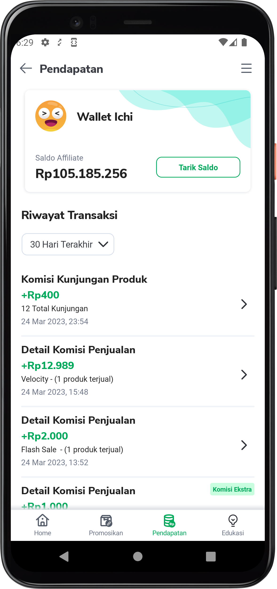 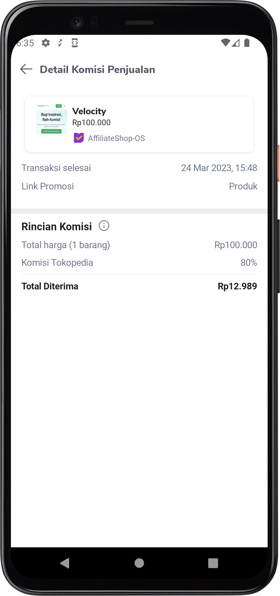 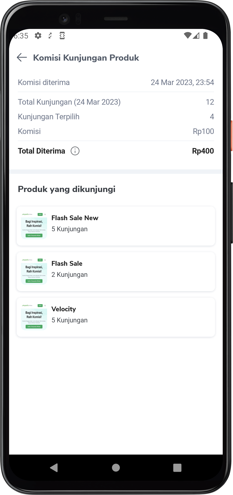  | [Get Announcements V2](/wiki/spaces/AF/pages/1948816403/Get+Announcements+V2) [Validate Affiliate User Status](/wiki/spaces/AF/pages/1693717006/Validate+Affiliate+User+Status) [Get Affiliate Balance](/wiki/spaces/AF/pages/1693684374/Get+Affiliate+Balance) [Get Affiliate Transaction History](/wiki/spaces/AF/pages/1838977093/Get+Affiliate+Transaction+History) [Date Range for Home PDP](/wiki/spaces/AF/pages/1932890204/Date+Range+for+Home+PDP) [Withdraw](/wiki/spaces/AF/pages/1837007152/Withdraw) [GOTO KYC Registration - GQL Contract](/wiki/spaces/AUT/pages/2091687978/GOTO+KYC+Registration+-+GQL+Contract)  |    
| Education  *Home → Edukasi (accessed from bottom nav-bar)* OR `tokopedia://affiliate/edu-page` | - Educations   - *Users can see the highlighted information so that they can know the newest updates related to Affiliate program.*   - *Users can follow the tokopedia affiliate page on different social media platforms.* - Search Result Page    - *Users can see the relevant search results that show the list of articles/event that contains keyword they inputted.* - Category Landing Page    - *Users can browse the list of articles under specific content categories and easily navigate through the second level category under the same L1 so that they can easily find the relevant articles that they want to read easily.* - Learn  - *Users can access learning articles, the help section and the privacy policy.*  | 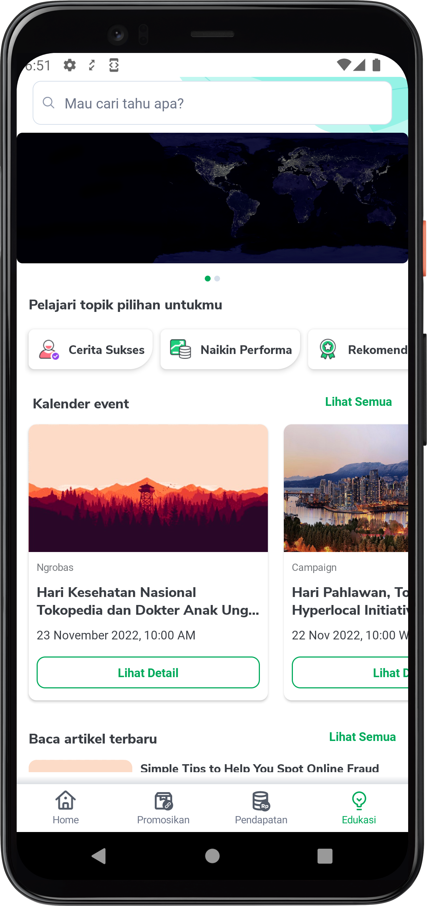 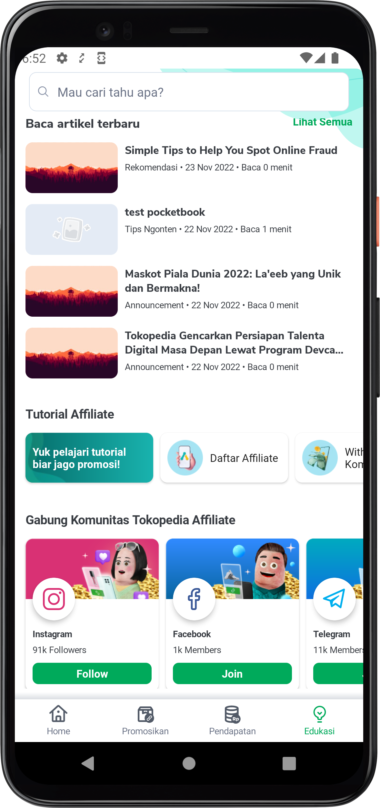 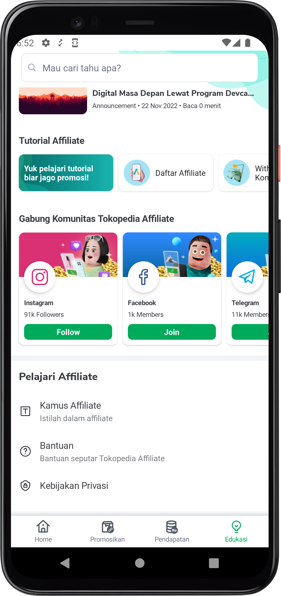 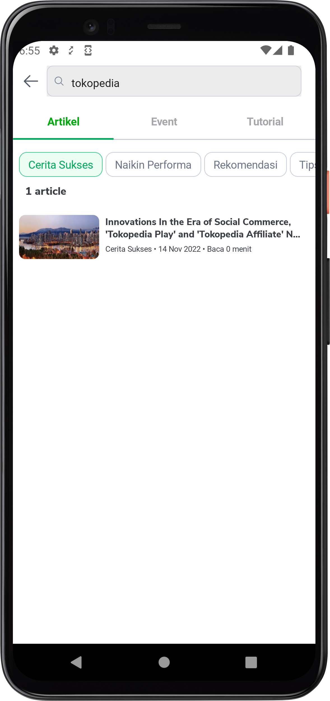 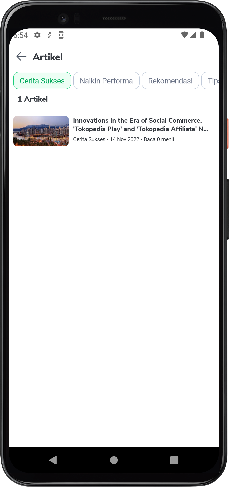 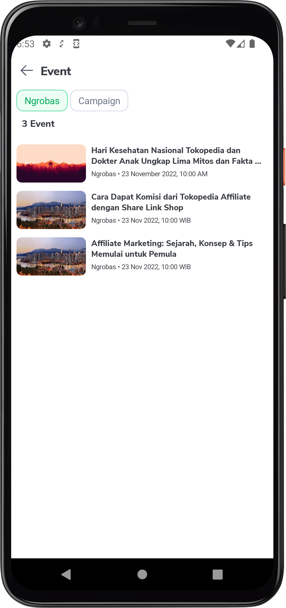  | [Dynamic Banner Usecases](/wiki/spaces/PES/pages/1904476656/Dynamic+Banner+Usecases) [Category Tree/Topic Landing Page](/wiki/spaces/PES/pages/939394220) [Article Cards](/wiki/spaces/PES/pages/963458762/Article+Cards) [Search Result Page](/wiki/spaces/PES/pages/961970720/Search+Result+Page) <https://tokopedia.atlassian.net/wiki/spaces/AF/pages/1959625213/PRD+Affiliate+Microsite+Akademi+Kreator+Tokopedia+Sections?NO_SSR=1> |    
| Link Generation History  *Tokopedia main page → Home → Perfroma → Riwayat link dipromosikan* | - *Users can see generated product link history. So that, They know the list of products that they have generated in the past and can easily re-promote it again.*  | 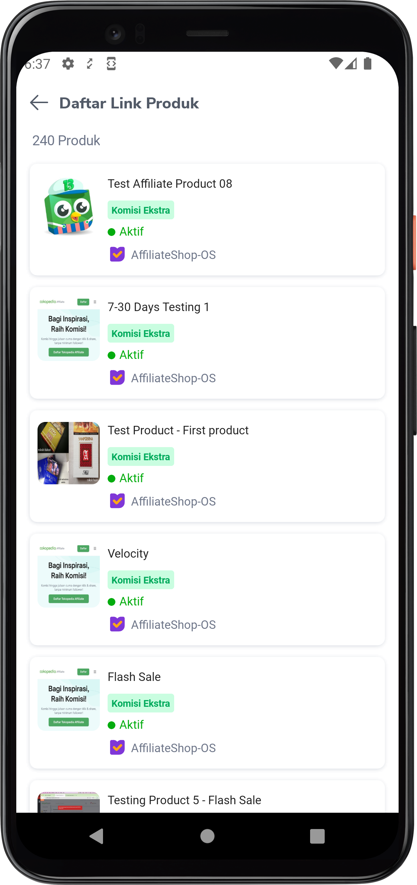  | [[Updated] GetAffiliateItemsPerformanceList GQL contract](/wiki/spaces/AF/pages/2176795422) [GetAffiliateItemsPerformanceList GQL contract for SSA](/wiki/spaces/AF/pages/2103773169/GetAffiliateItemsPerformanceList+GQL+contract+for+SSA) [Generate Affiliate Link GQL](/wiki/spaces/AF/pages/1693684315/Generate+Affiliate+Link+GQL)  |    

    
---   
## Useful Links

- [Figma](https://www.figma.com/file/WZC97qtIfGEx4cnKE3bXeN/%5BAffiliate%5D-Mobile-Portal)
- [Figma 2.0](https://www.figma.com/file/BN5YC1zPMENzFGGChHi6bc/%5BAffiliate%5D-Portal-2.0-Phasing)
- [https://tokopedia.atlassian.net/wiki/spaces/AF](/wiki/spaces/AF)

## FAQ

<!--start expand:What is the Tokopedia Affiliate Program?-->    
The Tokopedia Affiliate Program is a program where you will get a commission for every Tokopedia product sold by sharing product links generated through the Tokopedia Affiliate platform to your social media such as Youtube, Facebook, Instagram, Twitter, TikTok, websites and other public sites.
<!--end expand-->    

<!--start expand:How much is the Tokopedia Affiliate Program commission?-->    
Get up to 10% commission up to IDR 50,000 for every product sold from the product link and shop page link that you share. If someone visits the product link and the shop page, you also have the opportunity to get a visit commission.
<!--end expand-->    

<!--start expand:How do I register to become an affiliate?-->    
To register, you can register directly through the Affiliate platform in the Tokopedia Application.
<!--end expand-->    

<!--start expand:What are the requirements to join the Tokopedia Affiliate Program?-->    
You only need to have a Tokopedia account & be active on social media, without a minimum number of followers.
<!--end expand-->    

<!--start expand:Can the commission I receive be withdrawn to my personal account?-->    
The commission will go to the Affiliate Balance and you can withdraw it to your account. Make sure that you have gone through the Account Review Process first before you can withdraw your commission. For subsequent withdrawals, you can access the Affiliate Balance Earnings page and transfer the funds to your bank account on the Affiliate Dashboard. Please complete your bank information and the verification process via OTP or by entering your Tokopedia PIN.
<!--end expand-->    

<!--start expand:How do I track my commission earnings as a Tokopedia affiliate?-->    
You can track your commission, earnings and different analytics on the dashboard, You can also view transaction history, and request a withdrawal upon completing KYC.
<!--end expand-->    

<!--start expand:When will I receive my commission?-->    
The commission will be received after the product you recommended has been sold successfully and the transaction status has been completed. Generally, it takes a maximum of two days after the product is sent or after the buyer presses the "product received" button. In the case of goods or funds being returned, we may deduct a commission from your earnings, depending on the reason for the return. We will look into the case before taking action and contacting you.
<!--end expand-->