| **Status** | <!--start status:GREEN-->RELEASE<!--end status-->  |
| --- | --- |
| **Project Lead** | [Zishan Rashid](https://tokopedia.atlassian.net/wiki/people/5c53e2323290dd17112962f7?ref=confluence)  |
| Product Manager |  [Karenia Emeralda Arnetha](https://tokopedia.atlassian.net/wiki/people/6170b6eb3e3753006fa4d8e4?ref=confluence) [Atika Rahmawati Yuliantoputri](https://tokopedia.atlassian.net/wiki/people/612c2bb044c8ed00686150e6?ref=confluence) |
| Team | [Darth](https://tokopedia.atlassian.net/people/team/8c90de56-d4f1-45a7-9021-bd87c4ea9ce2) ([Mohit Singh](https://tokopedia.atlassian.net/wiki/people/5ff3fa2244065f013f9f1eb9?ref=confluence) [Zishan Rashid](https://tokopedia.atlassian.net/wiki/people/5c53e2323290dd17112962f7?ref=confluence) ) |
| Release date | 19 Mar 2021 / <!--start status:GREY-->MA-3.119<!--end status-->  |
| Module type | <!--start status:YELLOW-->FEATURE<!--end status--> |
| Product PRD | [[PRD] Catalog 2.0 - Catalog Widget - Product basic information](/wiki/spaces/CT/pages/1173554348)  |
| Module Location | `features/category/catalog` |

## Table of Contents

<!--toc-->

## Release Notes

<!--start expand:19 Aug 22 (MA-3.188)-->
Catalog Rollence Removal, Hyperlocal on products
<!--end expand-->

<!--start expand:30 May 22 (MA-3.176)-->
Catalog New Design Product List Scroll
<!--end expand-->

<!--start expand:14 Mar 22 (MA-3.166)-->
Catalog For You (Untukmu Widget)
<!--end expand-->

## Overview

A catalog is a collection of products that has an identical brand, type, and specifications (a SKU) from various merchants. A catalog product acts as a master data for Tokopedia products and it contains all the information and details related to the product including product images, descriptions, specifications, etc. One of the purposes of a catalog is to provide buyers with the most accurate, complete, and compelling information about a product; hence helping them in making the right buying decision (before deciding which merchant to purchase from). Furthermore, as there are hundreds of identical products available at Tokopedia, catalogs help buyers during their shopping journey by clustering these identical products. These product clusters allow users to view various different product SKUs and enable buyers to compare products easily

### Project Description

Improve the experience of the user to understand the product better with components like gallery, images, specifications, descriptions, comparisons, reviews and related products

## Tech Stack

- Visitor Pattern: Components from BE
- Youtube Player : Play videos in video section

## Flow Diagram

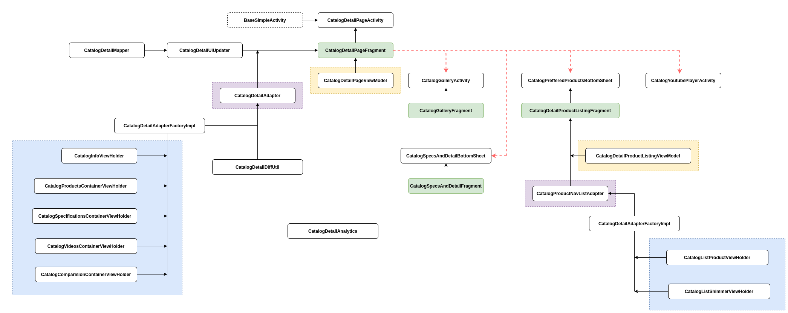


| **API** | **Notes** | **Type** |
| --- | --- | --- |
| [Catalog Modular API](/wiki/spaces/CT/pages/1225490842/Catalog+Modular+API)  | Main Page Api, Contains all components | GQL |
| [API - Filter and Sort](/wiki/spaces/SE/pages/538805340/API+-+Filter+and+Sort)  | Contains filter data | GQL |
| [Catalog Product Review](/wiki/spaces/CT/pages/1840776329/Catalog+Product+Review)  | See all from review widget open bottom sheet with all reviews | GQL |
| [Catalog Comparison](/wiki/spaces/CT/pages/1883079508/Catalog+Comparison)  | Comparison widget bottom sheet  | GQL |

## Navigation


|  |  |  |
| --- | --- | --- |
| <br/> | 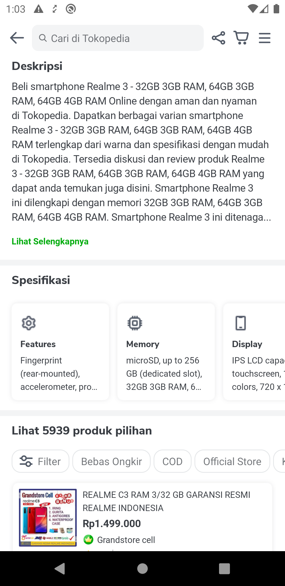<br/> | 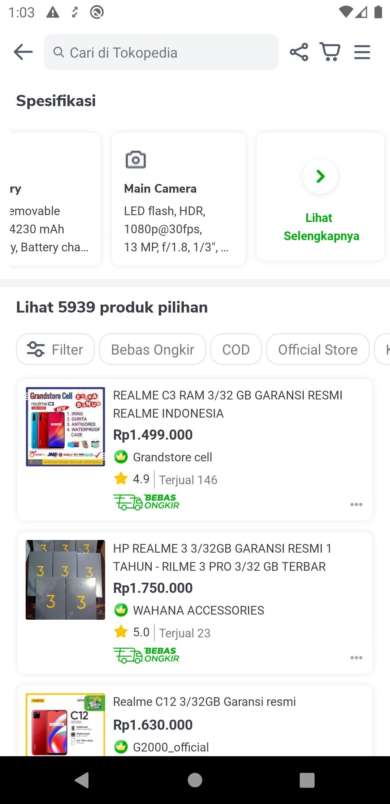<br/> |
| 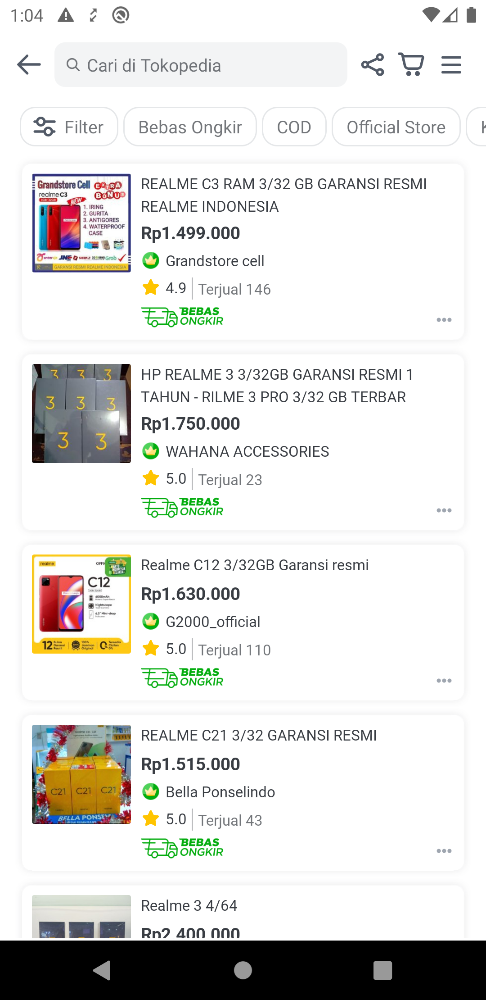<br/> | 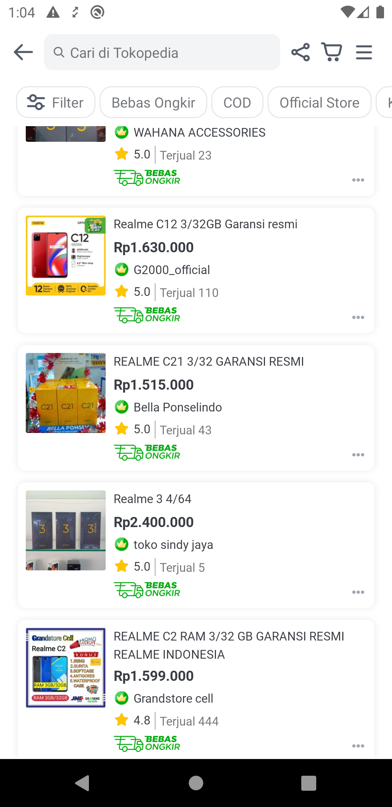<br/> | 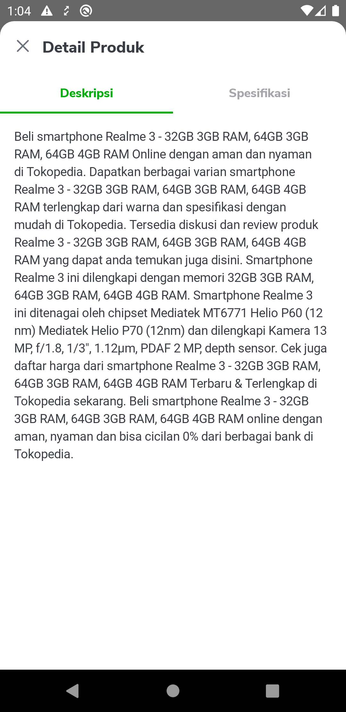<br/> |
| 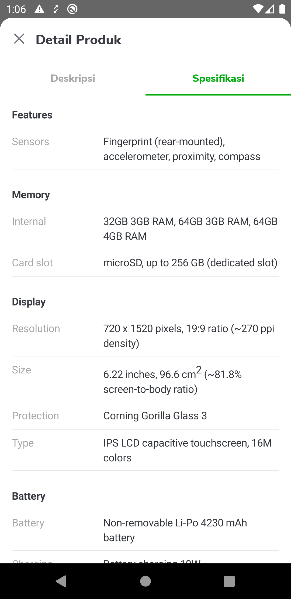<br/> | <br/> | <br/> |
| 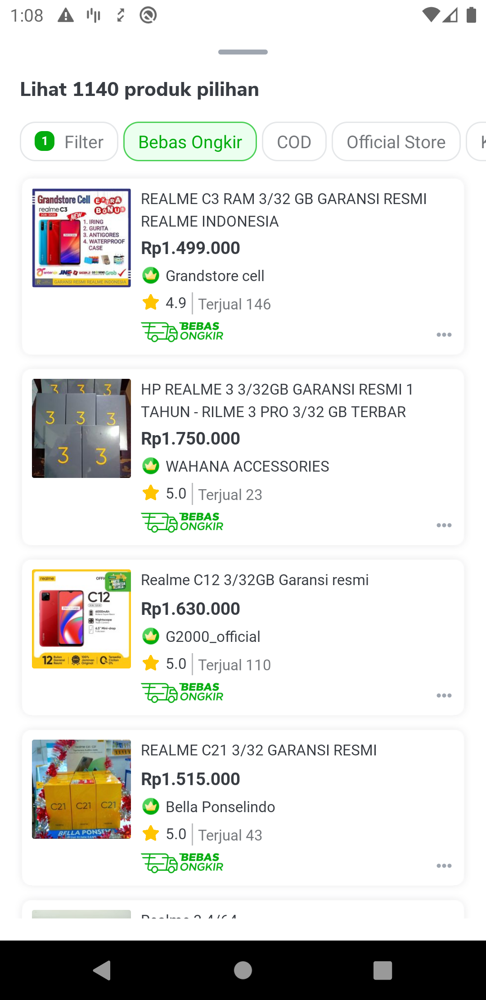<br/> | 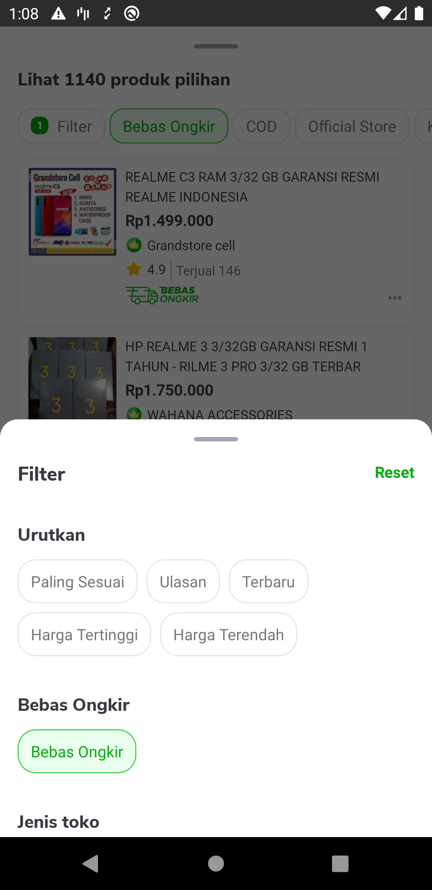<br/> | 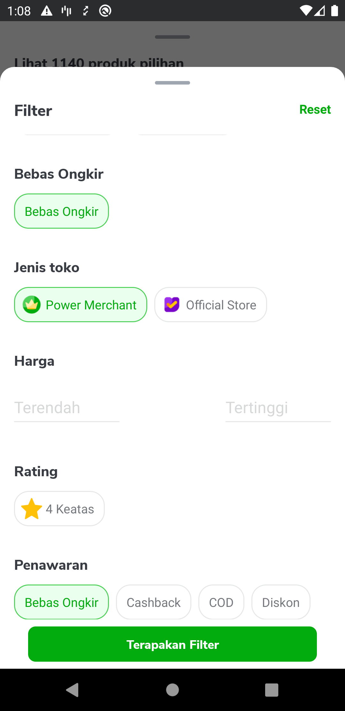<br/> |
| <br/> | 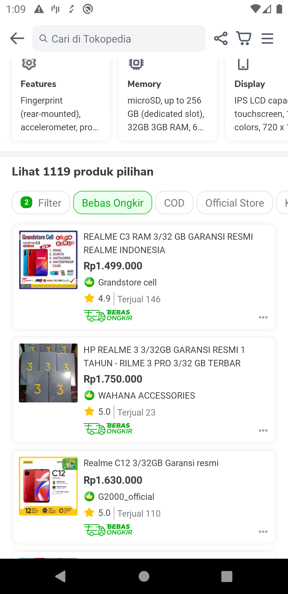<br/> | 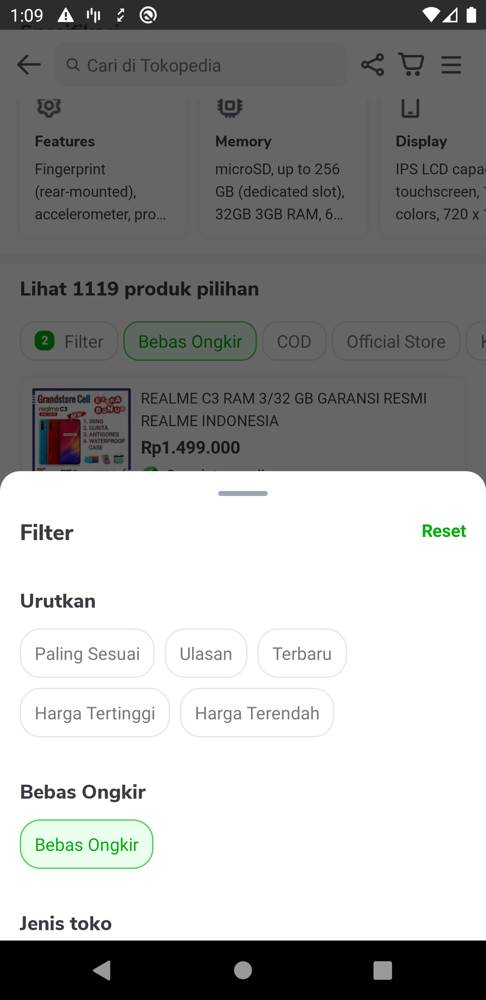<br/> |
| <br/> | 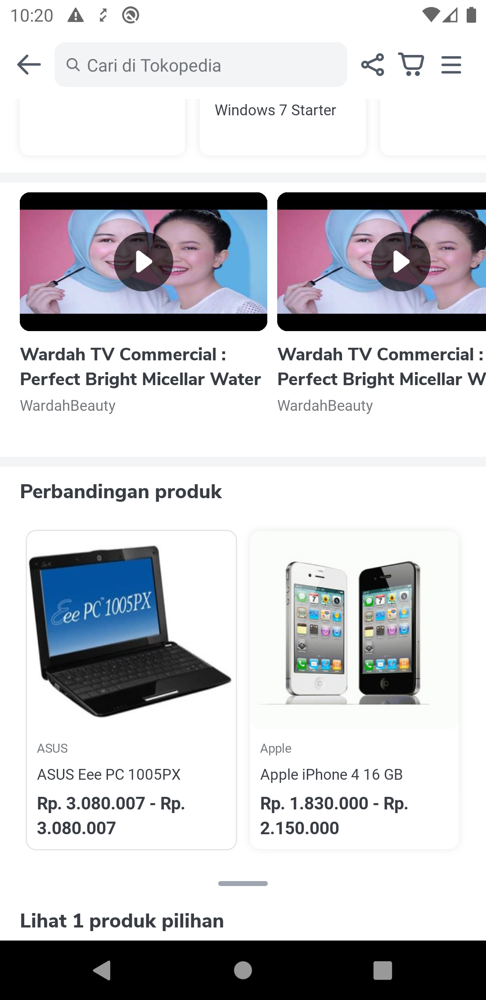<br/> | 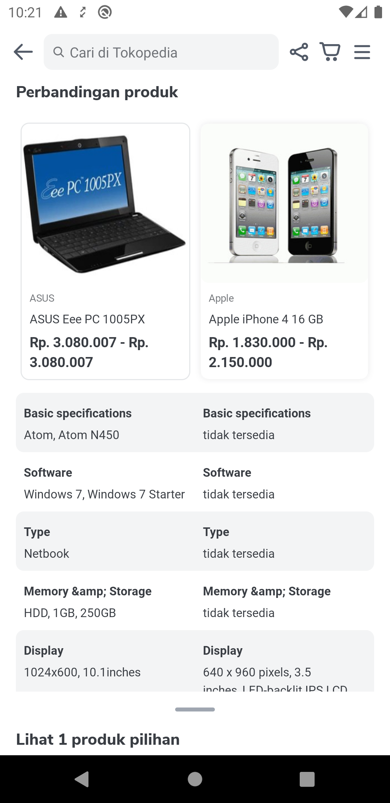<br/> |
| 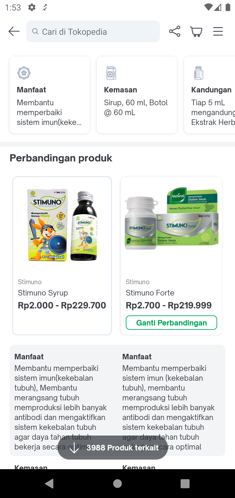<br/> | 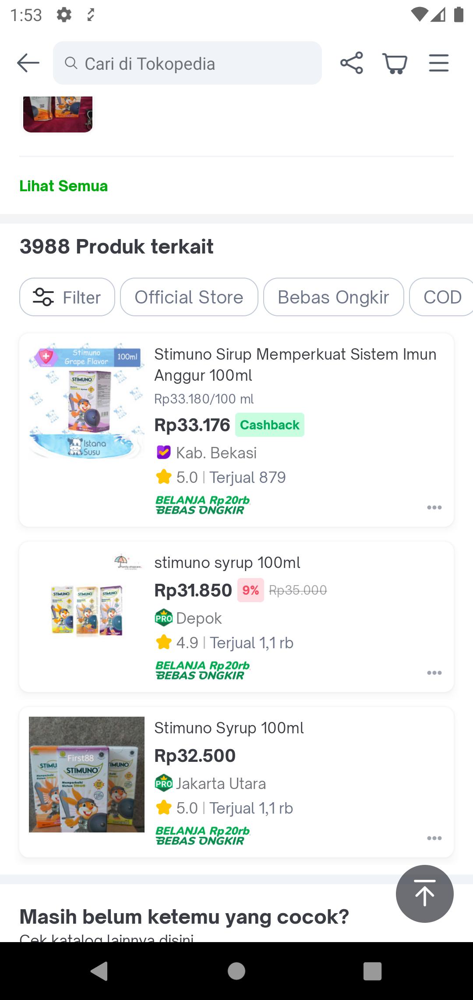<br/> | <br/> |

## How-to

Applinks : 

`tokopedia://catalog/i-63-mate-63/apple-iphone-4-16gb`

`tokopedia://catalog/66275`

`tokopedia://catalog/i-mate-63/apple-iphone-4-16gb`


```
RouteManager.route(context,applink)
```


---

## Useful Links

- [Figma](https://www.figma.com/file/0MSL1uy7FB6ke6tXyB3sdA/%5BUX-M-Category%5D-Catalog-2020?node-id=1686%3A1853)

## FAQ

<!--start expand:Testing catalog ids ?-->
66275
<!--end expand-->

