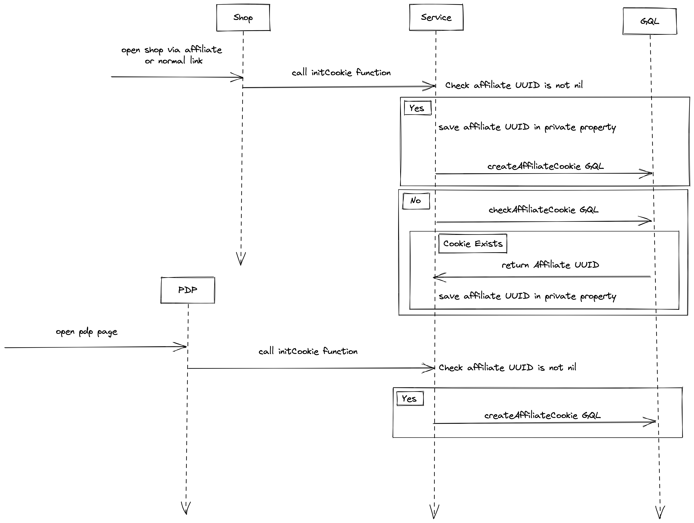
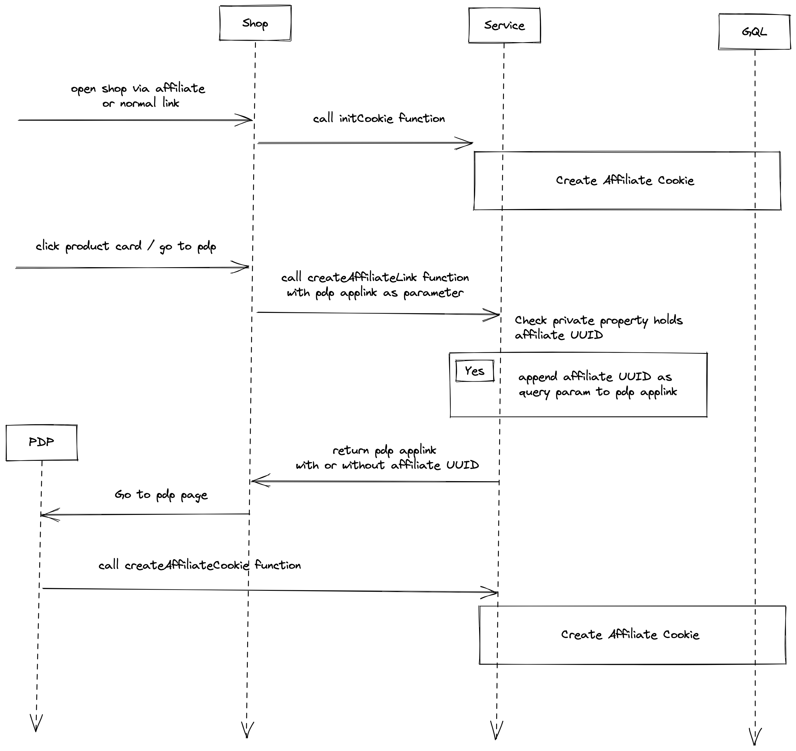

| **Status** | <!--start status:GREEN-->RELEASE<!--end status--> |
| --- | --- |
| **Project Lead** | [Zishan Rashid](https://tokopedia.atlassian.net/wiki/people/5c53e2323290dd17112962f7?ref=confluence)  |
| Product Manager | [Ahmad Hilman Prasetya](https://tokopedia.atlassian.net/wiki/people/5fd6f86c208dbf0107bfb16c?ref=confluence) [Gita Prasulistiyono (Unlicensed)](https://tokopedia.atlassian.net/wiki/people/60f7ace2d5c92900696c4a85?ref=confluence)  |
| Team | Apps Team - [Deepesh Tiwari](https://tokopedia.atlassian.net/wiki/people/62873f7b56b84700697907e2?ref=confluence) EM - [Arshi Sharma](https://tokopedia.atlassian.net/wiki/people/5c32d4f6553b6b6604ec662a?ref=confluence) Backend - [Rahul Baghel](https://tokopedia.atlassian.net/wiki/people/5cd164111b6dba0dc52bc7cd?ref=confluence) [Andrei Dharma](https://tokopedia.atlassian.net/wiki/people/5f6aef05ed55c7006ad8e05e?ref=confluence)  |
| Release date | 18 Aug 2022 / <!--start status:GREY-->MA-3.189<!--end status--> |
| Module type | <!--start status:PURPLE-->INTERNAL-LIBRARY<!--end status-->  |
| Product PRD | [[PRD] Campaign, Shop, Catalog Attribution](/wiki/spaces/AF/pages/1893073270)  |
| Module Location | `features/category/affiliate_toko` |

## Table of Contents

<!--toc-->

## Release Notes

<!--start expand:01 Nov 2022 (MA-3.200)-->
###### Added support for trackerID in affiliate link with param key *aff\_tracker\_id*
<!--end expand-->

## Overview

An intermediary between collaborated page owner and affiliate team in order to extend page attribution in the future.

### Background

We see that there is demand for different kinds of attributions and marketing use cases. Within Tokopedia alone, there are various pages that can be promoted via affiliates: products, shops/brands, campaigns. By expanding our attribution model, we will be able to (1) create new monetisation opportunities for creators, depending on their passion and needs, and (2) expand business opportunities for the affiliate team.

### Project Description

AffiliateCookieHelper is an encapsulated and standardised helper to help record affiliate attribution.

This service wraps all the client requests and passes them to the backend, so page owners don't need to reinvent the wheel to perform the logic of calling backend queries.

In the future, if we have another page introduced, it would be seamless integration from the frontend while passing relevant parameters to this helper.

## Flow Diagram

- Solution Diagram - <https://app.diagrams.net/#G106ssXAnX6zbYqrB17RDcYH42SsQDhueV>
- SDK Flow -





## How-to

Each page owner need to add this in their module `build.gradle`


```
//Add this dependency in the Gradle of your module
implementation projectOrAar(rootProject.ext.features.affiliateSDK)

```

The shared-module used is very simple, you only need to add `AffiliateCommonSdkModule` on your dagger component.


```
@Component(
	modules = [AffiliateCommonSdkModule::class]
)
interface FooComponent {
	...
}

```


```
//Using DI inject AffiliateCookieHelper
@Inject
lateinit var affiliateCookieHelper : AffiliateCookieHelper
```


---

### Use cases

#### initCookie

Call this function to create cookie for both order and traffic attribution. This is a fire and forget function.

This function will call the `createAffiliateCookie` [query](#) if you have an affiliate UUID. Otherwise, if you from `shop` or `other page` that allow check cookie, it will call the `checkAffiliateCookie` [query](#) to check cookie for both product and page attribution from the backend. The UUID will be saved in the helper private property and will be used later when you call the `createAffiliateLink` function.


```
suspend fun initCookie(
    affiliateUUID: String,
    affiliateChannel: String,
    affiliatePageDetail: AffiliatePageDetail,
    uuid: String,
    additionalParam: List<AdditionalParam>
){...}
```


| **Param** | **Description** | **URL Query Param Key** |
| --- | --- | --- |
| [affiliatePageDetail](https://tokopedia.atlassian.net/wiki/spaces/PA/pages/2107048465/Affiliate+SDK#AffiliatePageDetail) | Source Page Info |  |
| `affiliateChannel` | Channel is required and pass it from url query params  | `channel` |
| `affiliateUUID` | AffiliateUUID is required and pass it from url query params  |  |
| `uuid` | UUID is random UUID generated every time user land on PDP page. (**Required for Product)** |  |
| `additionalParam` | Some additional params |  |

##### AffiliatePageDetail


```
 class AffiliatePageDetail(
    val pageId: String = "",
    val source: AffiliateSdkPageSource,
    val pageName: String = "",
    val siteId: String = "1",
    val verticalId: String = "1",
)
```


| **Parameter** | **Type** | **Example** |
| --- | --- | --- |
| `source` | `AffiliateSdkPageSource` | **For PDP-**`AffiliateSdkPageSource.PDP(``shopId: String,` `productInfo:` [AffiliateSdkProductInfo](https://tokopedia.atlassian.net/wiki/spaces/PA/pages/2107048465/Affiliate+SDK#AffiliateSdkProductInfo)`)`**For Shop -**`AffiliateSdkPageSource.Shop(``shopId: String``)`Note: `shopId`for PDP is mandatory and for Shop is optional.**For Discovery -** `AffiliateSdkPageSource.Discovery()`**For DirectATC -** `AffiliateSdkPageSource.DirectATC(``atcSource:` [AffiliateAtcSource](https://tokopedia.atlassian.net/wiki/spaces/PA/pages/2107048465/Affiliate+SDK#AffiliateAtcSource)`,``shopId: String?,``productInfo:` [AffiliateSdkProductInfo](https://tokopedia.atlassian.net/wiki/spaces/PA/pages/2107048465/Affiliate+SDK#AffiliateSdkProductInfo)?`)` |
| `pageId` | `String` | For PDP - `pageId = productID`  For Shop - `pageID = shopID``pageID` is optional for Discovery |
| `pageName` | `String` | For Discovery - `pageName = campaign slug``pageName` is optional for PDP and Shop |
| `siteId` | `String` | If not provided it’s default value is 1 |
| `verticalId` | `String` | If not provided it’s default value is 1 |

##### AffiliateAtcSource


```
enum class AffiliateAtcSource(val source: String) {
    PDP(""),
    SHOP_PAGE("shop_page"),
    DISCOVERY_PAGE("discovery_page")
}
```

##### AffiliateSdkProductInfo


```
AffiliateSdkProductInfo(
    categoryID: String,
    isVariant: Boolean,
    stockQty: Int
)
```


| **Parameter** | **Type** | **Example** |
| --- | --- | --- |
| `categoryID` | `String` | `"1234-1233"` |
| `isVariant` | `boolean` | `true` |
| `stockQty` | `Int` | `"100"` |

##### Example

As it is a suspend function we have to call it from *coroutine-scope*


```
//For Shop
coroutineScope.launch{
  affiliateCookieHelper.initCookie(
        "affiliateUUID",
        "1",
        AffiliatePageDetail("pageID",AffiliateSdkPageSource.Shop("shopID"))
    )
}

//For Product
coroutineScope.launch{
  affiliateCookieHelper.initCookie(
        "affiliateUUID",
        "1",
        AffiliatePageDetail(
            "pageID",
            AffiliateSdkPageSource.PDP(
            "shopID",
            AffiliateSdkProductInfo("categoryID",10)
            )
        )
    )
}
```


---

#### createAffiliateLink

Call this function when you want to append an affiliate UUID query to param to your applink or URL.

This function will be use on `shop` page and `other page` that have affiliate marker mechanism. This function will append affiliate UUID that saved on `initCookie` function, so make sure you call `initCookie` function before you call this function.


```
fun createAffiliateLink(productUrl: String, trackerId: String?): String { ... }
```

##### **Param**`productUrl` is an product applink or url

`trackerId` trackerId to be included in affiliate link

##### **Result**An URL with below params - `aff_unique_id` -> affiliate UUID

`aff_tracker_id` -> tracker id

##### Example


```
affiliateCookieHelper.createAffiliateCookie("tokopedia://product/12345?pageID=5674831")
// output -> tokopedia://product/12345?pageID=5674831&aff_unique_id="1234-5678"
// if the cookie not recorded, will return the same URL as the parameter
```


---

## Action Items

- Add Support for Campaign and TokoNow.

## Useful Links

- [Common-SDK Requirement](/wiki/spaces/AF/pages/1966182849/Common-SDK+Requirement)
- <https://app.diagrams.net/#G106ssXAnX6zbYqrB17RDcYH42SsQDhueV>
- <https://tokopedia.atlassian.net/wiki/spaces/AF/pages/1893073270?atlOrigin=eyJpIjoiNzM2Y2RiMjBhNGI4NDUwMDkwZDk3Mzc4YzBhOTdmNjMiLCJwIjoiY29uZmx1ZW5jZS1jaGF0cy1pbnQifQ>
- <https://tokopedia.atlassian.net/wiki/spaces/AF/pages/1958878124?atlOrigin=eyJpIjoiNzY2YzY5NmNiNTg3NGI4NTliNzVjNmZmMzlkZjBjMDYiLCJwIjoiY29uZmx1ZW5jZS1jaGF0cy1pbnQifQ>
- <https://tokopedia.atlassian.net/wiki/spaces/AF/pages/2155119340?atlOrigin=eyJpIjoiZDM0ZGUxN2EyMzEwNDUxNjg2YTEyNWIzYTI3MDQ1OWUiLCJwIjoiY29uZmx1ZW5jZS1jaGF0cy1pbnQifQ>
- [[PRD] Wishlist Collection Page Attribution Commisison](/wiki/spaces/AF/pages/2094729431)
- [[PRD-disco/campaign] Contd. ADP / Transaction History / Generated Page History for Discovery/Campaign Attribution Commission](/wiki/spaces/AF/pages/1992198085)

## FAQ

<!--start expand:Why we need to call affiliateCookieHelper function even if we don’t have affiliate UUID?-->
If you don’t have affiliate UUID, the service will call checkAffiliateCookie query to return active affiliate UUID / cookie.
<!--end expand-->

<!--start expand:How checkAffiliateCookie return affiliate UUID?-->
When we hit createAffiliateCookie query, backend has mechanism to save cookie or the UUID for 24 hours or more.
<!--end expand-->

<!--start expand:What if the user use 2 different affiliate links in the span of 24 hours?-->
Backend will use the last cookie the user use.
<!--end expand-->

<!--start expand:Where can I ask any other queries?-->
You can slack [Deepesh Tiwari](https://tokopedia.atlassian.net/wiki/people/62873f7b56b84700697907e2?ref=confluence) or [Zishan Rashid](https://tokopedia.atlassian.net/wiki/people/5c53e2323290dd17112962f7?ref=confluence)
<!--end expand-->

