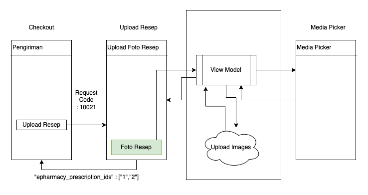

| **Status** | <!--start status:GREEN-->RELEASE<!--end status--> |
| --- | --- |
| **Project Lead** | [Zishan Rashid](https://tokopedia.atlassian.net/wiki/people/5c53e2323290dd17112962f7?ref=confluence)  |
| Product Manager | [Elison Koenaifi](https://tokopedia.atlassian.net/wiki/people/70121:221c7b73-3301-416b-ab69-016ae76422b8?ref=confluence) [Siti Kaamiliaa Hasna](https://tokopedia.atlassian.net/wiki/people/61daf5f50586a20069921055?ref=confluence)  |
| Team | [Darth](https://tokopedia.atlassian.net/people/team/8c90de56-d4f1-45a7-9021-bd87c4ea9ce2) ([Mohit Singh](https://tokopedia.atlassian.net/wiki/people/5ff3fa2244065f013f9f1eb9?ref=confluence) ) |
| Release date | 12 Sep 2022 / <!--start status:GREEN-->MA-3.190<!--end status--> |
| Module type | <!--start status:YELLOW-->FEATURE<!--end status--> |
| Product PRD | [EPharmacy PRD](https://docs.google.com/document/d/1FqF7NLkOt49Mo3527-hqNgHnqMgJR9AMkqfxo7rbxiw/edit#heading=h.8oglbygnr5kp) |
| Module Location | `features/category/epharmacy` |

## Table of Contents

<!--toc-->

## Release Notes

<!--start expand:12 Sept (MA-3.190)-->
###### *Upload Prescription page : User can upload prescription images that will be passed back to checkout in form of prescription ids*

###### [PR Link](https://github.com/tokopedia/android-tokopedia-core/pull/27557)
<!--end expand-->

## Overview

Upload Prescription: Upload prescription images max 5 using media picker and sending the image as encodedString . Return prescription ids to the caller i.e checkout.


### Project Description

Tokopedia was warned for its ethical drugs purchase flow where it placed the upload prescription after payment was verified. We were asked to add the prescription upload experience before the customer makes a payment to ensure that every restricted medication purchase include doctor’s prescription in it.

## Tech Stack

- Media Picker : This feature uses Media Picker Library for selecting images
- Bitmap Factory : To compress and get byte array from images since API needs byte format string (jpeg) compression 80%
- Base64 encode : API needs byte format string.

## Flow Diagram




| **API** | **Notes** | **Type** |
| --- | --- | --- |
| <https://tokopedia.atlassian.net/wiki/spaces/CT/pages/1964051693/Fetch+order+details+by+order+id> <https://tokopedia.atlassian.net/wiki/spaces/CT/pages/1976600339/Fetch+prescriptions+by+checkout+id>  | Gets Data for rendering page which shows all the shops and ethical products in the checkout | GQL |
| [Upload prescription to ePharmacy](/wiki/spaces/CT/pages/1963951825/Upload+prescription+to+ePharmacy)  | Confirms/Submit prescription ids  | GQL |
| [Confirm prescription ids to ePharmacy](/wiki/spaces/CT/pages/1978730409/Confirm+prescription+ids+to+ePharmacy)  | Uploads image to server returns prescription id of the image uploaded | Rest |

## Navigation


## How-to

AppLinks : `tokopedia://epharmacy/`

Open using Order Id for viewing order


```
fun openUploadResepEpharmacy(orderId : String){
  startActivityForResult("tokopedia://epharmacy/${orderId}")
}
```

Open using checkout id for uploading


```
val EPHARMACY_UPLOAD_REQUEST_CODE = 10021
val EXTRA_CHECKOUT_ID_STRING = "extra_checkout_id_string"

fun openUploadResepEpharmacy(checkoutId : String){
  Intent().apply{
                putExtra(EXTRA_CHECKOUT_ID_STRING,checkoutId)
            }.also{
                startActivityForResult(it,EPHARMACY_UPLOAD_REQUEST_CODE)
            }
}
```


---

## Action
Items

*Increase Test Case Coverage*

Current : 70.84 %

Target : 95 %

## Useful Links

- [Figma Upload Prescription](https://www.figma.com/file/bBeZsEYnDf6Vukg0qtmfVI/%5BSehat%5D-ePharmacy-2.0---Master-Upload-Prescription?t=8yogi4wsq7yshZ9k-0)
