<!--left header table-->
| **Project Lead** | [Zishan Rashid](https://tokopedia.atlassian.net/wiki/people/5c53e2323290dd17112962f7?ref=confluence)  |
| --- | --- |
| Product Manager | [Fadhlan Hafizh Permana](https://tokopedia.atlassian.net/wiki/people/63152ef2b433b060db56655f?ref=confluence)  |
| Team | [Darth](https://tokopedia.atlassian.net/people/team/8c90de56-d4f1-45a7-9021-bd87c4ea9ce2) ([Rachit Panwar](https://tokopedia.atlassian.net/wiki/people/61b7c9f708e4e000698b50e9?ref=confluence) [Zishan Rashid](https://tokopedia.atlassian.net/wiki/people/5c53e2323290dd17112962f7?ref=confluence) ) |
| Release date |  |
| Module type |  <!--start status:YELLOW-->FEATURE<!--end status--> |
| Product PRD | [SplitPrice by Logistic Flow + Trade-in Home](/wiki/spaces/CT/pages/1892454503) |
| Module Location | `feature/category/tradein` |

## Table of Contents

<!--toc-->

## Overview

This document contains decisions, issues, flow chart, solutions from engineering perspective taken for the provided PRD. Trade-in and Money-in are the tools that enables users to exchange and cash-in their mobile phone respectively.

### Background

**Trade In** - *Handphone Trade-in is one of the big initiatives for Tokopedia in order to be a market leader in both online and offline handphone market in Indonesia.*

### Project Description

Handphone Trade-In Program is a **Make It Happen** service where Tokopedia user can exchange their old phone for a new phone. High Level MVP Requirements

- Only available for category handphone
- Only available for product from whitelist sellers: Official Store & Top Sellers
- Only available for coverage area Jabodetabek
- Partnership with Laku6 as a third party who run device diagnostic, offer the final price, buy used phone, refurbished and sell it for a profit

## Flow Diagram

- MVVM, Kotlin and Coroutines  
  Here is the flow diagram for how tradein 3.0 works

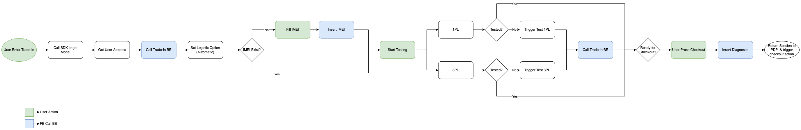

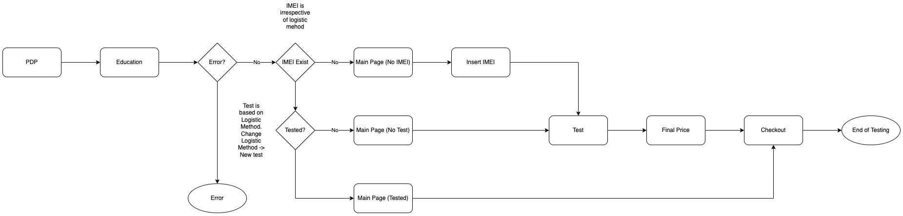

## How-to


```
implementation project(rootProject.ext.features.commonTradein)
```

This implementation can be used to get the `TradeInPDPHelper` which is needed to start Tradein from any module.

### Code and Schema Design

**TradeInHomePage** Activity and **ViewModel** hold the common data, like PDP data, laku6 object for initialisation and cart because TradeInHomeVM is shared VM between all fragments  
Initially we had multiple APIs to handle a lot of flow. Now `GQL_TRADE_IN_DETAIL` handles all of the flow on backend side and tradeIn main page has one single api.

Flow -

**PDP** → TradeInHomePageActivity → TradeInHomePageFragment → `GQL_TRADE_IN_DETAIL` (if above android 10 then also `GQL_VALIDATE_IMEI` ) → Laku6 Functional Testing → Photo Upload → Laku6final price → Broadcast to TradeInHomeActivity → `GQL_INSERT_LOGISTIC_PREFERENCE` → Checkout

**Applink List**

1. Main Page: `tokopedia://foobar/{{product_id}}?optional_param=source_shop`

## Navigation

testing page link - `tokopedia://product/775243897`

money in - `tokopedia://money_in/device_validation`

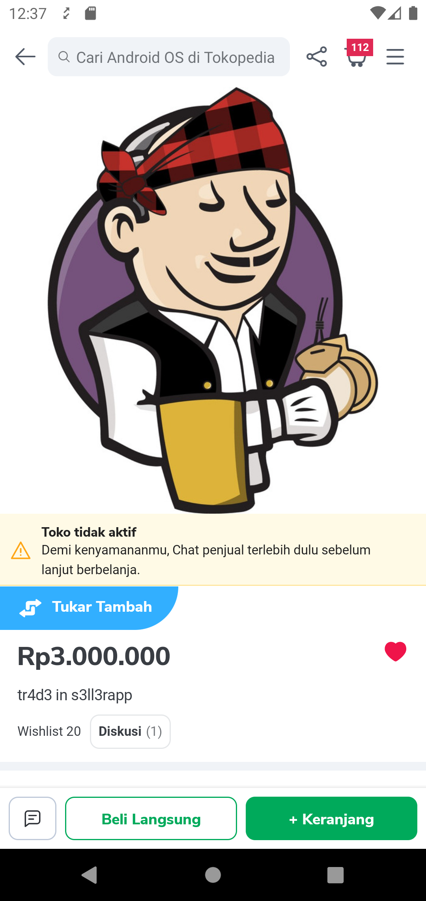

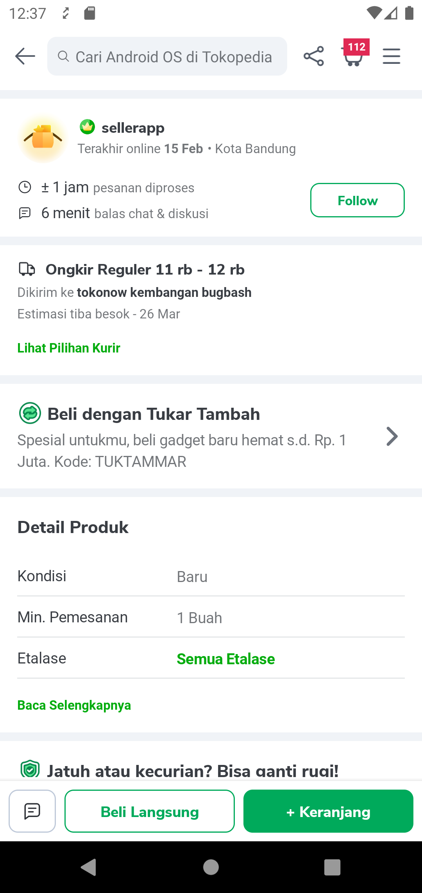

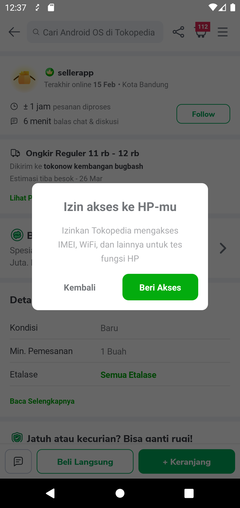

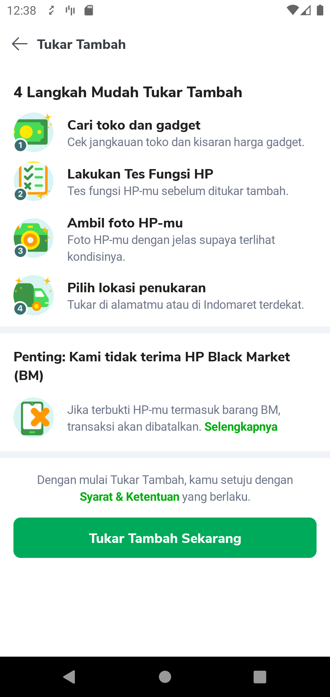

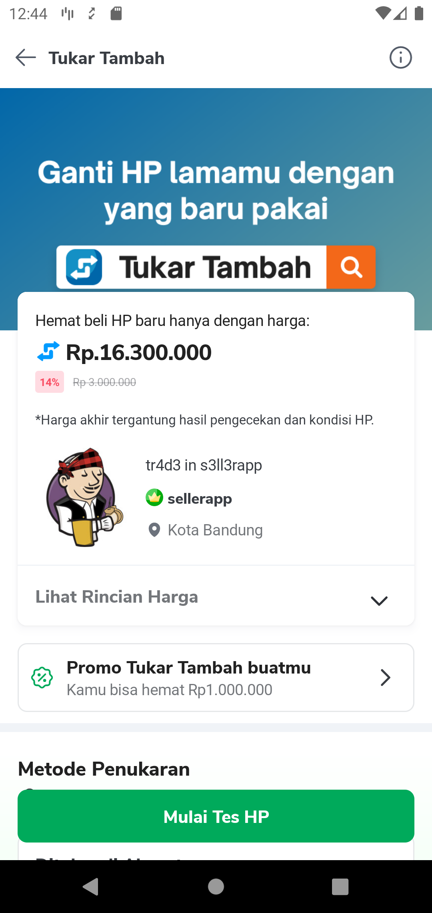

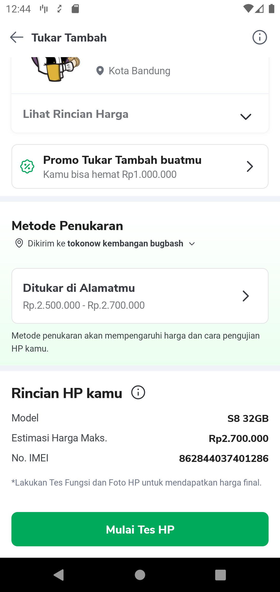

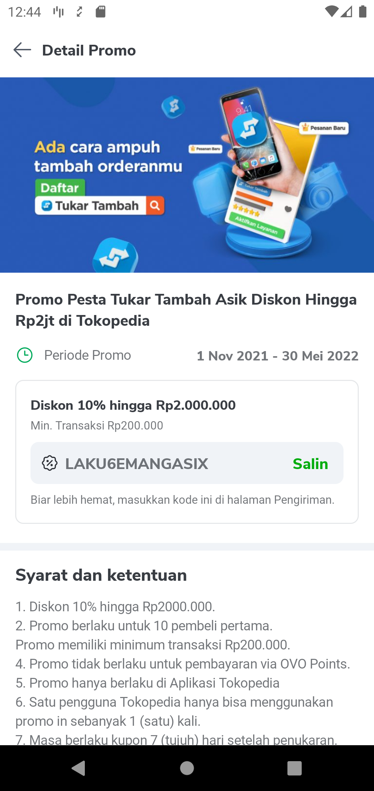

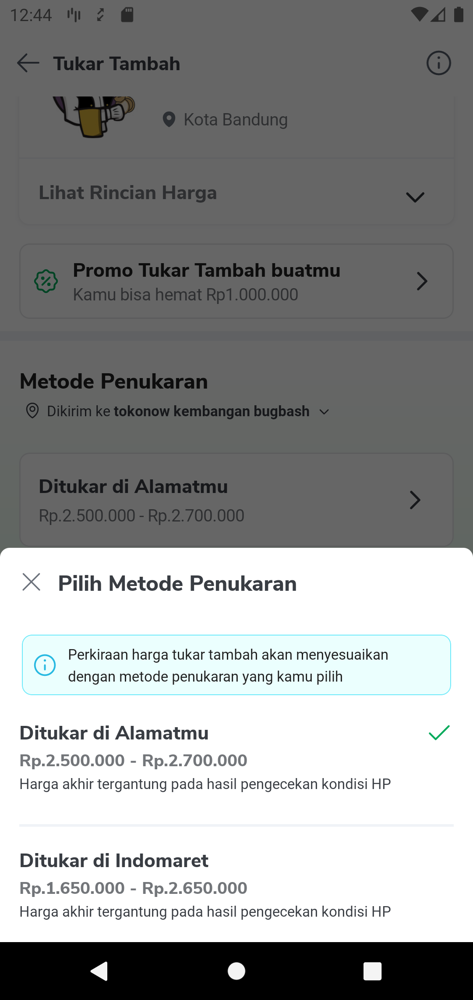

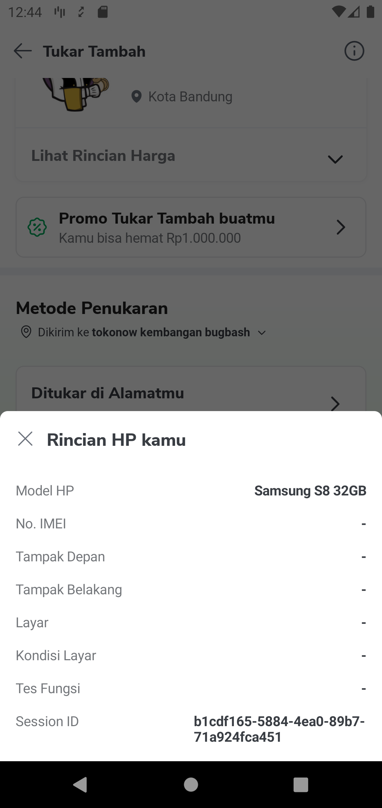

After clicking Mulai Tes HP, user is directed to laku6 functional test and from there after completion we get a broadcast from sdk to send user to checkout.

### **APIs**


| **API** | **Notes** |
| --- | --- |
| `GQL_PROMO` | [Get Promo Detail](/wiki/spaces/CT/pages/1842643523/Get+Promo+Detail) |
| `GQL_FETCH_TNC` | `query fetchBlackMarketAndTnC` |
| `GQL_INSERT_LOGISTIC_PREFERENCE` |  [GQL - insertTradeInLogisticPreference](/wiki/spaces/CT/pages/1912733854/GQL+-+insertTradeInLogisticPreference)  |
| `GQL_TRADE_IN_DETAIL` | [GQL - GetTradeInDetail Wrapper](/wiki/spaces/CT/pages/1902875646/GQL+-+GetTradeInDetail+Wrapper)  |
| `GQL_VALIDATE_IMEI` | [GQL - validateIMEI](/wiki/spaces/CT/pages/1902843229/GQL+-+validateIMEI)  |

## Tech Stack

Trade-in and Money-in are highly dependent on the third party library `laku6` which helps us with diagnostics and price verification of the device along with providing the infrastructure for the delivery and exchange system.

Documentation for laku6 - <https://drive.google.com/file/d/11bj4t9NC3LOXbHBtPL5tYE-UaM8a-tlR/view?usp=sharing>

updated documentation - <https://drive.google.com/file/d/1X2q3v3T_-bxTXqQqnR1I_I9oHpOpSdM1/view?usp=sharing>

## Useful Links

PRD - [SplitPrice by Logistic Flow + Trade-in Home](/wiki/spaces/CT/pages/1892454503)   
Figma - <https://www.figma.com/file/YvFQO1rVWCc9kiQF3kzzv7/%5BCategory%5D-Trade-in-TIMI-v.3.0.0?node-id=539%3A57526>

Trackers - <https://mynakama.tokopedia.com/datatracker/product/requestdetail/view/2547>

