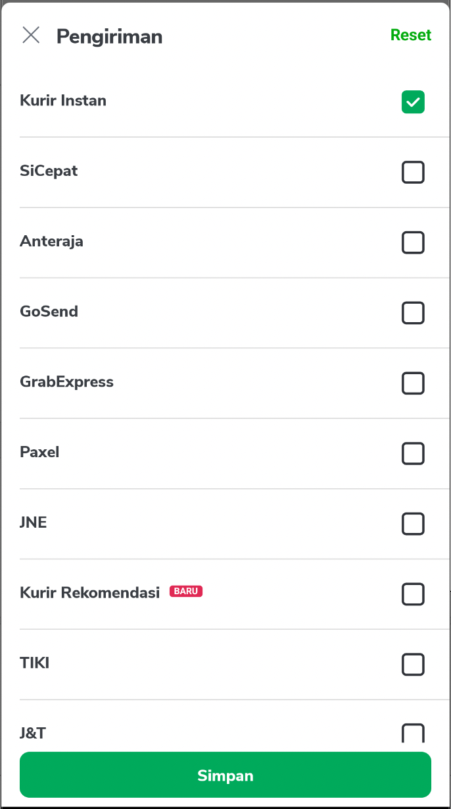
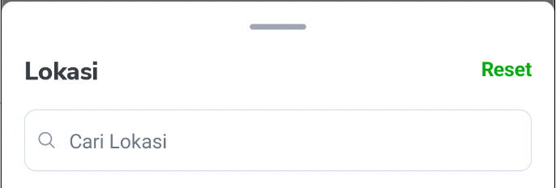
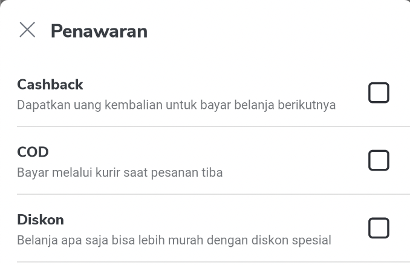
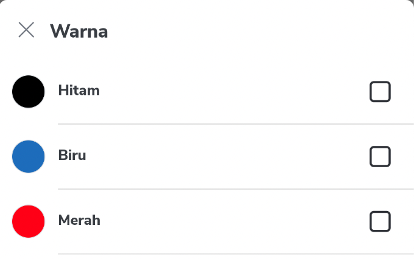
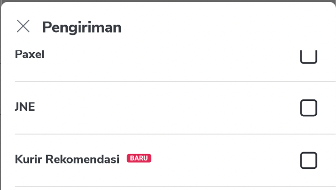
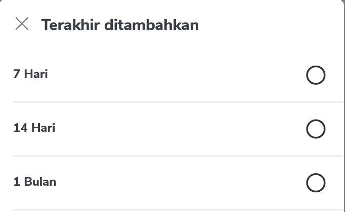

---
labels:
- Filter
---

<!--left header table-->
| **Status**      | <!--start status:Green-->RELEASE<!--end status-->                                                           |
|-----------------|-------------------------------------------------------------------------------------------------------------|
| Team            | Minion Dave                                                                                                 |
| Module type     | <!--start status:Grey-->SUB-FEATURE<!--end status-->                                                        |
| Release date    | -                                                                                                           |
| Product Manager | @Hefrian, @Sheila, @Matthew, @Melvin, @Jefferson, @Gilang                                                   |
| Contributors    | @Zulfikar Rahman @Darian Thedy @Muhammad Fiqri Muthohar                                                     |
| Module Location | `features/discovery/filter` / `com.tokopedia.filter`                                                        |
| Product PRD     | [SRP Filter UI Revamp](https://tokopedia.atlassian.net/wiki/spaces/SE/pages/764843258/SRP+Filter+UI+Revamp) |

<!--toc-->
## Release Notes


## Overview
### Project Description
Filter and Sort is used to help users find the products they need based on their own preferences when browsing or searching in Tokopedia.

There are two components required to implement Filter and Sort functionality:
1. Quick Filter
2. Bottom Sheet Filter
3. Bottom Sheet Filter Detail

### Quick Filter
**Quick Filter** component is provided by Unify Component called `SortFilter`. Please check this technical documentation from Unify: [Sort Filter](https://tokopedia.atlassian.net/wiki/spaces/PA/pages/706251184/Sort+Filter)


### Bottom Sheet Filter
**Bottom Sheet** component is `SortFilterBottomSheet` from module `features/discovery/filter`. It is a `Fragment` subclass of `BottomSheetUnify`.

Include in your module gradle:
```
implementation project(rootProject.ext.features.filter)
```

To show this component, create a new instance and call show like this:
```
val sortFilterBottomSheet = SortFilterBottomSheet()
sortFilterBottomSheet.show(
	parentFragmentManager,
	searchParameter.getSearchParameterHashMap(),
	presenter.getDynamicFilterModel(),
	this,
)
```
Show function takes four arguments:

1. `FragmentManager` → Use `parentFragmentManager`
2. `Map<String, String>` → Map Parameter of the page, usually contains all parameters sent to Back End. This is used by the Bottom Sheet to determine active sort and filters that you have.
3. `DynamicFilterModel` → DynamicFilterModel retrieved from Back End.
4. `SortFilterBottomSheet.Callback` → Callback interface used by `SortFilterBottomSheet`.

`SortFilterBottomSheet.Callback` has two functions that needs to be implemented by the page using `SortFilterBottomSheet`:

1. **onApplySortFilter** → This function is called when button "Tampilkan" is clicked on `SortFilterBottomSheet`. You need to override and implement the reload page and send tracking in this function. It will send a parameter `ApplySortFilterModel`, containing four objects:
    1. `mapParameter: Map<String, String>` → This is **all** the parameters generated after user select / unselect Filter and Sort.
    2. `selectedFilterMapParameter: Map<String, String>` → This is the selected filter parameters generated after user select / unselect Filter.
    3. `selectedSortMapParameter: Map<String, String>` → This is the selected sort parameters generated after user select another Sort.
    4. `selectedSortName: String` → This is the name of sort generated after user select another Sort.
2. **getResultCount** → This function is called when any Filter and Sort Chips is selected from the `SortFilterBottomSheet`. This is usually used to show the result count in the apply button at the bottom of the Bottom Sheet. You need to override and implement the functionality to get result count of your page from Back End. It will send a parameter `Map<String, String>`, which is the parameters generated when user select / unselect Filter and Sort Chips. After receiving result count data from Back End, you need to call function `SortFilterBottomSheet.setResultCountText`, with the parameter String to show the result count, for example: "Tampilkan 204 rb Produk" ("Show 204 thousand Product"). If you don't need to show the result count, you can just call `SortFilterBottomSheet.setResultCountText` with any String that shows the user to press this button to apply the sort and filter, for example "Tampilkan Produk" ("Show Products").  


More info for **onApplySortFilter(ApplySortFilterModel)** implementations:

1. Since `mapParameter` contains all Filter and Sort parameters, you can use this mapParameter as parameter sent to Back End when reloading your page with filters.
2. `selectedFilterMapParameter` only contains the Filter parameter applied. This is usually used for Tracking of Filter functionality, with function `FilterTracking.eventApplyFilter`. This value can be empty if user press the "Reset" button.
3. `selectedSortMapParameter` and `selectedSortName` is usually used together. This is usually used for Tracking of Sort functionality. You should check if the value of these two parameters if not empty before calling the tracking. If they are empty, it means the user did not press any Sort chips and should not hit the tracking.

Additional information on `SortFilterBottomSheet`:

If you have SortFilterBottomSheet instance as "global variable" in your Fragment / Activity, don't forget to set a dismiss listener and make the instance null. This is to prevent a memory leak where you still keep an instance of destroyed `SortFilterBottomSheet` Fragment in your Fragment / Activity.

```
sortFilterBottomSheet?.setOnDismissListener {  
    sortFilterBottomSheet = null
}
```

### Bottom Sheet Filter Detail

Bottom Sheet Filter Detail can also be used directly by using class `FilterGeneralDetailBottomSheet`.



To use this component, create a new instance and call `show` like this:

```
FilterGeneralDetailBottomSheet().show(
    parentFragmentManager,
    filterViewModel.filter,
    filterDetailCallback,
)
```

Show function takes 3 arguments:

1. `FragmentManager` → Use `parentFragmentManager`
2. `Filter` → `Filter` object that contains list of `Option` to show in the bottom sheet
3. `FilterGeneralDetailBottomSheet.Callback` → Callback interface used by `FilterGeneralDetailBottomSheet`. This callback has one function `onApplyButtonClicked`, which will be called when "Simpan" (save) button is clicked.

Bottom Sheet Filter Detail configuration:

1. Title from the bottom sheet comes from `Filter.title`.
2. Reset on the top right will be shown if there are any checked option. Clicking the reset button will clear all the selected option.
3. Search bar inside the bottom sheet will be shown if `Filter.search.searchable` value is `1`. Placeholder for the search bar comes from `Filter.search.placeholder`. 
4. All `Option` inside `Filter` will be shown as an item in the list.  



  

	1. Title is taken from `Option.name`
	2. Description below the title is taken from `Option.description` (optional).
	3. Color sample is taken from `Option.hexColor` (optional).
	4. Badge "BARU" on the right of title will be shown if `Option.isNew` is true.
	5. If `Option.inputType` is `radio`, Radio button will be shown. Otherwise, the Checkbox will be shown.

All the selection of filter options are flagged in field `Option.inputState`:

1. When opening the bottom sheet, Options with `inputState == true` will be selected.
2. When selecting or de-selecting the items, `inputState` will be updated accordingly inside the bottom sheet.
3. When clicking "Simpan" (save) button, the callback `FilterGeneralDetailBottomSheet.Callback` will give back the same list of Options with `inputState` according to the selection of the user.

  
## Useful Links
- [Figma](https://www.figma.com/file/wQWBN9drPapyQHrPHTIQPV/%5BUI%2FUX---M---Filter%5D-Filter-Revamp?node-id=170%3A4973)