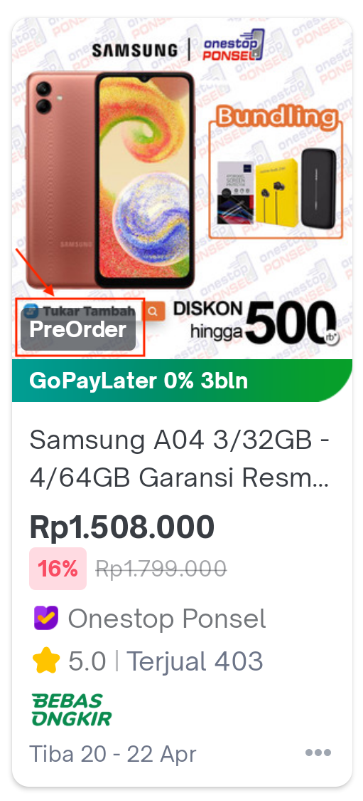
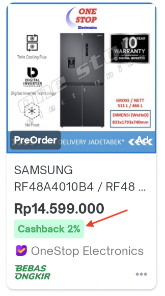
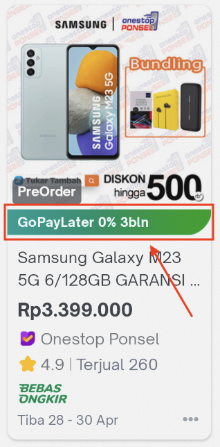
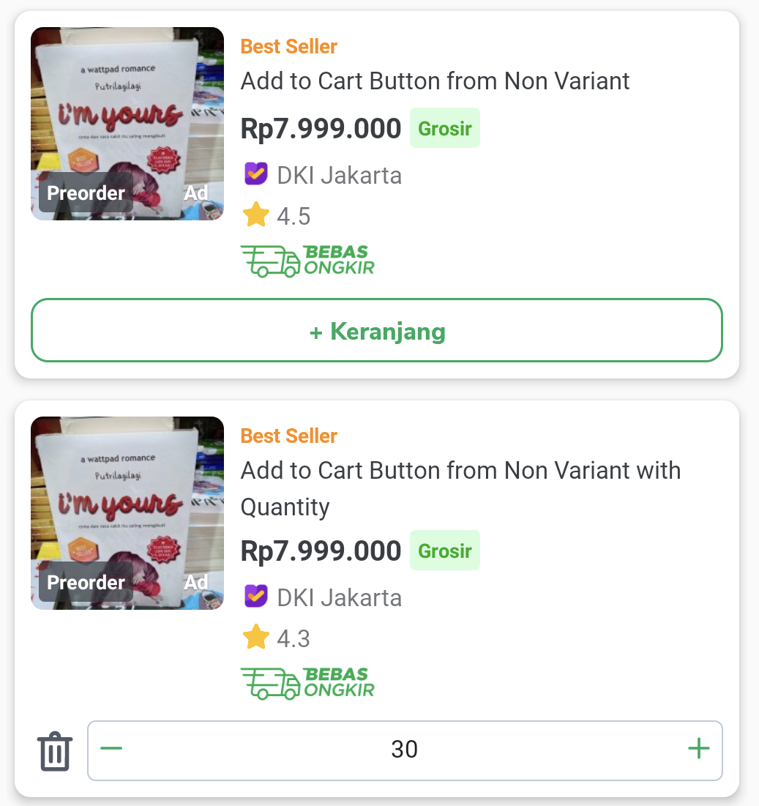
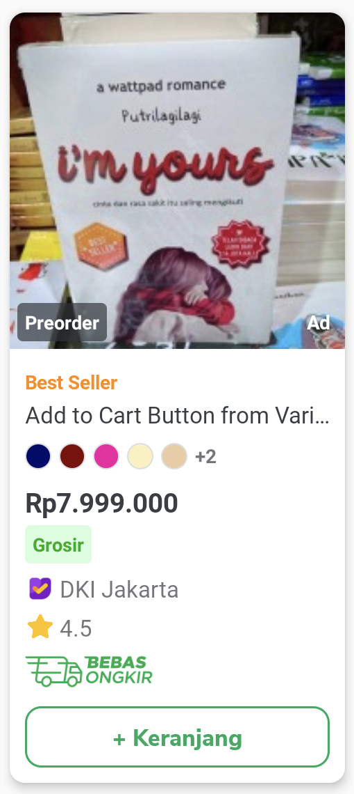
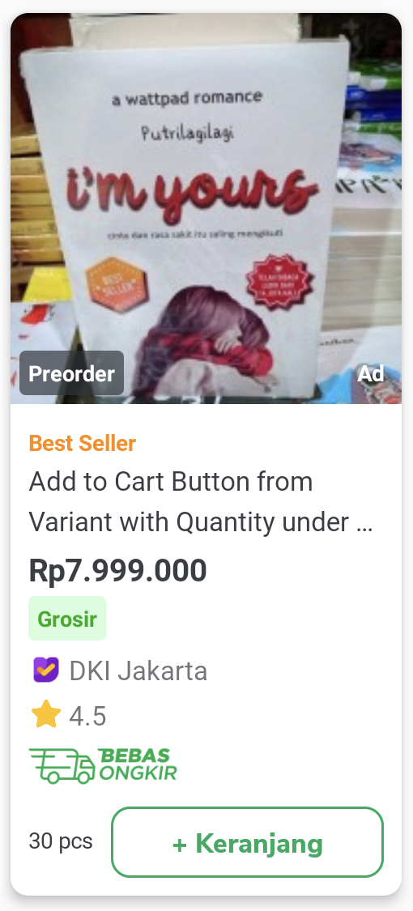
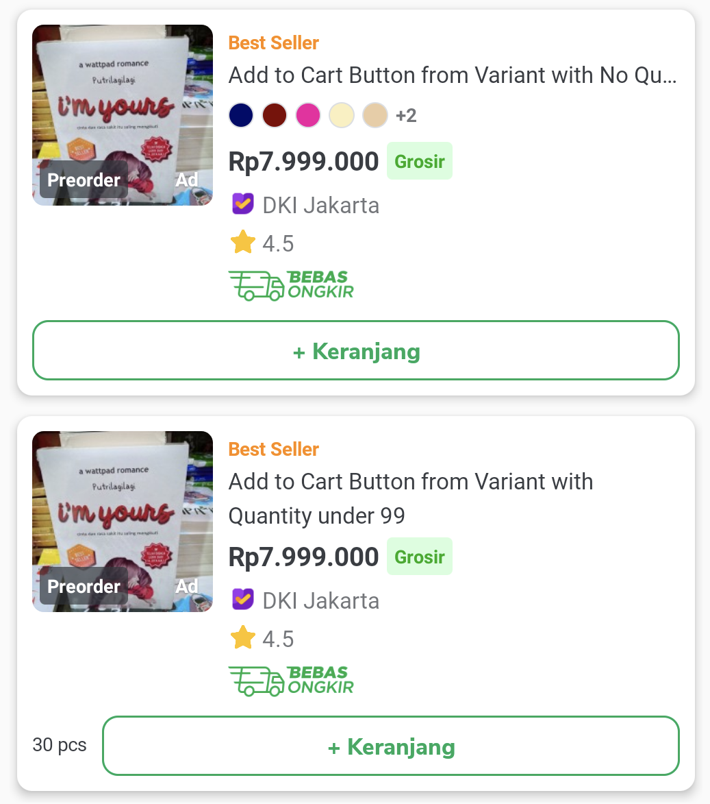
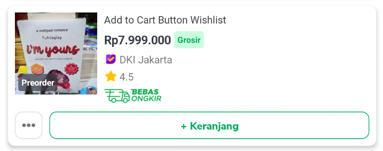

---
labels:
- product-card
---


| **Status**      | <!--start status:GREEN-->RELEASE<!--end status-->                                                                          |
|-----------------|----------------------------------------------------------------------------------------------------------------------------|
| Team            | Minion Dave                                                                                                                |
| Module type     | <!--start status:GREY-->SUB-FEATURE<!--end status-->                                                                       |
| Release date    | 2 Feb 2020 / MA-3.67                                                                                                       |
| Product Manager | @Gilang                                                                                                                    |
| Contributors    | `@Zulfikar Rahman @Darian Thedy @Muhammad Fiqri Muthohar`                                                                  |
| Module Location | `features/discovery/productcard` / `com.tokopedia.productcard`                                                             |
| Product PRD     | [Product Card 2020 Phase 1](https://tokopedia.atlassian.net/wiki/spaces/SE/pages/656739876/DONE+Product+Card+2020+Phase+1) |

<!--toc-->

## Overview

### Background

There are a lot of pages and features in Tokopedia that need to show list of products, such as Home Page, Search Result Page, Discovery Page, Recommendation, Wishlist, and so on. Having multiple Product Cards for each individual pages will be confusing for the user, because different pages can show different information, with different layout, different font size, or different labels. This is also bad for Tokopedia Product Team and Engineer Team because we need to make changes in all pages if we want to put new information into the Product Card.

The Product Card module is created to tackle these problems, by creating a single unified component that will be used across all pages. Tokopedia users will have the same experience for Product Card in all pages, and any new information or labels in Product Card can be added with a single development.

### Project Description

There are two view types of Product Card: Grid View (`ProductCardGridView`) and List View (`ProductCardListView`). Both view types can be used for vertical or horizontal scrolling view.

Product Card will only render its UI based on `ProductCardModel` given from function `setProductModel`.

#### Image
Product Card Image will be rendered from field `productImageUrl`.

#### Title
Product Card Title will be rendered from field `productName`

#### Price
Product Card Price will be rendered from field `formattedPrice`

#### Discount label
Product Card Discount label will be rendered as `LabelUnify` with `labelType=general_light_red` from field `discountPercentage`.

#### Slashed Price
Product Card Slash Price will be rendered as a price with strikethrough indicating the original price of the product before discount. It will be rendered from field `slashedPrice`.

#### Labels

A single label in Product Card is represented as `LabelGroup` class. `ProductCardModel` can accept list of `LabelGroup` in `labelGroupList`, and will render the Labels depending on the rules from Product Card UI Guidelines. These LabelGroup list usually come from Back End data, so it can just be mapped into list of `LabelGroup` from `ProductCardModel`.  
```
data class LabelGroup(
   val position: String = "",
   val title: String = "",
   val type: String = "",
   val imageUrl: String = ""
)
```

- `position`: Position indicates where the label will be rendered. Each `position` will be explained later below.
- `title`: Title will be rendered as the text in the label.
- `type`: Type indicates the styles of labels, which can be hex colors, unify label types, or text color.  
- `imageUrl`: Some labels can show image, which will be taken from this Image URL.


#### Status Label


Example `LabelGroup`:
```
position = "status"
title = "PreOrder"
type = "transparentBlack"
```

Status label will be rendered at the bottom left of the product card image.

#### Price Label


Example `LabelGroup`:
```
position = "price"
title = "Cashback 2%"
type = "lightGreen"
```

Price label will be rendered below the product price.

#### Campaign Label


Example `LabelGroup`:
```
position = "campaign"
title = "GoPayLater 0% 3bln"
type = ""
imageUrl = "http://images.tokopedia.net/campaign_image_url.png"
```

#### Add To Cart with Quantity Editor for Non Variant Products




1. Create and set object `ProductCardModel.NonVariant` into `ProductCardModel`.
	1. `quantity` → Quantity of the product from Cart. If 0 then Product Card will show `+ Keranjang` button. If > 0 then Product Card will show Quantity Editor.
	2. `minQuantity` → Minimum Quantity for add to cart. Quantity editor cannot be lower than this value.
	3. `maxQuantity` → Maximum Quantity for add to cart. Quantity editor cannot be higher than this value.
2. Create `ATCNonVariantListener` and call `setAddToCartNonVariantClickListener` in ProductCardGridView and ProductCardListView. `onQuantityChanged` will be called when:
	1. User clicked `+ Keranjang` button. `quantity` parameter will be `minQuantity`.
	2. User clicked `+` or `-` from Quantity Editor. `quantity` parameter will be the value from Quantity Editor.
	3. User typed the value from Quantity Editor. `quantity` parameter will be the value from user input.
	4. User clicked `trash` button. `quantity` parameter will be `0`.

```
fun setAddToCartNonVariantClickListener(addToCartNonVariantClickListener: ATCNonVariantListener) {
    cartExtension.addToCartNonVariantClickListener = addToCartNonVariantClickListener
}
```

```
interface ATCNonVariantListener {
    fun onQuantityChanged(quantity: Int)
}
```

#### Add to Cart for Variant Products





1. Create and set `ProductCardModel.Variant` into `ProductCardModel`.
   1. `quantity` → Quantity of the Product from Cart. If 0 then Product Card will only show the `+ Keranjang` button. If > 0 then Product Card will also show the quantity label on the left of the `+ Keranjang` button (`ex. 30 pcs`)
2. Set listener for Add Variant in ProductCardGridView and ProductCardListView. This listener will be called when `+ Keranjang` is clicked.

```
fun setAddVariantClickListener(addVariantClickListener: (View) -> Unit) {
        buttonAddVariant?.setOnClickListener(addVariantClickListener)
    }
```

#### Three Dots and Add To Cart Wishlist



1. Set the flag `hasButtonThreeDotsWishlist` and `hasAddToCartWishlist` in `ProductCardModel`
2. For the on click listener, use `setThreeDotsWishlistOnClickListener` and `setAddToCartWishlistOnClickListener` in `ProductCardGridView` and `ProductCardListView`

#### Card Interaction

1. Set the flag `cardInteraction` in `ProductCardModel`
2. For the on click listener & long click listener, use the usual `setOnClickListener` and `setOnLongClickListener`. Make sure to register the event on `ProductCardGridView` or `ProductCardListView`, not on the parent/root view (if the product card isn’t the root).

## How to

Product Card is currently owned by Search team. There are certain guidelines for design unification in Product Card, which dictates what information will be shown or removed depending on situations. This creates a complex set of rules that must be developed in Product Card. Make sure to consult with Product Card PM and Design team before using or adding new components in Product Card.

Careful development and review is needed to prevent issues and bugs such as crashes, missing informations / labels, or overlapping views. Any issues happening on Product Card will impact all pages using it.

Please take notes on these for development in Product Card:


1. Please make sure you have read and understand the code style, design, and standards for Product Card. You can start from `ProductCardGridView.kt` and `ProductCardListView.kt`
2. Please make sure to add or modify these instrumentation test:
   1. `ProductCardTest.kt`
   2. `CarouselProductCardGridTest.kt`
   3. `CarouselProductCardListTest.kt`
3. Please make sure to check `ProductCardHeightCalculator.kt` and add the product card height for carousel
4. Please make sure to add and specify the `layout_height` and `layout_marginTop` in dp from `dimens.xml`. This is to ensure we can calculate Product Card’s height properly in carousel. Example `@dimen/product_card_text_view_price_height` and `@dimen/product_card_text_view_price_margin_top`

```
<com.tokopedia.unifyprinciples.Typography
 android:id="@+id/textViewPrice"
 android:layout_width="wrap_content"
 android:layout_height="@dimen/product_card_text_view_price_height"
 android:layout_marginTop="@dimen/product_card_text_view_price_margin_top"
 android:ellipsize="end"
 android:maxLines="1"
 android:textColor="@color/Unify_N700_96"
 android:visibility="gone"
 android:gravity="center_vertical"
 app:layout_constraintStart_toStartOf="parent"
 app:layout_constraintTop_toBottomOf="@id/textViewCategory"
 app:typographyType="body_2"
 app:typographyWeight="bold"
 tools:text="Rp7.999.000"
 tools:visibility="visible" />`
```

## Action Items

- Research Jetpack Compose
