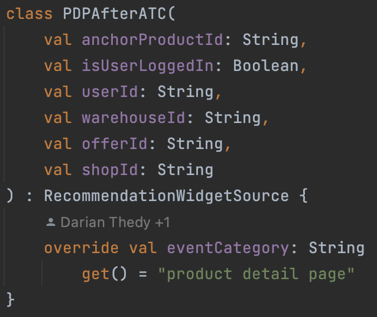
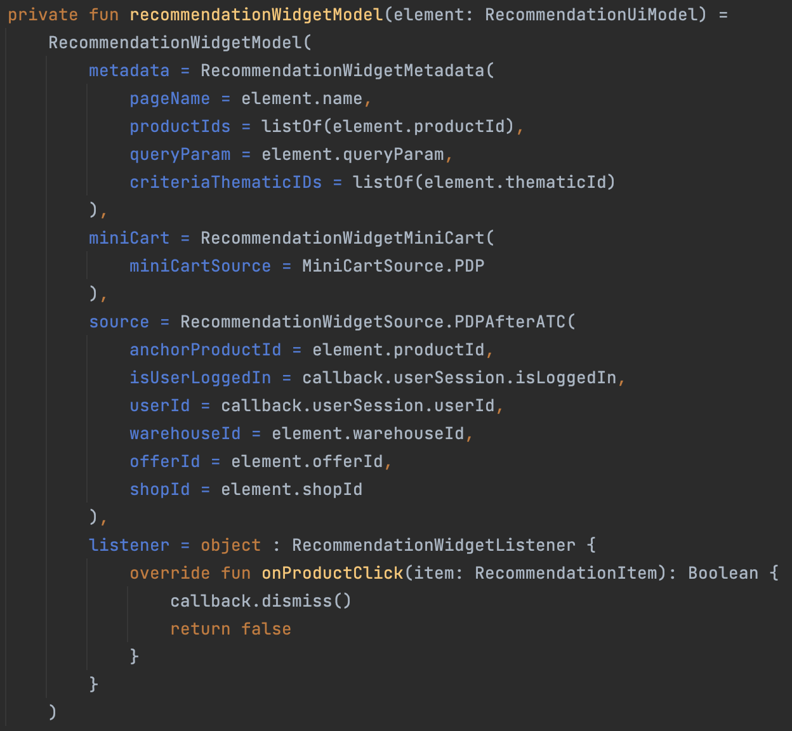
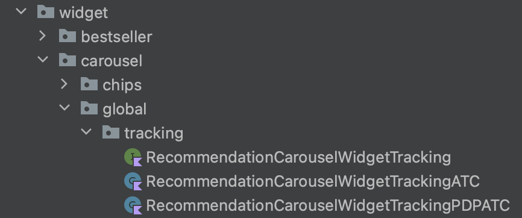
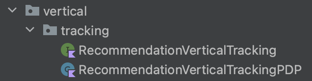
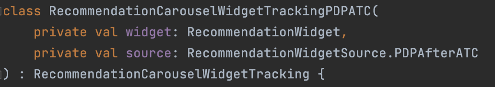
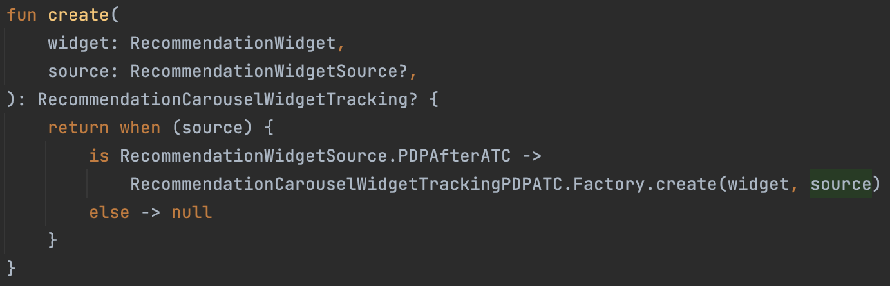

---
labels:
- Recommendation
---
<!--left header table-->
| **Status**      | <!--start status:Green-->RELEASE<!--end status-->                                            |
|-----------------|----------------------------------------------------------------------------------------------|
| Team            | Minion Dave                                                                                  |
| Module type     | <!--start status:Yellow-->FEATURE<!--end status-->                                           |
| Release date    | -                                                                                            |
| Product Manager | @Denny Hartanto                                                                              |
| Contributors    | @Zulfikar Rahman @Darian Thedy @Frenzel Timothy Surya                                        |
| Module Location | features/discovery/recommendation_widget_common / com.tokopedia.recommendation_widget_common |
| Product PRD     | -                                                                                            |

<!--toc-->
## Release Notes

## Overview

### Background
Recommendation Widget is a widget that can show product recommendations in a lot of pages across Tokopedia App. The goal of Global Recommendation Widget is to enable all those pages to show product recommendation easily.

### Project Description
Global Recommendation Widget aims to create a single entry point where all pages with all kinds of layout requirements can implement it as simple as plug and play.

Supported Widgets:
- Recommendation Carousel
- Recommendation Vertical _(please note this is different from infinite recommendation)_
- Comparison BPC (Beauty & Personal Care)

Already implemented in:
- Inbox Page => Carousel & Vertical
- Product Detail Page (PDP) => Vertical & Comparison BPC
- PDP Post-ATC Bottom Sheet => Carousel

## Diagram

## How To
To implement this widget, please follow these steps:
1. Add `RecommendationWidgetView` to your xml. If you are using RecyclerView in your page, you can create your own ViewHolder and add this widget in the ViewHolder's layout file. 
2. Call `bind()` function available in the widget with the appropriate `RecommendationWidgetModel`. `RecommendationWidgetModel` contains all the configuration that is needed to show product recommendation on your page:
   1. `metadata: RecommendationWidgetMetadata` => This contains parameters that is usually passed to Recommendation BE GQL, such as `pageSource`, `pageName`, `productIds`, `categoryIds`, etc.
   2. `miniCart: RecommendationWidgetMiniCart` => This contains specific parameters for MiniCart if your page implements MiniCart as well, usually for Tokopedia NOW pages.
   3. `source: RecommendationWidgetSource` => This contains specific page source that calls the widget. If your page does not exist yet, please add a new class inside `RecommendationWidgetSource` that implements the interface. If required, you can add some constructor parameters, for example for tracker needs.
      
   4. `listener: RecommendationWidgetListener` => You may use this field if you need action callback from the widget. If your requirement is not on the listener yet, please reach Recommendation FE team to add the capability.
   5. You may ignore other fields as they are deprecated and will be removed soon.
   
3. If you are using RecyclerView, please make sure to override `onViewRecycled()` on both Adapter and ViewHolder, then call `recycle()` function.
4. To implement tracker based on your page needs, please follow these steps:
   1. Create a page specific tracker class inside widget specific package. Example: `RecommendationCarouselWidgetTrackingPDPATC` PDP Post-ATC Recom Carousel tracker.  
      
      
      
   2. Update widget specific tracking interface to map the source to the newly created tracker class. Example: `RecommendationCarouselWidgetTracking.Factory.create()`
      
5. If your page has refresh capability, please follow these steps:
   1. Get/create `RecommendationWidgetViewModel` instance using `recommendationWidgetViewModel()` function. 
   -Example: `private val recommendationWidgetViewModel by recommendationWidgetViewModel()`
   2. Call `refresh()` function from that instance.

Please get in touch with Recommendation team (FE or PM) to know what your page need to send, especially `pageName` and tracking.

## Action Items

- Migrate Recommendation Widget from other page into Global Recommendation Widget
- Move all Recommendation Carousel functionalities into Global Recommendation Widget
- Move existing Comparison Widget functionalities into Global Recommendation Widget

## Useful Links

