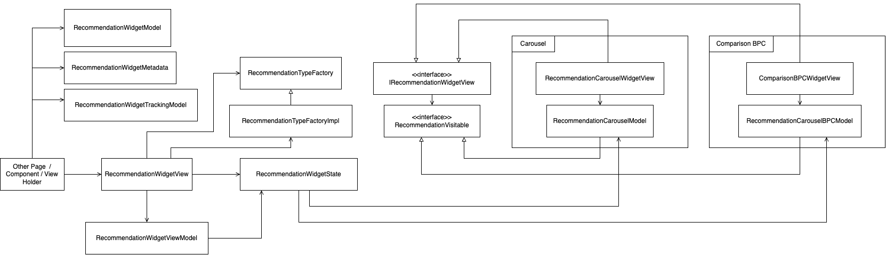

---
labels:
- Recommendation
---
<!--left header table-->
| **Status**      | <!--start status:Green-->RELEASE<!--end status-->                                            |
|-----------------|----------------------------------------------------------------------------------------------|
| Team            | Minion Dave                                                                                  |
| Module type     | <!--start status:Yellow-->FEATURE<!--end status-->                                           |
| Release date    | -                                                                                            |
| Product Manager | @Denny Hartanto                                                                              |
| Contributors    | @Zulfikar Rahman @Darian Thedy @Frenzel Timothy Surya                                        |
| Module Location | features/discovery/recommendation_widget_common / com.tokopedia.recommendation_widget_common |
| Product PRD     | -                                                                                            |

<!--toc-->
## Release Notes

## Overview

### Background
Recommendation Widget is a widget that can show product recommendations in a lot of pages across Tokopedia App. The goal of Global Recommendation Widget is to enable all those pages to show product recommendation easily.

### Project Description
Global Recommendation Widget aims to create a single entry point where all pages with all kinds of layout requirements can implement it as simple as plug and play.

## Diagram

## How To
To implement this widget, add `RecommendationWidgetView` to your xml. If you are using RecyclerView in your page, you can create your own ViewHolder and add this widget in the ViewHolder's layout file. After that, call `bind` function available in the widget with the appropriate `RecommendationWidgetModel`.
`RecommendationWidgetModel` contains all the configuration that is needed to show product recommendation on your page:
1. `RecommendationWidgetMetadata` => This contains parameters that is usually passed to Recommendation BE GQL, such as `pageSource`, `pageName`, `productIds`, `categoryIds`, etc.
2. `RecommendationWidgetTrackingModel` => This contains parameters that is needed by Tracking.
3. `RecommendationWidgetMiniCart` => This contains specific parameters for MiniCart if your page implements MiniCart as well, usually for Tokopedia NOW pages.

Please get in touch with Recommendation team (FE or PM) to know what your page need to send, especially `pageName` and tracking.

## Action Items

- Migrate Recommendation Widget from other page into Global Recommendation Widget
- Move existing Recommendation Carousel functionalities into Global Recommendation Widget
- Move existing Comparison Widget functionalities into Global Recommendation Widget

## Useful Links

