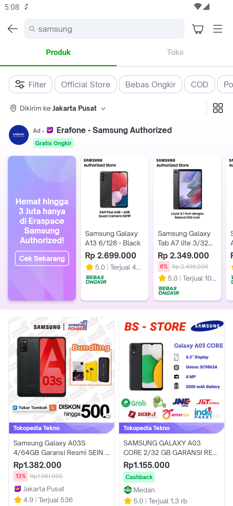
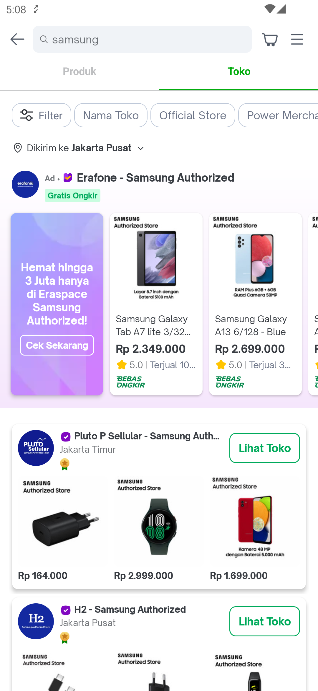
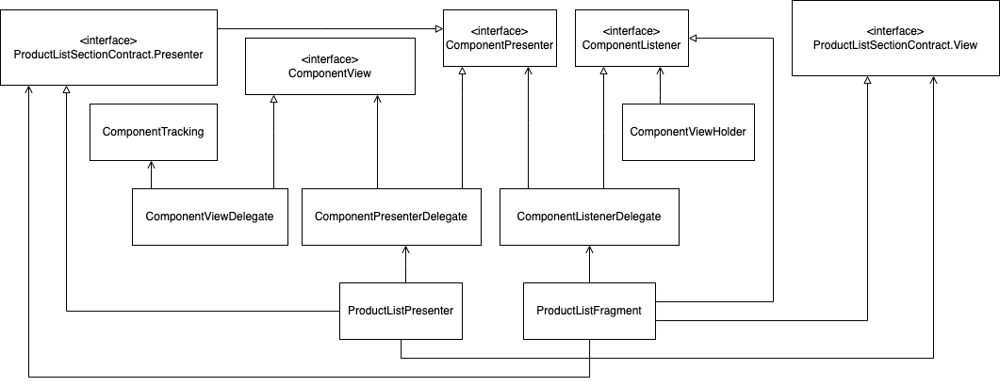

---
labels:
- SRP
- Search
---
<!--left header table-->
| **Status** | <!--start status:Green-->RELEASE<!--end status--> |
| --- | --- |
| Team | Minion Dave |
| Module type | <!--start status:Yellow-->FEATURE<!--end status--> |
| Release date | - |
| Product Manager | @Hefrian, @Sheila, @Matthew, @Melvin, @Jefferson, @Gilang |
| Contributors | @Zulfikar Rahman @Darian Thedy @Muhammad Fiqri Muthohar |
| Module Location | features.search / features/discovery/search / com.tokopedia.search |
| Product PRD | - |

<!--toc-->
## Release Notes

## Overview

### Background
There are millions of products and shops available in Tokopedia. Search feature can help users find those products and shops based on the keywords.

### Project Description
Search Result Page is a page to show list of products or shops based on the keyword input from the user. It may also contains Top Ads and some product recommendations. Users can use some filters to narrow down the search result. List of Products and Shops shown are separated with tab.

## Diagram

### Search Result Page
Search Result Page is an activity with tabs: tab Product and tab Shop.

<!-- insert SRP Diagram here -->

### Search Result - Product Tab
Search Result Product consists of multiple component or sub features, such as Top Ads, Broad Match, Inspiration Carousels, Inspiration Widgets, Banner, etc. This is the class diagram between Search Result Product Fragment, Presenter, and any of its components:

### Search Result - Shop Tab
<!-- insert SRP Shop Tab Diagram here -->

## Navigation

## How To

### Open Search Result Page with Applink
You can use applink tokopedia://search?q=_$keyword_, replacing _$keyword_ with the actual keyword. All the query parameters in the applink will be sent to Search API. This means the products in Search Result Page will be shown based on the query parameters as well. For example, you can use applink tokopedia://search?q=samsung&official=true, which will search with keyword "samsung" from Official Store shops.

## Action Items

- Research [MvRx](https://github.com/airbnb/mavericks)

## Useful Links
- [Search Product API](https://tokopedia.atlassian.net/wiki/spaces/SE/pages/354713601#API-SearchProduct-GQL)
- [Banned Products](https://tokopedia.atlassian.net/wiki/spaces/PA/pages/2065843034/Search+Result+Page+-+Banned+Products)
- [Banner](https://tokopedia.atlassian.net/wiki/spaces/PA/pages/2067141109/Search+Result+Page+-+Banner)
- [Broad Match](https://tokopedia.atlassian.net/wiki/spaces/PA/pages/2068155239/Search+Result+Page+-+Broad+Match)
- Change View
- Choose Address 
- CPM / Shop Ads 
- Empty State 
- Global Nav / Top Nav Widget
