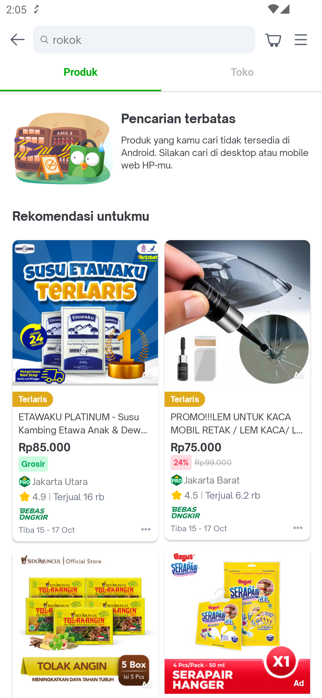

---
labels:
- SRP
- Search
- Tobacco
---
<!--left header table-->
| **Status** | <!--start status:Green-->RELEASE<!--end status--> |
| --- | --- |
| Team | Minion Dave |
| Module type | <!--start status:Yellow-->FEATURE<!--end status--> |
| Release date | - |
| Product Manager | @Melvin |
| Contributors | @Zulfikar Rahman @Darian Thedy @Muhammad Fiqri Muthohar |
| Module Location | com.tokopedia.search.result.product.banned |
| Product PRD | - |

<!--toc-->
## Release Notes

## Overview

### Background
Google changed its policy to prohibit Apps that encourages the use of Tobacco and Alcohol in Play Store. This means Tokopedia Apps could be taken down from Play Store if it is still available for users to buy Tobacco and Alcohol.

### Project Description
Search Result Page will not show products that goes under category of Tobacco, such as rokok or vape. The UI will simply show simple illustration with message Pencarian terbatas (restricted search).

## Flow Diagram

## Action Items

- Double check with PM if this is still necessary after we implemented a violation widget.
- Current Impression tracker for this widget is still hit from Presenter. We should move it into the ImageView.addImpressionListener.

## Useful Links
- [Tobacco](https://support.google.com/googleplay/android-developer/answer/6161122?hl=en)
- [Inappropriate Content](https://support.google.com/googleplay/android-developer/answer/9878810)

## FAQ
<!--start expand:How can users buy tobacco / alcohol products in Tokopedia?-->
Users can still buy tobacco / alcohol products via Tokopedia Desktop
<!--end expand-->