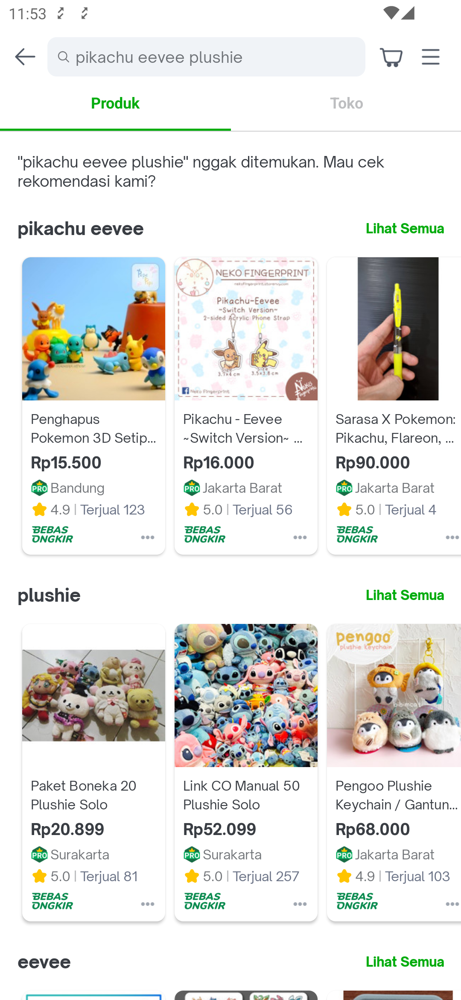
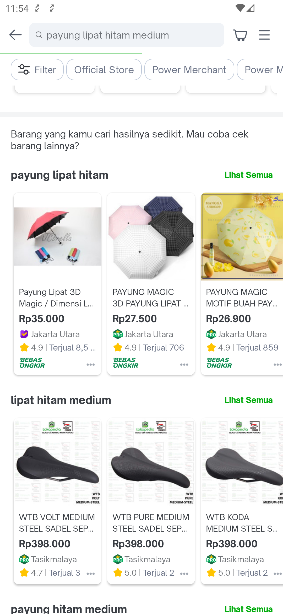

---
labels:
- SRP
- Search
---
<!--left header table-->
| **Status** | <!--start status:Green-->RELEASE<!--end status--> |
| --- | --- |
| Team | Minion Dave |
| Module type | <!--start status:Yellow-->FEATURE<!--end status--> |
| Release date | - |
| Product Manager | @Hefrian |
| Contributors | @Zulfikar Rahman @Darian Thedy @Muhammad Fiqri Muthohar |
| Module Location | com.tokopedia.search.result.product.broadmatch |
| Product PRD | [Broad Matching](https://tokopedia.atlassian.net/wiki/spaces/SE/pages/651526492) |

<!--toc-->
## Release Notes

## Overview

### Background
There are condition where users use keywords that too specific or user search with partially correct keyword and we haven't recognize the other part of the keyword. Right now this condition will generate no search result or in some condition we offer alternative keywords using fuzzy but came out it was out of context.

### Project Description
Show list of alternative keywords with the list of products for users to choose and continue searching with those alternative keywords.

## Flow Diagram

## Useful Links
- [JIRA Ticket](https://tokopedia.atlassian.net/browse/AN-6586)
- [API](https://tokopedia.atlassian.net/wiki/spaces/SE/pages/354713601#API-SearchProduct-GQL)
- [Tracker](https://tokopedia.atlassian.net/browse/AN-38563)
