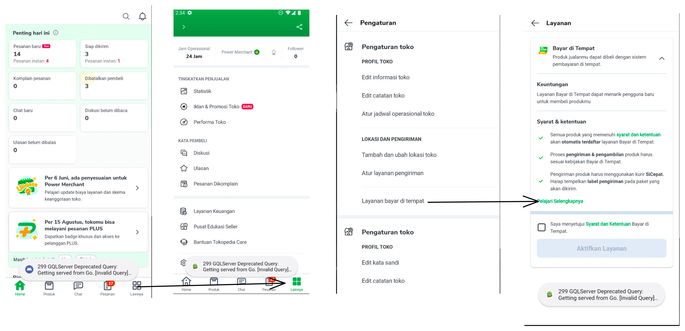

| **Status** | <!--start status:GREEN-->RELEASED<!--end status--> |
| --- | --- |
| **Project Contributor** | [Fakhira Devina](https://tokopedia.atlassian.net/wiki/people/61077e53b704b40068e80a8e?ref=confluence) |
| Product Manager | [Nuringtyas Rahwinarni](https://tokopedia.atlassian.net/wiki/people/5f58b98ed2c77e0075ac9865?ref=confluence)  |
| Team | [Minion Bob](https://tokopedia.atlassian.net/people/team/2373d8a6-1afc-4f2a-aa7a-63855c273051) |
| Release date | 24 September 2020 / <!--start status:GREY-->SA-2.24<!--end status-->  |
| Module type | <!--start status:YELLOW-->FEATURE<!--end status--> |
| Product PRD | **Figma :** <https://www.figma.com/file/Owqs18GACUfIrvClUNm03W/COD-For-All-Users?node-id=112%3A0>  |
| Module Location | `features/logistic/activation` |

<!--toc-->

## Release Notes

<!--start expand:24 September 2020 (SA-2.24)-->
[First release](https://tokopedia.atlassian.net/browse/AN-20018)
<!--end expand-->

## Overview

### Background

Today, activation page can be found in SellerApp and only handle COD Activation for seller, but in a near future, it can handle multiple feature that can beneficial for seller.

## Navigation

Can be accessed only in seller app

## How-to

To go to COD activation page, you can call  internal applink `tokopedia-android-internal://marketplace/shop-settings-cod`

## Tech Stack

- MVVM
- Kotlin
- JUnit
- Coroutines

### GQL & API List

| **GQL & API Name** | **Documentation Link** | **Description** |
| --- | --- | --- |
| `shopFeatureData` | [Shop Feature Query](/wiki/spaces/MC/pages/622891217/Shop+Feature+Query)  | Get Shop Feature Data |
| `updateShopFeature` | [Update Shop Feature](/wiki/spaces/MC/pages/617913598/Update+Shop+Feature)  | Update Shop FeatureSend param with- `type`: 1 (cod activation)  |