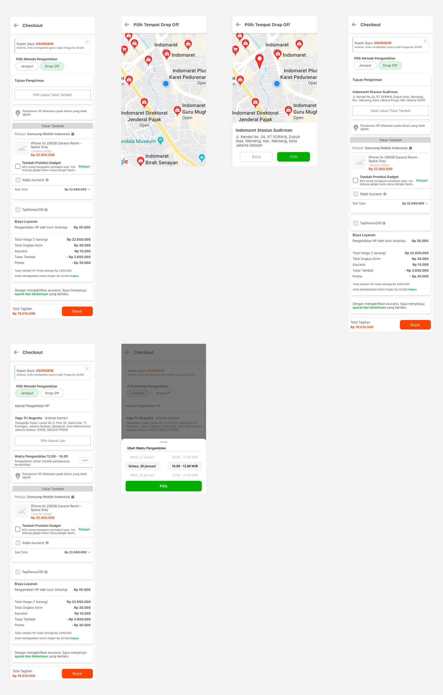

| **Status** | <!--start status:GREEN-->RELEASE<!--end status--> |
| --- | --- |
| Contributors | [Fajar Nuha](https://tokopedia.atlassian.net/wiki/people/5c90c19e47a4d62d37cde63f?ref=confluence)  |
| Product Manager |  |
| Team | Minion Bob |
| Release date | 10 Dec 2019 / <!--start status:GREY-->MA-3.55<!--end status--> |
| Module type |  <!--start status:YELLOW-->FEATURE<!--end status--> |
| Product PRD | [PRD Category - Trade-in nationwide expansion](/wiki/spaces/CT/pages/507936904/PRD+Category+-+Trade-in+nationwide+expansion) (Trade-In) |
| Module Location | `features/logistic/dropoff` |

<!--toc-->

## Release Notes

<!--start expand:10 Dec 2019 (MA-3.55)-->
###### [First Release](https://tokopedia.atlassian.net/browse/AN-2795)
<!--end expand-->

## Overview

*Dropoff is a part of trade-in feature where user can drop the order to nearby Indomaret, we as a Logistic provides maps view and nearest Indomaret Location.*

## Tech Stack

- *MVVM*
- *Coroutines*
- *JUnit*

### UI Component

- Autocomplete Fragment
- Dropoff Picker

	- Map Fragment
	- BottomSheet Nearby Location

### GQL

| **GQL Name** | **Documentation Link** | **Description** |
| --- | --- | --- |
| `KeroMapsAutoComplete` | [GMaps Autocomplete - /maps/autocomplete](/wiki/spaces/LG/pages/586482573) | To get all available location using keyword |
| `KeroPlacesGetDistrict` | [GMaps Autofill District Place Detail - /maps/places/get-district](/wiki/spaces/LG/pages/694750060) | To get district detail from placeId |
| `keroAddressCorner` | [Get Address Corner - /maps/v1/address/corner](/wiki/spaces/LG/pages/694794650) | Get All User Addresses |
| `keroAddressStoreLocation` | [Get Store Location - /maps/store-location/address](/wiki/spaces/LG/pages/560238543)  | Getting Indomaret Location |

## Navigation

`tokopedia-android-internal://logistic/dropoff/`

