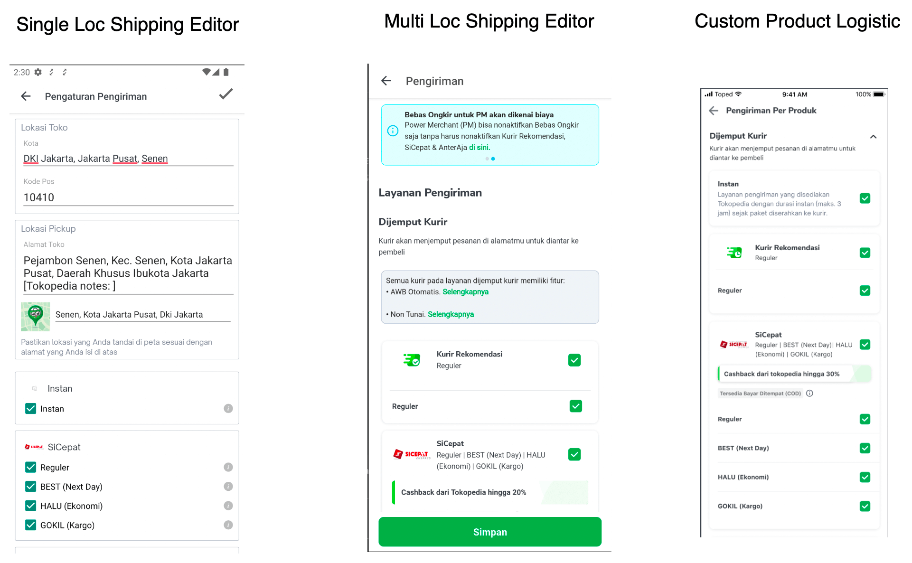

| **Project Lead** | [Angga Prasetiyo](https://tokopedia.atlassian.net/wiki/people/5c90710f9701df2d3a08e7c1?ref=confluence)  |
| --- | --- |
| Product Manager | [Aditya Rifaldi](https://tokopedia.atlassian.net/wiki/people/603c7cf8333ff40070ba5f3c?ref=confluence)  |
| Team | Minion Bob |
| Status | <!--start status:GREEN-->RELEASE<!--end status--> |
| Release date | - |
| Module type | <!--start status:YELLOW-->FEATURE<!--end status--> |
| Product PRD | - |
| Gradle module name | `features.editshipping` | `features/logistic/editshipping` | `com.tokopedia.editshipping` |

## Background

Tokopedia facilitates seller to set up courier with a feature called `Shipping Editor`. Seller can set up courier for shop level wide or just for a specific product. 

## Description

Shipping editor page is a page to show available courier that can be chosen by seller. There are two different shipping editors based on number of seller warehouse. If seller only support one warehouse, then system will direct seller to shipping editor single loc page. If seller support more than one warehouse, system will direct seller to shipping editor multi loc page. Seller can also setup courier for a specific product only in Custom Product Logistic (CPL) page.

## Sub-features / Widget / Interactions

- [Shipping Editor](/wiki/spaces/PA/pages/1761280076/Shipping+Editor)
  - Single Loc
  - Multi Loc
- [Custom Product Logistic](/wiki/spaces/PA/pages/2103097544/Custom+Product+Logistic)
- [Edit Address Multi Location](https://tokopedia.atlassian.net/wiki/spaces/PA/pages/2106130969/Edit+Shipping+Edit+Shop+Multilocation+Address)