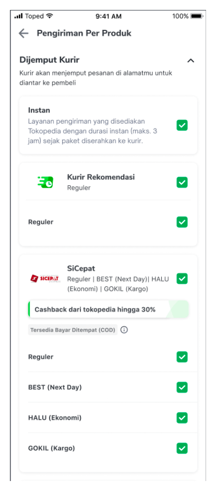
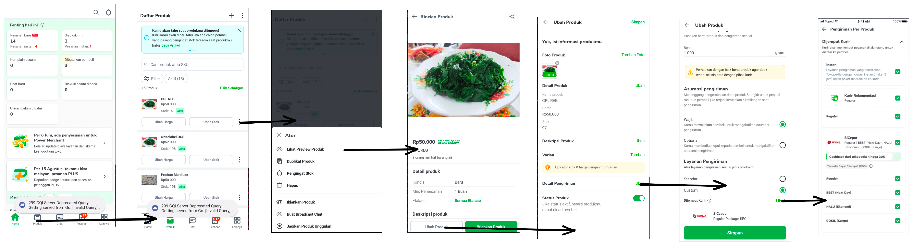

| **Status** | <!--start status:GREEN-->RELEASED<!--end status--> |
| --- | --- |
| **Project Contributor** | [Fakhira Devina](https://tokopedia.atlassian.net/wiki/people/61077e53b704b40068e80a8e?ref=confluence) |
| Product Manager | [Aditya Rifaldi](https://tokopedia.atlassian.net/wiki/people/603c7cf8333ff40070ba5f3c?ref=confluence) |
| Team | [Minion Bob](https://tokopedia.atlassian.net/people/team/2373d8a6-1afc-4f2a-aa7a-63855c273051) |
| Release date | 16 September 2021 / <!--start status:GREY-->MA-3.143<!--end status--> <!--start status:GREY-->SA-2.73<!--end status-->  |
| Module type | <!--start status:YELLOW-->FEATURE<!--end status--> |
| Product PRD | - |
| Module Location | `features/logistic/editshipping` |

## Release Notes

<!--start expand:20 Jan 2023 (MA-3.204/SA-2.134)-->
Whitelabel Instan
<!--end expand-->

<!--start expand:5 August 2022 (SA-2.116)-->
[Fix checkbox cpl when uncheck child item](https://tokopedia.atlassian.net/browse/AN-39565)
<!--end expand-->

<!--start expand:20 May 2022 (MA-3.175/SA-2.105)-->
[Gocar Instan Coachmark](https://tokopedia.atlassian.net/browse/AN-35180)
<!--end expand-->

<!--start expand:16 September 2021 (MA-3.143/SA-2.73)-->
[Release](https://tokopedia.atlassian.net/browse/AN-28150)
<!--end expand-->

# Overview

## Background

Tokopedia facilitates seller to set up courier for a specific product with Custom Product Logistic feature. CPL page only accessible from seller app. 



## Navigation


- 
- Edit Product: Seller app only → tab product → Lihat preview product → Ubah product → detail pengiriman
- Add Product: Seller app only → tab product → click icon + → detail pengiriman

## How-to

To go to CPL page, you can call `ApplinkConstInternalLogistic.CUSTOM_PRODUCT_LOGISTIC` with these extras:


| **Key** | **Description** | **Type** | **Mandatory** | **Status** |
| --- | --- | --- | --- | --- |
| EXTRA\_CPL\_PARAM | shipper service ids from getProductV3 ([details here](https://tokopedia.atlassian.net/wiki/spaces/PA/pages/2104460915/Tech+Plan+-+Whitelabel+Seller+Side#Adjustment-to-get-activated-CPL-from-BE-merchant)). Used for hit `ongkirGetCPLEditor` GQL | Long Array | Y | <!--start status:GREY-->IN DEVELOPMENT<!--end status-->  |
| EXTRA\_SHOP\_ID | shop id | long | Y | <!--start status:GREEN-->DONE<!--end status-->  |
| EXTRA\_PRODUCT\_ID | product id | string | Y | <!--start status:GREEN-->DONE<!--end status-->  |
| EXTRA\_SHIPPER\_SERVICES | draft shipper service selected by user, not saved to BE yet | Int Array | N | <!--start status:GREEN-->DONE<!--end status-->  |


```
startActivityForResult(
            RouteManager.getIntent(
                context,
                ApplinkConstInternalLogistic.CUSTOM_PRODUCT_LOGISTIC
            ).apply {
                putExtra(
                    EXTRA_CPL_PARAM, extraCplParam
                )
                putExtra(EXTRA_SHOP_ID, shopId.toLong())
                putExtra(EXTRA_PRODUCT_ID, "")
                putIntegerArrayListExtra(EXTRA_SHIPPER_SERVICES, extraShipperServices)
            }, REQUEST_CODE_CPL
)
```

# Tech Stack

- Shipping Editor (Multi-Loc)
  - MVVM
  - Kotlin
  - JUnit
  - Coroutines

## GQL List


| **GQL & API Name** | **Documentation Link** | **Description** |
| --- | --- | --- |
| `ongkirGetCPLEditor` | [Get CPL Editor](/wiki/spaces/LG/pages/2061927259/Get+CPL+Editor)  | Get available and chosen courier for selected product |

# Useful Links

1. [Figma](https://www.figma.com/file/FVDQo4TKYRYZQPqmXsvfyD/Shipping-Editor-x-Shipping-Selection-v2.3---Whitelabel-Instant-Service?node-id=1516%3A157356&t=7VlxIA4eWgPom0MN-0)