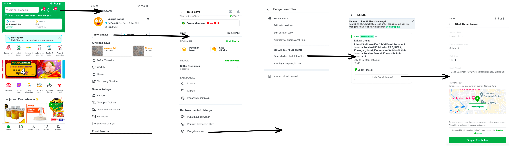

<!--left header table-->
| **Status**               | <!--start status:GREEN-->RELEASED<!--end status-->                                                               |
|--------------------------|------------------------------------------------------------------------------------------------------------------|
| **Project Contributor**  | [Fakhira Devina](https://tokopedia.atlassian.net/wiki/people/61077e53b704b40068e80a8e?ref=confluence)            |
| Product Manager          | [Septian Bayu Laksono](https://tokopedia.atlassian.net/wiki/people/5df8541fa0602c0cabdce844?ref=confluence)      |
| Team                     | [Minion Bob](https://tokopedia.atlassian.net/people/team/2373d8a6-1afc-4f2a-aa7a-63855c273051)                   |
| Release date             | 19 Mar 2021 / <!--start status:GREY-->MA-3.199<!--end status--> <!--start status:GREY-->SA-2.49<!--end status--> |
| Module type              | <!--start status:YELLOW-->FEATURE<!--end status-->                                                               |
| Product PRD              | <https://docs.google.com/document/d/1aYZuy3NFTxXozIhIqdlMSljTknYrKmaHL9G3ozgt4L8/edit#heading=h.2msbh42vwwqv>    |
| Module Location          | `features/logistic/editshipping`                                                                                 |

<!--toc-->

## Release Notes

<!--start expand:1 September 2023-->
Remove Shop Single Location
<!--end expand-->

<!--start expand:19 March 2021 (MA-3.199/SA-2.49)-->
[First release](https://tokopedia.atlassian.net/browse/AN-22308)
<!--end expand-->

## Overview

### Background

Today, Tokopedia only facilitates multiple-locations through Tokopedia Warehouses (TokoCabang) managed by Tokopedia’s partners. However, the use cases for TokoCabang is not fit with the needs of (a) offline retailers that already have strong network presence (b) track inventory across these locations (c) nature of business that is not fit to be handled by third party, e.g. frozen food, large volume items (Furniture, Cars), high valuable items (Jewelry). 

This limitation then resulted in many of the merchants restoring to either (a) Set up and operating multiple stores to activate different locations (b) Manually routing incoming orders offline to fulfill from multiple warehouses. For buyers (especially outside Jabodetabek), this experience makes them struggle to discover localized products that require same-day/instant delivery, e.g. fresh, frozen, ready-to-eat, through our platforms (search, browse). Building multiple ship location capabilities will provide huge benefits for our sellers, our buyers as well as Tokopedia.

### Project Description

Revamp shipping editor to be a place to set up (activate-deactivate) courier only

- Remove section to setup address district-city, postal code, and pinpoint

## Navigation

MA/SA -> pengaturan toko -> Tambah dan ubah lokasi toko -> edit lokasi

 

## How-to

To show edit address multi location page you can call `ApplinkConstInternalLogistic.SHOP_EDIT_ADDRESS` 


```
startActivityForResult(RouteManager.getIntent(this, ApplinkConstInternalLogistic.SHOP_EDIT_ADDRESS))
```


---

## Useful Links

- [Figma](https://www.figma.com/file/dBAnwVyjDUOO4llvBnzXaS/%5BUI-%2F-UX---D---Custom-Product-Logistic-%2F-Shipping-Editor-%5D-Multi-Location?node-id=956%3A46647)

## Tech Stack

- MVVM
- Kotlin
- JUnit
- Coroutines

### GQL & API List


| **GQL & API Name** | **Documentation Link** | **Description** |
| --- | --- | --- |
| `kero_maps_autocomplete` | [Get CPL Editor](https://tokopedia.atlassian.net/wiki/spaces/LG/pages/2061927259/Get+CPL+Editor)  | Get related location from a `keyword`, will return list of `place_id`s |
| `kero_places_get_district` | [GMaps Autofill District Place Detail - /maps/places/get-district](https://tokopedia.atlassian.net/wiki/spaces/LG/pages/694750060)  | Get location detail based on `place_id`  |
| `keroGetDistrictDetails` | [[Kero] Get District Details Docs](https://tokopedia.atlassian.net/wiki/spaces/LG/pages/588841721)  | Get available zip codes based on `district_id` |
| `kero_maps_autofill` | [Get All City - maps/v1/address/get-all-city](https://tokopedia.atlassian.net/wiki/spaces/LG/pages/626229824)  | Get location formatted address based on latitude & longitude |
| `ShopLocUpdateWarehouse` | [HTTP - Update warehouse Shop location](https://tokopedia.atlassian.net/wiki/spaces/LG/pages/963454179/HTTP+-+Update+warehouse+Shop+location)  | Save edit address |
| `ShopLocCheckCouriersNewLoc` | [HTTP - Check Courier New Location](https://tokopedia.atlassian.net/wiki/spaces/LG/pages/987894946/HTTP+-+Check+Courier+New+Location)  | Check courier availability before saving edit address, if courier not available then user will be notified before saving edit address |