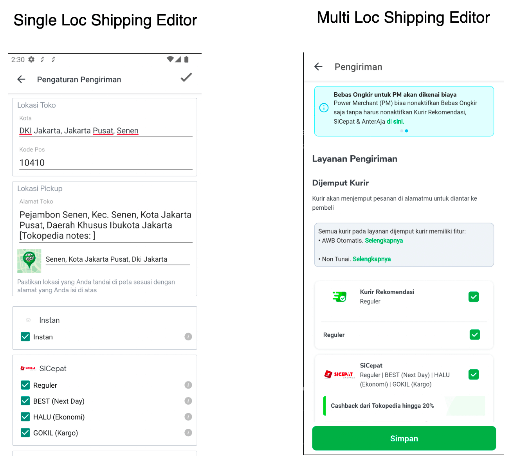
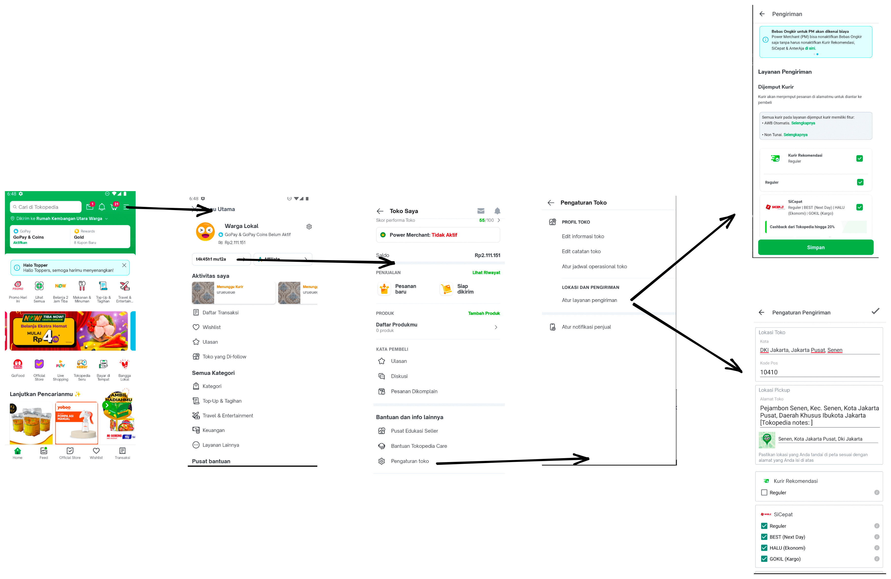
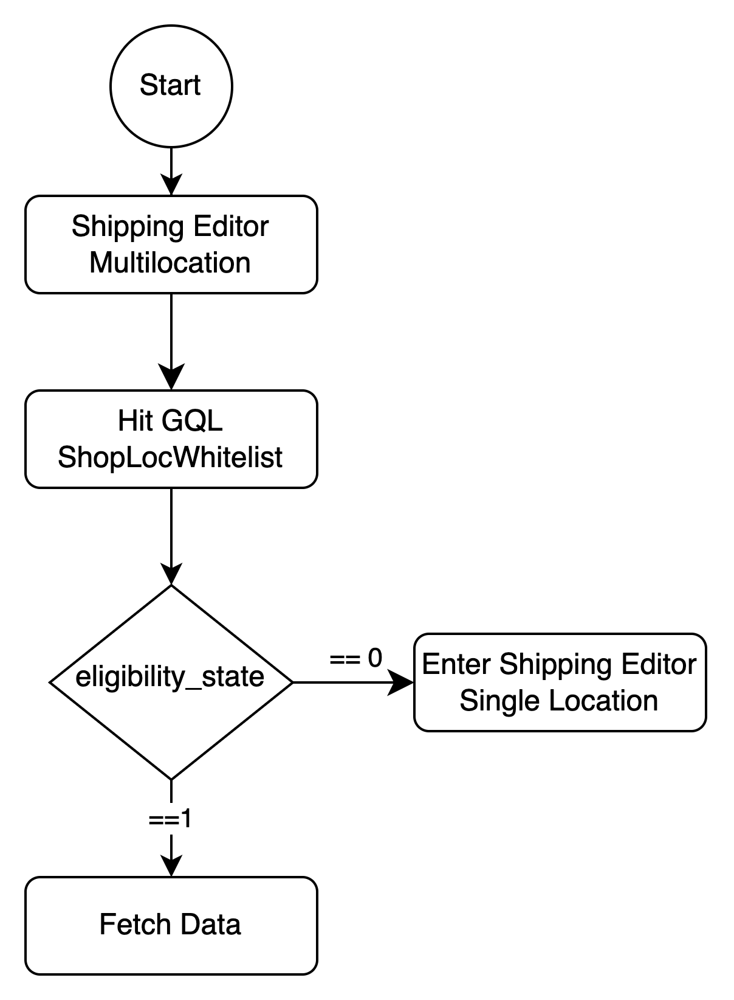

<!--left header table-->
| **Status**              | <!--start status:GREEN-->RELEASED<!--end status-->                                                             |
|-------------------------|----------------------------------------------------------------------------------------------------------------|
| **Project Contributor** | [Fakhira Devina](https://tokopedia.atlassian.net/wiki/people/61077e53b704b40068e80a8e?ref=confluence)          |
| Product Manager         | [Aditya Rifaldi](https://tokopedia.atlassian.net/wiki/people/603c7cf8333ff40070ba5f3c?ref=confluence)          |
| Team                    | [Minion Bob](https://tokopedia.atlassian.net/people/team/2373d8a6-1afc-4f2a-aa7a-63855c273051)                 |
| Release date            | -                                                                                                              |
| Module type             | <!--start status:YELLOW-->FEATURE<!--end status-->                                                             |
| Product PRD             | **Multi-Loc** PRD: <https://docs.google.com/document/d/1aYZuy3NFTxXozIhIqdlMSljTknYrKmaHL9G3ozgt4L8/edit> |
| Module Location         | `features/logistic/editshipping`                                                                               |

<!--toc-->

## Release Notes

<!--start expand:1 September 2023-->
Remove Shop Single Location
<!--end expand-->

<!--start expand:20 Jan 2023 (MA-3.204/SA-2.134)-->
[Whitelabel Instan](https://tokopedia.atlassian.net/wiki/spaces/PA/pages/2104460915/Whitelabel+Instan)
<!--end expand-->

<!--start expand:20 May 2022 (MA-3.175/SA-2.105)-->
[Gocar Instan Coachmark](https://tokopedia.atlassian.net/browse/AN-35180)
<!--end expand-->

## Overview

### Background

Tokopedia facilitates seller to set up courier with a feature called `Shipping Editor`.

## Navigation

- Shipping editor page can be accessed with this app link `tokopedia-android-internal://marketplace/shop-settings-shipping`

## Flow Diagram

## Tech Stack

- Shipping Editor (Multi-Loc)
  - MVVM
  - Kotlin
  - JUnit
  - Coroutines

### GQL & API List

- Multi Loc

| **GQL Name** | **Documentation Link** | **Description** |
| --- | --- | --- |
| `ShopLocWhitelist` | [Eligible Multilocation](https://tokopedia.atlassian.net/wiki/spaces/PA/pages/1995178121/Eligible+Multilocation)  | To define whether seller is single loc seller or multi loc seller |
| `ongkirShippingEditorGetShipperDetail` | [Get Shipper Details](https://tokopedia.atlassian.net/wiki/spaces/LG/pages/1020857519/Get+Shipper+Details)  | To get shipping editor details |
| `ongkirShippingEditor` | [Get Shipper List Page](https://tokopedia.atlassian.net/wiki/spaces/LG/pages/984973950/Get+Shipper+List+Page)  | To get shipping editor shipper list |
| `ongkirShippingEditorGetShipperTicker` | [Get Shipper Ticker](https://tokopedia.atlassian.net/wiki/spaces/LG/pages/980768555/Get+Shipper+Ticker)  | To get shipping editor shipper ticker |
| `ongkirShippingEditorSave` | [Save Shipping Editor](https://tokopedia.atlassian.net/wiki/spaces/LG/pages/984974003/Save+Shipping+Editor)  | To save shipping editor based on user’s courier input |
| `ongkirShippingEditorPopup` | [Validate Popup Shipping Editor](https://tokopedia.atlassian.net/wiki/spaces/LG/pages/980768600/Validate+Popup+Shipping+Editor)  | To validate shippping editor popup based on user’s courier input |

## Useful Links

- UI/UX: <https://www.figma.com/file/dBAnwVyjDUOO4llvBnzXaS/%5BUI-%2F-UX---D---Custom-Product-Logistic-%2F-Shipping-Editor-%5D-Multi-Location?node-id=956%3A46647>
- GTM : <https://mynakama.tokopedia.com/datatracker/requestdetail/view/1137>