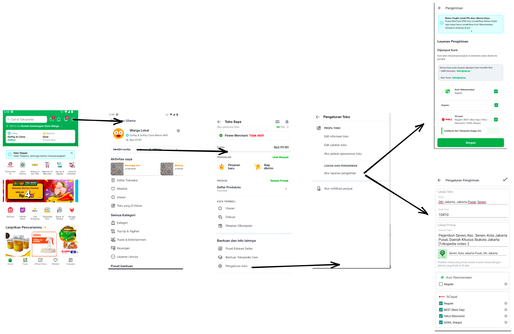
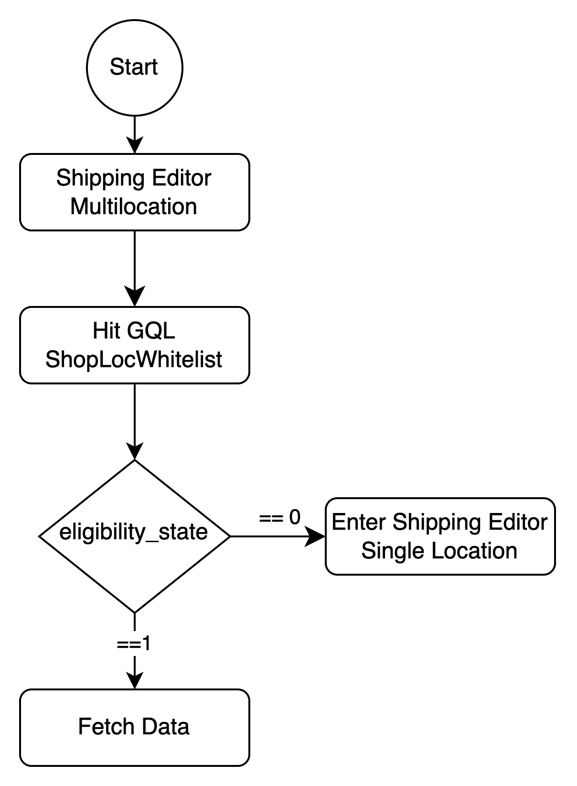

| **Status** | <!--start status:GREEN-->RELEASED<!--end status--> |
| --- | --- |
| **Project Contributor** | [Fakhira Devina](https://tokopedia.atlassian.net/wiki/people/61077e53b704b40068e80a8e?ref=confluence) |
| Product Manager | [Aditya Rifaldi](https://tokopedia.atlassian.net/wiki/people/603c7cf8333ff40070ba5f3c?ref=confluence)  |
| Team | [Minion Bob](https://tokopedia.atlassian.net/people/team/2373d8a6-1afc-4f2a-aa7a-63855c273051) |
| Release date | - |
| Module type | <!--start status:YELLOW-->FEATURE<!--end status--> |
| Product PRD | **Multi-Loc**PRD: <https://docs.google.com/document/d/1aYZuy3NFTxXozIhIqdlMSljTknYrKmaHL9G3ozgt4L8/edit>  |
| Module Location | `features/logistic/editshipping` |

<!--toc-->

## Release Notes

<!--start expand:20 Jan 2023 (MA-3.204/SA-2.134)-->
[Whitelabel Instan](/wiki/spaces/PA/pages/2104460915/Whitelabel+Instan)
<!--end expand-->

<!--start expand:20 May 2022 (MA-3.175/SA-2.105)-->
[Gocar Instan Coachmark](https://tokopedia.atlassian.net/browse/AN-35180)
<!--end expand-->

## Overview

### Background

Tokopedia facilitates seller to set up courier with a feature called `Shipping Editor`. There are 2 different pages for this `Shipping Editor`, the first one is for default seller (only have one warehouse), we called it **Single Location**, other for seller that have multiple warehouse or **Multi-Location**. Before, seller that have multiple warehouse, only can set up their courier through TokoCabang managed by Tokopedia’s partners. But now, all seller can manage their own courier in Tokopedia’s app.

Shipping Editor on **Single-Loc** handle shop edit address and courier selection in one page. Meanwhile, Shipping Editor on **Multi-Loc** only handle courier selection, but having interconnection with shop edit address in another page.

## Navigation

- Both pages can be accessed with this app link `tokopedia-android-internal://marketplace/shop-settings-shipping`

## Flow Diagram

## Tech Stack

- Shipping Editor (Single - Loc)

	- MVP
	- Java - Kotlin
	- Retrofit
	- **Still using REST**
- Shipping Editor (Multi-Loc)

	- MVVM
	- Kotlin
	- JUnit
	- Coroutines

### GQL & API List

- Single Loc

| **GQL & API Name** | **Documentation Link** | **Description** |
| --- | --- | --- |
| `keroMapsAutofill` | [GMaps Autofill District Geocode - /maps/geocode/get-district](/wiki/spaces/LG/pages/694818899) | To get district detail from latlong |
| `get_shipping_info.pl` | - | To get shipping editor info |
| `shippingEditorMobilePopup` | [BO Deactivation Confirmation Popup](/wiki/spaces/LG/pages/862292063/BO+Deactivation+Confirmation+Popup)  | To validate new shipper selection (deactivate Bebas Ongkir) |

- Multi Loc

| **GQL Name** | **Documentation Link** | **Description** |
| --- | --- | --- |
| `ShopLocWhitelist` | [Eligible Multilocation](/wiki/spaces/PA/pages/1995178121/Eligible+Multilocation)  | To define whether seller is single loc seller or multi loc seller |
| `ongkirShippingEditorGetShipperDetail` | [Get Shipper Details](/wiki/spaces/LG/pages/1020857519/Get+Shipper+Details)  | To get shipping editor details |
| `ongkirShippingEditor` | [Get Shipper List Page](/wiki/spaces/LG/pages/984973950/Get+Shipper+List+Page)  | To get shipping editor shipper list |
| `ongkirShippingEditorGetShipperTicker` | [Get Shipper Ticker](/wiki/spaces/LG/pages/980768555/Get+Shipper+Ticker)  | To get shipping editor shipper ticker |
| `ongkirShippingEditorSave` | [Save Shipping Editor](/wiki/spaces/LG/pages/984974003/Save+Shipping+Editor)  | To save shipping editor based on user’s courier input |
| `ongkirShippingEditorPopup` | [Validate Popup Shipping Editor](/wiki/spaces/LG/pages/980768600/Validate+Popup+Shipping+Editor)  | To validate shippping editor popup based on user’s courier input |

## Useful Links

- UI/UX: <https://www.figma.com/file/dBAnwVyjDUOO4llvBnzXaS/%5BUI-%2F-UX---D---Custom-Product-Logistic-%2F-Shipping-Editor-%5D-Multi-Location?node-id=956%3A46647>
- GTM : <https://mynakama.tokopedia.com/datatracker/requestdetail/view/1137>
