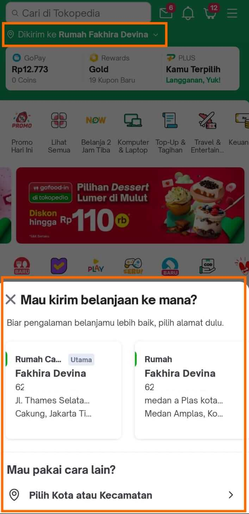
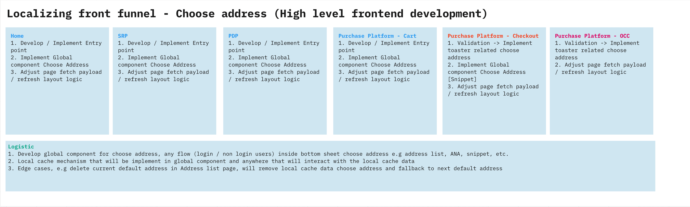
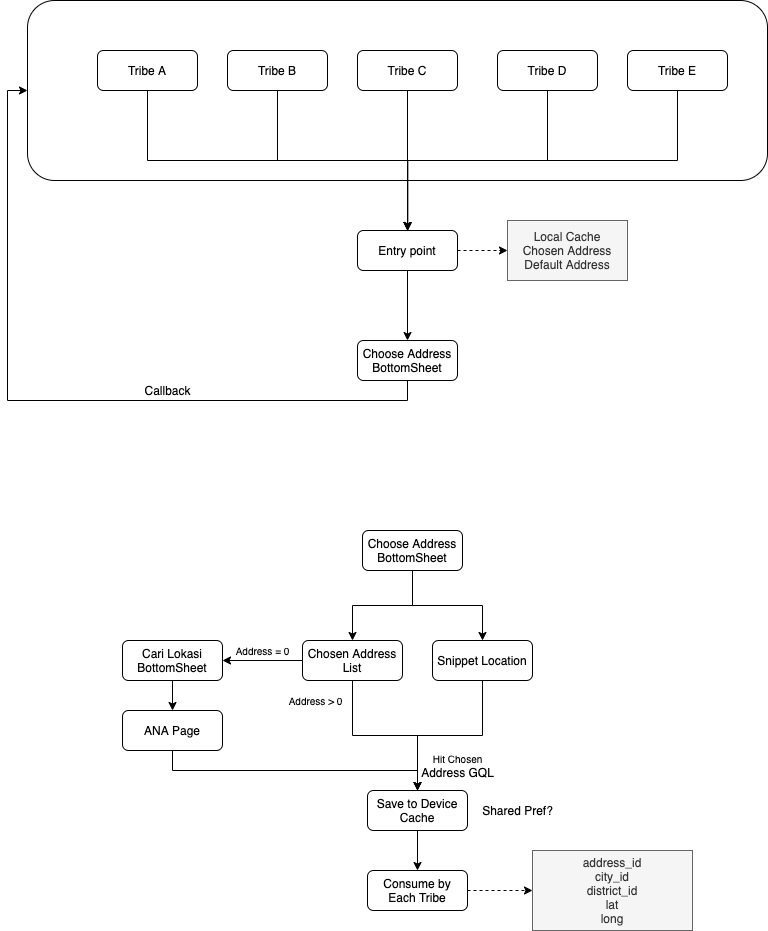

| **Status** | <!--start status:GREEN-->RELEASE<!--end status--> |
| --- | --- |
| Contributors | Android: [Angga Prasetiyo](https://tokopedia.atlassian.net/wiki/people/5c90710f9701df2d3a08e7c1?ref=confluence) [Ivan Fadhila (Unlicensed)](https://tokopedia.atlassian.net/wiki/people/5dd7516d58fc78100710fcea?ref=confluence) [Fakhira Devina](https://tokopedia.atlassian.net/wiki/people/61077e53b704b40068e80a8e?ref=confluence) [Felicia Widjaja](https://tokopedia.atlassian.net/wiki/people/5c90c19d196abe2e884c82ed?ref=confluence)  <br/>Backend Engineer: [Joel Hutasoit](https://tokopedia.atlassian.net/wiki/people/5cabff78faab36165eb9d1e7?ref=confluence) |
| Product Manager | [Nuringtyas Rahwinarni](https://tokopedia.atlassian.net/wiki/people/5f58b98ed2c77e0075ac9865?ref=confluence)  |
| Team | Minion Bob |
| Release date | March 2021 |
| Module type | <!--start status:BLUE-->SUB-FEATURE<!--end status--> |
| Product PRD | <https://docs.google.com/document/d/1wYVu25dTo8YsQ7s3ws8gq37T85KWPuE9siNjkLtVoGU/edit#heading=h.rq438b6zh7yv>  |
| Module Location | `features/logistic/localizationchooseaddress` |

<!--toc-->

## Release Notes

<!--start expand:26 September 2022 (MA-3.193)-->
[Add param is tokonow request](https://tokopedia.atlassian.net/browse/AN-41571)
<!--end expand-->

<!--start expand:7 April 2022 (MA-3.170)-->
[Tokonow home icon improvement - handling open new warehouse](https://tokopedia.atlassian.net/browse/AN-34800)
<!--end expand-->

<!--start expand:Jan 2022-->
NOW! 15
<!--end expand-->

## Overview

### Background


To deliver greater customer experience, Tokopedia wants to localize its front funnel (Home, Search and Discovery) so that products that cannot be delivered to a user's default address do not appear upon discovery. This is especially important since Tokopedia is growing its F&B categories and many F&B merchants which provide perishable products (example: frozen food, vegetables, meat, fruits) tend to only deliver within their city and exclusively ship with Instant and Same-Day Delivery.

Building the capabilities to choose an address in the very beginning of a buyer's journey to have localized experience tailored based on that chosen address, can avoid situations where buyers cannot checkout the items they have added to cart due to the merchants' coverage is outside buyer's destination address, in the very end of their journey, therefore saving buyer time from eventual disappointment, and improve discoverability for relevant merchants, especially those offering perishable FMCG products

### Project Description

A widget where user can choose / add their delivery address from various page in tokopedia, that help users to discover more relevant product that can be shipped to their address.

This UI Component will be created by Logistic FE, so the lifecycle and the functionality will be the same and unified.

- A consumer page will have to just add this component to their page and implement the [callback/listener](https://tokopedia.atlassian.net/wiki/spaces/PA/pages/1157243000/Choose+Address+Widget+-+Localized+Experience#Choose-Address-Listener).
- A [callback/listener](https://tokopedia.atlassian.net/wiki/spaces/PA/pages/1157243000/Choose+Address+Widget+-+Localized+Experience#Choose-Address-Listener) will be available for the consumer. So every time this widget needs to be updated/refreshed, the callback/delegate will be triggered, letting the consumer know and ideally handling their own refresh layout logic.
- We will provide [Local Cache Model](https://tokopedia.atlassian.net/wiki/spaces/PA/pages/1157243000/Choose+Address+Widget+-+Localized+Experience#Local-Cache-Model) to be consumed by each page. Local Chosen Address data will be fetched every time host fragment bind the Local Choose Address Widget with `chooseAddressWidget.bindChooseAddress(this)`
  - By default widget will get data from device’s shared preference
  - If device doesn’t have local chosen address data (indicated by `LocalCacheModel.address_id == 0`), widget will fetch data from BE [keroAddrGetStateChosenAddress](https://tokopedia.atlassian.net/wiki/spaces/LG/pages/1145635698/GQL+Get+State+Chosen+Address)

## Tech Stack

- MVVM
- Kotlin
- JUnit
- Coroutines

## Flow Diagram



## How-to

### **Choose Address Dependency**

First thing first to implement this widget is we must add a dependency in the `build.gradle` file of your module. 

- add a dependency to the Choose Address widget and its service:


```
implementation project(rootProject.ext.features.localizationchooseaddress)
```

### **Choose Address Widget**


If you want to use this widget, you need to add this widget to your xml, you can adjust the height and the width as you like, because on each page the layout and size are different. 

- Implementation of widget in xml file.


```
<com.tokopedia.localizationchooseaddress.ui.widget.ChooseAddressWidget
    android:id="@+id/choose_address_widget"
    android:layout_width="match_parent"
    android:layout_height="wrap_content"
    app:layout_constraintStart_toStartOf="parent"
    app:layout_constraintTop_toTopOf="parent"/>
```

- After putting the widget in the xml file, you need to extend your view with our listener with `ChooseAddressWidget.ChooseAddressListener` and bind the widget with your view.


```
chooseAddressWidget = view?.findViewById(R.id.choose_address_widget)
chooseAddressWidget.bindChooseAddress(this)
```

#### **Choose Address Listener**

There are several listeners in the widget that each module / host should know.


| **Function** | **Mandatory** | **Description** |
| --- | --- | --- |
| `fun getLocalizingAddressHostFragment(): Fragment` | Y | need object host fragment to get view model |
| `fun getLocalizingAddressHostSourceData(): String` | Y | Each host/fragment need to send string [source](https://tokopedia.atlassian.net/wiki/spaces/PA/pages/1157243000/Choose+Address+Widget+-+Localized+Experience#Choose-Address-Source), needed for API parameter and analytics. |
| `fun getLocalizingAddressHostSourceTrackingData(): String` | N | String source that will be sent for analytics only. By default, this method will return the page string source |
| `fun getEventLabelHostPage()` | N | Host/fragment can set eventLabel from each page. By default, this method will return empty string. |
| `fun onLocalizingAddressUpdatedFromWidget()` | Y | Action chosen address from user by widget/bottom sheet. - Host/fragment must update content UI and re-bind LCA widget<br/> |
| `fun onLocalizingAddressUpdatedFromBackground()` | N | Address updated from background if device have not address saved in local cache. This is optional to update UI. Host/fragment can ignore this. |
| `fun onLocalizingAddressServerDown()` | Y | called if the server down on widget/bottom sheet.- Host/fragment mandatory to GONE Choose Address Widget.<br/> |
| `fun onLocalizingAddressLoginSuccess()` | Y | Use to notify host/fragment if login from bottom sheet is success. If this listener is being called, host/fragment need to refresh their page. |
| `fun onLocalizingAddressRollOutUser(isRollOutUser: Boolean)` | Y | this trigger to Host this feature active or not- Host must GONE widget if isRollOutUser == false<br/>- Host must VISIBLE widget if isRollOutUser == true<br/> |
| `fun needToTrackTokoNow(): Boolean` | N | To differentiate page that needs to track NOW! or not. By default, this method will return false |
| `fun onClickChooseAddressTokoNowTracker()` | N | custom tracker for choose address widget of NOW! page. By default, this method will be empty |
| `fun onChangeTextColor(): Int` | N | Int Color for Text label |
| `fun isSupportWarehouseLoc(): Boolean` | N | To differentiate feature that need warehouse loc or not |
| `fun isNeedToRefreshTokonowData(): Boolean` | N | To differentiate feature that need to refresh NOW! data or not. Only used in home ([Read more](/wiki/spaces/TokoNow/pages/1900906659/Home+Icon+improvement)) |
| `fun onTokonowDataRefreshed()` | N | To trigger UI refresh after getting new tokonow warehouse data ([Read more](/wiki/spaces/TokoNow/pages/1900906659/Home+Icon+improvement)) |
| `fun isFromTokonowPage(): Boolean` | N | To check from NOW! page or not |

#### **Choose Address Source**


| - Home : `home`<br/>- Discovery: `discovery`<br/>- PDP: `product detail`<br/>- Shop: `shop`<br/>- Cart: `cart`<br/>- Checkout: `checkout`<br/>- OCC: `occ`<br/>- Search: `search`<br/>- Thank You Page: `typ`<br/>- Address list: `address`<br/>- Login: `login`<br/>- Play: `play`<br/>- NOW!: `now`<br/>- tokofood: `tokofood`<br/> |
| --- |

### Local Cache Model

Chosen Address will be saved in LocalCacheModel that consists of:


| **Variable** | **Type** | **Description** | **Example** | **Status** |
| --- | --- | --- | --- | --- |
| address\_id | String | User chosen address' ID. Use this field to determine whether:- User logged in/not<br/>- User already selected any saved address<br/> |  | <!--start status:GREEN-->RELEASE<!--end status-->  |
| city\_id | String | User chosen address city ID |  | <!--start status:GREEN-->RELEASE<!--end status-->  |
| lat | String | User chosen address latitude. This field can be empty if user hasn’t set any pinpoint for this address |  | <!--start status:GREEN-->RELEASE<!--end status-->  |
| long | String | User chosen address longitude. This field can be empty if user hasn’t set any pinpoint for this address |  | <!--start status:GREEN-->RELEASE<!--end status-->  |
| postal\_code | String | User chosen address postal code |  | <!--start status:GREEN-->RELEASE<!--end status-->  |
| label | String | Label that shown in LCA widget.  | - `addressName receiverName` for saved address (ex: Rumah Adi)<br/>- `districtName, cityName` for snippet address (ex: Setiabudi, Jakarta)<br/> | <!--start status:GREEN-->RELEASE<!--end status-->  |
| shop\_id | String |  |  | <!--start status:GREEN-->RELEASE<!--end status-->  |
| warehouse\_id | String | NOW! warehouse nearest user’s chosen address.  |  | <!--start status:GREEN-->RELEASE<!--end status-->  |
| service\_type | String | NOW! service based on user preference: | - 2hr<br/>- 15m<br/>- fc <!--start status:GREY-->BACKLOG<!--end status--><br/> | <!--start status:GREEN-->RELEASE<!--end status-->  |
| tokonow\_last\_update | String | Timestamp of the latest update NOW! data ([Read more](#)) |  | <!--start status:GREEN-->RELEASE<!--end status-->  |
| warehouses | List<LocalWarehouseModel> | NOW! nearest warehouse**s** based on each service type- Size of the list will be the same with number of `service_type` NOW! serves. Currently there are only 2.<br/>- If one of the service type is not available for user’s chosen address, the `warehouse_id` will be zero<br/> | - User eligible for 2h & 15m service type: `[ {service_type:"2h", warehouse_id:12},{service_type:"15m", warehouse_id:23} ]`<br/>- User eligible only for 2h service type `[ {service_type:"2h", warehouse_id:12},{service_type:"15m", warehouse_id:0} ]`<br/>- User not eligible for NOW! `[ {service_type:"2h", warehouse_id: 0},{service_type:"15m", warehouse_id: 0} ]`<br/> | <!--start status:GREEN-->RELEASE<!--end status-->  |
| greater\_city\_id | Long? | - `null` (means LCA greater-city still not updated / refreshed from BE (*during release/rollout or related cache still null*)),<br/>- `0` means related cityID/districtID not belongs to any greaterCity<br/>- `> 0` means related greaterCityID exist<br/> |  | <!--start status:GREY-->BACKLOG<!--end status-->  |
| greater\_city\_name | String? | - `null` (means LCA greater-city still not updated / refreshed from BE (*during release/rollout or related cache still null*)),<br/>- `""` means related cityID/districtID not belongs to any greaterCity,<br/>- `"[greater_city_name]" (not empty)` means related greaterCity exist<br/> |  | <!--start status:GREY-->BACKLOG<!--end status-->  |
| warehouse\_ids | List<String> | List of available warehouse ids | `["12345", "67890", "98760"]` | <!--start status:BLUE-->DEVELOPMENT<!--end status--> available in [feature/android/now\_topserba](https://github.com/tokopedia/android-tokopedia-core/tree/feature/android/now_topserba) (14/03) |


| **Variable** | **Type** | **Description** | **Example** | **Status** |
| --- | --- | --- | --- | --- |
| warehouse\_id | String | NOW! warehouse nearest user’s chosen address based on the respective `service_type` |  | <!--start status:GREEN-->RELEASE<!--end status-->  |
| service\_type | String | NOW! service type | - 2hr<br/>- 15m<br/>- fc <!--start status:GREY-->BACKLOG<!--end status--><br/> | <!--start status:GREEN-->RELEASE<!--end status-->  |

### **Using ChooseAddressUtils**

#### Getting latest local choose address data

There are several conditions that require you to get latest data from Local Cache, such as:

- Initial load page → make sure if there’s data in local or not
- Getting new local cache data after listener is triggered.
- Your page or feature want to get the current chosen address directly from Local Cache, without using Choose Address Widget.
- Updating tokonow data in Local Cache

For all of these conditions, you can get latest saved address data from this function in `ChooseAddressUtils`


```
ChooseAddressUtils.getLocalizingAddressData(context)
```

 this will trigger our function to get current chosen address. 


```
fun getLocalizingAddressData(context: Context): LocalCacheModel? {
        if(isRollOutUser()){
            if(isLoginUser(context)){
                if(hasLocalizingAddressOnCache(context)){
                    var chooseAddressPref = ChooseAddressSharePref(context)
                    return chooseAddressPref.getLocalCacheData()
                }else{
                    return ChooseAddressConstant.emptyAddress
                }
            }else{
                return ChooseAddressConstant.defaultAddress
            }
        }else{
            return ChooseAddressConstant.emptyAddress
        }
    }
```

For example, if you want to use Local Cache Data to be sent to each backend, you can use


```
val data = ChooseAddressUtils.getLocalizingAddressData(context)
```

#### Update choose address data updated from other page

You can also check if your page/feature needs to be refreshed during the back button experience using this code. But you need to send currentAddress data in your page as `currentLocalData` to be compared with our `LocalCache.`


```
 /**
  * if the result true, then host must getLocalizingAddressData to refresh the page content
  * if false, it mean data has same. no need action from host
  */
ChooseAddressUtils.isLocalizingAddressHasUpdated(context, currentLocalData)
```

#### Showing coachmark on choose address widget

Since this is a new feature, we need to show to user onboarding information **(coachmark)** about this feature on each implemented page. But again, the implementation on each page is different, so we decided not to provide the coachmark, we just provide **KEY** for identifier. to check if **coachmark** if already shown or not, you can use this snippet code


```
ChooseAddressUtils.isLocalizingAddressNeedShowCoachMark(context)
```

After the page shown the coackmark, please trigger `coachMarkLocalizingAddressAlreadyShown`, so we can set the state of the KEY to already shown. You can use this snippet code


```
ChooseAddressUtils.coachMarkLocalizingAddressAlreadyShown(context)
```

#### Check choose address widget rollout

There’s also a case when your page need to check choose-address rollence manually without inflating ChooseAddressWidget first. For this case, you can use this snippet code


```
ChooseAddressUtils.isRollOutUser(context)
```

### **Trigger Update Chosen Address Externally**

Actually, we can only updated the stored chosen address data from the bottomSheet or widget, but there are special cases besides that need to update the stored local cache without bottomSheet or widget. It happen when user has completed their transaction, or user changed address from Address List Page. For this cases, you need to include our repository in your ViewModel and called this function with source `typ` for Thank You Page or `address` for Address List Page :


```
suspend fun getDefaultChosenAddress(latLong: String?, source: String, isTokonow: Boolean): GetDefaultChosenAddressGqlResponse {
        val param = mapOf("lat_long" to latLong, "source" to source,
                "is_tokonow_request" to isTokonow)
        val request = GraphqlRequest(ChooseAddressQuery.getDefaultChosenAddress,
                GetDefaultChosenAddressGqlResponse::class.java, param)
        return gql.getResponse(request)
}
```

After this service success, you need to update LocalCache with this code:


```
fun updateLocalizingAddressDataFromOther(context: Context, addressId: String, cityId: String, districtId: String, lat: String, long: String, label: String,
                                             postalCode: String, shopId: String, warehouseId: String, warehouses: List<LocalWarehouseModel>, serviceType: String) {
        val chooseAddressPref = ChooseAddressSharePref(context)
        val localData = setLocalizingAddressData(addressId = addressId, cityId = cityId, districtId = districtId, lat = lat, long = long, label = label, postalCode = postalCode, shopId = shopId, warehouseId = warehouseId, warehouses = warehouses, serviceType = serviceType)
        chooseAddressPref.setLocalCache(localData)
}

//HOW TO IMPLEMENT (without updating NOW! field)
ChooseAddressUtils.updateLocalizingAddressDataFromOther(context, addressId, cityId, districtId, lat, long, label, postalCode, shopId, warehouseId, warehouses, serviceType)
```

### Access BottomSheet Choose Address Directly

Some page also need to access bottomSheet Choose Addresss directly without using `Choose Address Widget`. For that, than you can directly accesss `ChooseAddressBottomSheet` and show it in your page like others bottomsheet. 


```
val chooseAddressBottomSheet = ChooseAddressBottomSheet()
chooseAddressBottomSheet.setListener(`listener`)
chooseAddressBottomSheet.show(`childFragmentManager`, "")
```

### **Get chosen address directly from server**

Some page need to get ChosenAddress data directly from server to accommodate their needs, so we decide to make one use case that can be used by each page in their view model.

useCase : `GetChosenAddressWarehouseLocUseCase.kt`

sample code : 


```
fun getChosenAddress(){
    getChosenAddressWarehouseLocUseCase.getStateChosenAddress( {
        chosenAddressLiveData.postValue(Success(it))
    },{
        chosenAddressLiveData.postValue(Fail(it))
    }, SOURCE_PAGE )
}
```

### Partially update NOW! data in LCA

To support updating NOW! data in LCA when switching NOW! service, use `updateTokoNowData(context, warehouseId, shopId, warehouses, serviceType)`

sample code:


```
fun updateTokoNowData(context: Context, warehouseId: String, shopId: String, warehouses: List<LocalWarehouseModel>, serviceType: String) {
        val chooseAddressPref = ChooseAddressSharePref(context)
        val newData = getLocalizingAddressData(context).copy(warehouse_id = warehouseId, shop_id = shopId, warehouses = warehouses, service_type = serviceType)
        chooseAddressPref.setLocalCache(newData)
}
```

to map different `warehouses` object to list of `LocalWarehouseModel`, use `TokonowWarehouseMapper` which currently supports mapping from warehouse objects mentioned below


```
object TokonowWarehouseMapper {
    // Choosen Address response
    fun mapWarehousesResponseToLocal(warehouses: List<Warehouse>): List<LocalWarehouseModel> 
    
    // Add Address
    fun mapWarehousesAddAddressModelToLocal(warehouses: List<WarehouseDataModel>) : List<LocalWarehouseModel> 

    fun mapWarehousesModelToLocal(warehouses: List<WarehouseModel>) : List<LocalWarehouseModel> 
}
```


---

## Action Items

- <!--start status:YELLOW-->PLANNING<!--end status--> `greater_city_id` value can be 


	- `null` (means LCA greater-city still not updated / refreshed from BE (*during release/rollout or related cache still null*)),
	- `0` means related cityID/districtID not belongs to any greaterCity
	- `> 0` means related greaterCityID exist
- <!--start status:YELLOW-->PLANNING<!--end status--> `greater_city_name` value can be 


	- `null` (means LCA greater-city still not updated / refreshed from BE (*during release/rollout or related cache still null*)),
	- `""` means related cityID/districtID not belongs to any greaterCity,
	- `"[greater_city_name]" (not empty)` means related greaterCityID exist

## Useful Links

- [Figma](https://www.figma.com/file/GI0f9wmeCfDcm0JutsccIp/Localizing-Front-Funnel?node-id=0%3A1)
- GTM : <https://mynakama.tokopedia.com/datatracker/product/requestdetail/771><br />Timeline: <https://docs.google.com/spreadsheets/d/1KTUEOGrXANv64zFCm356dleAC0hlRggI86sz09DAGWk/edit#gid=1094485448>
- GQL: [Chosen Address](/wiki/spaces/LG/pages/1143576209/Chosen+Address)