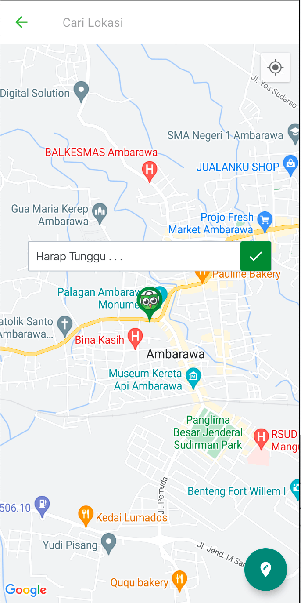

<!--left header table-->
| **Status**      | ​<!--start status:GREEN-->DONE<!--end status-->                                                              |
|-----------------|--------------------------------------------------------------------------------------------------------------|
| Contributors    | [Fakhira Devina](https://tokopedia.atlassian.net/wiki/people/61077e53b704b40068e80a8e?ref=confluence)        |
| Product Manager | [Wahyu Ivan Satyagraha](https://tokopedia.atlassian.net/wiki/people/61ad4312c15977006a17ce75?ref=confluence) |
| Team            | [Minion Bob](https://tokopedia.atlassian.net/people/team/2373d8a6-1afc-4f2a-aa7a-63855c273051)               |
| Release date    | ​10 Feb 2023 / ​<!--start status:GREY-->MA-3.208<!--end status-->                                            |
| Module type     | ​<!--start status:YELLOW-->FEATURE<!--end status-->                                                          |
| Module Location | `features/logistic/logisticaddress`                                                                          |

<!--toc-->

## Overview

### Background

When user wants to use Same Day/Instant Courier, they need to provide the address' pinpoint so courier would know the exact location of the delivery. For users that doesn’t have pinpoint data on their existing address, user can add pinpoint data only instead of going to edit address full flow by redirecting to pinpoint page. 

Example can be seen in features/transaction/checkout/src/main/java/com/tokopedia/checkout/view/ShipmentFragment.java (`navigateToPinpointActivity`)



## How-to

### Dependency

Add `logisticCommon` to your module’s dependencies and `localizationChooseAddress` for updating LCA data


```
implementation projectOrAar(rootProject.ext.features.logisticCommon)
implementation projectOrAar(rootProject.ext.features.localizationchooseaddress)
```

### Instructions

1. When user doesn’t have pinpoint, redirect them to `ApplinkConstInternalLogistic.PINPOINT` by passing **EXTRA_IS_GET_PINPOINT_ONLY** to `true`, **district name**, and **city name**.


```
val bundle = Bundle()
bundle.putBoolean(AddressConstant.EXTRA_IS_GET_PINPOINT_ONLY, true)

bundle.putString(AddressConstant.EXTRA_CITY_NAME, locationPass?.cityName)
bundle.putString(AddressConstant.EXTRA_DISTRICT_NAME, locationPass?.districtName)
val intent = RouteManager.getIntent(activity, ApplinkConstInternalLogistic.PINPOINT)
intent.putExtra(AddressConstant.EXTRA_BUNDLE, bundle)
startActivityForResult(intent, REQUEST_CODE_COURIER_PINPOINT)
```
2. After user succeed adding the pinpoint, Pinpoint page will give the selected latitude and longitude from `SaveAddressDataModel.latitude, SaveAddressDataModel.longitude` 


```
val addressData = data.getParcelableExtra<SaveAddressDataModel>(AddressConstant.EXTRA_SAVE_DATA_UI_MODEL)
```
3. Save the pinpoint data by using `UpdatePinpointUseCase` and provide the whole address data in the parameter

```
val params = EditPinpointParam(
    addressId = recipientAddressModel.id.toLongOrZero(),
    addressName = recipientAddressModel.addressName,
    address1 = recipientAddressModel.street,
    postalCode = recipientAddressModel.postalCode,
    district = recipientAddressModel.destinationDistrictId,
    city = recipientAddressModel.cityId,
    province = recipientAddressModel.provinceId,
    address2 = "$addressLatitude, $addressLongitude",
    receiverName = recipientAddressModel.recipientName,
    phone = recipientAddressModel.recipientPhoneNumber
)

val requestParams = UpdatePinpointParam(input = params)
```

4. Update pinpoint to local choose address data. This step is important to make sure the current chosen address data has the saved pinpoint.

```
fun Context.updateLocalChosenAddressPinpoint(latitude: String, longitude: String) {
    val currentAddressData = ChooseAddressUtils.getLocalizingAddressData(this)
    currentAddressData.let { chooseAddressData ->
        ChooseAddressUtils.updateLocalizingAddressDataFromOther(
            context = this,
            addressId = chooseAddressData.address_id,
            cityId = chooseAddressData.city_id,
            districtId = chooseAddressData.district_id,
            lat = latitude,
            long = longitude,
            label = chooseAddressData.label,
            postalCode = chooseAddressData.postal_code,
            warehouseId = chooseAddressData.warehouse_id,
            shopId = chooseAddressData.shop_id,
            warehouses = chooseAddressData.warehouses,
            serviceType = chooseAddressData.service_type,
            lastUpdate = chooseAddressData.tokonow_last_update
        )
    }
}
```
5. Refresh your page with the latest LocalCacheModel data

```
private fun refresh() {
    showLoadingLayout()
    context?.let {
        ChooseAddressUtils.getLocalizingAddressData(it).let { addressData ->
            viewModel.loadData(addressData)
        }
    }
}
```