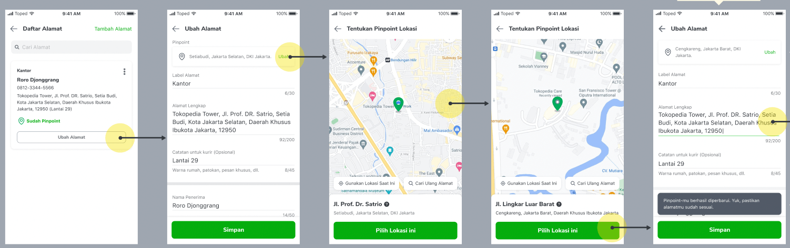
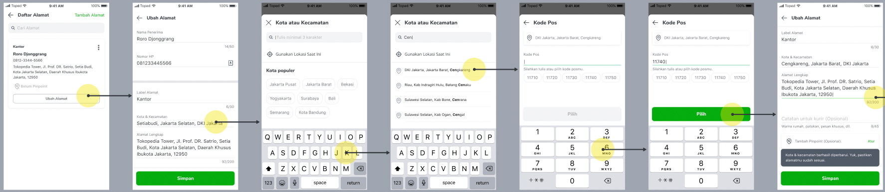
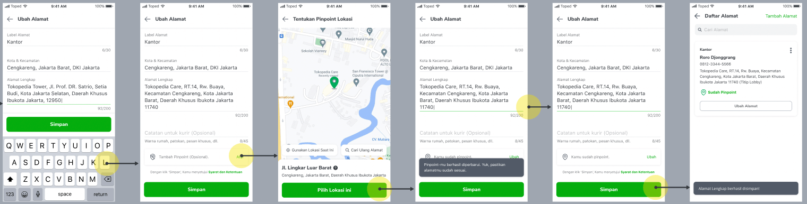
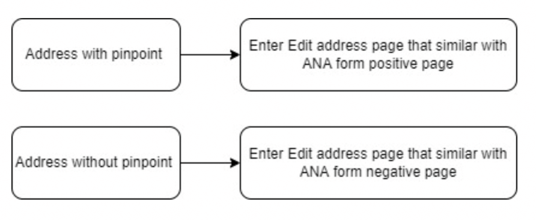

<!--left header table-->
| **Status**      | ​<!--start status:GREEN-->RELEASE<!--end status-->                                                                                                                                                                                                                                                                                                                                                                          |
|-----------------|-----------------------------------------------------------------------------------------------------------------------------------------------------------------------------------------------------------------------------------------------------------------------------------------------------------------------------------------------------------------------------------------------------------------------------|
| Contributors    | [Ivan Fadhila (Unlicensed)](https://tokopedia.atlassian.net/wiki/people/5dd7516d58fc78100710fcea?ref=confluence) [Fakhira Devina](https://tokopedia.atlassian.net/wiki/people/61077e53b704b40068e80a8e?ref=confluence) [Irpan .](https://tokopedia.atlassian.net/wiki/people/6253578a3bf0f0007015669c?ref=confluence) [Eka Desyantoro](https://tokopedia.atlassian.net/wiki/people/6283196bd9ddcc006e9c7a85?ref=confluence) |
| Product Manager | [Nuringtyas Rahwinarni](https://tokopedia.atlassian.net/wiki/people/5f58b98ed2c77e0075ac9865?ref=confluence)                                                                                                                                                                                                                                                                                                                |
| Team            | [Minion Bob](https://tokopedia.atlassian.net/people/team/2373d8a6-1afc-4f2a-aa7a-63855c273051)                                                                                                                                                                                                                                                                                                                              |
| Release date    | 27 May 2022 / <!--start status:GREY-->MA-3.177<!--end status-->                                                                                                                                                                                                                                                                                                                                                             |
| Module type     | ​<!--start status:YELLOW-->FEATURE<!--end status-->                                                                                                                                                                                                                                                                                                                                                                         |
| Product PRD     | [Edit Address Revamp](https://docs.google.com/document/d/1czHKAyEwLIbqWnlmnElAFUX5mtfoDkp__N38JXa1cyA/edit#)                                                                                                                                                                                                                                                                                                                |
| Module Location | `features/logistic/logisticaddress`                                                                                                                                                                                                                                                                                                                                                                                         |

<!--toc-->

## Release Notes

<!--start expand:27 May 2022 (MA-3.177)-->
[Release Edit Address Revamp](https://docs.google.com/document/d/1FlZzJYqRsFuuJf-_jZdUQ3T1U3mipIehQ3Zvy8dEJfQ/edit#)
<!--end expand-->

<!--start expand:10 Feb 2023 (MA-3.208) (SA-2.138)-->
[Edit Journey For Huawei Device](https://docs.google.com/document/d/156V7TudzmolCvwQ8MQGoWOTDaHuHGSHxRVu-HqNQ7_E/edit?pli=1#heading=h.w51s9gpss7d9)
<!--end expand-->

<!--start expand:September 2023-->
Remove Edit Address V1
<!--end expand-->

## Overview

### Background

Existing Edit Address built on very old architecture code. Result on tech inefficiency such as complexity to mantain, take a long time to compile code (reduce developer productivity), and can’t do the unit testing which is very important.

Therefore, we would like the initiate this edit address revamp by providing the seamless experience of edit address with the same validation a cross platform to improve our user experience, address quality, and nakama (tech) productivity.

### Project Description

This project is used to edit address, there is a edit address with pinpoint and without pinpoint. If with pinpoint will display edit address form similar with ANA positive and if without pinpoint will display edit address form similar with ANA negative

## Navigation

For detail about navigation can see this [figma](https://www.figma.com/file/XHExyriihA9HCEhPEcvoWL/Address-v3.2---Edit-Address-Revamp?node-id=378%3A81054&t=Yd3xEPxar9TcK4DI-0)

**With Pinpoint**



**Without Pinpoint**



## Tech Stack

**After Revamp**

- MVVM
- ViewBinding
- JUnit (Unit Test)
- Espresso (UI Test)

## Flow Diagram



## How-to

To go to the edit address revamp, we can use the applink below with param `address_id`


```
RouteManager.getIntent(context, "${ApplinkConstInternalLogistic.EDIT_ADDRESS_REVAMP}${addressId}")
```

- applink  
`tokopedia-android-internal://logistic/editaddressrevamp/{address_id}`

### GQL List


| **GQL Name** | **Documentation Link** | **Description** |
| --- | --- | --- |
| `KeroMapsAutoComplete` | [GMaps Autocomplete - /maps/autocomplete](https://tokopedia.atlassian.net/wiki/spaces/LG/pages/586482573)  | To get all available location using keyword |
| `keroMapsAutofill` | [GMaps Autofill District Geocode - /maps/geocode/get-district](https://tokopedia.atlassian.net/wiki/spaces/LG/pages/694818899)  | To get district detail from latlong |
| `KeroPlacesGetDistrict` | [GMaps Autofill District Place Detail - /maps/places/get-district](https://tokopedia.atlassian.net/wiki/spaces/LG/pages/694750060)  | To get district detail from placeId |
| `keroGetDistrictBoundaryArray` | [District Boundary - /v2/district-boundary/get](https://tokopedia.atlassian.net/wiki/spaces/LG/pages/586909442)  | To get boundary coordinate of `district_id` |
| `kero_addr_get_district_center` | [Get District Center Geolocation & Geocell - /v1/district/geocell](https://tokopedia.atlassian.net/wiki/spaces/LG/pages/1811317845)  | To get latitude & longitude of district center from `district_id` |
| `kero_get_address` | [Get Address - /maps/v1/address](https://tokopedia.atlassian.net/wiki/spaces/LG/pages/567411602)  | To get the detail address of a user. |
| `kero_edit_address` | [Edit Address - /maps/v1/address/edit](https://tokopedia.atlassian.net/wiki/spaces/LG/pages/572194984)  | To edit address |

## Action Items

## Useful Links

- Design : [Edit Address Revamp](https://www.figma.com/file/XHExyriihA9HCEhPEcvoWL/%5BUIUX%5D-Edit-Address-Revamp?node-id=378%3A81052)
- GTM : [Edit Address Revamp](https://mynakama.tokopedia.com/datatracker/requestdetail/view/2874)
- [Entry Point : Add & Edit Address (Source Param)](https://tokopedia.atlassian.net/wiki/spaces/PA/pages/2034631658)
- [Add Pinpoint on Existing Address](https://tokopedia.atlassian.net/wiki/spaces/PA/pages/2052849693/Add+Pinpoint+on+Existing+Address)
- [Hide Pinpoint Page Entry Point](https://tokopedia.atlassian.net/wiki/spaces/PA/pages/2092339526/Hide+Pinpoint+Page+Entry+Point)