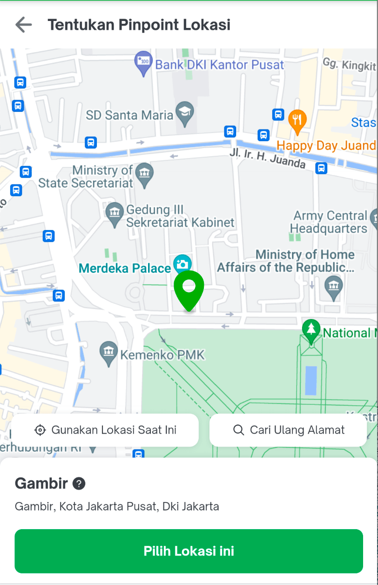

| **Status** | <!--start status:GREEN-->RELEASE<!--end status--> |
| --- | --- |
| **Tribe** | Logistic |
| **Contributors** | Android: [Fakhira Devina](https://tokopedia.atlassian.net/wiki/people/61077e53b704b40068e80a8e?ref=confluence)WPE: [Erwin Winata](https://tokopedia.atlassian.net/wiki/people/603c7cd31c44230072df325b?ref=confluence) [Irfan Andriansyah](https://tokopedia.atlassian.net/wiki/people/619ade053618cd006f62806f?ref=confluence) |
| **Product Manager** | [Wahyu Ivan Satyagraha](https://tokopedia.atlassian.net/wiki/people/61ad4312c15977006a17ce75?ref=confluence)  |
| **Team** | Minion Bob |
| **Module Type** | <!--start status:YELLOW-->FEATURE<!--end status--> |
| **Module Location** | `features/logistic/logisticaddaddress` |
| **Product PRD** | <https://docs.google.com/document/d/156V7TudzmolCvwQ8MQGoWOTDaHuHGSHxRVu-HqNQ7_E/edit?pli=1#heading=h.yhckt7m3bwde>  |
| **Tech Plan** | [Use Designated Page When Pinpoint](/wiki/spaces/PA/pages/2089192790/Use+Designated+Page+When+Pinpoint)  |

<!--toc-->

## Overview

#### Pinpoint Webview Page


This is a custom web view page that shows pinpoint from `tokopedia.com/pin-point-web-view`. This page is made as a substitute of the native pinpoint page since native pinpoint page doesn’t work in android devices that don’t have Google Play Services.

## Navigation

Internal applink: `tokopedia-android-internal://logistic/pin-point-picker-result` || `ApplinkConstInternalLogistic.PINPOINT_WEBVIEW`

External applink: `tokopedia://pin-point-picker-result`

## How-to

To access this page and receive the selected lat & long, call


```
val intent = RouteManager.getIntent(activity, ApplinkConstInternalLogistic.PINPOINT_WEBVIEW)
startActivityForResult(intent, REQUEST_CODE_SET_PINPOINT)
```

Additional data can be sent via query param / bundle.

### Parameter


| **Variable** | **Bundle key** | **Query param key** | **Description** | **Mandatory** | **Example** |
| --- | --- | --- | --- | --- | --- |
| District ID | `KEY_DISTRICT_ID` | `districtId` | location’s district id.- If not null and not in edit address flow, page will apply the district validation flow (if user drag pinpoint outside the district, then they can’t select the pinpoint)<br/> | This is mandatory if you don’t send latitude and longitude. Otherwise, this is optional |  |
| Latitude | `KEY_LAT_ID` | `lat` | location’s latitude | This is mandatory if you don’t send district id. Otherwise, this is optional |  |
| Longitude | `KEY_LONG_ID` | `lng` | location longitude | This is mandatory if you don’t send district id. Otherwise, this is optional |  |
| Source | `KEY_SOURCE_PINPOINT` | `source` | source page that call’s the pinpoint webview page. Use enum `PinpointSource`. - If not null, will trigger tracker for ANA revamp / Edit Address revamp | N | - `address-editor` for edit address<br/>- `add-address-positive` for ana positive flow<br/>- `add-address-negative` for ana negative flow<br/> |
| LocationPass | `KEY_LOCATION_PASS` |  | `LocationPass` model. - If not null, pinpoint page will send back the `LocationPass` model with the chosen latitude and longitude | N |  |
| SaveAddressDataModel | `KEY_ADDRESS_DATA` |  | `SaveAddressDataModel` model. - If not null, pinpoint page will send back the `SaveAddressDataModel` model with the chosen latitude and longitude and all detail address. | N |  |

We will send back latitude, longitude, LocationPass, and SaveAddressDataModel via bundle


| **Variable** | **Bundle key** | **Description** |
| --- | --- | --- |
| Latitude | `KEY_LAT_ID` | chosen latitude |
| Longitude | `KEY_LONG_ID` | chosen longitude |
| LocationPass | `KEY_LOCATION_PASS` | `SaveAddressDataModel` model. Only returned if caller page sent KEY\_LOCATION\_PASS |
| SaveAddressDataModel | `KEY_ADDRESS_DATA` | `SaveAddressDataModel` model. Only returned if caller page sent KEY\_ADDRESS\_DATA  |

## Useful Links

- [Tech plan](/wiki/spaces/PA/pages/2089192790/Use+Designated+Page+When+Pinpoint)