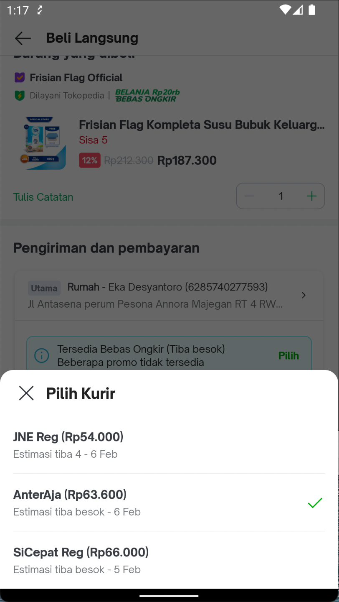
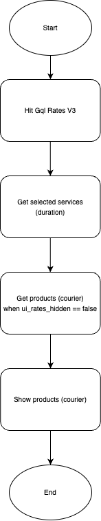

| **Status** | ​<!--start status:YELLOW-->IN TESTING<!--end status--> |
| --- | --- |
| Contributors | ​[Fakhira Devina](https://tokopedia.atlassian.net/wiki/people/61077e53b704b40068e80a8e?ref=confluence) ​[Eka Desyantoro](https://tokopedia.atlassian.net/wiki/people/6283196bd9ddcc006e9c7a85?ref=confluence) ​ |
| Product Manager | [Nuringtyas Rahwinarni](https://tokopedia.atlassian.net/wiki/people/5f58b98ed2c77e0075ac9865?ref=confluence)  |
| Team | [Minion Bob](https://tokopedia.atlassian.net/people/team/2373d8a6-1afc-4f2a-aa7a-63855c273051) |
| Release date | (ETA) ​24 Feb 2023 / ​<!--start status:GREY-->MA-3.209<!--end status--> |
| Module type | ​<!--start status:YELLOW-->FEATURE<!--end status--> |
| Product PRD |  |
| Module Location | `features/logistic/logisticcart` |

<!--toc-->

  
Release Notes (max 5 latest release notes)

<!--start expand:ETA 24 Feb 2023 (MA-3.209)-->
Unify shipping courier bottomsheet checkout & occ
<!--end expand-->

## Overview

### Background

Previously the shipping courier bottomsheet was separated between [checkout page](/wiki/spaces/PA/pages/1426720585/Checkout) & [occ page](/wiki/spaces/PA/pages/1412564357/One+Click+Checkout). On checkout page bottomsheet will be displayed when call function `onChangeShippingCourier` in [ShipmentFragment](https://github.com/tokopedia/android-tokopedia-core/blob/release/features/transaction/checkout/src/main/java/com/tokopedia/checkout/view/ShipmentFragment.java) and on OCC page bottomsheet will be displayed when call function `chooseCourier` in [OrderSummaryPageFragment](https://github.com/tokopedia/android-tokopedia-core/blob/release/features/transaction/oneclickcheckout/src/main/java/com/tokopedia/oneclickcheckout/order/view/OrderSummaryPageFragment.kt).  
So we need to maintain two different bottomsheets when there are changes. therefore we took the initiative to unify this widget to make it easier in the future when there are changes we only need to make changes in one bottomsheet.  


### Project Description

This bottomsheet is used to select courier on the checkout and occ page  


## Flow Diagram

## How-to

1. **Add dependencies**  
Add `logisticCart` dependency to your module's `build.gradle`


```
implementation projectOrAar(rootProject.ext.features.logisticcart)
```
2. **Initialize**  
`ShippingCourierBottomsheet` with several paramaters


```
ShippingCourierBottomsheet.show(
  activity: Activity,
  fragmentManager: FragmentManager,
  shippingCourierBottomsheetListener: ShippingCourierBottomsheetListener,
  shippingCourierUiModels: List<ShippingCourierUiModel>?,
  recipientAddressModel: RecipientAddressModel?,
  cartPosition: Int,
  isOcc: Boolean
)
```


| **Name** | **Description** |
| --- | --- |
| `shippingCourierBottomsheetListener` | Listener to call function `onCourierChoosen` & `onCourierShipmentRecommendationCloseClicked` |
| `shippingCourierUiModels` | This data for show list of duration on bottomsheet |
| `recipientAddressModel` | This is data to sent back when call function `onCourierChoosen` |
| `cartPosition` | To define cart position on checkout page |
| `isOcc` | To differentiate from checkout or occ |

## Tech Stack

- MVP
- Kotlin
- JUnit
- RxJava

### GQL List


| **GQL Name** | **Documentation** | **Description** |
| --- | --- | --- |
| `ratesV3` | ​[Rates V3](/wiki/spaces/LG/pages/567279712/Rates+V3)  | To get all data for shipping widget |