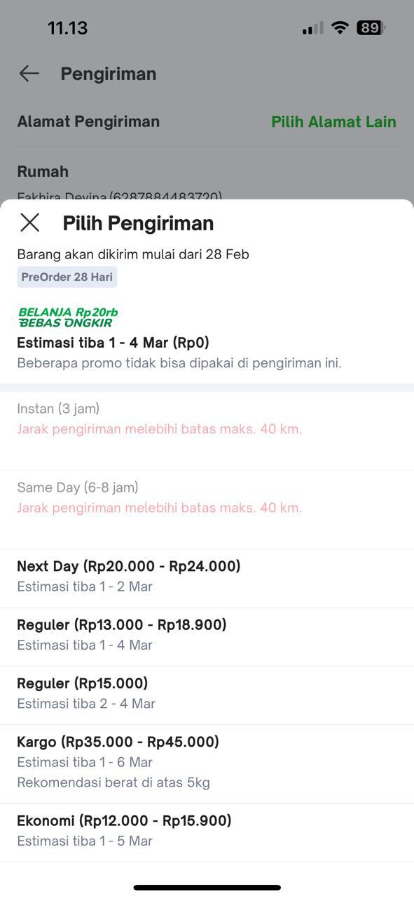
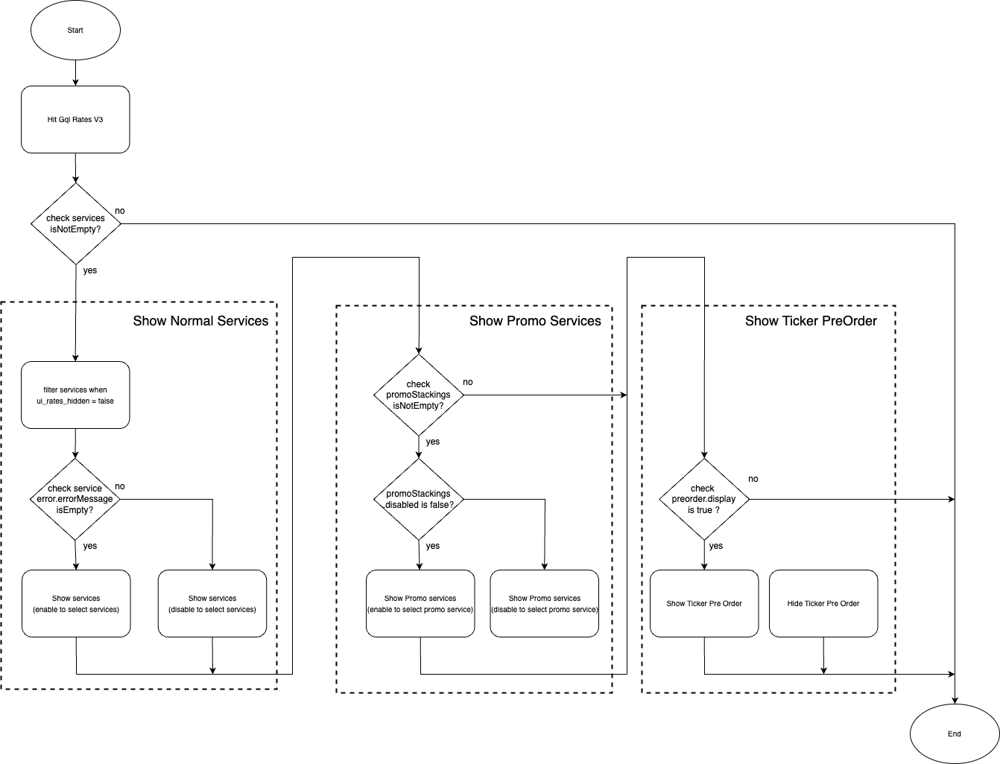

| **Status** | ​<!--start status:GREEN-->RELEASE<!--end status--> |
| --- | --- |
| Contributors | ​[Fakhira Devina](https://tokopedia.atlassian.net/wiki/people/61077e53b704b40068e80a8e?ref=confluence) ​[Eka Desyantoro](https://tokopedia.atlassian.net/wiki/people/6283196bd9ddcc006e9c7a85?ref=confluence) ​ |
| Product Manager | [Nuringtyas Rahwinarni](https://tokopedia.atlassian.net/wiki/people/5f58b98ed2c77e0075ac9865?ref=confluence)  |
| Team | [Minion Bob](https://tokopedia.atlassian.net/people/team/2373d8a6-1afc-4f2a-aa7a-63855c273051) |
| Release date | (ETA) ​24 Feb 2023 / ​<!--start status:GREY-->MA-3.209<!--end status--> |
| Module type | ​<!--start status:YELLOW-->FEATURE<!--end status--> |
| Product PRD |  |
| Module Location | `features/logistic/logisticcart` |

<!--toc-->

  
Release Notes

<!--start expand:ETA 24 Feb 2023 (MA-3.209)-->
Unify shipping duration bottomsheet checkout & occ
<!--end expand-->

## Overview

### Background

Previously the shipping duration bottomsheet was separated between checkout & occ page, so we need to maintain two different bottomsheets when there are changes. therefore we took the initiative to unify this widget to make it easier in the future when there are changes we only need to make changes in one bottomsheet.

### Project Description

This bottomsheet is used to select the delivery duration on the checkout and occ page



## Flow Diagram



## How-to

1. **Add dependencies**  
Add `logisticCart` dependency to your module's `build.gradle`


```
implementation projectOrAar(rootProject.ext.features.logisticcart)
```
2. **Initialize**  
`ShippingDurationBottomsheet` with several parameters, this parameters is used as a request to ratesV3  


```
ShippingDurationBottomsheet.show(
  activity: Activity,
  fragmentManager: FragmentManager,
  shippingDurationBottomsheetListener: ShippingDurationBottomsheetListener?,
  shipmentDetailData: ShipmentDetailData,
  selectedServiceId: Int,
  shopShipmentList: List<ShopShipment>,
  recipientAddressModel: RecipientAddressModel? = null,
  cartPosition: Int,
  codHistory: Int = -1,
  isLeasing: Boolean = false,
  pslCode: String = "",
  products: ArrayList<Product>,
  cartString: String,
  isDisableOrderPrioritas: Boolean,
  isTradeInDropOff: Boolean = false,
  isFulFillment: Boolean = false,
  preOrderTime: Int = -1,
  mvc: String = "",
  cartData: String,
  isOcc: Boolean
)
```

3. Initialize `ShippingDurationBottomsheetListener`

- `onShippingDurationChoosen`: triggered after user select one of pengiriman service (ex: instan, same day, reguler, etc)


| **Param** | **Type** | **Description** |
| --- | --- | --- |
| `shippingCourierUiModels` | `List<ShippingCourierUiModel>?` | list of courier available for selected duration/service |
| `courierItemData` | `ShippingCourierUiModel?` | - checkout: **recommended courier** in selected duration that has `selected_shipper_service_id != 0` OR `recommend == true` flag, not error, and not dedicated courier for bebas ongkir (`ui_rates_hidden == true`). If there is no recommended courier, the value will be `null`<br/>- beli langsung / one click checkout: **default courier** in selected duration that has `selected_shipper_service_id != 0` OR `recommend == true` flag, not error, and not dedicated courier for bebas ongkir (`ui_rates_hidden == true`). Will always return `courierItemData` even if no courier are eligible<br/> |
| `recipientAddressModel` | `RecipientAddressModel?` | user address data |
| `cartPosition` | `Int` | index of order for the selected duration, in beli langsung will always return 0 |
| `selectedServiceId` | `Int` | service  |
| `serviceData` | `ServiceData?` | id for selected duration/service |
| `flagNeedToSetPinpoint` | `Boolean` | `true` if user selected instan / same day but user address doesn’t have pinpoint |
| `isDurationClick` | `Boolean` | parameter used as a flag in shipment and will be `true` if the user can choose the delivery duration |
| `isClearPromo` | `Boolean` | parameter used as a flag in shipment and will be `true` if the user can choose the delivery duration to clear the promo |

- `onLogisticPromoChosen`: triggered after user select one of pengiriman service has promo


| **Param** | **Type** | **Description** |
| --- | --- | --- |
| `shippingCourierUiModels` | `List<ShippingCourierUiModel>?` | list of courier available for selected duration/service |
| `courierData` | `ShippingCourierUiModel?` | - checkout: **recommended courier** in selected duration that has `selected_shipper_service_id != 0` OR `recommend == true` flag, not error, and not dedicated courier for bebas ongkir (`ui_rates_hidden == true`). If there is no recommended courier, the value will be `null`<br/>- beli langsung / one click checkout: **default courier** in selected duration that has `selected_shipper_service_id != 0` OR `recommend == true` flag, not error, and not dedicated courier for bebas ongkir (`ui_rates_hidden == true`). Will always return `courierItemData` even if no courier are eligible<br/> |
| `recipientAddressModel` | `RecipientAddressModel?` | user address data |
| `cartPosition` | `Int` | index of order for the selected duration, in beli langsung will always return 0 |
| `serviceData` | `ServiceData?` | id for selected duration/service |
| `flagNeedToSetPinpoint` | `Boolean` | `true` if user selected instan / same day but user address doesn’t have pinpoint |
| `promoCode` | `String` | promo code on the selected service |
| `selectedServiceId` | `Int` | service  |
| `logisticPromo` | `Boolean` | the model sent for shipment validates the promo |

- `onNoCourierAvailable`: triggered when no courier available
- `onShippingDurationButtonCloseClicked` : triggered when user clicked icon close on shiping duration bottomsheet
- `onShowDurationListWithCourierPromo` : triggered when courier has promo to show duration list
- `onShowLogisticPromo` : function to show logistic promo

## UI Model

### LogisticPromoUiModel


| **Variable name** | **Type** | **Description** | **Mapping from RatesV3** |
| --- | --- | --- | --- |
| `freeShippingItemTitle` | String | Title of bebas ongkir shipping, support HTML format | `promo_stackings.texts.bottom_sheet` |
| `codData` | `CodDataPromo` | show cash on delivery (COD) info.If `isCodAvailable == true`, UI will show `promo_stackings.cod.cod_text` | `promo_stackings.cod` |
| `bottomSheetDescription` | String | Description of bebas ongkir shipping. If empty, UI will show `promo_stackings.texts.promo_message` | `promo_stackings.texts.bottom_sheet_description` |
| `promoMessage` | String | Description of bebas ongkir shipping. Will only be shown if `bottomSheetDescription` is empty | `promo_stackings.texts.promo_message` |
| `disabled` | Boolean | Flag to determine whether this bebas ongkir can be chosen by user or not. Disabled promo stacking will still be shown to user, but will be greyed out and not clickable. | `promo_stackings.disabled` |
| `imageUrl` | String | url for logo bebas ongkir | `promo_stackings.image_url` |

### Tech Stack

- MVP
- Kotlin
- JUnit
- RxJava

### GQL List


| **GQL Name** | **Documentation** | **Description** |
| --- | --- | --- |
| `ratesV3` | ​[Rates V3](/wiki/spaces/LG/pages/567279712/Rates+V3)  | To get all data for shipping widget |