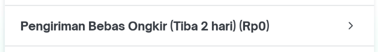
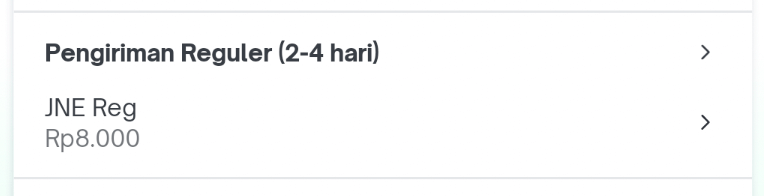
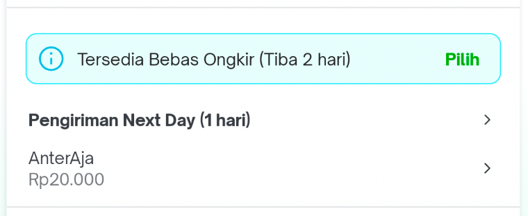
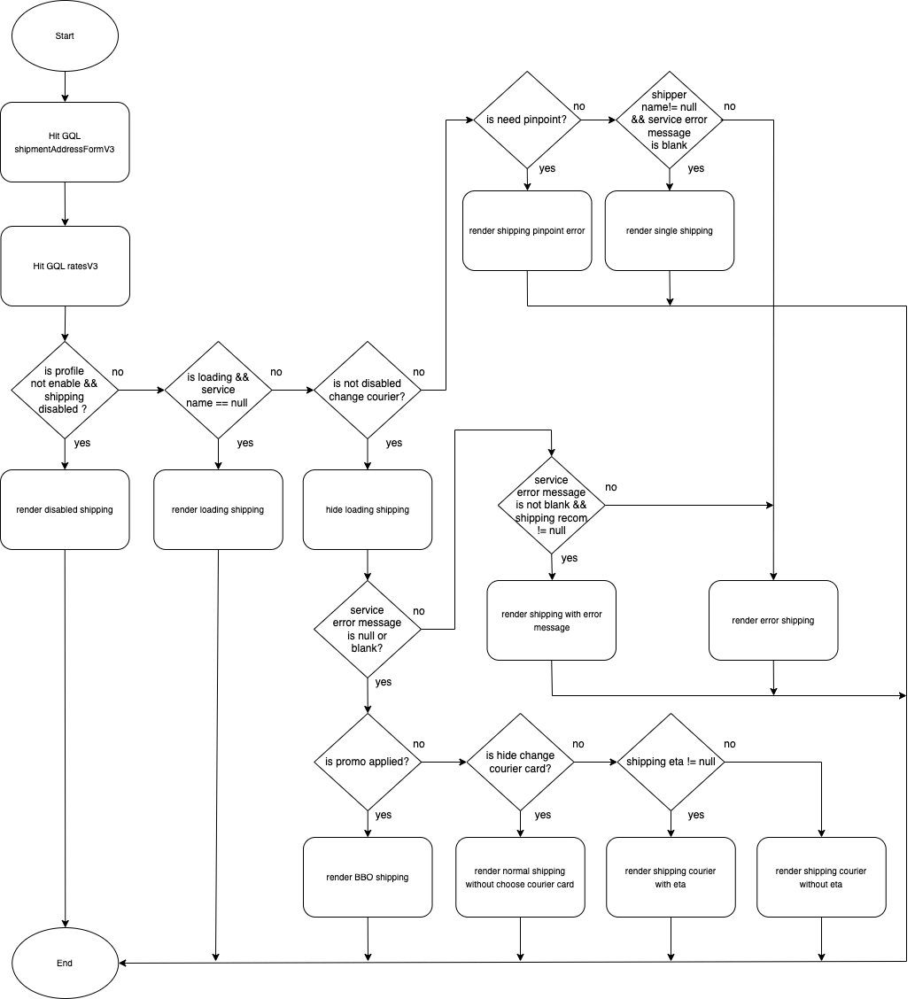

| **Status** | ​<!--start status:YELLOW-->IN TESTING<!--end status--> |
| --- | --- |
| Contributors | ​[Fakhira Devina](https://tokopedia.atlassian.net/wiki/people/61077e53b704b40068e80a8e?ref=confluence) ​[Eka Desyantoro](https://tokopedia.atlassian.net/wiki/people/6283196bd9ddcc006e9c7a85?ref=confluence) ​ |
| Product Manager | [Nuringtyas Rahwinarni](https://tokopedia.atlassian.net/wiki/people/5f58b98ed2c77e0075ac9865?ref=confluence)  |
| Team | [Minion Bob](https://tokopedia.atlassian.net/people/team/2373d8a6-1afc-4f2a-aa7a-63855c273051) |
| Release date | (ETA) ​24 Feb 2023 / ​<!--start status:GREY-->MA-3.209<!--end status--> |
| Module type | ​<!--start status:YELLOW-->FEATURE<!--end status--> |
| Product PRD |  |
| Module Location | `features/logistic/logisticcart` |

<!--toc-->

## Release Notes

<!--start expand:ETA 24 Feb 2023 (MA-3.209)-->
Move shipping widget from module OCC (One Click Checkout) to logistic cart
<!--end expand-->

## Overview

### Background

Shipping OCC Widget is part of the logistics, but now the code is in the OCC (one click checkout) module. By moving this widget to the logistics cart module, the ownership will be clearer in logistics and more manageable in the future

### Project Description

Shipping OCC Widget is a custom view developed to select shipping at `occ (one click checkout) page`

This custom view has functionality to select shipping `duration` and `courier` when the buyer wants to checkout the product. There are several view conditions to be displayed.  


- Use Bebas Ongkir


- Use delivery arrived 4 hours (Dilayani Tokopedia)


- Normal Shipping


- Normal Shipping With Bebas Ongkir Ticker



## Flow Diagram



## How-to

#### 1. Add dependencies

Add `logisticCart` dependency to your module's build.gradle


```
implementation projectOrAar(rootProject.ext.features.logisticcart)
```

#### 2. Implement ShippingOccWidget

Add ShippingOccWidget to your fragment’s layout


```
<com.tokopedia.logisticcart.shipping.features.shippingwidget.ShippingOccWidget
    android:id="@+id/shipping_occ_widget"
    android:layout_width="match_parent"
    android:layout_height="wrap_content"/>
```

#### 3. Initialize ShippingWidget


```
val shippingOccWidget = itemView.findViewById<ShippingOccWidget>(R.id.shipping_occ_widget);
```

## Public Method

- `renderDisabledShipping`

This function to disabled select shipping

- `renderLoadingShipping`

This function to show loading shipping.

- `hideLoaderShipping`

This function to hide loading shipping.

- `renderShippingDuration`

This function to show shipping duration and will triggered callback `onChangeDurationListener` when clicked the duration views.

- `renderBboTicker`

This function to show / hide `Bebas Ongkir` ticker, and will triggered callback `onTickerClickListener` when clicked the ticker.

- `renderBboShipping`

This function to show layout `Bebas Ongkir` (cannot select courier) and will triggered callback `onChangeDurationListener` when clicked the the views.

- `renderNormalShippingWithoutChooseCourierCard`

This function to show layout when use delivery arrived 4 hours (Dilayani Tokopedia) (cannot select courier) and will triggered callback `onChangeDurationListener` when clicked the the views.

- `renderShippingCourierWithEta`

This function to show layout shipping courier with eta and will triggered callback `onChangeCourierListener` when clicked the the views.

- `renderShippingCourierWithoutEta`

This function to show layout shipping courier without eta and will triggered callback `onChangeCourierListener` when clicked the the views.

- `renderShippingWithErrorMessage`

This function to render error shipping with error message and will triggered callback `onShippingErrorMessageClickListener` when clicked text error.

- `renderErrorShipping`

This function to render error shipping and will triggered callback `onReloadShipping` when clicked reload shipping view.

- `renderShippingPinpointError`

This function to render error shipping and will triggered callback `onChoosePinpoint` when clicked the the views.

- `renderSingleShipping`

This function to show layout from Tokonow and cannot change duration & courier.

## Tech Stack

- MVVM
- Kotlin
- JUnit
- Coroutines

### GQL List


| **GQL Name** | **Documentation** | **Description** |
| --- | --- | --- |
| `ratesV3` | ​[Rates V3](/wiki/spaces/LG/pages/567279712/Rates+V3)  | To get all data for shipping widget |