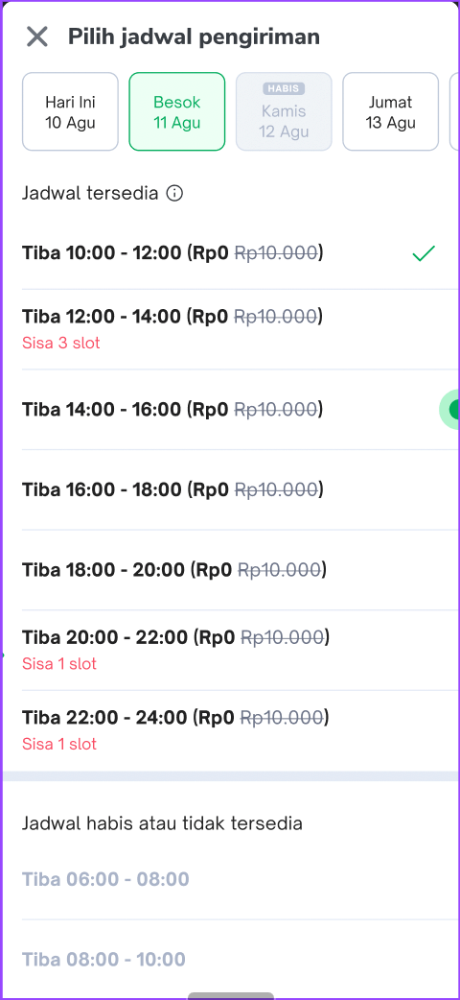
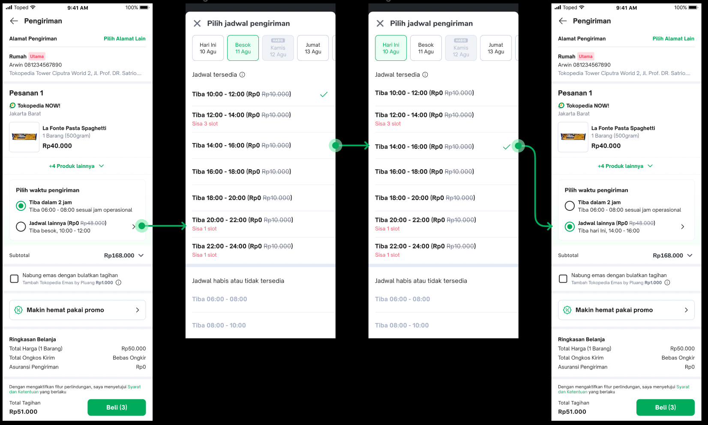
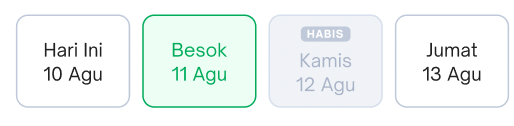
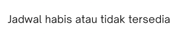

| **Status** | ​​<!--start status:YELLOW-->IN TESTING<!--end status--> |
| --- | --- |
| Contributors | ​​[Fakhira Devina](https://tokopedia.atlassian.net/wiki/people/61077e53b704b40068e80a8e?ref=confluence) ​​[Eka Desyantoro](https://tokopedia.atlassian.net/wiki/people/6283196bd9ddcc006e9c7a85?ref=confluence) ​ |
| Product Manager | ​[Nuringtyas Rahwinarni](https://tokopedia.atlassian.net/wiki/people/5f58b98ed2c77e0075ac9865?ref=confluence) |
| Team | [Minion Bob](https://tokopedia.atlassian.net/people/team/2373d8a6-1afc-4f2a-aa7a-63855c273051) |
| Release date | (ETA) ​24 Feb 2023 / ​<!--start status:GREY-->MA-3.209<!--end status--> |
| Module type | ​​<!--start status:YELLOW-->FEATURE<!--end status--> |
| Product PRD | [[PRD] NOW! Scheduled Delivery - Logistic Part](https://docs.google.com/document/d/1koEoZPc9OXWy3vPVQUsKjoYZV-JW8pYx6zrYk_TPDOg/edit#heading=h.pyqe7434atfh) |
| Module Location | `features/logistic/logisticcart` |

## Table of Contents

<!--toc-->

## Release Notes

<!--start expand:ETA 24 Feb 2023 (MA-3.209)-->

<!--end expand-->

## Overview

### Background

In H2 2022, NOW! want to provide scheduled delivery for customers, where they can plan their delivery. Scheduled delivery provides users the options to plan ahead and reserve their wanted items within their desired times, this is especially useful when dealing with busy schedules and short shelf life products. By having this, we aim to position NOW! as a reliable weekly grocery place rather than a shop for urgent/impulse needs only. This is not just important from a sustainability perspective, but also to capture our next million customers.

Related doc: [NOW! Scheduled Delivery - Main PRD](https://docs.google.com/document/d/1--JOpV9wDc6Yvb0p3xhwu31kF8WI_k13Qxcmp0Jz4nI/edit#) | [NOW! Scheduled Delivery - Figma](https://www.figma.com/file/NYI8RQjjIJWrceE6ojxPCc/Scheduled-Delivery?node-id=430%3A5132)

### Project Description

Bottomsheet for showing delivery schedules in `checkout` page. Data is supplied from Schelly [Scheduled Delivery Rates](/wiki/spaces/LG/pages/2076674436/Scheduled+Delivery+Rates) 

- Normal Flow


- User not meet minimum purchase OR User does not have free ongkir quota anymore


- User click info icon


## Navigation

This bottomsheet will show when click icon chevron right on schedule delivery option widget



## How-to

**1. Add dependencies**  
Add `logisticCart` dependency to your module's `build.gradle`


```
implementation projectOrAar(rootProject.ext.features.logisticcart)
```

**2. Initialize**  
`ScheduleSlotBottomSheet` with `BottomSheetUiModel` 


```
ScheduleSlotBottomSheet.show(fragmentManager, bottomsheetUiModel)
```

To get `BottomSheetUiModel` from Schelly, use `ScheduleDeliveryBottomSheetMapper.mapResponseToUiModel` with following params:


| **Variable Name** | **Type** | **Description** |
| --- | --- | --- |
| `deliveryServices` | `List<DeliveryService>` | List of schedule delivery services |
| `selectedDateId` | `String` | Current selected date. If user hasn’t selected any time schedule, then `selectedDateId` is the id of date which has recommended `DeliveryProduct` |
| `selectedTimeSlot` | `DeliveryProduct` | Current selected time slot. If user hasn’t selected any time schedule, then `selectedDateId` is the id of date which has recommended `DeliveryProduct` |
| `notice` | `Notice` | Data for Schedule Info Bottomsheet |

**3. Set Listener**  
Setup `ScheduleSlotBottomSheetListener` and override this method


| **Method Name** | **Description** |
| --- | --- |
| `onChooseTimeListener(timeId: Long, dateId: String`) | callback after user chosen any time schedule |

## UI Model

### BottomSheetUiModel

Model for showing schedule delivery bottomsheet


| **Variable name** | **Type** | **Description**                                                                                                                                                                                                                                                                                                       |
| --- | --- |-----------------------------------------------------------------------------------------------------------------------------------------------------------------------------------------------------------------------------------------------------------------------------------------------------------------------|
| date | `ChooseDateUiModel` | Show list of dates for schedule delivery. Shown time slot list is from `date.content` that has one of the time slot selected (`date.content.isSelected`)  |
| availableTitle | `TitleSectionUiModel` | Section title for available time slot                                                                                                                                                                                                                                                                                 |
| unavailableTitle | `TitleSectionUiModel` | Section title for unavailable time slot                                                                                                                                                                                                                                                                               |
| infoUiModel | `BottomSheetInfoUiModel` | Data for bottom sheet schedule delivery info                                                                                                                                                                                                                                                                          |

### ChooseDateUiModel

Model for showing list of dates


| **Variable name** | **Type** | **Description** |
| --- | --- | --- |
| content | `List<ButtonDateUiModel>` | List of dates |

## ButtonDateUiModel

Model for showing date card


| **Variable name** | **Type** | **Description** | **Example** |
| --- | --- | --- | --- |
| title | String | Title of date card | “Hari ini” |
| date | String | Subtitle of date card | “20 Sep” |
| isEnabled | Boolean | Flag to define if date has available time slot | true |
| id | String | id of date |  |
| isSelected | Boolean | Flag to define if any time slot in this date is selected. | true |
| availableTime | List<ChooseTimeUiModel> | List of available time slot |  |
| unavailableTime | List<ChooseTimeUiModel> | List of unavailable time slot |  |

### ChooseTimeUiModel

Model for showing time slot item


| **Variable name** | **Type** | **Description** | **Example** |
| --- | --- | --- | --- |
| content | String | Title of time slot item in HTML format | “**Tiba 10:00 - 12:00 (Rp0** ~~Rp10.000~~**)**”or“**Tiba 10:00 - 12:00 (Rp10.000)**”or“**Tiba 10:00 - 12:00**” |
| isEnabled | Boolean | Flag to define if time slot can be selected by user | true |
| divider | DividerType | Divider type for time slot item UI |  |
| isSelected | Boolean | Flag to define if time slot is selected. If user hasn’t selected any time slot, isSelected is defined as the recommended time slot from BE. | true |
| note | String | Wording under title | “Sisa 3 slot” |
| timeId | Long | time slot id |  |
| dateId | String | date id |  |

### TitleSectionUiModel

Model for showing time slot section title


| **Variable name** | **Type** | **Description** | **Example**                                                                                                                                              |
| --- | --- | --- |----------------------------------------------------------------------------------------------------------------------------------------------------------|
| title | String | Title of time slot title section | “Jadwal Tersedia”or“Jadwal habis atau tidak tersedia”                                                                                                    |
| content | String | Description to show edge case wording.Wording is from BE:`deliveryService.deliveryProduct.promoText` |   “Belanja min. Rp50.000 untuk gratis ongkir” or“Kuota gratis ongkirmu habis” |
| icon | Int | icon (info) | `IconUnify.INFORMATION`                                                                                                                                  |

### BottomSheetInfoUiModel

Model for showing bottom sheet schedule delivery info 


| **Variable name** | **Type** | **Description** | **Example** |
| --- | --- | --- | --- |
| title | String | Title of bottomsheet | “Tentang pengiriman terjadwal” |
| description | String | Description of bottomsheet | “Atur kapan pesanan tiba sesuai kebutuhanmu. Saat ini pengiriman terjadwal hanya tersedia khussu pesanan Tokopedia NOW!” |
| imageUrl | String | image url. Hardcoded from FE |  |

## Tech Stack

- MVVM
- Kotlin
- JUnit
- Coroutines

### GQL List


| **GQL Name** | **Documentation** | **Description** |
| --- | --- | --- |
| `ongkirGetScheduledDeliveryRates` | ​​[Scheduled Delivery Rates](https://tokopedia.atlassian.net/wiki/spaces/LG/pages/2076674436) | To get all data for schedule delivery rates |


---

## Useful Links

- Design : [Figma](https://www.figma.com/file/8JT5Va3Bxgk2fAiX0pAn3y/Address-v3.3---Share-Address?node-id=732%3A85129&t=BsNPGPAHJMDhxXyo-0)
- Tech plan : ​[Now Schedule Delivery](https://tokopedia.atlassian.net/wiki/spaces/PA/pages/2060816481)