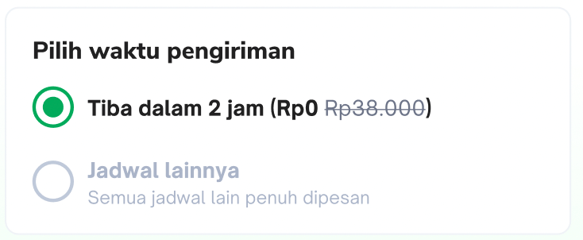
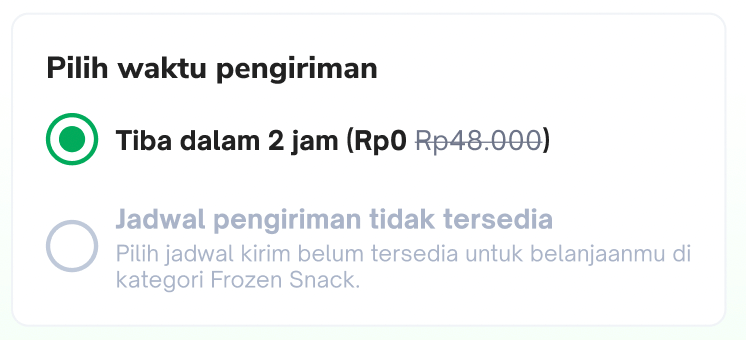
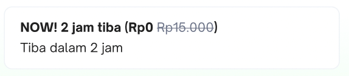
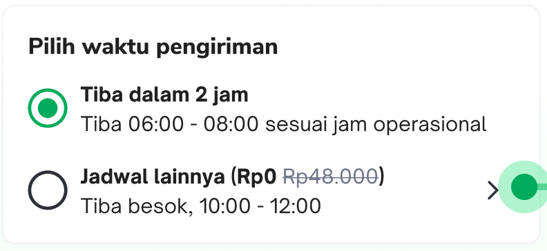
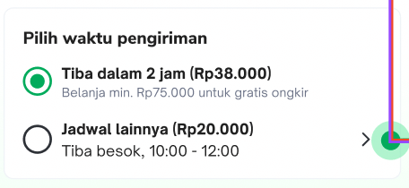
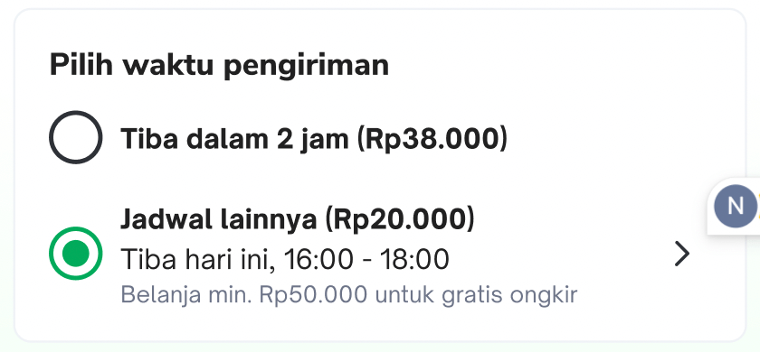
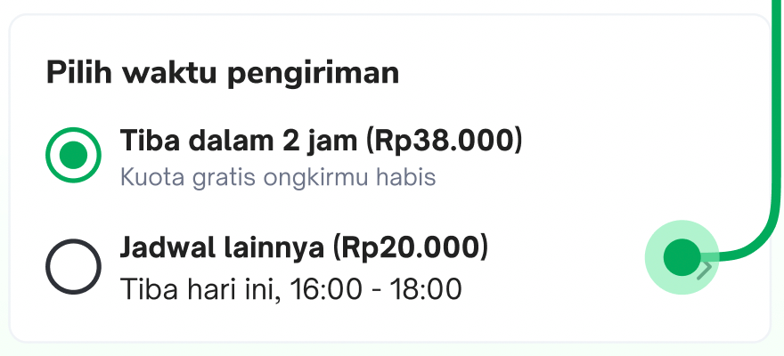
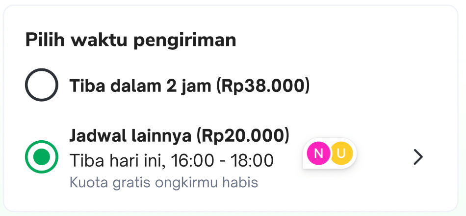
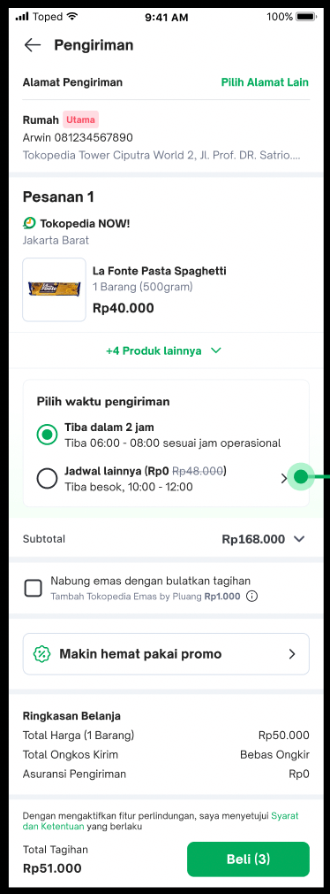
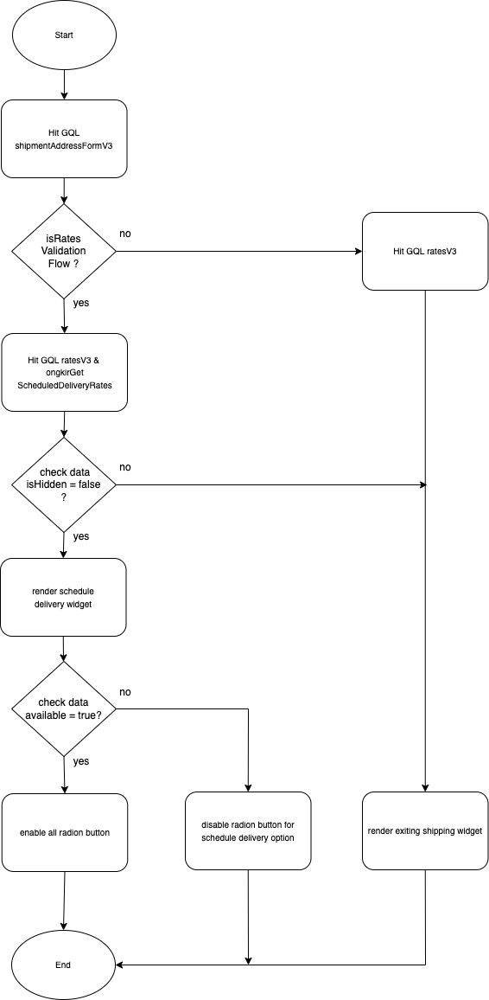

| **Status** | ​<!--start status:YELLOW-->IN TESTING<!--end status--> |
| --- | --- |
| Contributors | ​[Fakhira Devina](https://tokopedia.atlassian.net/wiki/people/61077e53b704b40068e80a8e?ref=confluence) ​[Eka Desyantoro](https://tokopedia.atlassian.net/wiki/people/6283196bd9ddcc006e9c7a85?ref=confluence) ​ |
| Product Manager | [Nuringtyas Rahwinarni](https://tokopedia.atlassian.net/wiki/people/5f58b98ed2c77e0075ac9865?ref=confluence)  |
| Team | [Minion Bob](https://tokopedia.atlassian.net/people/team/2373d8a6-1afc-4f2a-aa7a-63855c273051) |
| Release date | (ETA) ​24 Feb 2023 / ​<!--start status:GREY-->MA-3.209<!--end status--> |
| Module type | ​<!--start status:YELLOW-->FEATURE<!--end status--> |
| Product PRD | [[PRD] NOW! Scheduled Delivery - Logistic Part](https://docs.google.com/document/d/1koEoZPc9OXWy3vPVQUsKjoYZV-JW8pYx6zrYk_TPDOg/edit#heading=h.pyqe7434atfh) |
| Module Location | `features/logistic/logisticcart` |
| Design | [Figma](https://www.figma.com/file/NYI8RQjjIJWrceE6ojxPCc/Scheduled-Delivery?node-id=1394%3A69713&t=VcFexNbE3N3i3at8-0) |
| Tech Plan | [Now Schedule Delivery](/wiki/spaces/PA/pages/2060816481/Now+Schedule+Delivery) |

## Table of Contents

<!--toc-->

## Release Notes

<!--start expand:ETA 24 Feb 2023 (MA-3.209)-->

<!--end expand-->

## Overview

### Background

In H2 2022, NOW! want to provide scheduled delivery for customers, where they can plan their delivery. Scheduled delivery provides users the options to plan ahead and reserve their wanted items within their desired times, this is especially useful when dealing with busy schedules and short shelf life products. By having this, we aim to position NOW! as a reliable weekly grocery place rather than a shop for urgent/impulse needs only. This is not just important from a sustainability perspective, but also to capture our next million customers.

Related doc: [NOW! Scheduled Delivery - Main PRD](https://docs.google.com/document/d/1--JOpV9wDc6Yvb0p3xhwu31kF8WI_k13Qxcmp0Jz4nI/edit#) | [NOW! Scheduled Delivery - Figma](https://www.figma.com/file/NYI8RQjjIJWrceE6ojxPCc/Scheduled-Delivery?node-id=430%3A5132)

### Project Description

This is a custom view developed to select shipping for Tokopedia Now at `checkout page`

This custom view has functionality to select schedule delivery when the buyer wants to checkout the product. There are several view conditions to be displayed.

- Available 2 hours option, but not available schedule delivery option


- Available 2 hours option, schedule delivery not available in warehouse (hide schedule delivery widget and show existing widget for 2 hours)



- Available for 2 hours and schedule delivery option



- Available for 2 hours and schedule delivery option, but not meet minimum purchase for free ongkir



- Available for 2 hours and schedule delivery option, but not have free ongkir quota anymore



## Navigation

This widget will show on checkout page when product tokopedia now and support schedule delivery.



## Flow Diagram



## How-to

#### 1. Add dependencies

Add `logisticCart` dependency to your module's build.gradle


```
implementation projectOrAar(rootProject.ext.features.logisticcart)
```

#### 2. Implement ShippingWidget

Add ShippingWidget to your fragment’s layout


```
<com.tokopedia.logisticcart.scheduledelivery.view.ShippingScheduleWidget
    android:id="@+id/shipping_schedule_widget"
    android:layout_width="match_parent"
    android:layout_height="wrap_content"/>
```

#### 3. Initialize ShippingWidget


```
val shippingScheduleWidget = itemView.findViewById<ShippingScheduleWidget>(R.id.shipping_schedule_widget);
```

You need to call funtion `bind` to render widget with below parameters 


|  | **Variable Name** | **Type** | **Description** |
| --- | --- | --- | --- |
| 1 | `titleNow2H` | `CharSequence` | To show title 2 hours option |
| 2 | `descriptionNow2H` | `String` | To show description 2 hours option |
| 3 | `labelNow2H` | `CharSequence` | To show label 2 hours option |
| 4 | `scheduleDeliveryUiModel` | `ScheduleDeliveryUiModel` | This data will convert to `ShippingScheduleWidgetModel` to show schedule delivery option |
| 5 | `listener` | `ShippingScheduleWidgetListener` | Listener to trigger function`onChangeScheduleDelivery` when there is a change in the data delivery schedule |

**ScheduleDeliveryUiModel**

This is model to render data to schedule delivery widget


|  | **Variable Name** | **Type** | **Description** |
| --- | --- | --- | --- |
| 1 | `isSelected` | `Boolean` | To determine the selected radio button for schedule delivery option |
| 2 | `available` | `Boolean` | To disable / enable schedule delivery option |
| 3 | `hidden` | `Boolean` | To hide schedule delivery option (use existing widget 2 hours) |
| 4 | `title` | `String` | To show partial title for schedule delivery option |
| 5 | `text` | `String` | To show in description schedule delivery widget when schedule delivery in not available |
| 6 | `notice` | `Notice` | To display in schedule delivery bottomsheets |
| 7 | `deliveryServices` | `List<DeliveryService>` | This is master data for schedule delivery option |
| 8 | `scheduleDate` | `String` | Selected `deliveryServices.id`  |
| 9 | `timeslotId` | `Long` | Selected `deliveryProducts.timeslotId`  |
| 10 | `deliveryProduct` | `DeliveryProduct` | Selected `deliveryProducts` |

**ShippingScheduleWidgetModel**

This is model to render data on radio button section


| **Variable Name** | **Type** | **Description** |
| --- | --- | --- |
| `isEnable` | `Boolean` | To enable / disable radio button section |
| `title` | `CharSequence` | To show title on radio button section |
| `description` | `String` | To show description on radio button section |
| `label` | `CharSequence` | To show label on radio button section |
| `isSelected` | `Boolean` | To set selected radio button |
| `isShowCoachMark` | `Boolean` | To show coachmark on radio button section |
| `onSelectedWidgetListener` | `Unit` (callback listener) | Listener will trigger when select / unselect radio button (clicked radio button section) |
| `onClickIconListener` | `Unit` (callback listener) | Listener will trigger when clicked icon chevron right to show bottom sheets |

## Tech Stack

- MVVM
- Kotlin
- JUnit
- Coroutines

### GQL List


| **GQL Name** | **Documentation** | **Description** |
| --- | --- | --- |
| `ongkirGetScheduledDeliveryRates` | ​[Scheduled Delivery Rates](/wiki/spaces/LG/pages/2076674436/Scheduled+Delivery+Rates)  | To get all data for schedule delivery rates |


---

## Useful Links

- Design : [Figma](https://www.figma.com/file/8JT5Va3Bxgk2fAiX0pAn3y/Address-v3.3---Share-Address?node-id=732%3A85129&t=BsNPGPAHJMDhxXyo-0)
- Tech plan : [Now Schedule Delivery](/wiki/spaces/PA/pages/2060816481/Now+Schedule+Delivery)