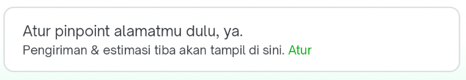
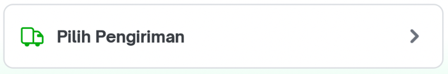
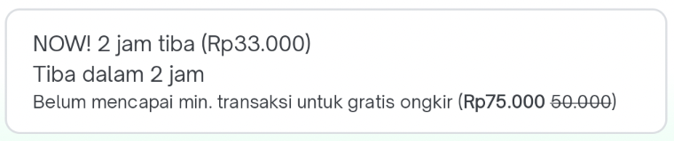
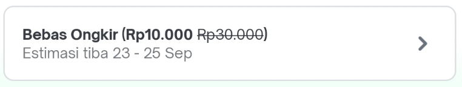
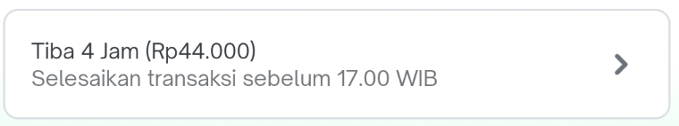
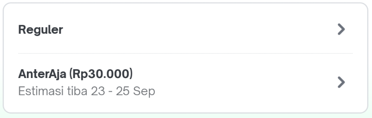
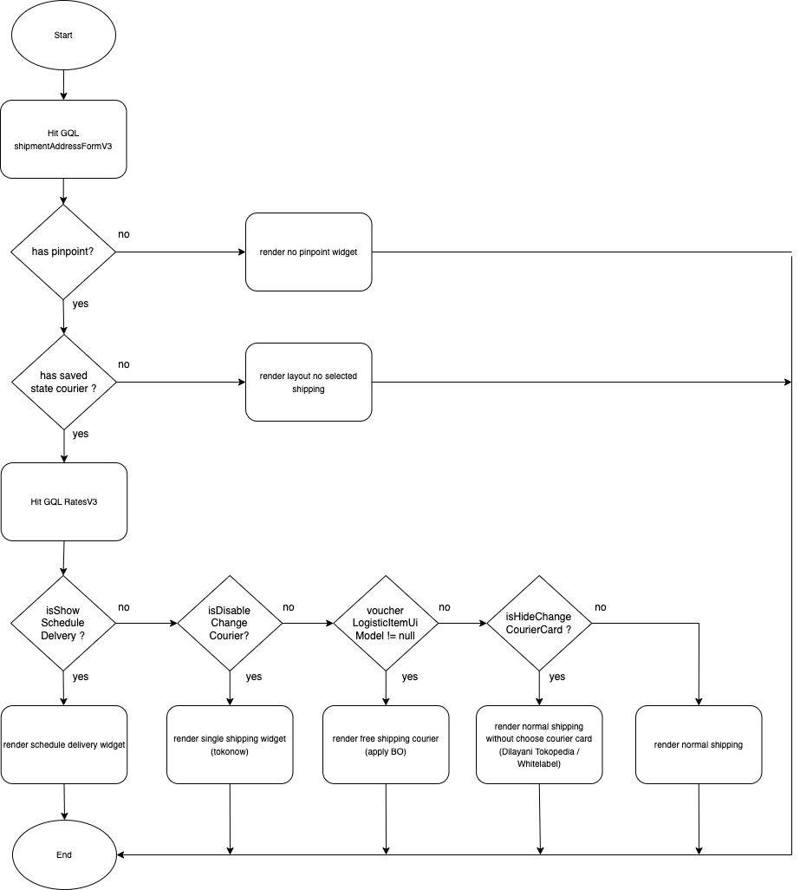

| **Status** | ​<!--start status:YELLOW-->IN TESTING<!--end status--> |
| --- | --- |
| Contributors | ​[Fakhira Devina](https://tokopedia.atlassian.net/wiki/people/61077e53b704b40068e80a8e?ref=confluence) ​[Eka Desyantoro](https://tokopedia.atlassian.net/wiki/people/6283196bd9ddcc006e9c7a85?ref=confluence) ​ |
| Product Manager | [Nuringtyas Rahwinarni](https://tokopedia.atlassian.net/wiki/people/5f58b98ed2c77e0075ac9865?ref=confluence)  |
| Team | [Minion Bob](https://tokopedia.atlassian.net/people/team/2373d8a6-1afc-4f2a-aa7a-63855c273051) |
| Release date | (ETA) ​24 Feb 2023 / ​<!--start status:GREY-->MA-3.209<!--end status--> |
| Module type | ​<!--start status:YELLOW-->FEATURE<!--end status--> |
| Product PRD |  |
| Module Location | `features/logistic/logisticcart` |

<!--toc-->

  
Release Notes (max 5 latest release notes)

<!--start expand:ETA 24 Feb 2023 (MA-3.209)-->
Move shipping widget from module checkout to logistic cart
<!--end expand-->

## Overview

### Background

Shipping widget is part of the logistics, but now the code is in the checkout module and still uses java. By moving this widget to the logistics cart module and converting it to Kotlin, the ownership will be clearer in logistics and more manageable in the future

### Project Description

Shipping widget is a custom view developed to select shipping at `checkout page`

This custom view has functionality to select shipping `duration` and `courier` when the buyer wants to checkout the product. There are several view conditions to be displayed.  


- No pinpoints yet


- Not selected delivery yet



- Product from tokonow



- Use Bebas Ongkir



- Use delivery arrived 4 hours (Dilayani Tokopedia)



- Normal Shipping



## Flow Diagram

## How-to

#### 1. Add dependencies

Add `logisticCart` dependency to your module's build.gradle


```
implementation projectOrAar(rootProject.ext.features.logisticcart)
```

#### 2. Implement ShippingWidget

Add ShippingWidget to your fragment’s layout


```
<com.tokopedia.logisticcart.shipping.features.shippingwidget.ShippingWidget
    android:id="@+id/shipping_widget"
    android:layout_width="match_parent"
    android:layout_height="wrap_content"/>
```

#### 3. Initialize ShippingWidget


```
val shippingWidget = itemView.findViewById<ShippingWidget>(R.id.shipping_widget);
shippingWidget.setupListener(this);
```

You need to initialize ShippingWidget and `setupListener()` to implements `ShippingWidgetListener` on your fragment : 

- `onChangeDurationClickListener`

This is listener triggered when user will change the delivery duration

- `onChangeCourierClickListener`

This is listener triggered when user will change the courier

- `onOnTimeDeliveryClicked`

This is listener triggered when user clicked on time delivery

- `onClickSetPinpoint`

This is listener triggered when user will set pin point

- `onClickLayoutFailedShipping`

This is listener triggered when user clicked failed shipping layout

- `onViewErrorInCourierSection`

This is listener triggered when view error in courier section

## Public Method

- `hideShippingStateLoading`

This function to hide shipping state loading.

- `renderShippingVibrationAnimation`

This function to render shipping vibration animation.

- `renderErrorCourierState`

This function to render error courier state.

- `showContainerShippingExperience`

This function to show container shipping experience.

- `renderSingleShippingCourier`

This function to show layout from Tokonow and cannot change duration & courier.

- `showLayoutFreeShippingCourier`

This function to show layout `Bebas Ongkir` and cannot select courier.

- `renderFreeShippingCourier`

This function to render courier name, label selected free shipping & label free shipping eta when show layout `Bebas Ongkir`.

- `renderNormalShippingWithoutChooseCourierCard`

This function to show layout when use delivery arrived 4 hours (Dilayani Tokopedia) and cannot select courier.

- `renderNormalShippingCourier`

This function to render normal shipping courier and user can change duration & courier.

- `showLayoutNoSelectedShipping`

This function to show when haven't selected delivery yet.

- `showLayoutTradeIn`

This function to show trade in layout.

- `showLayoutStateFailedShipping`

This function to show layout state failed shipping.

- `prepareLoadCourierState`

This function to prepare load courier state, hide all view on shipping widget.

- `renderLoadingCourierState`

This function to show loading on courier state, hide shipping view, and hide trade in view.

- `onLoadCourierStateData`

This function to show loading on courier state and hide shipping view.

- `hideTradeInShippingInfo`

This function to hide trade in view

- `hideTradeInTitleAndDetail`

This function to title and detail on trade in view

- `renderErrorPinpointCourier`

This function to render error pinpoint courier

## Tech Stack

- MVVM
- Kotlin
- JUnit
- Coroutines

### GQL List


| **GQL Name** | **Documentation** | **Description** |
| --- | --- | --- |
| `ratesV3` | ​[Rates V3](/wiki/spaces/LG/pages/567279712/Rates+V3)  | To get all data for shipping widget |