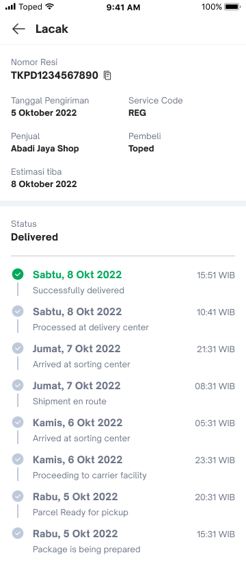
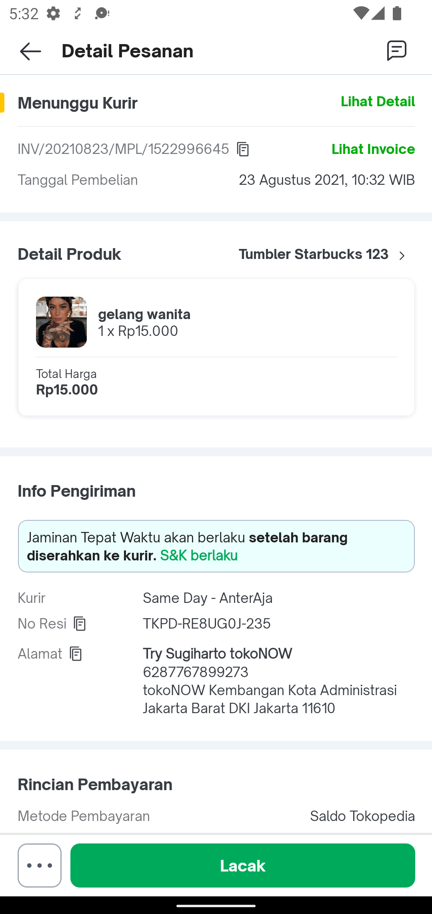

<!--left header table-->

| Status               | <!--start status:GREEN-->RELEASE<!--end status-->                                                                                                                                                                                                                                                          |
|----------------------|------------------------------------------------------------------------------------------------------------------------------------------------------------------------------------------------------------------------------------------------------------------------------------------------------------|
| Contributors         | [Irpan .](https://tokopedia.atlassian.net/wiki/people/6253578a3bf0f0007015669c?ref=confluence) [Fakhira Devina](https://tokopedia.atlassian.net/wiki/people/61077e53b704b40068e80a8e?ref=confluence) [Eka Desyantoro](https://tokopedia.atlassian.net/wiki/people/6283196bd9ddcc006e9c7a85?ref=confluence) |
| Product Manager  | [Aulia Rasyid](https://tokopedia.atlassian.net/wiki/people/613e9e61e7c328007069f2b6?ref=confluence)                                                                                                                                                                                                        |
| Team                 | [Minion Bob](https://tokopedia.atlassian.net/people/team/2373d8a6-1afc-4f2a-aa7a-63855c273051)                                                                                                                                                                                                             |
| Module type          | <!--start status:YELLOW-->FEATURE<!--end status-->                                                                                                                                                                                                                                                         |
| Module Location      | `features/logistic/logisticorder`                                                                                                                                                                                                                                                                          |

<!--toc-->

## Release Notes

<!--start expand:29 July (Ma-3.185 and SA-2.115)-->
- Add copy paste button and Empty Field state.

<!--end expand-->

<!--start expand:24 June (Ma-3.180)-->
- [Proof of Delivery (POD)](https://tokopedia.atlassian.net/wiki/spaces/PA/pages/1967065652)
<!--end expand-->
- [Handle Tracking Page for OWOC Product ](https://github.com/tokopedia/android-tokopedia-core/pull/34005)

## **Overview**

### Project Description

Tracking page takes care of every user needs when it comes to tracking, including reference number, courier name, estimated time
arrival, image when product is picked up and delivered, also tracking feature so user can track their own product(s). Recently,
tracking page have a new addition called tipping section, because there is a habit where our buyer wants to give tips to the
Gojek/Grab Driver. The buyer gives tips when the driver asks about parking fees or the buyer generously wants to give tips.

But currently, there is no seamless flow for buyers to give tips on Tokopedia App. Buyers need to give tips via cash. This pain
point is frustrating for buyers where buyers are not at home, buyers living at apartments (need to go down to the lobby). And it
gets worse when right now during a pandemic buyer does not want to meet the driver directly to hand over tips via cash.

To solve this, Tokopedia wants to provide a seamless flow for buyers to give cashless tips to drivers via Tokopedia App. With this
product, we will solve buyer pain points where the buyer does not need to meet the driver and give cash tips.

### UI Page

## Navigation

- `tokopedia://shipping/tracking/{{order_id}}`
- `tokopedia-android-internal://logistic/shipping/tracking/{{order_id}}`

one example of entry point of tracking page is Detail Pesanan with click in Lacak Button

## Tech Stack

- Java - Kotlin
- MVP - MVVM
- JUnit
- Coroutines

## UI Component

- Tracking Page

	- Tracking History
	- ETA - ETA BottomSheet
	- Tipping Section
- Live Tracking Page → webview
- Shipping Confirmation

## GQL List

| **GQL & API Name**          | **Documentation Link**                                                                                                                  | **Description**                              |
|-----------------------------|-----------------------------------------------------------------------------------------------------------------------------------------|----------------------------------------------|
| `logistic_tracking`         | [[Internal/GQL] Get Tracking](https://tokopedia.atlassian.net/wiki/spaces/LG/pages/570294330)                                           | To get all tracking info                     |
| `retryAvailability`         | [[MP Log] Retry Availability - /api/logistic/i/v1/retry\_availability](https://tokopedia.atlassian.net/wiki/spaces/LG/pages/2086542990) | To check if courier is avail to retry pickup |
| `retryBooking`              | [[MP Log] Retry Booking - /api/logistic/i/v1/retry\_booking](https://tokopedia.atlassian.net/wiki/spaces/LG/pages/840115009)            | Doing retry pickup                           |
| get-delivery-image          | [Get Delivery Image](https://tokopedia.atlassian.net/wiki/spaces/LG/pages/1412012172/Get+Delivery+Image)                                | to show image from courier                   |
| `get_edit_shipping_form.pl` | -                                                                                                                                       | get courier list on confirm shipping         |
| `proceed_shipping.pl`       | -                                                                                                                                       | proceed shipping from seller side            |
| `/v4/order/change_courier`  | -                                                                                                                                       | change courier before shipping               |

## How To

here is how to call Tracking Page from your side

Here is the applink to navigate 
`tokopedia://shipping/tracking/{{order_id}}?tx_id={{tx_id}}&group_type={{group_type}}`

<!--start expand:Param and query-->

| **Param**    | **Type** | **Notes**                                     |
|--------------|----------|-----------------------------------------------|
| `orderId`    | String   | order id for show data tracking page          |
| `tx_id`      | String   | adjust for owoc product. default empty string |
| `group_type` | Int      | adjust for owoc product. default 0            |

| **Query**           | **Type** | **Notes**                                                                         |
|---------------------|----------|-----------------------------------------------------------------------------------|
| `url_live_tracking` | String?  | need to send to show live tracking. if null will not show button to live tracking |
| `caller`            | String?  | need to send only if caller is from seller                                        |

<!--end expand-->

---

## Useful Links

- [Figma Dynamic ETA](https://www.figma.com/file/Ca0Lakjx4tZDf4gvClXkQ3/Dynamic-ETA-v1.0---%5BM%2FD%5D?t=c19BCJRsa9gQhYF9-6)
- [Figma Add copy paste button and Empty Field state](https://www.figma.com/file/tNgEL1SLOrz4hKsk9p0jT3/%5BUIUX-M%2FD%5D-Tracking-%2F-Lacak-Master?node-id=203%3A9724)