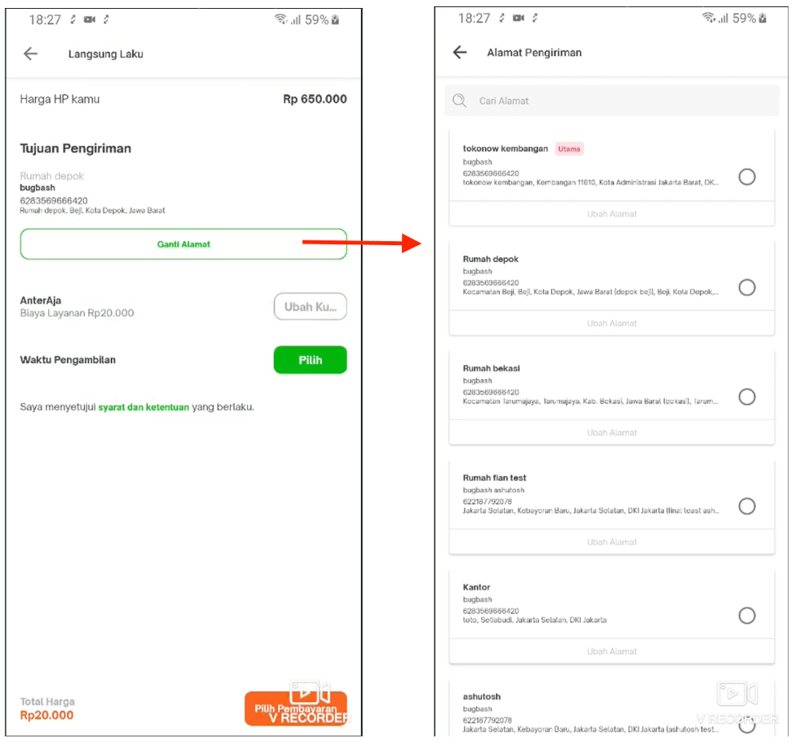
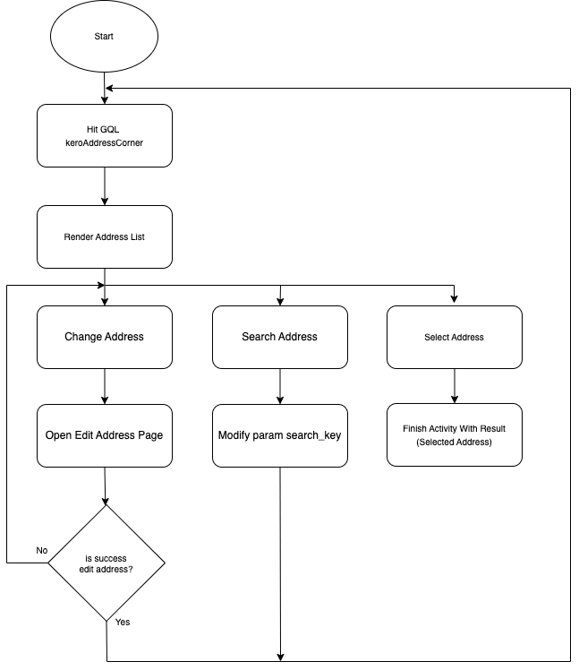

| **Status** |  <!--start status:GREEN-->RELEASE<!--end status-->  |
| --- | --- |
| **Project Contributor** | [Fakhira Devina](https://tokopedia.atlassian.net/wiki/people/61077e53b704b40068e80a8e?ref=confluence) [Eka Desyantoro](https://tokopedia.atlassian.net/wiki/people/6283196bd9ddcc006e9c7a85?ref=confluence) [Irpan .](https://tokopedia.atlassian.net/wiki/people/6253578a3bf0f0007015669c?ref=confluence)  |
| Product Manager | [Nuringtyas Rahwinarni](https://tokopedia.atlassian.net/wiki/people/5f58b98ed2c77e0075ac9865?ref=confluence)  |
| Team |  [Minion Bob](https://tokopedia.atlassian.net/people/team/2373d8a6-1afc-4f2a-aa7a-63855c273051)  |
| Module type | <!--start status:YELLOW-->FEATURE<!--end status--> |
| Module Location | `features/logistic/manageaddress` |

## Table of Contents

<!--toc-->

## Overview

### Project Description

This page contains a list of addresses that function to select address in the trade-in feature. There are functions for selecting addresses, searching, and there is an entry point for editing addresses

## Navigation

This page can be accessed from the trade in feature



## Flow Diagram



## How-to

Go to address selection page you can call `ApplinkConstInternalMarketplace.CHECKOUT_ADDRESS_SELECTION` 


```
startActivity(RouteManager.getIntent(this, ApplinkConstInternalMarketplace.CHECKOUT_ADDRESS_SELECTION))
```

or also from the notification with this applink  
`tokopedia-android-internal://marketplace/checkout-address-selection`

## Tech Stack

- MVP
- Kotlin
- JUnit
- RX Java

### GQL List


| **GQL Name** | **Documentation** | **Description** |
| --- | --- | --- |
| `keroAddressCorner` | [Get Address Corner - /maps/v1/address/corner](/wiki/spaces/LG/pages/694794650) | Get All User Addresses |


---

## Action Items

- Convert to use MVVM & Coroutines