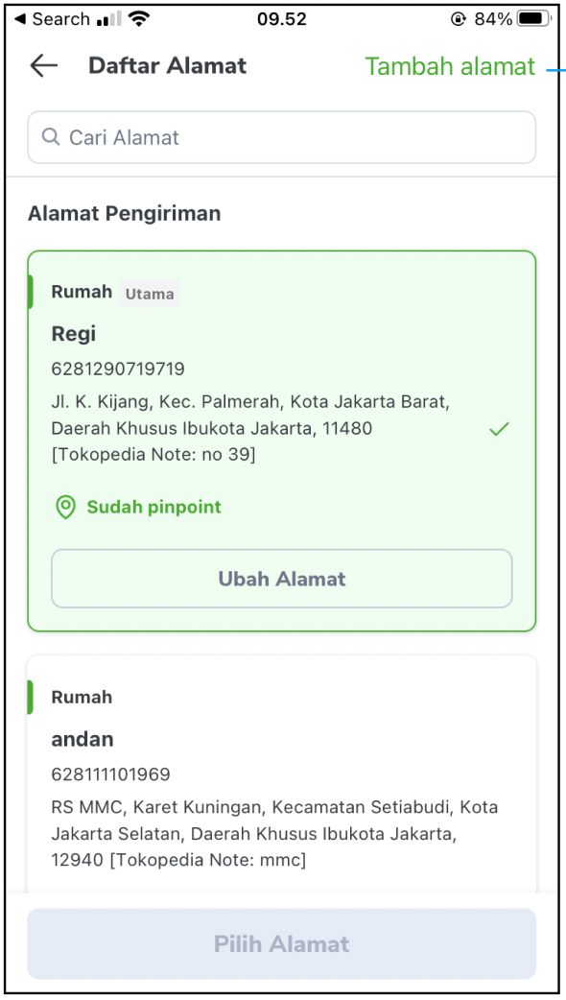
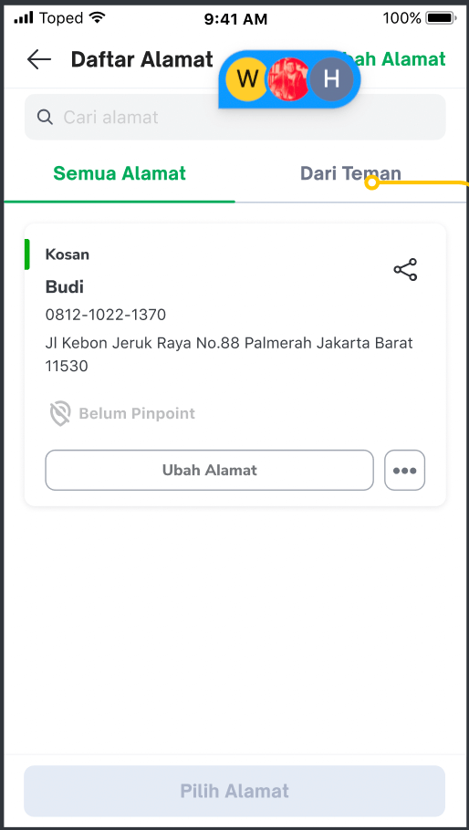
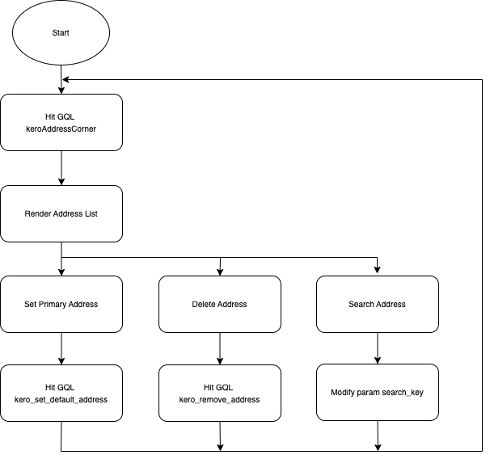

| **Status** |  <!--start status:GREEN-->RELEASE<!--end status-->  |
| --- | --- |
| **Project Contributor** | [Fakhira Devina](https://tokopedia.atlassian.net/wiki/people/61077e53b704b40068e80a8e?ref=confluence) [Eka Desyantoro](https://tokopedia.atlassian.net/wiki/people/6283196bd9ddcc006e9c7a85?ref=confluence) [Irpan .](https://tokopedia.atlassian.net/wiki/people/6253578a3bf0f0007015669c?ref=confluence)  |
| Product Manager | [Nuringtyas Rahwinarni](https://tokopedia.atlassian.net/wiki/people/5f58b98ed2c77e0075ac9865?ref=confluence)  |
| Team |  [Minion Bob](https://tokopedia.atlassian.net/people/team/2373d8a6-1afc-4f2a-aa7a-63855c273051)  |
| Module type | <!--start status:YELLOW-->FEATURE<!--end status--> |
| Module Location | `features/logistic/manageaddress` |

## Table of Contents

<!--toc-->

## Overview

### Project Description

This is a feature that contains the buyer's address list. There are functions for searching, setting main address, deleting address, and there are entry points for adding/editing address.

  
Since share address release and if eligible this page will have 2 tabs (main address & from friend). For detail about share address feature can see [here](https://tokopedia.atlassian.net/wiki/spaces/PA/pages/2034631325/Logistic+Address+Share+Address).



## Navigation

There are several entry points to show address list, for details entry point see [here](https://tokopedia.atlassian.net/wiki/spaces/PA/pages/2034631638/Source+Param+Manage+Address+Entry+Point)

## Flow Diagram

## How-to

Go to main address page you can call `ApplinkConstInternalLogistic.MANAGE_ADDRESS` 


```
startActivity(RouteManager.getIntent(this, ApplinkConstInternalLogistic.MANAGE_ADDRESS))
```

or also from the notification with this applink  
`tokopedia-android-internal://logistic/manageaddress/`

## Tech Stack

- MVVM
- Kotlin
- JUnit
- Coroutines

### GQL List


| **GQL Name** | **Documentation** | **Description** |
| --- | --- | --- |
| `keroAddressCorner` | [Get Address Corner - /maps/v1/address/corner](/wiki/spaces/LG/pages/694794650) | Get All User Addresses |
| `kero_set_default_address` | [Set Default Address - /maps/v1/address/primary](/wiki/spaces/LG/pages/572195326) | Set User Default Address |
| `kero_remove_aadress` | [Remove Address - /maps/v1/address/remove](/wiki/spaces/LG/pages/572162326) | Remove User Address |


---

## Action Items

- Add rollence to check eligible share Address
- Support Share Address Feature