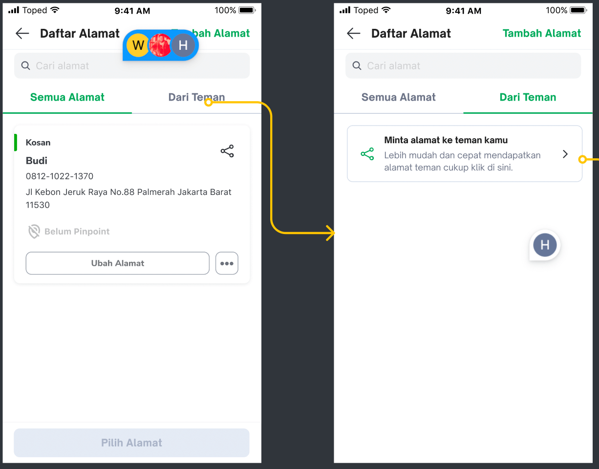
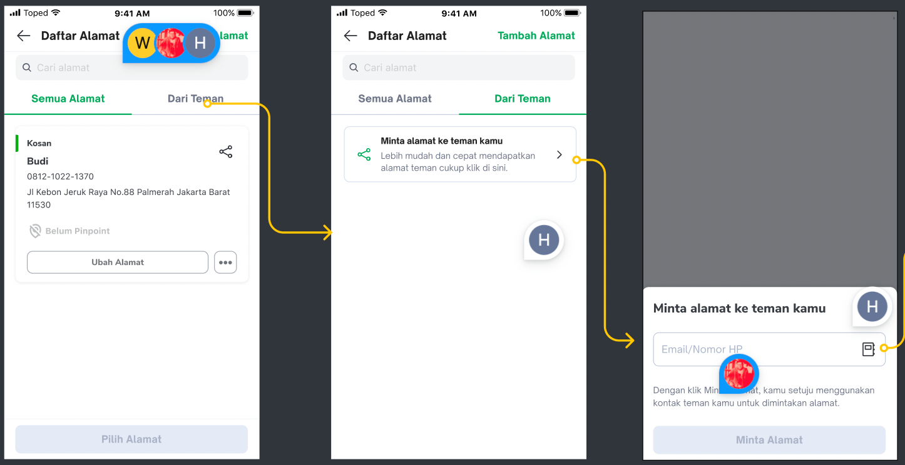
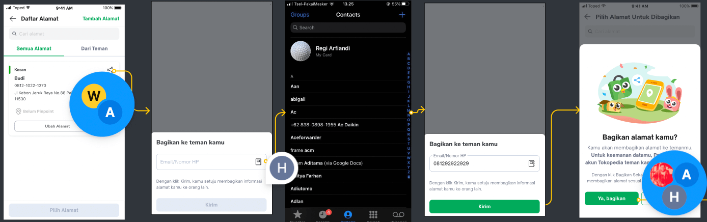
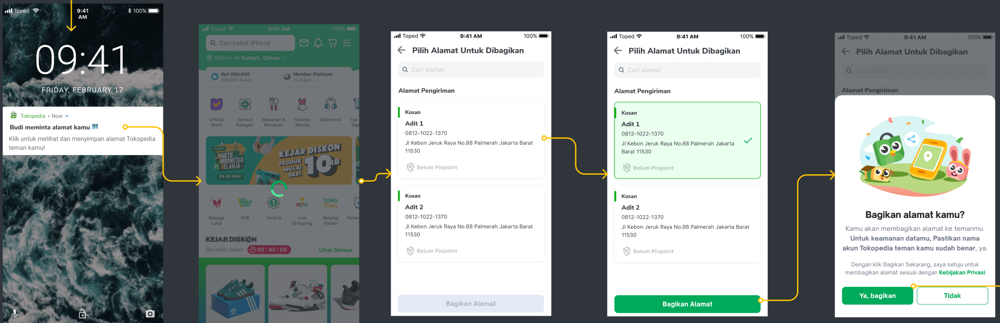
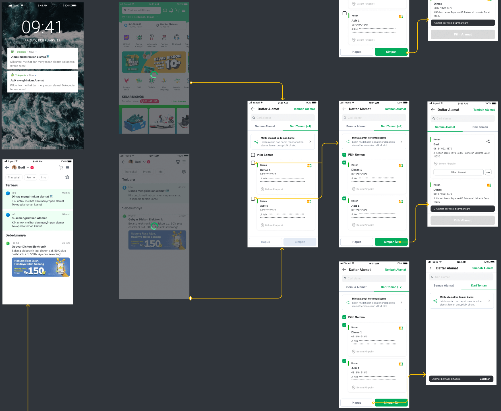
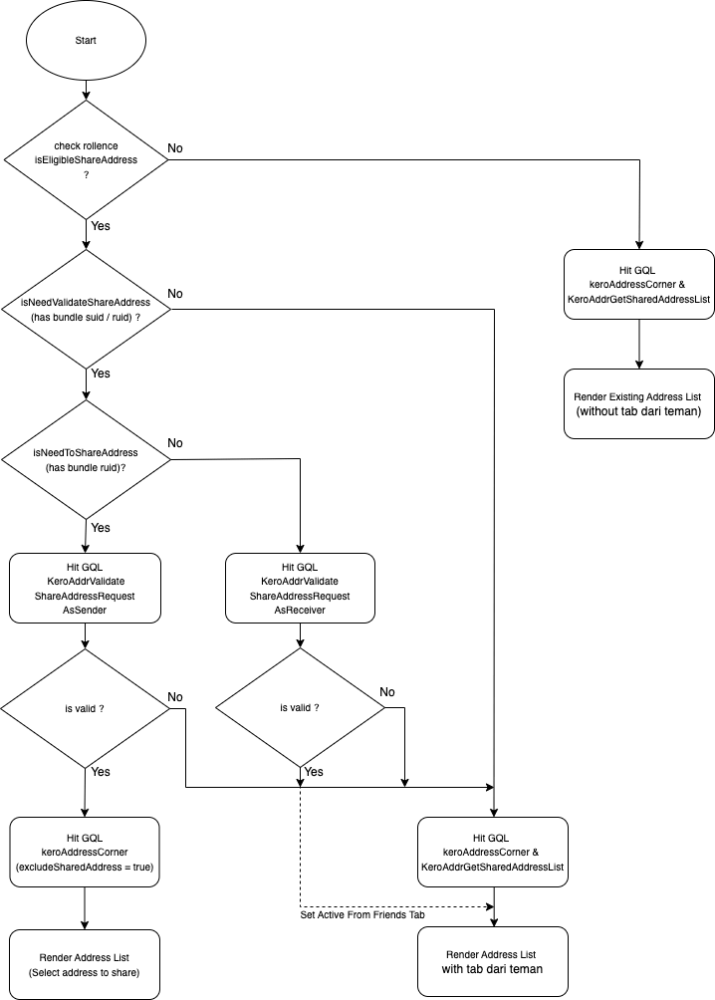

| **Status** |  <!--start status:GREEN-->RELEASE<!--end status-->  |
| --- | --- |
| **Project Contributor** | [Fakhira Devina](https://tokopedia.atlassian.net/wiki/people/61077e53b704b40068e80a8e?ref=confluence) [Eka Desyantoro](https://tokopedia.atlassian.net/wiki/people/6283196bd9ddcc006e9c7a85?ref=confluence) [Irpan .](https://tokopedia.atlassian.net/wiki/people/6253578a3bf0f0007015669c?ref=confluence)  |
| Product Manager | [Wahyu Ivan Satyagraha](https://tokopedia.atlassian.net/wiki/people/61ad4312c15977006a17ce75?ref=confluence)  |
| Team |  [Minion Bob](https://tokopedia.atlassian.net/people/team/2373d8a6-1afc-4f2a-aa7a-63855c273051)  |
| Release date | 16 Dec 2022 / <!--start status:GREY-->MA-3.202<!--end status-->  |
| Module type | <!--start status:YELLOW-->FEATURE<!--end status--> |
| Product PRD | [PRD - Share Address](https://docs.google.com/document/d/12WmxwOm3HBdi3PcxbrkeV1DOkqZzLC7bzom_7MRnML8/edit)  |
| Module Location | `features/logistic/manageaddress` |

## Table of Contents

<!--toc-->

## Release Notes

<!--start expand:16 Dec 2022 (MA-3.202)-->

<!--end expand-->

## Overview

### Background

At some big events or important occasions, buyers tend to buy goods/packages for their friends and families. There can be a buyer who sends the packages to a single location, or there is a buyer who sends packages to multiple locations (but usually it's the same packages). Whatever the destination is, for those buyers, the pre-requisite step is pretty similar: they need to manually input the address of the destination.  
By having a feature which allows the buyers to send their address to other users with their consent, will provide a delightful experience for the buyers when they want to buy a package as a gift to other users by eliminating the manual process of inputting the address. On Technical perspective, this feature can press the operational cost and time, since between buyers can share their address (pinpoint included), the receiver will not have to do the pinpoint anymore.

### Project Description

This project add one new tab *Dari Teman* in manage address page which contains a list of addresses sent from other users, we can save / delete this addresses. The share address feature allows users to send/receive addresses.

## Navigation

Entry point go to share address page is same with manage address, for details entry point see [here](https://tokopedia.atlassian.net/wiki/spaces/PA/pages/2034631638/Source+Param+Manage+Address+Entry+Point)


Flow request address, from tab *Dari Teman* and click section view *Minta alamat ke teman kamu*


Flow to direct share address, user can click share icon on the top right

  
Flow share address, from notification if any other users request address

  
Flow when received address from others user from notification or can seen in tab *Dari Teman,* and the user can save or delete addresses



## Flow Diagram



## How-to

Go to share address page you can call `ApplinkConstInternalLogistic.MANAGE_ADDRESS` 


```
startActivity(RouteManager.getIntent(this, ApplinkConstInternalLogistic.MANAGE_ADDRESS))
```

or also from the notification with this applink

- if anyone request address  
`tokopedia://share_address?ruid={receiver_user_id}`
- if anyone send address  
`tokopedia://share_address?suid={sender_user_id}`

## Tech Stack

- MVVM
- Kotlin
- JUnit
- Coroutines

### GQL List


| **GQL Name** | **Documentation** | **Description** |
| --- | --- | --- |
| `KeroAddrValidateShareAddressRequestAsSender` | [[GQL / gRPC] Validate Share Address Request As Sender](/wiki/spaces/LG/pages/2004192040)  | To validate share address request as sender when entry point from notification center (has param `ruid`) |
| `KeroAddrValidateShareAddressRequestAsReceiver` | [[GQL / gRPC] Validate Share Address Request As Receiver](/wiki/spaces/LG/pages/2004485920)  | To validate share address request as receiver when entry point from notification center (has param `suid`) |
| `KeroAddrGetSharedAddressList` | [[GQL / gRPC] Get Shared Address List](/wiki/spaces/LG/pages/1989414063)  | To get shared address list |
| `KeroAddrSaveSharedAddress` | [[GQL] Save Shared Address](/wiki/spaces/LG/pages/1991345373)  | To save shared address (support to save multiple address) |
| `KeroAddrDeleteSharedAddress` | [[GQL] Delete Shared Address](/wiki/spaces/LG/pages/1991345365)  | To delete shared address (support to delete multiple address) |
| `KeroAddrSelectAddressForShareAddressRequest` | [[GQL] Select Address For Share Address Request](/wiki/spaces/LG/pages/1991345381)  | To share address from notification center when there is an address request  |
| `KeroAddrSendShareAddressRequest` | [[GQL] Send Share Address Request](/wiki/spaces/LG/pages/1991345389)  | To request address to other user |
| `KeroAddrShareAddressToUser` | [[GQL] Share Address To User](/wiki/spaces/LG/pages/1991836660)  | To share address from address list |


---

## Action Items

- Create cassava Test

## Useful Links

- Design : [Figma](https://www.figma.com/file/8JT5Va3Bxgk2fAiX0pAn3y/Address-v3.3---Share-Address?node-id=732%3A85129&t=BsNPGPAHJMDhxXyo-0)
- Tracker : <https://mynakama.tokopedia.com/datatracker/requestdetail/view/3435>
- Test Case (Cassava Test) :   
- [Share Address Request & Share - Share](https://mynakama.tokopedia.com/tracker-test-case/detail/346)   
- [Share Address Request & Share - Request](https://mynakama.tokopedia.com/tracker-test-case/detail/345)   
- [Share Address - Direct Share](https://mynakama.tokopedia.com/tracker-test-case/detail/343)