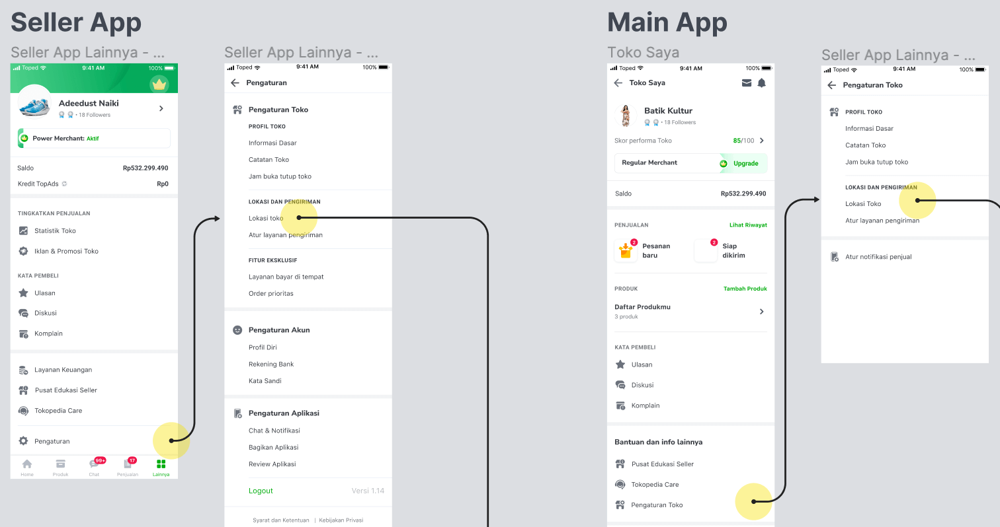
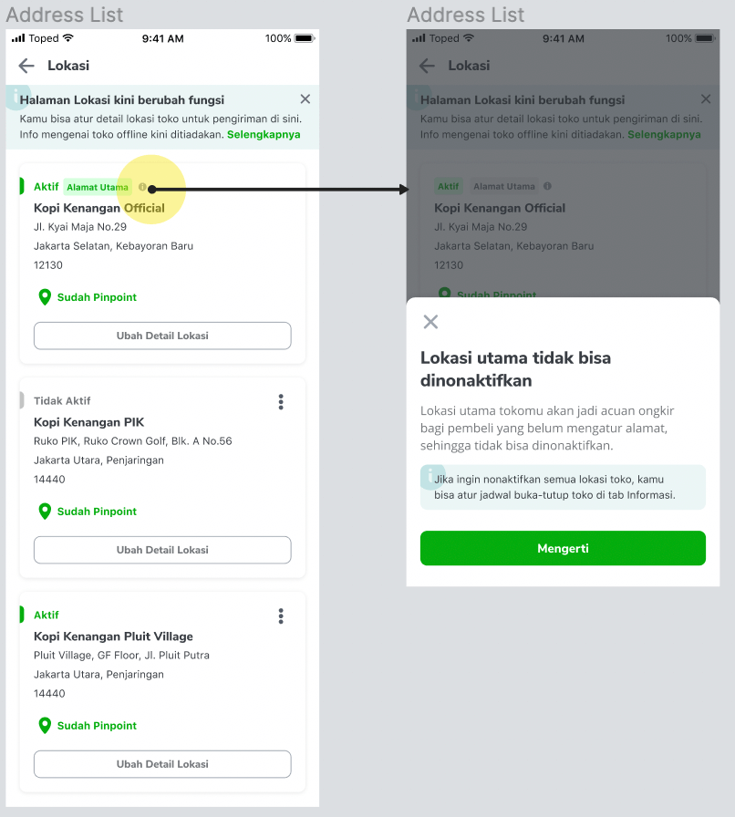
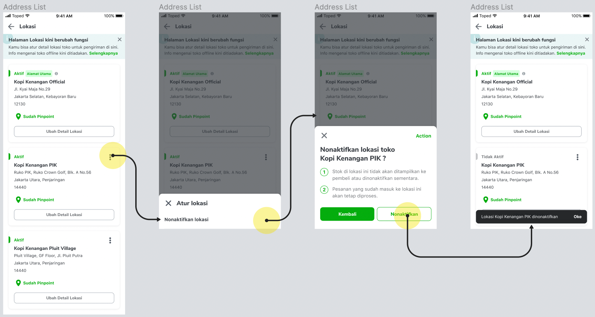
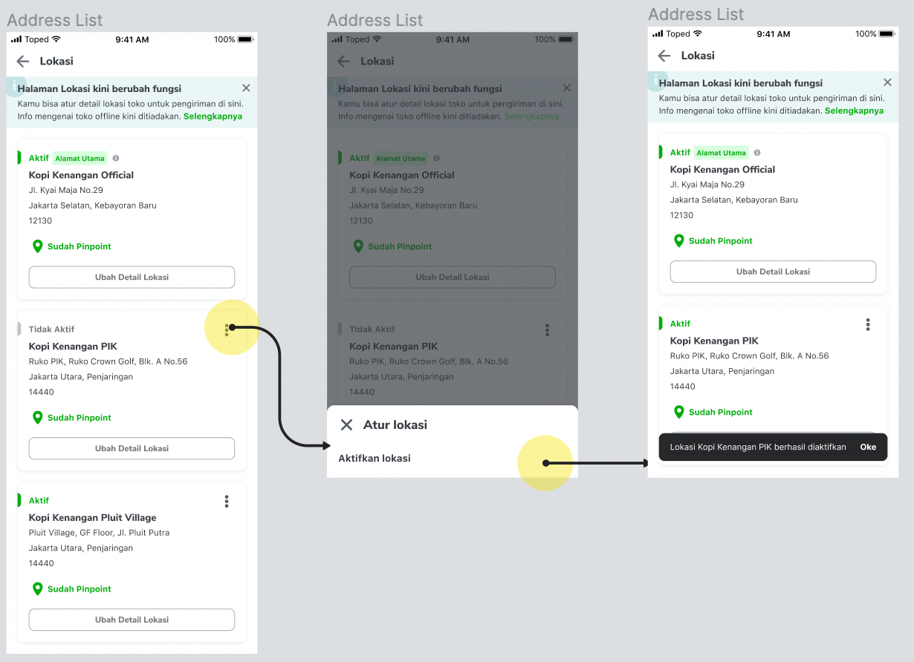
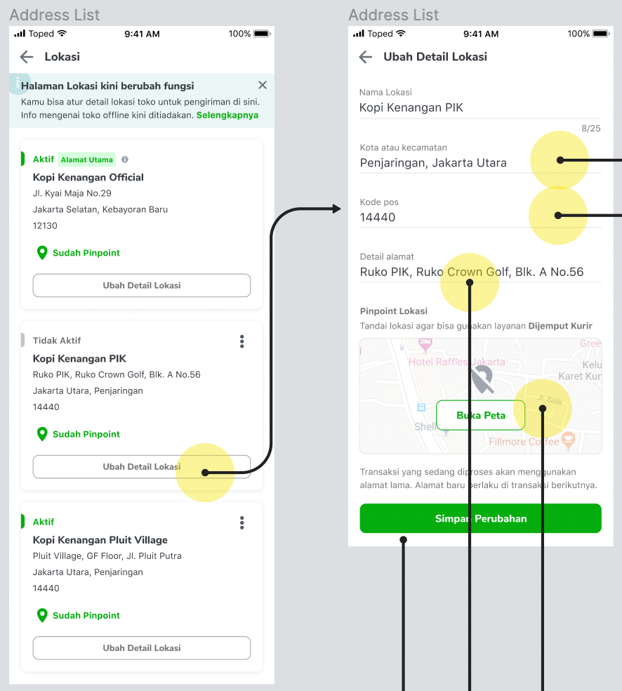
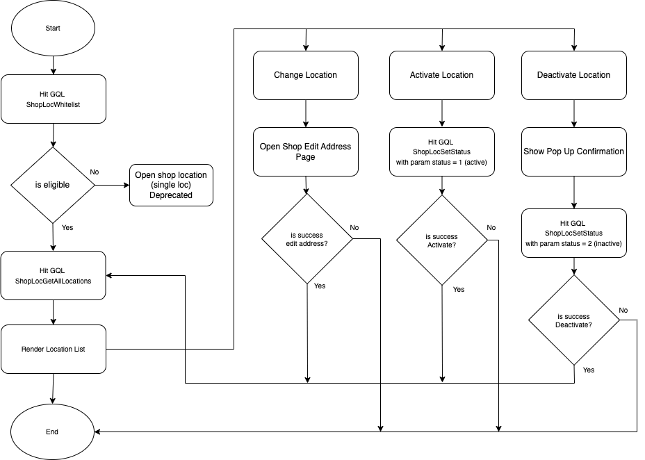

<!--left header table-->
| **Status**              | <!--start status:GREEN-->RELEASE<!--end status-->                                                                                                                                                                                                                                                          |
|-------------------------|------------------------------------------------------------------------------------------------------------------------------------------------------------------------------------------------------------------------------------------------------------------------------------------------------------|
| **Project Contributor** | [Fakhira Devina](https://tokopedia.atlassian.net/wiki/people/61077e53b704b40068e80a8e?ref=confluence) [Eka Desyantoro](https://tokopedia.atlassian.net/wiki/people/6283196bd9ddcc006e9c7a85?ref=confluence) [Irpan .](https://tokopedia.atlassian.net/wiki/people/6253578a3bf0f0007015669c?ref=confluence) |
| Product Manager         | [Nuringtyas Rahwinarni](https://tokopedia.atlassian.net/wiki/people/5f58b98ed2c77e0075ac9865?ref=confluence)                                                                                                                                                                                               |
| Team                    | [Minion Bob](https://tokopedia.atlassian.net/people/team/2373d8a6-1afc-4f2a-aa7a-63855c273051)                                                                                                                                                                                                             |
| Release date            | 18 Dec 2020                                                                                                                                                                                                                                                                                                |
| Module type             | <!--start status:YELLOW-->FEATURE<!--end status-->                                                                                                                                                                                                                                                         |
| Product PRD             | <https://docs.google.com/document/d/1lpc98btp1vOgFcTrCllUc3qrS23AF8vlz2ebFyt6i7s/edit#heading=h.i6nxfhanqq70>                                                                                                                                                                                              |
| Module Location         | `features/logistic/manageaddress`                                                                                                                                                                                                                                                                          |

<!--toc-->

## Release Notes

<!--start expand:1 September 2023-->
Remove Shop Single Location
<!--end expand-->

<!--start expand:18 Dec 2020-->

<!--end expand-->

## Overview

### Background

Nowadays, more than 80% of internet users in Indonesia have made online purchases and the sales of physical goods through online are projected to increase by more than 8 times in 2020.  Tokopedia is one of an online platform beneficial from technological developments and changing in consumer behavior. This resulted in a new high MUB and MUS in the month of May reaching 557K unique transacting sellers and 3.8 mio unique buyers. In H1 2020 there is a 25% increase in new C2C merchants registered with 1.2 mio new merchants, compared to 955K new merchants in H1 2019. More significantly, to survive with this trend, large offline retailers switching to online with Official Store Registration increased by 225% from 193 registrations per month in Jan to 494 registrations per month in June 2020. Many of them already have strong network presence, such as ACE Hardware, MAP, CFC Fried Chicken, Chatime, and so on.

These merchants already have their inventory currently allocated across multiple warehouse and offline store locations. Hence, allowing operations from multiple warehouses via the Tokopedia platform can bring impact to both buyers and merchants. Buyers can benefit from the location proximity to get access to more assortment, faster delivery and lower fulfillment cost, while sellers can increase efficiencies of operations.

We have identified potential partners where more than 56+ merchants with 20k+ locations across Indonesia are ready to be onboarded. This also brings opportunities to few categories, e.g. FMCG grows exponentially, especially if we are able to display relevant content based on the users location.

### Project Description

This project create new page list of seller shop locations. Seller can deactivate / reactivate stores and there is an entry point to edit stores from this page.

## Navigation

Entry point from store location settings on Seller App and Main App 

  
Main location can’t be deactivated


Flow Deactivate branch


Flow Reactivate branch


Flow Edit Location



## Flow Diagram



## How-to

To show shop location page you can call `ApplinkConstInternalLogistic.SHOP_SETTINGS_ADDRESS` 


```
RouteManager.route(activity, ApplinkConstInternalMarketplace.SHOP_SETTINGS_ADDRESS)
```

or also with this internal applink  
`tokopedia-android-internal://marketplace/shop-settings-address`

## Tech Stack

- MVVM
- Kotlin
- JUnit
- Coroutines

### GQL List


| **GQL Name** | **Documentation** | **Description** |
| --- | --- | --- |
| `ShopLocWhitelist` | [Is Eligible Multilocation](https://tokopedia.atlassian.net/wiki/spaces/LG/pages/1098123039/Is+Eligible+Multilocation)  | Differentiate seller with single / multi location |
| `ShopLocGetAllLocations` | [HTTP - Get All Locations Info](https://tokopedia.atlassian.net/wiki/spaces/LG/pages/987562519/HTTP+-+Get+All+Locations+Info)  | Get All Seller Location (Multi-Loc) |
| `ShopLocSetStatus` | [GRPC - Bulk Set Shop Location Status](https://tokopedia.atlassian.net/wiki/spaces/LG/pages/963754852/GRPC+-+Bulk+Set+Shop+Location+Status)  | Set Warehouse Status to active or inactive (Multi-Loc) |


---

## Action Items

## Useful Links

- [Figma](https://www.figma.com/file/dBAnwVyjDUOO4llvBnzXaS/Shipping-Editor-x-Location-v2.0---Multi-Location?node-id=341%3A17897&t=L5IbuZ9frUG6v33u-0)