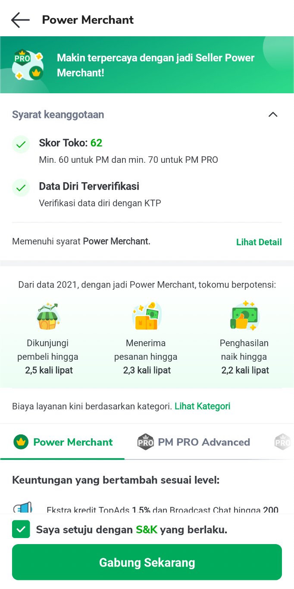
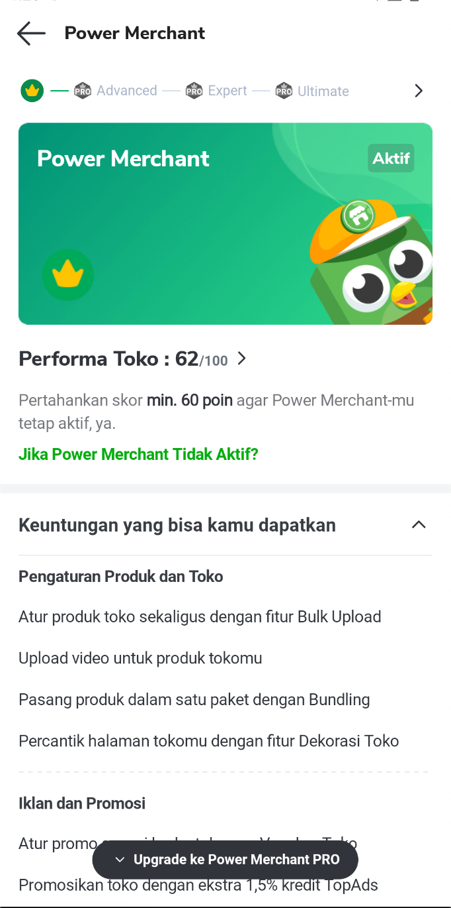
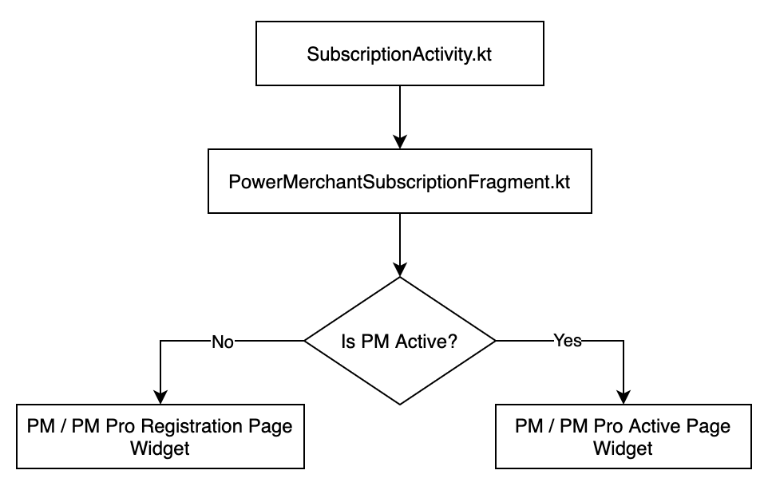
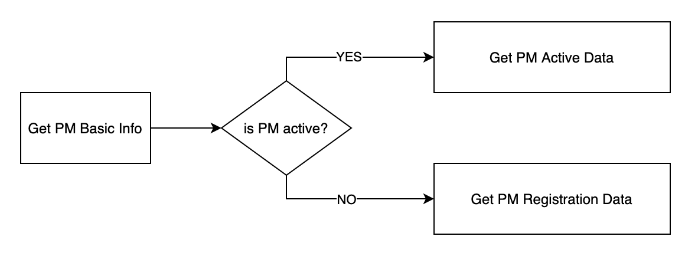
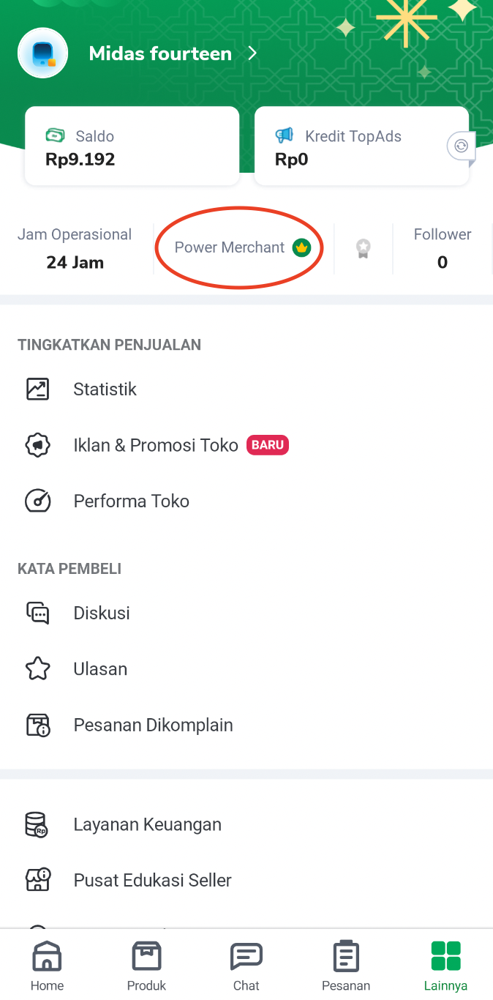
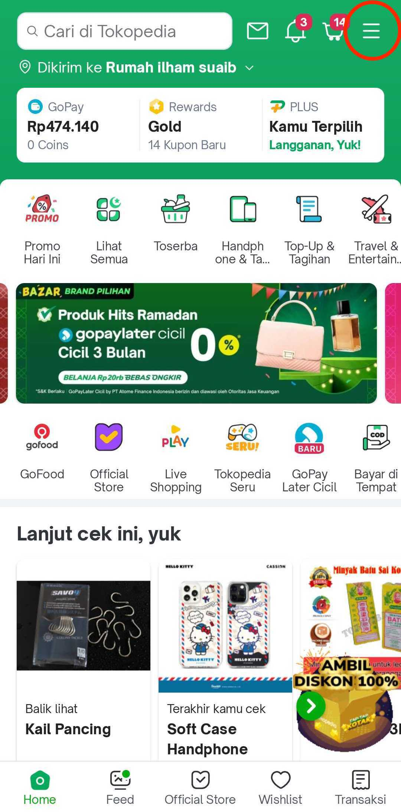
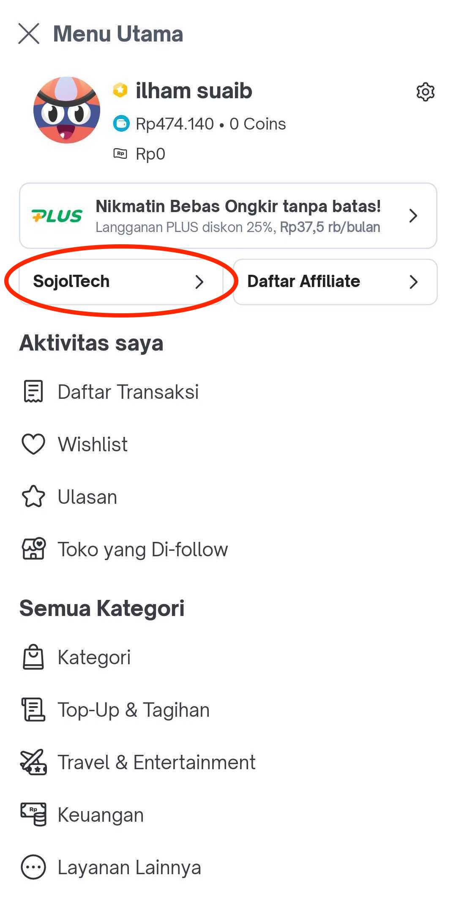
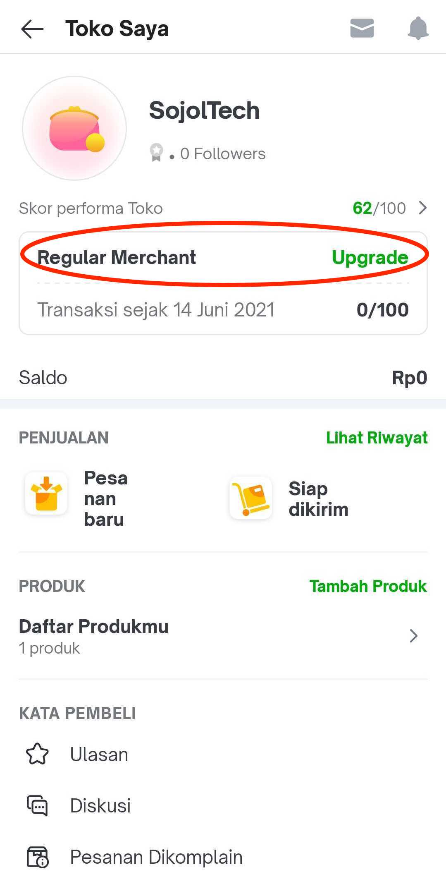

| **Status** | <!--start status:GREEN-->RELEASE<!--end status--> |
| --- | --- |
| Contributors | [Ilham .](https://tokopedia.atlassian.net/wiki/people/5de4d2148743750d00b7cc12?ref=confluence) [Rizqi Aryansa](https://tokopedia.atlassian.net/wiki/people/5e25ee87006fae0ca232e1ac?ref=confluence) [REIVIN OKTAVIANUS](https://tokopedia.atlassian.net/wiki/people/5dae89dab86cd40c2da5ad2f?ref=confluence)  |
| Product Manager | [Franky Gabriel Sanjaya](https://tokopedia.atlassian.net/wiki/people/6029d0717b23f4006842dec3?ref=confluence)  |
| Team | [Minion Stuart](https://tokopedia.atlassian.net/people/team/eeba862a-bd9d-472c-b901-415b15b1a37e)  |
| Release date | - |
| Module type | <!--start status:RED-->FEATURE<!--end status--> |
| Module Location | `features/merchant/power_merchant_subscribe` |

## Table of Contents

<!--toc-->

## Overview

Seller will be looking at this page when they want to register for **Power Merchant (PM)**. They will be able to see the benefits of Power Merchant, and what are the requirements they need to fulfill if they become Power Merchant.

### Screenshoots

## Tech Stack

- Kotlin
- Coroutine
- MVVM
- Recycler View (View Holder Based)

## Flow Diagram

### PM Page Code Structure

PM page code structure in general basically the same as the other page. Where there is an Activity and then a Fragment on above of it.

### Data Flow

Here is the data flow Power Merchant Page

## Navigation

To open the PM page, below are the entry points : 

1. On Seller App, from ***Home*** → ***Other Menu*** → ***Power Merchant Card.*** This entry point is not visible for Official Store.  

2. On Customer App, from **Home** → **Main Menu** *(on top right corner)* → **Shop Account** → **Upgrade Power Merchant**

## How-to

**AppLink**

| **Internal AppLink** | **External AppLink** |
| --- | --- |
| `tokopedia-android-internal://marketplace/power-merchant-subscribe` | `tokopedia://power_merchant/subscribe` |

 

No required param for PM app links

---

## Useful Links

- [PRD](https://docs.google.com/document/d/1YCcxVnhBzDBhXSUkWjH5tt4YNTL4ei84sb0v87-ff8E/edit#heading=h.wrq8dh9iczu4)
- [Figma](https://www.figma.com/file/4Ssx0veBnLqzawYZuuNfzw/%F0%9F%91%BE%5BUI-M%5D-Power-Merchant-Pro?node-id=2%3A0)
- [GQL Docs](#)
- [PR](https://github.com/tokopedia/android-tokopedia-core/pull/19673)
- Data Tracker : [Seller App](https://mynakama.tokopedia.com/datatracker/product/requestdetail/1358) & [Main App](https://mynakama.tokopedia.com/datatracker/product/requestdetail/1159)

