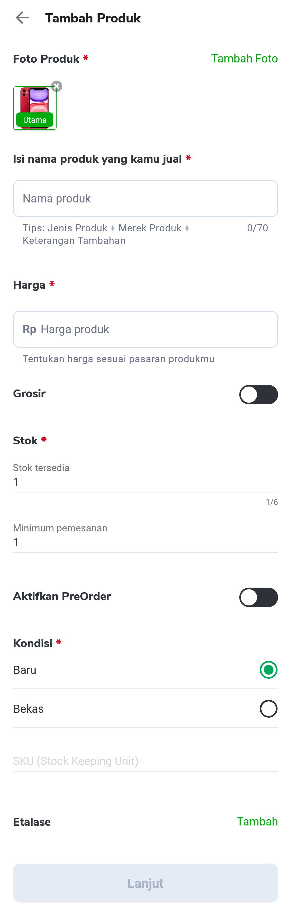
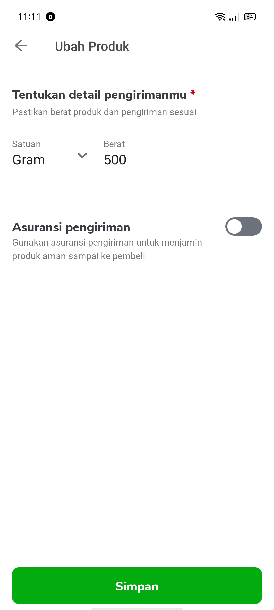
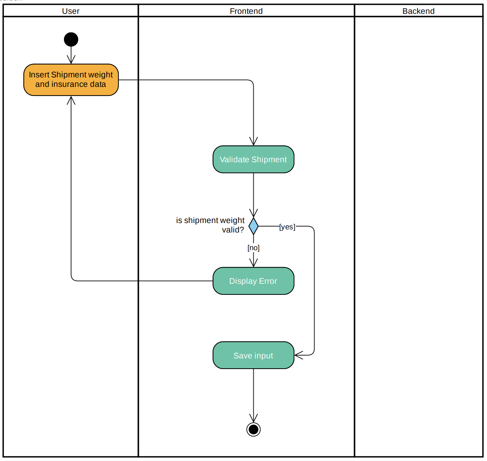
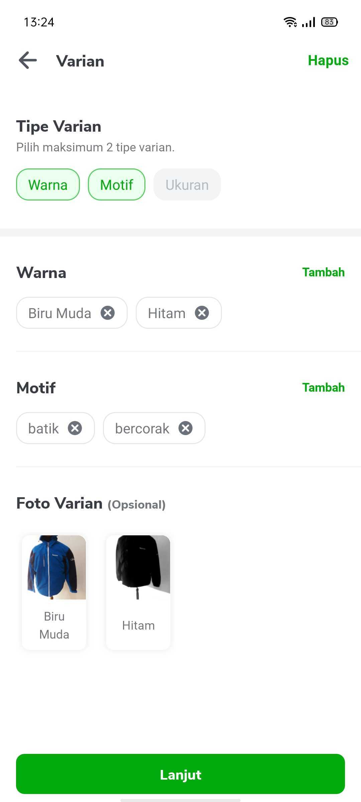
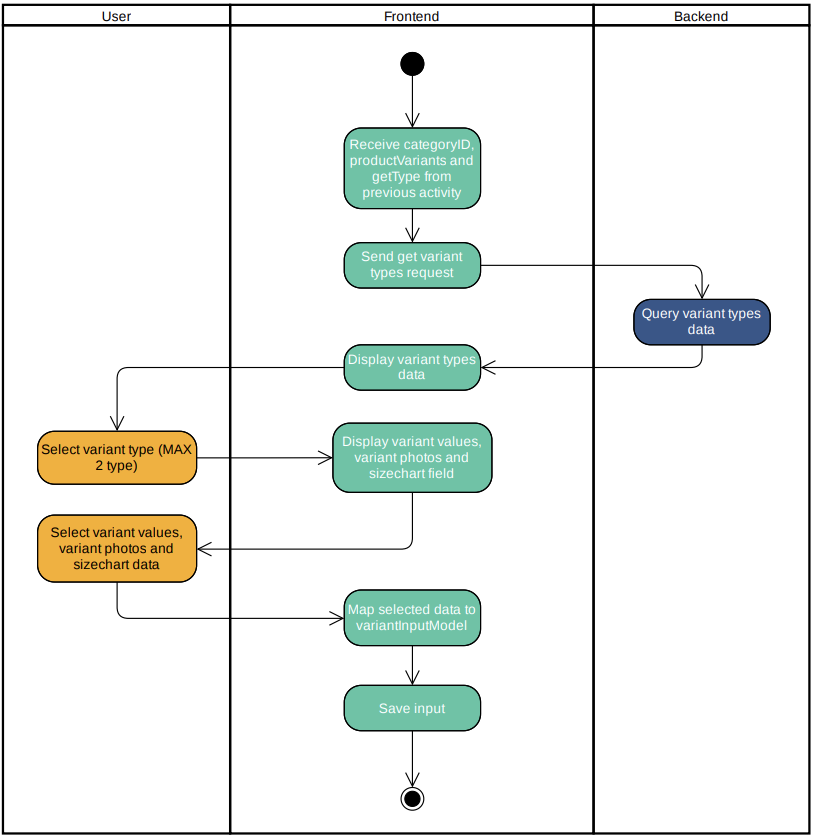
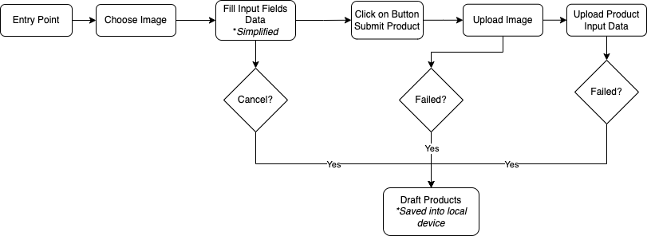
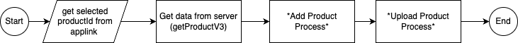

| Status | <!--start status:GREEN-->RELEASE<!--end status--> |
| --- | --- |
| Contributors
 | [Faisal Ramdani](https://tokopedia.atlassian.net/wiki/people/5def016f73b0bd0e4d82fa6e?ref=confluence)  |
| Project Lead | [Yogie Susdyastama Putra](https://tokopedia.atlassian.net/wiki/people/5c6bf2e6f1a05835f933bf30?ref=confluence)  |
| Product Manager | [Kalyana Dewi](https://tokopedia.atlassian.net/wiki/people/5fc4839231795a006fac223b?ref=confluence) [Nur Fasya Febriarti](https://tokopedia.atlassian.net/wiki/people/5d943b8ae610e60dd0602ae0?ref=confluence)  |
| Team | [Minion Ken](https://tokopedia.atlassian.net/people/team/0ac7bdd0-19b2-4196-8711-b1a0a4b07178) |
| Release Date | <!--start status:GREY-->SA-2.02<!--end status--> |
| Module Type | <!--start status:YELLOW-->FEATURE<!--end status-->  |
| Module Location | `features/merchant/product_add_edit` |

## Table of Contents

<!--toc-->

## Overview

### Background

*“A first-time entrepreneur who wants to start a business online, needs to create their product listing to their newly built online shop but faces challenges in creating a product page that will attract a potential buyer.”*

Today, entry points to add product experience are tucked under different menu and scattered on a different page. The most frequent button used to start adding products is on the seller dashboard both on mobile and desktop. From the perspective of new merchants, after they successfully created their shop, they will be asked to choose whether to continue adding a product or to visit their shop. While giving merchant freedom to choose on the next step, this option causing the number of merchants without product in Tokopedia increases. For the last 6 months, consistently there are ~40% of new registered merchants every month that has no product upload. Delay in add product also makes Tokopedia needs to do additional marketing effort to encourage merchants to add products. An effort that has a time window, as we see that 95% of merchants with product upload their product within the first 30 days after registration.

### Project Description

Add edit product is a feature that allows seller to manage their product and its variants. In this module the user can create, edit, duplicate and delete their product.

## Flow Diagram

### Activity Description

<!--start expand:Product Preview Page-->
**Fragment Class:** AddEditProductPreviewFragment

**GQL Usage**

- query `getProductV3`
- mutation `ProductAddV3`
- mutation `ProductUpdateV3`

**Flows & processes**

- Get product data
- Get product draft
- Save product draft
- Update product status
- Update product photos
<!--end expand-->

<!--start expand:Product Detail Page-->
**Fragment Class:** AddEditProductDetailFragment

**GQL Usage**

- query `getJarvisRecommendation`
- query `universe_search`

**Flows & processes**

- Product data input

	- Product Name
	- Price
	- Wholesale/ Grosir Price Input
	- Stock
	- Min. Order
	- Preorder Input
	- Product Condition
	- Etalase Input
	- SKU Input
	- Spesifikasi Input
- Product name validation
- Product name recommendation
- Category name recommendation
- Price recommendation
- Status sinyal Aktif/ Inaktif validation (If choose phone-related category)
<!--end expand-->

<!--start expand:Product Description Page-->
**Fragment Class:** AddEditProductDescriptionFragment

 

**Input Validations**

- Description input validation  
Input validation will works based on activity diagram below.

- Video URL input validation  
This validation is including these processes

	- URL format validation
	- Youtube URL format validation
	- Youtube link availability
	- Youtube thumbnail data displaying
<!--end expand-->

<!--start expand:Product Shipment Page-->
**Fragment Class:** AddEditProductShipmentFragment

**Input Validations**

- Shipment input validation  
Input validation will works based on activity diagram below.

<!--end expand-->

<!--start expand:Product Variant Page-->
**Fragment Class:** AddEditProductVariantFragment

**GQL Usage**

- query `getVariantCategoryCombination`

**Input Validations**

- Variant input validation  
Input validation will works based on activity diagram below.

<!--end expand-->

<!--start expand:Upload Product Service-->
**Involved Classes**

- AddEditProductBaseService
- AddEditProductAddService
- AddEditProductEditService

**Uploading Product Flow**

Uploading product data will works based on diagram below.

Uploading data will started after user input, after input were done the upload product service will upload product first. If uploading product data is failed, the product data will saved into draft and uploading product data will be canceled.  
But, if product image data were success to upload, the flow will continue to upload product input process. After this process were done, the upload status will be appeared at notification center.
<!--end expand-->

### Flow Description

- **Add Product Flow**

<!--start expand:Add Product Flow Diagram-->
Adding product data will works based on diagram below.

**Details:**

1. Product Preview Page
2. Image Picker/ Media Picker ([MediaPicker: Universal Image and Video Picker](/wiki/spaces/PA/pages/1944682656/MediaPicker%3A+Universal+Image+and+Video+Picker) )
3. Image Editor/ Media Editor ([MediaPicker: Universal Image and Video Picker](/wiki/spaces/PA/pages/1944682656/MediaPicker%3A+Universal+Image+and+Video+Picker) )
4. Product Detail Input Page
5. Product Description Input Page
6. Product Variant Page
7. Product Variant Detail Page
8. Atur Sekaligus Bottomsheet
9. Product Shipment Input Page
<!--end expand-->

- **Edit Product Flow**

<!--start expand:Edit Product Flow Diagram-->
Editing product data will works based on diagram below.

When editing product page user will redirected to Product Preview Page. At this page user can choose page based on data that user want to be edited.
<!--end expand-->

- **Duplicate Product Flow**

<!--start expand:Duplicate Product Flow-->
Duplicate product data will works based on diagram below.

Duplicate product flow experience is actually will be the same like edit product did, but at the end of submission the data will be threated as adding data.
<!--end expand-->

## Navigation

Add edit product can be accessed by using app link or via product manage list page (`ProductManageFragment`).

### Navigation from product manage list page

The first page in Add Edit Product is called Product Preview Page. User will always be landed into this page before being able to edit product information.

You can **add** new product by pressing the plus button on action bar or **edit** the existing product information by clicking the product image in product list item. 

Moreover you can **duplicate** a product by pressing the overflow button and click duplicate product option. You will be landed into product preview page with 

### Navigation using Applink

1. **Public Applink**

	1. Add product: `tokopedia://product/add`
	2. Edit product: `tokopedia://product/edit/{product_id}`
2. **Internal Applink:** `tokopedia-android-internal://merchant/open-product-preview`
3. **Product draft page:** `tokopedia-android-internal://merchant/product-draft`
4. **Category picker:** `tokopedia-android-internal://merchant/product-category-picker/{id}/`

---

## Action Items

You can see this module action items planning using link below:

- <https://docs.google.com/document/d/1ZjhJqQX3f7fX9aSrIKthFcKoY_GIbYkScAgbxBJtHt8/edit?usp=sharing>
- <https://docs.google.com/document/d/1S3aznsEXKzoUH6JXwX9Iu0WXR_zjuPJJMsOxvwuyeU0/edit>
- <https://docs.google.com/document/d/1Y0abk5LK6da-ZwZikn0g68To0myJqq2F1j0XG3wqaR8/edit#>

## Useful Links

- API: [Product Add/Edit](/wiki/spaces/TMA/pages/709795766)
- PRD: 

	- **PRD Add Edit Product:**  
	[PRD - Add/Edit Product - Produce Quality Product Listing](/wiki/spaces/TMA/pages/669679632)
	- **PRD Add Edit Variant Revamp:**  
	[Revamp Add/Edit Variant Experience on App](/wiki/spaces/TMA/pages/763104087)
- Figma: 

	- **Add Edit Product:** <https://www.figma.com/file/UhdaoUSE51lfLcWF6Vy2ku/%5BM%5D---Add-%26-Edit-Product?node-id=1%3A3>
	- **Add Edit Variant Revamp:** <https://www.figma.com/file/Glhpf7qblv3edIxOCx7uP5/%5BM%5D---Add-Variant?node-id=0%3A1>
- Thanos: 

	- <https://mynakama.tokopedia.com/datatracker/requestdetail/view/22>
	- <https://mynakama.tokopedia.com/datatracker/requestdetail/view/31>
- Data Layer: 

	- <https://docs.google.com/spreadsheets/d/17SjuoZykbAXEWMLSbUBSDsgKLxtNGp11FQip6w2aLjA/edit#gid=306885993>
	- <https://docs.google.com/spreadsheets/d/1GWNudDTj6yk_S9LiM8yVXSBQvigdK1AmQWiRbFj3S-M/edit#gid=1566691838>

## FAQ

<!--start expand:Where can I request a sourceId?-->
You can request on the [media slack channel](https://slack.com/)
<!--end expand-->

