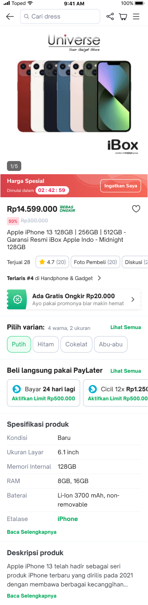

| **Status** |  <!--start status:PURPLE-->DEVELOPMENT<!--end status--> <!--start status:GREEN-->RELEASE<!--end status-->  |
| --- | --- |
| Contributors | [Yovi Eka Putra](https://tokopedia.atlassian.net/wiki/people/62b94558018dea0d40730d06?ref=confluence) [Kelvindo Sutan](https://tokopedia.atlassian.net/wiki/people/5ff2a8fe44065f013f93507c?ref=confluence) [Yehezkiel .](https://tokopedia.atlassian.net/wiki/people/5c94aa7a7792242c8613ad14?ref=confluence)  |
| Product Manager | [Amirul Hadi Wibowo](https://tokopedia.atlassian.net/wiki/people/60bdafb9dae567006894003a?ref=confluence)  |
| Team | [Minion Stuart](https://tokopedia.atlassian.net/people/team/eeba862a-bd9d-472c-b901-415b15b1a37e)  |
| Module type | <!--start status:BLUE-->SUB-FEATURE<!--end status-->  |
| Module Location | `features/merchant/product_detail/info` |

## Table of Contents

<!--toc-->

## Overview

Product Detail Info BottomSheet is a bottom sheet for explain more detail regarding product description.


| <br/> | <br/> |
| --- | --- |


### Background

Simplify product content in product detail page, so that in bottom sheet buyer can more freely to describe regarding they product.


---

## Navigation

1. Open PDP
2. Scroll to Product Detail Info
3. Click `"Baca Selengkapnya"`

## How-to

If you want to use this bottom-sheet, we have provided helper to easy to use


```
ProductDetailInfoHelper.showBottomSheetInfo(
    fragmentActivity: FragmentActivity,
    daggerComponent: ProductDetailComponent?,
    listener: ProductDetailBottomSheetListener,
    p1Data: DynamicProductInfoP1?,
    sizeChartImageUrl: String?,
    infoData: ProductDetailInfoDataModel,
    forceRefresh: Boolean,
    isOpenSpecification: Boolean,
    annotationExtParam: String = ""
)
```


| **Param Name** | **Description** |
| --- | --- |
| `fragmentActivity` | your activity |
| `daggerComponent` | dagger of product detail component |
| `listener` | interface between bottom-sheet to PDP. |
| `sizeCartImageUrl` | image url for guideline image from variant data |
| `infoData` | Data model to annotation type especially if `showBottomSheet` is `true`  |
| `forceRefresh` | if PDP to swipe refresh, so this field should to `true` |
| `isOpenSpecification` | this field will differentiate bottom-sheet item type. |
| `annotationExtParam` | this value from PDP data, usually we will passing to info bottom sheet graphQL, needed BE. |


---

## Tech Stack

Product detail info bottom sheet have a recycler-view to display multiple type item:


| **TYPE** | **SCREENSHOT** | **DATA SOURCE** |
| --- | --- | --- |
| Header | <br/> | `PdpGetDetailBottomSheet.bottomsheetData.componentName='header'` |
| Annotation | <br/> | `PdpGetDetailBottomSheet.bottomsheetData.componentName='detail'`but this data get from`infoData: ProductDetailInfoDataModel` |
| Discussion | <br/> | `PdpGetDetailBottomSheet.discussion` |
| Expandable List | <br/> | `PdpGetDetailBottomSheet.dataShopNotes` |
| Card | <br/> | `PdpGetDetailBottomSheet.bottomSheetData.componentName='custom_info'` |
| Catalog | <br/> | `PdpGetDetailBottomSheet.bottomSheetData.componentName='catalog'` |
| Expandable Image | <br/> | `PdpGetDetailBottomSheet.bottomSheetData.componentName='panduan_ukuran'` |
| Shimmering for product catalog | <br/> | `ProductInfoParcelData.isOpenSpecification = true` |
| Shimmering for product description only | <br/> | `ProductInfoParcelData.isOpenSpecification == false && isCatalog == true` |
| Legacy Shimmering | <br/> | `otherwise this` |

## Data Source


| **Request** | **Response** |
| --- | --- |
| ```query PdpGetDetailBottomSheet($productId:String,$shopId:String,$catalogId:String, $isGiftable:Boolean, $parentId:String, $bottomsheetParam:String){  pdpGetDetailBottomSheet(productID:$productId, shopID:$shopId, catalogID:$catalogId, isGiftable:$isGiftable, parentID:$parentId, bottomsheetParam:$bottomsheetParam){    bottomsheetData{      title      componentName      isApplink      isShowable      value      applink      icon      row {        key        value      }    }    dataShopNotes{      shopNotesData{        shopNotesID        title        content        isTerms        position        url        updateTime        updateTimeUTC      }      error    }    discussion{      title      buttonType      buttonCopy    }    error{      Code      Message      DevMessage    }  }}``` | ```[    {        "data": {            "pdpGetDetailBottomSheet": {                "bottomsheetData": [                    {                        "applink": "",                        "componentName": "header",                        "icon": "",                        "isApplink": false,                        "isShowable": true,                        "row": [],                        "title": "",                        "value": ""                    },                    {                        "applink": "",                        "componentName": "detail",                        "icon": "",                        "isApplink": false,                        "isShowable": true,                        "row": [],                        "title": "Detail produk",                        "value": ""                    },                    {                        "applink": "",                        "componentName": "deskripsi",                        "icon": "",                        "isApplink": true,                        "isShowable": true,                        "row": [],                        "title": "Deskripsi produk",                        "value": ""                    },                    {                        "applink": "",                        "componentName": "panduan_ukuran",                        "icon": "",                        "isApplink": true,                        "isShowable": false,                        "row": [],                        "title": "Panduan ukuran",                        "value": ""                    },                    {                        "applink": "",                        "componentName": "panduan_perawatan",                        "icon": "",                        "isApplink": true,                        "isShowable": false,                        "row": [],                        "title": "Panduan perawatan",                        "value": ""                    },                    {                        "applink": "",                        "componentName": "informasi_penting",                        "icon": "",                        "isApplink": true,                        "isShowable": false,                        "row": [],                        "title": "Informasi penting",                        "value": ""                    }                ],                "dataShopNotes": {                    "error": "",                    "shopNotesData": []                },                "discussion": {                    "buttonCopy": "",                    "buttonType": "",                    "title": "Ada hal lain yang ingin ditanyakan?"                },                "error": {                    "Code": 0,                    "DevMessage": "",                    "Message": ""                }            }        }    }]``` |

## Useful Links

- [Figma](https://www.figma.com/file/oN7uy5TBohqGmuZX1eFnIq/Informasi-Produk%2C-Catalog%2C-Annotation?type=design&node-id=5831-171597&mode=design&t=jumuJNOTEvnm2UVc-0)

