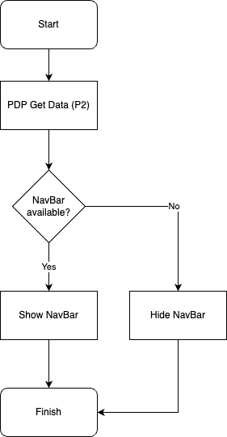
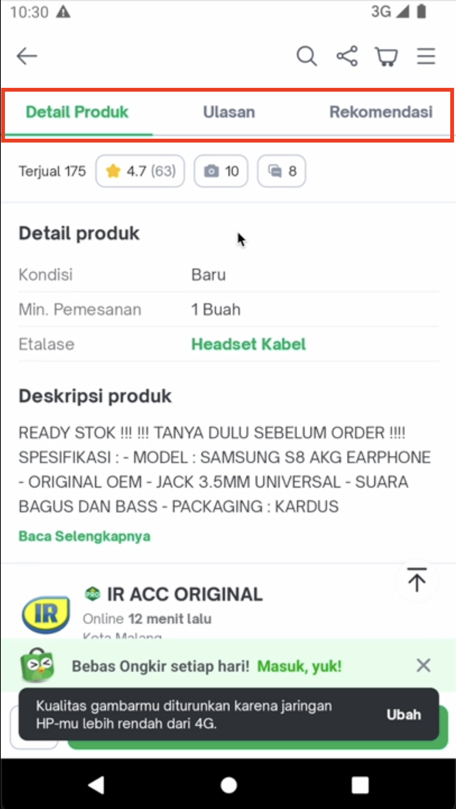

---
Product Detail Navigation
---

| **Status** | <!--start status:GREEN-->RELEASE<!--end status--> |
| --- | --- |
| Contributors | [Kelvindo Sutan](https://tokopedia.atlassian.net/wiki/people/5ff2a8fe44065f013f93507c?ref=confluence)  |
| Product Manager | [Amirul Hadi Wibowo](https://tokopedia.atlassian.net/wiki/people/60bdafb9dae567006894003a?ref=confluence)  |
| Team | [Minion Stuart](/wiki/spaces/PA/pages/812245572/Android+Minion+Stuart) |
| Release date | 11 May 2022 / <!--start status:GREY-->MA-3.175<!--end status--> |
| Module type | <!--start status:YELLOW-->FEATURE<!--end status--> |
| Module Location | `features/merchant/product_detail` |
| PRD | <https://docs.google.com/document/d/1QL4-jhikrtEYOV62wnjwdWYLEBHaGJD_GM2GAvSvxyg/edit?pli=1#>  |

## Table of Contents

<!--toc-->

## Release Notes (max 5 latest release notes)

> - 11 May 2022 (MA-3.175)\
> *Initial Release*

## Overview

### Project Description

Enable user to scroll easily within product detail page. Using navigation tab, user can click then scroll through the targeted content.

## Flow Diagram

## Navigation

Open product detail page, then scroll over product image to show navigation tab.

Click any item to navigate to the content.

1. Navigation Tab visibility depends on the product image.
2. If the product image visible (full or part of it), Navigation Tab is hidden.
3. Else if the product image not visible, Navigation Tab will be show.
4. Click items in Navigation Tab will scroll the product detail to the target.
5. It is possible to miss target when the product detail is first load.
6. When user scroll up, Navigation Tab will be hide temporary.
7. If the user stop scrolling for 2 seconds, the Navigation Tab will be show.
8. While the screen navigate / scroll, user can’t disturb the process.
9. Navigation Tab support 3 or 4 items, controlled by internal tools.

---

## Useful Links

- [Figma](https://www.figma.com/file/jjXOOHLGDbeROy38nBTt1y/PDP-Audit-2022?node-id=504%3A51908)

