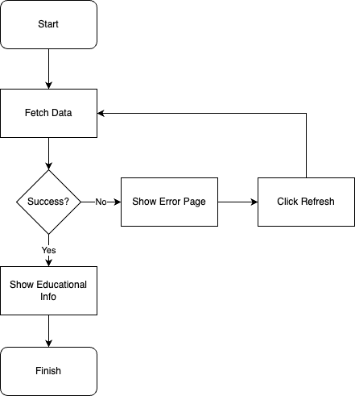
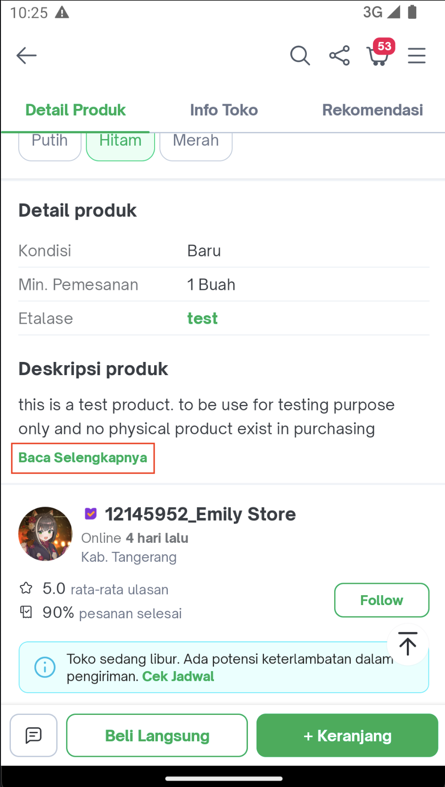
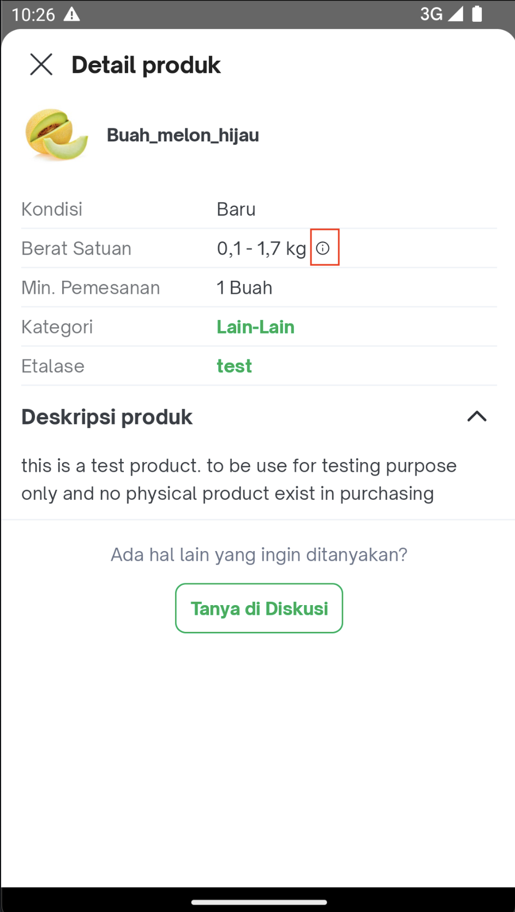
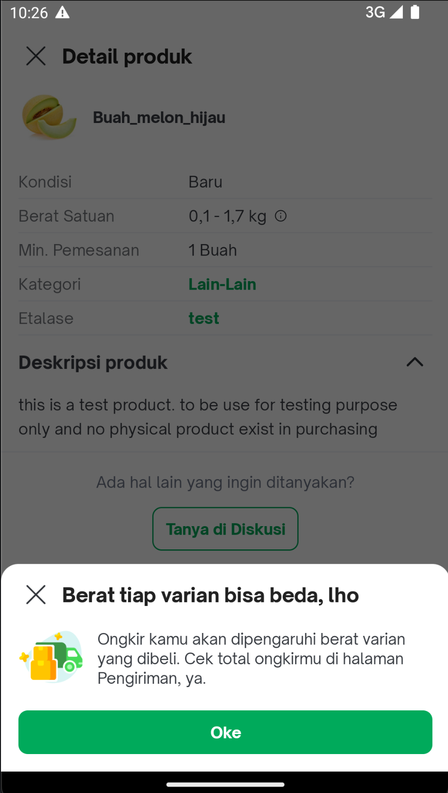

---
Educational Bottom Sheet
---


| Status | <!--start status:GREEN-->RELEASE<!--end status--> |
| --- | --- |
| Contributors | [Yehezkiel .](https://tokopedia.atlassian.net/wiki/people/5c94aa7a7792242c8613ad14?ref=confluence)  |
| Product Manager | [Amirul Hadi Wibowo](https://tokopedia.atlassian.net/wiki/people/60bdafb9dae567006894003a?ref=confluence)  |
| Team | [Minion Stuart](https://tokopedia.atlassian.net/people/team/eeba862a-bd9d-472c-b901-415b15b1a37e) |
| Release date | <!--start status:GREY-->MA-3.179<!--end status-->  |
| Module type | <!--start status:PURPLE-->FEATURE<!--end status--> |
| Module Location | `features/merchant/product_detail_additional_info` |

## Table of Contents

<!--toc-->

## Release Notes

> - 13 June 2022 (MA-3.179)\
> *Initial Release*

## Overview

### Background

We often need a simple bottom sheet that contains information. That’s why we create this educational bottom sheet that the content is based on backend response.

### Project Description

This educational bottom sheet is enable globally within Tokopedia apps. By passing the `type`, it will render the content controlled by BE data.

### Supported Type

Check the documentation from BE [here](/wiki/spaces/~6240e3791da0e1007137cca7/blog/2022/04/18/1943833475/How+to+use+PDP+Educational+Bottomsheet).

## Tech Stack

### GQL


```
query PdpGetEducationalBottomsheet(${'$'}type: String) {
  pdpGetEducationalBottomsheet(type: ${'$'}type){
  title
  description
  icon
  eventCategory
  buttons {
    buttonTitle
    color
    appLink
    webLink
  }
}
```

### ViewStub

The error state will be in view stub. It will lazily render.


```
<ViewStub
  android:id="@+id/base_product_educational_error"
  android:inflatedId="@+id/educational_error"
  android:layout_width="match_parent"
  android:layout_height="wrap_content"
  android:layout="@layout/product_educational_error"
  android:visibility="gone"
  tools:visibility="visible" />
```

## Flow Diagram



## Navigation

One of the feature that using educational bottom sheet; Weight per Variant.


| <br/> | <br/> |
|---------------------------------------|---------------------------------------|
| <br/> | <br/> |

## How-to

### App Link


```
"tokopedia://product-edu/{type}?product_id={product_id}&shop_id={shop_id}"
```


| **Param Name** | **Mandatory** | **Description** | **Example** |
| --- | --- | --- | --- |
| `type` | Yes | Determine content of educational bottom sheet that will be return from BE | `12` |
| `product_id` | No | Additional param for Tracker | `12345` |
| `shop_id` | No | Additional param for Tracker | `12345` |

### Helper

include `product_detail_common` module into your module,

`build.gradle`


```
implementation projectOrAar(rootProject.ext.features.productDetailCommon)
```


```
internal class Foo {
  fun bar(): Bar {
    ProductEducationalHelper.goToEducationalBottomSheet(
      context = context,
      url = url,
      productId = data.basic.productID,
      shopId = data.basic.shopID
    )
  }
}
```


| **Param Name** | **Mandatory** | **Description** | **Example** |
| --- | --- | --- | --- |
| `url` | Yes | The educational bottom sheet applink, with type. | `tokopedia://product-edu/{type}` |
| `product_id` | No | Additional param for Tracker | `12345` |
| `shop_id` | No | Additional param for Tracker | `12345` |


---

## Useful Links

- [Tracker - Multi Location](https://mynakama.tokopedia.com/datatracker/requestdetail/view/3038)

