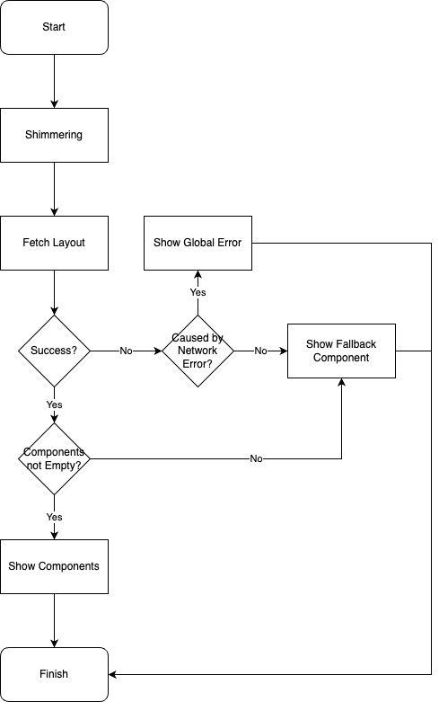
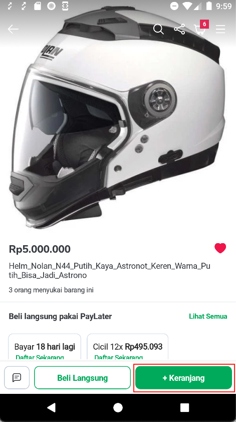
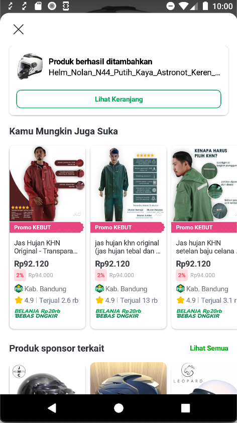

---
Post ATC
---


| **Status** | <!--start status:GREEN-->RELEASE<!--end status--> |
| --- | --- |
| Contributors | [Kelvindo Sutan](https://tokopedia.atlassian.net/wiki/people/5ff2a8fe44065f013f93507c?ref=confluence)  |
| Product Manager | [Amirul Hadi Wibowo](https://tokopedia.atlassian.net/wiki/people/60bdafb9dae567006894003a?ref=confluence)  |
| Team | [Minion Stuart](https://tokopedia.atlassian.net/people/team/eeba862a-bd9d-472c-b901-415b15b1a37e) |
| Release date | <!--start status:GREY-->MA-3.209<!--end status--> <!--start status:GREY-->SA-2.139<!--end status-->  |
| Module type | <!--start status:PURPLE-->FEATURE<!--end status--> |
| Module Location | `features/merchant/product_detail_additional_info` |

## Table of Contents

<!--toc-->

## Release Notes

> - 6 Mar 2023 (MA-3.212/SA-2.142)\
> *Add Fallback Flow, Improve adapter with DiffUtil (*[*PR*](https://github.com/tokopedia/android-tokopedia-core/pull/32026)*)*
> - 13 Feb 2023 (MA-3.209/SA-2.139)\
> *Initial Release (*[*PR*](https://github.com/tokopedia/android-tokopedia-core/pull/31627)*)*

## Overview

### Background

Current post add to cart page have static content. This feature enable dynamic content within post add to cart page. Also make the page can be use globally within Tokopedia Apps.

### Project Description

After finish add to cart, we will serve user with a page that contain message and recommendation.

The bottom sheet using recycler view and each content and position can be adjust from BE.

## Tech Stack

### GQL


```
query $OPERATION_NAME(
  $$PARAM_PRODUCT_ID: String,
  $$PARAM_LAYOUT_ID: String,
  $$PARAM_CART_ID: String,
  $$PARAM_PAGE_SOURCE: String
) {
  pdpGetPostATCLayout(
    $PARAM_PRODUCT_ID: $$PARAM_PRODUCT_ID,
    $PARAM_LAYOUT_ID: $$PARAM_LAYOUT_ID,
    $PARAM_CART_ID: $$PARAM_CART_ID,
    $PARAM_PAGE_SOURCE: $$PARAM_PAGE_SOURCE
  ) {
    name
    basicInfo {
      shopID
      category {
        id
        name
      }
    }
    components {
      name
      type
      data {
        ... on pdpProductPostATCInfo {
          title
          subTitle
          image
          button {
            text
            cartID
          }
        }
      }
    }
  }
}
```

### Adapter Delegate

Post ATC use adapter delegate to make multiple item type in single recycler view. For the details check the documentation [here](https://docs.google.com/presentation/d/1Ay6sIyBK1MBdW-C2s1jm1G5a7ywXPQTM00HxWAiuGMg/edit#slide=id.g63f3db931c_0_66).

### Flow

To optimize UI performance when refreshing / updating list of recycler view items.


```
private const val UI_UPDATE_DEBOUNCE = 200L

private val updateUiJob = launch {
  updateUiFlow.debounce(UI_UPDATE_DEBOUNCE).collect {
    val list: List<PostAtcUiModel> = mapUiModels.values.toList()
    submitList(list)
  }
}
```

Post ATC have asynchronous process for each view holder. That why by using debounce in request update ui job, we can optimize the ui update when there are several request in the short time.

## Flow Diagram



## Navigation


| <br/> | <br/> |
|-----------------------------------------|-----------------------------------------|

## How-to

### App Link


```
"tokopedia://post-atc/{product_id}?cartID={cart_id}&layoutID={layout_id}&pageSource={page_source}"
```


| **Param Name** | **Mandatory** | **Description** | **Example** |
| --- | --- | --- | --- |
| `product_id` | Yes | ID that specify which product to get the detail. This paramater will be passed to the back-end. | `12345` |
| `cart_id` | No | ID from doATC. This parameter will be pass to cart when user choose to check cart. | `12345` |
| `layout_id` | No | ID of layout. This ID will control the dynamic layout in Post ATC. | `1234` |
| `page_source` | No | Information of where post atc used/called. The string for tracker purpose | `product detail page` |

### Helper

include `product_detail_common` module into your module,

`build.gradle`


```
implementation projectOrAar(rootProject.ext.features.productDetailCommon)
```


```
internal class Foo {
  fun bar(): Bar {
    PostAtcHelper.start(
      context, // Context
      basicInfo.productID, // Product ID
      cartId = cartId,
      pageSource = PostAtcHelper.Source.PDP, // Use Constant from Helper
      layoutId = basicInfo.postAtcLayout.layoutId
    )
  }
}
```


---

## Useful Links

- [Figma](https://www.figma.com/file/50NBvyL7Paanp3vR8jVqM1/Post-ATC?node-id=278%3A62730&t=Z2n7EvKCVupWB1kb-0)
- [Tracker](https://mynakama.tokopedia.com/datatracker/requestdetail/view/3711)

