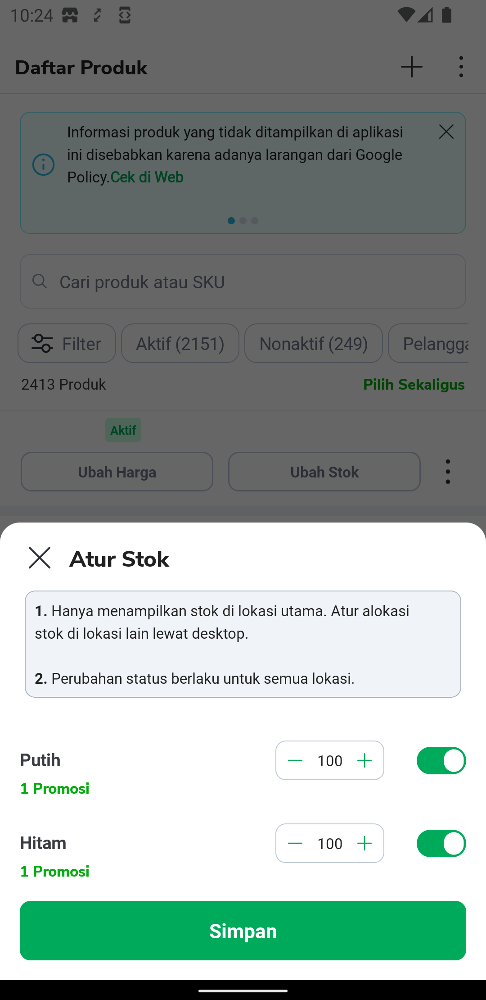

| **Status** |  <!--start status:GREEN-->RELEASE<!--end status-->  |
| --- | --- |
| Contributors | [Edwin Nurwansyah](https://tokopedia.atlassian.net/wiki/people/622e71a875f257006a98bab9?ref=confluence)  |
| Team | [Minion Stuart](https://tokopedia.atlassian.net/people/team/eeba862a-bd9d-472c-b901-415b15b1a37e) (2020-2022 ) [Minion Ken](https://tokopedia.atlassian.net/people/team/0ac7bdd0-19b2-4196-8711-b1a0a4b07178) (Now) |
| Release date | 2020 |
| Module type |  <!--start status:YELLOW-->FEATURE-COMMON<!--end status--> |
| Module Location | `features/merchant/product_manage_common` |

## Table of Contents

<!--toc-->

## Overview

Product manage common is a common module that consists of several helper such as constant, data model, use case , etc, that is related to the product manage journey on tokopedia

## How-to Implement Module

To include this common module, you can the dependency below on your module:


```
  implementation projectOrAar(rootProject.ext.features.productManageCommon)
```

## What’s inside this module?

### A. Usecase


| **Class Name** | **For More Detail** |
| --- | --- |
| `ClearAllDraftProductsUseCase` | <https://docs.google.com/spreadsheets/d/1Xcq_gQXHVNynz37eFuOIWLv8x21jN6bhztQOcMOjwdc/edit#gid=0>  |
| `GetAllDraftProductsCountFlowUseCase` |
| `GetStatusShopUseCase` |
| `GetProductListMetaUseCase` |
| `GetProductManageAccessUseCase` |
| `EditStatusUseCase` |
| `GetUploadStatusUseCase` |
| `ClearUploadStatusUseCase` |
| `SetUploadStatusUseCase` |
| `EditProductVariantUseCase` |
| `GetProductVariantUseCase` |

### B. ViewModel


| **Class Name** | **Purpose** |
| --- | --- |
| `QuickEditVariantViewModel` | Manage Variant Product |
| `ProductManageQuickEditStockViewModel` | Manage Non-Variant Product |

### C. Tracking


| **Class Name** |
| --- |
| `ProductManageTracking` |

### C. User Interface


| **UI** | **Class Name** |
| --- | --- |
| <br/>Edit Stock Single Product | `ProductManageQuickEditStockFragment` |
| <br/>Edit Stock Product Variant | `QuickEditVariantStockBottomSheet` (parent: `QuickEditVariantBottomSheet`) |

## What modules depend on module Product Common?

- Topchat
- Product Add Edit
- Product Manage List
- Seller Menu

## Useful Links

#### A. Mapping Application Usecase and GQL in the feature ([link](https://docs.google.com/spreadsheets/d/1Xcq_gQXHVNynz37eFuOIWLv8x21jN6bhztQOcMOjwdc/edit?usp=sharing))

