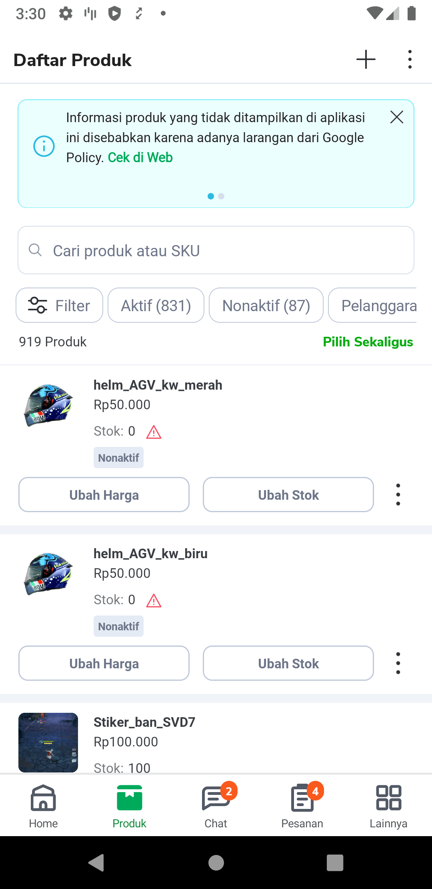
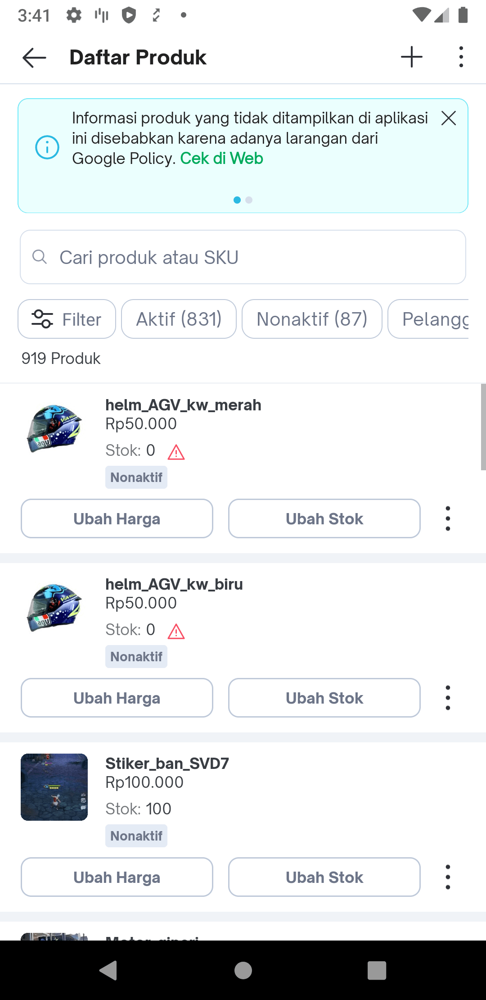
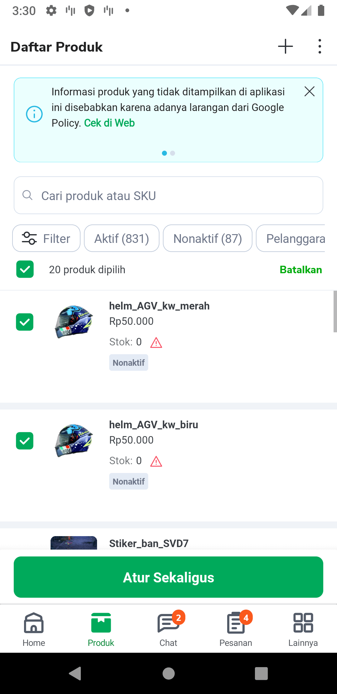
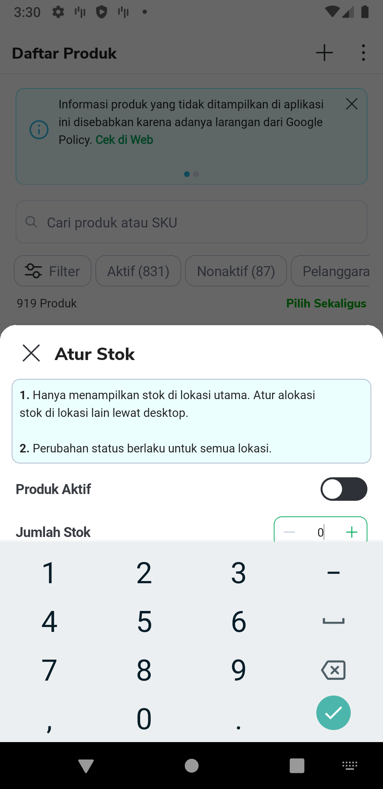
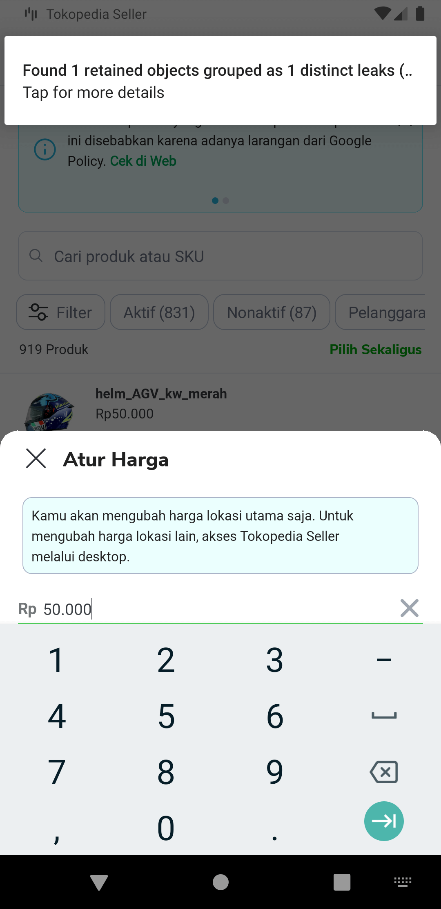
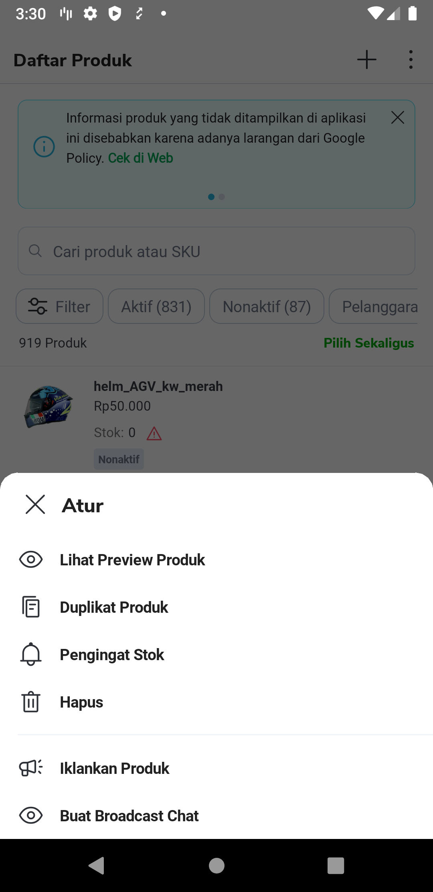
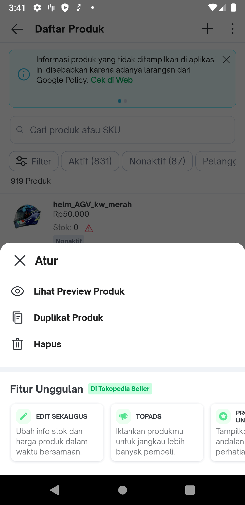
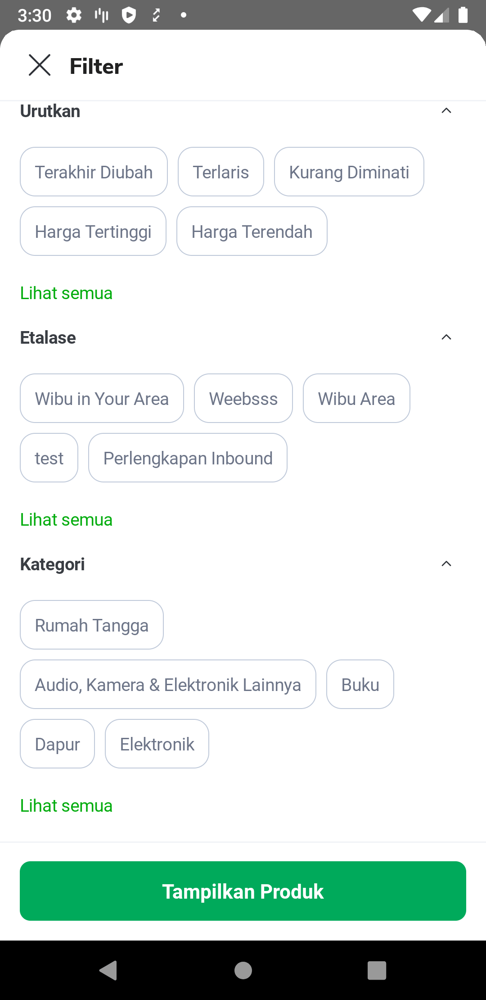

| **Status** | <!--start status:GREEN-->RELEASE<!--end status-->  |
| --- | --- |
| Contributors | [REIVIN OKTAVIANUS](https://tokopedia.atlassian.net/wiki/people/5dae89dab86cd40c2da5ad2f?ref=confluence) [Edwin Nurwansyah](https://tokopedia.atlassian.net/wiki/people/622e71a875f257006a98bab9?ref=confluence)  |
| Product Manager | [Valeri Monica](https://tokopedia.atlassian.net/wiki/people/62535a2862802600683df305?ref=confluence) [Abdul Mukhlis (Unlicensed)](https://tokopedia.atlassian.net/wiki/people/621d51a459c0740069d6e7f3?ref=confluence) [Achmad Fahlevi](https://tokopedia.atlassian.net/wiki/people/5ff2a7ff1051d10075798c01?ref=confluence)  |
| Team | [Minion Stuart](https://tokopedia.atlassian.net/people/team/eeba862a-bd9d-472c-b901-415b15b1a37e) (2020 -2023) [Minion Ken](https://tokopedia.atlassian.net/people/team/0ac7bdd0-19b2-4196-8711-b1a0a4b07178) (Current) |
| Release date | 03 April 2020 |
| Module type | <!--start status:YELLOW-->FEATURE<!--end status-->  |
| Product PRD | 1. [Manage Product Revamp](https://tokopedia.atlassian.net/wiki/spaces/MC/pages/551715709) 2. [Notifyme](https://tokopedia.atlassian.net/jira/software/c/projects/AN/issues/AN-40460) 3. [Product Suspend](https://tokopedia.atlassian.net/jira/software/c/projects/AN/issues/AN-35814) 4. [Bulk Stock Alert](https://tokopedia.atlassian.net/jira/software/c/projects/AN/issues/AN-35813) 5. [Stock Available](https://tokopedia.atlassian.net/jira/software/c/projects/AN/issues/AN-43888)  |
| Module Location |  `features/merchant/product_manage` |

## Table of Contents

<!--toc-->

## Overview

Product manage list is module for product manage feature. This module consists of several sub features. they are stock reminder, bulk edit, filter, edit stock, edit price, product preview, delete product, duplicate product, advertise products, broadcast chat and make superior products. You can also see about the feature, GQL Call and etc in this [link](https://docs.google.com/spreadsheets/d/1Xcq_gQXHVNynz37eFuOIWLv8x21jN6bhztQOcMOjwdc/edit?usp=sharing)

| **Seller App** | **Main App** |
| --- | --- |
|   |   |
|   | ❌ Not Support in Main App |
|   |   |
|   |   |
|   |   |
|   |   |

## Navigation

| **Seller App** | **Main App** |
| --- | --- |
|   |   |

<!--left header table-->
| Applink Development  | Main Page: `tokopedia-android-internal://marketplace/product-manage-list` `tokopedia-android-internal://marketplace/product-manage-list?search=[value]` `tokopedia-android-internal://marketplace/product-manage-list?filter=[id_filter]` Stock Reminder: `tokopedia-android-internal://marketplace/stock-reminder/{productId}/{title}/{isVariant}` |
| --- | --- |
| Applink Production  | Main Page Product Manage SellerApp: `sellerapp://product/manage` `sellerapp://product/manage?search=[value]` `sellerapp://product/manage?filter=[id_filter]` Main Page Product Manage MainApp : `tokopedia://seller/product/manage` `tokopedia://seller/product/manage?search=[value]` `tokopedia://seller/product/manage?filter=[id_filter]` Stock Reminder Page Seller App: `sellerapp://stock-reminder/{productId}/{title}/{isVariant}` |

## Additional Information

- **Hierarchy Icon Flag in Item Product List**

| **Name** | **Icon** | **Hierarchy** | **Jira Task** | **Read Field in GQL** |
| --- | --- | --- | --- | --- |
| Notify me OOS |   | 1 | <https://tokopedia.atlassian.net/jira/software/c/projects/AN/issues/AN-40460> | `haveNotifyMeOOS` |
| OOS |   | 2 | <https://tokopedia.atlassian.net/jira/software/c/projects/AN/issues/AN-35814> | `suspendLevel` || `isEmptyStock && status` |
| Stock Below min Threshold Stock Alert |   | 3 | <https://tokopedia.atlassian.net/jira/software/c/projects/AN/issues/AN-35813> | `stockAlertActive` |
| Stock Alert On |   | 4 | <https://tokopedia.atlassian.net/jira/software/c/projects/AN/issues/AN-35813> | `hasStockAlert` |

- **Icon Identifier in Item Product List**

| **Name** | **Icon** | **Jira Task** | **Field GQL** |
| --- | --- | --- | --- |
| Stock Available |  | <https://tokopedia.atlassian.net/jira/software/c/projects/AN/issues/AN-43888> |  |

- **Ticker**

Product manage have 2 type ticker. They are Ticker Dynamic and Ticker Static. Different Dynamic Ticker and Static Ticker is Dynamic Ticker product owner can set ticker in intools and we don’t need development in android side. Different with Dynamic Ticker, Static ticker need developmend from android,because it has to be set through the code. Developer can set static ticker in `TickerProvider` Class. Currently, Product Manage Page have 2 static ticker. They are static ticker for info **multi location shop** and static ticker for **shop moderated** (when this ticker appear, no others ticker appears)

- **Filter**

Trigger for filter need to set static in code. When we add filter, we must add id filter in `ProductManageFilterMapper`  class.

- **Product Tobacco Prevention**

Product manage android not allowed from playstore to show product tobacco. So, user can’t see and manage product tobacco.

| **Name** | **Link** | **Note** |
| --- | --- | --- |
| Jira Task | <https://tokopedia.atlassian.net/jira/software/c/projects/AN/issues/AN-45183> |  |
| Figma | <https://www.figma.com/file/69z5R8LDOZOBth7ypoAia5/%5BUI-M-IMS%5D-Manage-Product-Master-Android?node-id=7137%3A199402&t=u7fqSW5k1iXGXLfE-0>  | Option 2 |
| GQL | <https://tokopedia.atlassian.net/wiki/spaces/MC/pages/656903551/GQL+ProductList#Manage-Product-Data>  | use field `isTobacco` |

## Useful Links

#### A. GQL Docs ([link](https://docs.google.com/spreadsheets/d/1Xcq_gQXHVNynz37eFuOIWLv8x21jN6bhztQOcMOjwdc/edit#gid=442699360))

#### B. Implementation Usecase and GQL in the feature ([link](https://docs.google.com/spreadsheets/d/1Xcq_gQXHVNynz37eFuOIWLv8x21jN6bhztQOcMOjwdc/edit?usp=sharing))

