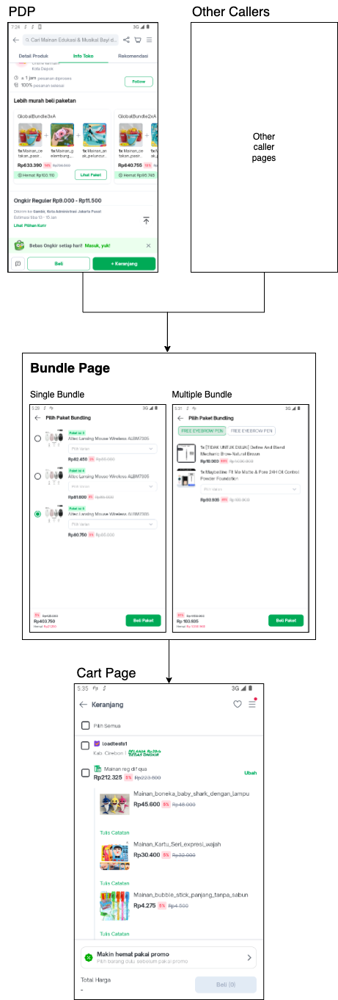

| **Status** | <!--start status:GREEN-->RELEASE<!--end status--> |
| --- | --- |
| Contributors | [Faisal Ramdani](https://tokopedia.atlassian.net/wiki/people/5def016f73b0bd0e4d82fa6e?ref=confluence) [YOHANN Prananta (Unlicensed)](https://tokopedia.atlassian.net/wiki/people/5de4eab04ae7b80d0d19f990?ref=confluence)  |
| Product Manager | [Nur Fasya Febriarti](https://tokopedia.atlassian.net/wiki/people/5d943b8ae610e60dd0602ae0?ref=confluence)  |
| Team | [Minion Ken](https://tokopedia.atlassian.net/people/team/0ac7bdd0-19b2-4196-8711-b1a0a4b07178) |
| Release date | 2021 |
| Module type | Product Bundling <!--start status:YELLOW-->FEATURE<!--end status-->Add On Bottom Sheet <!--start status:BLUE-->SUB-FEATURE<!--end status--> |
| Product PRD | [PRD - Product Bundling [E2E Experience]](/wiki/spaces/TMA/pages/1638927076)  |
| BRD | <https://docs.google.com/document/d/1jyWYGCnWocVlOwQgR8y9bvBASR39sTj6HExzbeiVSZg/edit#heading=h.jcecn7dsawd4> <https://docs.google.com/document/d/10ygGH9lT-xikR1iy94pLLSwDyaGOHGcLPzRc2Pe3_3A/edit> (Hampers/ Add On Bottom Sheet) |
| Module Location |  `features/merchant/product_service_widget` |

## Table of Contents

<!--toc-->

## Release Notes (max 5 latest release notes)

<!--start expand:3 Jan (MA-3.202)-->
*- Add new parameter for Sorting Bundling Widget*  
- Product Bundling New Improvement UI - BSP Multi/ Custom Quantity Handling
<!--end expand-->

## Overview

Product Bundling is one of the most common methods a seller uses to uplift their sales. To ease user to discover bundling products, we proposed to develop Bundling as a promotional tool which will enable sellers to add multiple products and sell them as a bundle.

### Background

Product Bundling is one of the most common methods a seller uses to uplift their sales. In order to have a bundling scheme, currently sellers in Tokopedia are creating a new SKU manually and input the new image, product name, description, promotion price, and other product information for each package—identified as a hard bundling method. This hard bundling strategy has been used by 1.3 million merchants with estimated ~15 mio products created with a total of 300 billion TIV generated in a month.  

However, we found that creating a hard bundling causes new challenges and limitations to our seller and buyers. For sellers, it will be a high operational cost to create and maintain a bundled product since the stock and other product attributes are not synchronized with the main product. For the buyers, finding and purchasing a bundled promotion becomes a challenge since there is no clear information about the bundling promotion and the visibility on the benefit on our current system beside the product name, description, and product price that is modified by each seller ([Appendix 3](https://docs.google.com/document/d/1jyWYGCnWocVlOwQgR8y9bvBASR39sTj6HExzbeiVSZg/edit#heading=h.5phkm0i7iv41)), resulting in a difficulty to discover bundling products.

Hence, we proposed to develop Bundling as a promotional tool which will enable sellers to add multiple products and sell them as a bundle which offer a lower price as an added-value, while still giving them flexibility to sell the products individually.

#### Project Description

Bundling as a promotional tool which will enable sellers to add multiple products and sell them at once as a bundle. There are two side of development of this project, including:

##### *Buyers*

*Enable buyers to purchase product on bundle level (Only Android and IOS)*

##### *Sellers*

*Enable sellers to create a virtual bundling based on existing products (Only Desktop)*

## Tech Stack

- Dagger
- Livedata
- mockk
- GQL
- MVVM
- KOTLIN

## Flow Diagram

This diagram shows how bundling page work flow.

## Navigation

This navigation shows how user select product bundling from caller page until add it into the cart.

## How-to

This module contain 3 re-usable components, here is the manual link for each component:

1. Bundling Selection Page

	- **Manual link:** [Product Service Widget/ Bundle Selection Page](/wiki/spaces/PA/pages/1972207757) **(Point number 1)**
2. Product Bundle Widget

	- **Manual Link:** [Product Bundling Global Widget](/wiki/spaces/PA/pages/2012219235/Product+Bundling+Global+Widget)
3. Hampers/ Addon Bottomsheet

	- **Manual Link:** [Product Service Widget/ Bundle Selection Page](/wiki/spaces/PA/pages/1972207757) **(Point number 2)**

---

## Action Items

This module has action item that can be visit here:

<https://docs.google.com/document/d/1853gzFyPQ_86b7L1Iho6epPd5jWscCfBRB20LPavBSA/edit#heading=h.rhtinuvosc6z> 

## Useful Links

- [Figma - Bundling Selection Page (BSP)](https://www.figma.com/file/zBTHW6g31a47ddYugMXU6U/Product-Bundling-Buyer-Experience)
- [Figma - Bundling Widget](https://www.figma.com/file/HWGJ8utksSzyWzss0iK3pe/Bundling-Improvement---Buyer?node-id=1052%3A130503&t=uB0G04Q4NIdMHlIk-0)
- [Figma - Hampers/ Add On Edu Bottom Sheet](https://www.figma.com/file/MHzmKboRV0ogvd8JPpfSbK/Gifting-Projects?t=wOELglMiBYuQRix8-0)
- [Thanos - Bundling Selection Page (BSP)](https://mynakama.tokopedia.com/datatracker/requestdetail/view/2032)
- [Thanos - Bundling Widget](https://mynakama.tokopedia.com/datatracker/requestdetail/view/2032)
- [Thanos - Hampers/ Add On Edu Bottom Sheet](https://mynakama.tokopedia.com/datatracker/product/requestdetail/view/2737)

## FAQ

<!--start expand:How can I request new pageSource for applink?-->
You can request on the PIC slack
<!--end expand-->

