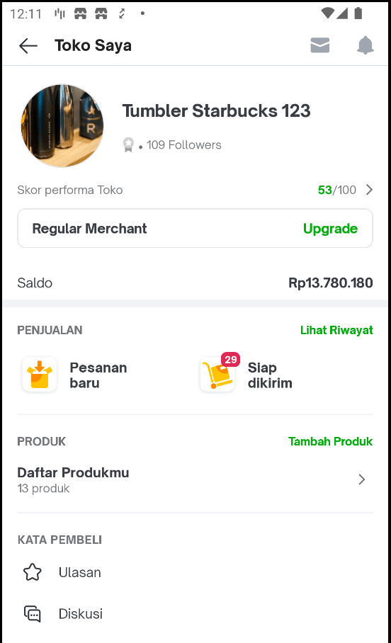
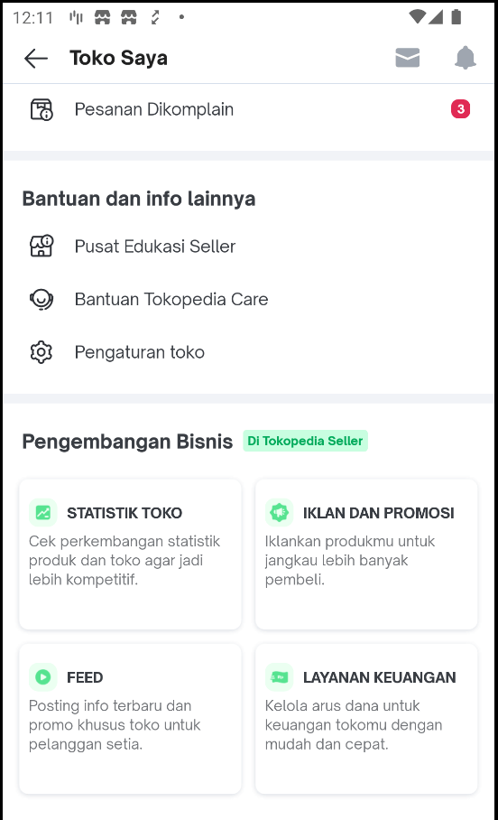
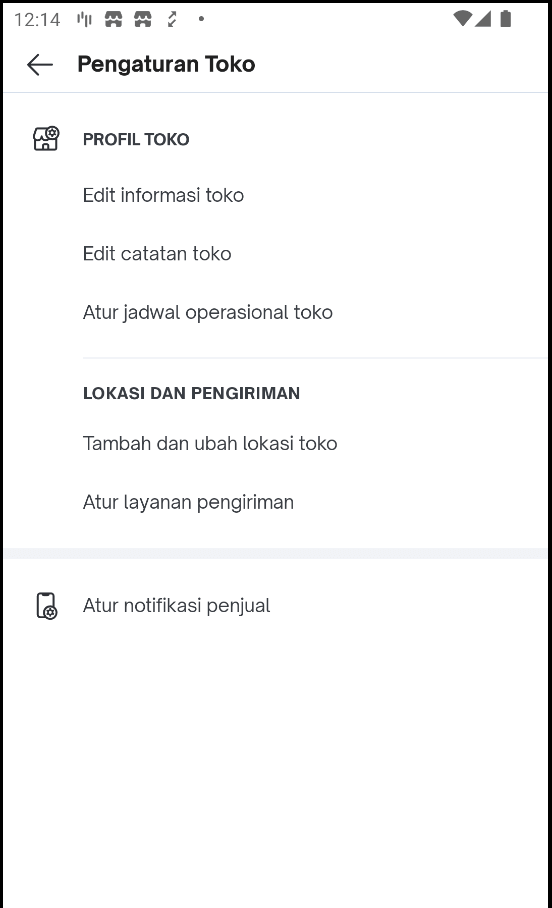
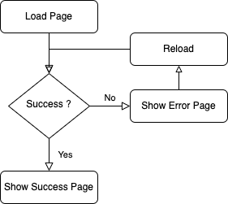
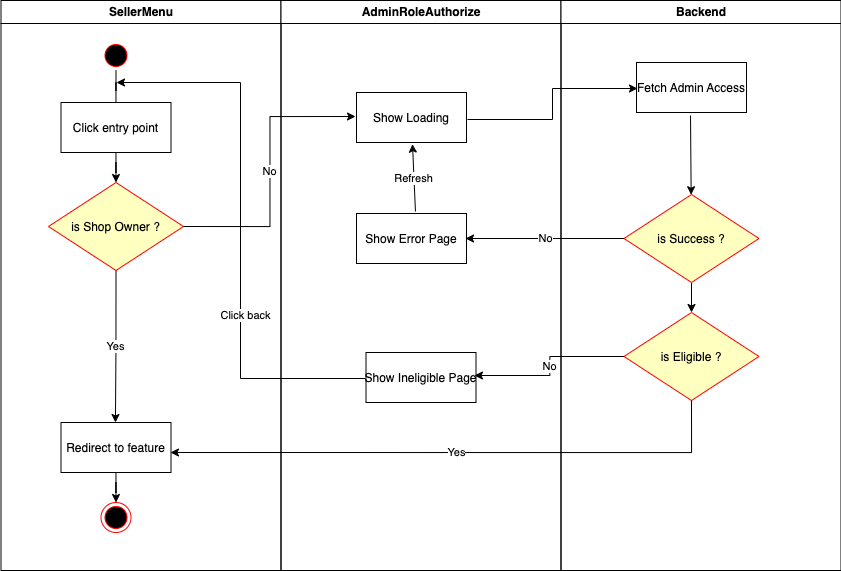
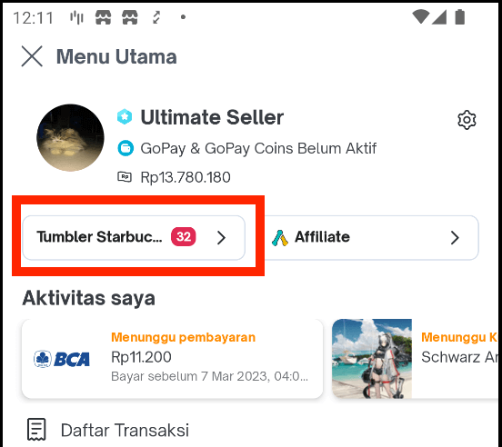

| Status | <!--start status:GREEN-->RELEASE<!--end status--> |
| --- | --- |
| Module type | <!--start status:BLUE-->FEATURE<!--end status--> |
| PRD Link | <https://docs.google.com/presentation/d/1xisbKtxyaATcj2vv7Dx-os7USeafD7dbwYWE-oM1yx0/edit#slide=id.g8c1dbf4580_0_0>  |
| Module Location | `features.merchant.seller_menu` |
| Module | `implementation projectOrAar(rootProject.ext.features.sellerMenu)` |
| Team | [Minion Stuart](https://tokopedia.atlassian.net/people/team/eeba862a-bd9d-472c-b901-415b15b1a37e) ([REIVIN OKTAVIANUS](https://tokopedia.atlassian.net/wiki/people/5dae89dab86cd40c2da5ad2f?ref=confluence) [Ilham .](https://tokopedia.atlassian.net/wiki/people/5de4d2148743750d00b7cc12?ref=confluence) [Yusuf Hendrawan](https://tokopedia.atlassian.net/wiki/people/5df336f3f4ab290ecfc64169?ref=confluence) [Rizqi Aryansa](https://tokopedia.atlassian.net/wiki/people/5e25ee87006fae0ca232e1ac?ref=confluence)), [Edwin Nurwansyah](https://tokopedia.atlassian.net/wiki/people/622e71a875f257006a98bab9?ref=confluence) , [Reza Gama Hidayat](https://tokopedia.atlassian.net/wiki/people/5def15952702bc0ec7e775c5?ref=confluence)  |
| Product Manager | [Falih Hermon Putra (Unlicensed)](https://tokopedia.atlassian.net/wiki/people/5d092faf11233f0c4ca08f00?ref=confluence)  |

## Table of Contents

- [Table of Contents](https://tokopedia.atlassian.net/wiki/spaces/PA/pages/2183596165/Template+Module+Name+A+Short+description+highlight#Table-of-Contents)
- [Release Notes](https://tokopedia.atlassian.net/wiki/spaces/PA/pages/2183596165/Template+Module+Name+A+Short+description+highlight#Release-Notes)
- [Overview](https://tokopedia.atlassian.net/wiki/spaces/PA/pages/2183596165/Template+Module+Name+A+Short+description+highlight#Overview)
- [Tech Stack](https://tokopedia.atlassian.net/wiki/spaces/PA/pages/2183596165/Seller+Menu#Tech-Stack)
- [Flow Diagram](https://tokopedia.atlassian.net/wiki/spaces/PA/pages/2183596165/Template+Module+Name+A+Short+description+highlight#Flow-Diagram)
- [Navigation](https://tokopedia.atlassian.net/wiki/spaces/PA/pages/2183596165/Template+Module+Name+A+Short+description+highlight#Navigation)
- [How-to](https://tokopedia.atlassian.net/wiki/spaces/PA/pages/2183596165/Template+Module+Name+A+Short+description+highlight#How-to)
- [Useful Links](https://tokopedia.atlassian.net/wiki/spaces/PA/pages/2183596165/Template+Module+Name+A+Short+description+highlight#Useful-Links)

## Release Notes

<!--start expand:11 September 2020-->
[AN-19616](https://tokopedia.atlassian.net/browse/AN-19616)
 -
<!--end expand-->

## Overview


|  Seller Menu Top Cut <br/> |  Seller Menu Bottom Cut <br/> |  Seller Menu Setting <br/> |
|------------------------------------------------------------|------------------------------------------------------------------|------------------------------------------------------------|

The Seller Menu module contains page that shows main seller informations, such as:

- Shop Avatar
- Shop Name
- Shop Badge
- Shop Followers
- Shop Score
- Shop Status
- Balance
- Order Counts
- Product Count

Other than these informations, seller menu page also provides entry points for main settings for seller.   
  
However, seller menu doesn’t provide complete informations and entry points for seller that are available right now in the Tokopedia ecosystem. Sellers will need to use our Tokopedia Seller app to access more complete seller features. To inform sellers about that, this page also shows small detail of features that are available right now in Tokopedia Seller. Despite that, it’s needed to be informed that the most complete feature for sellers are all available in Desktop platform.

This page also has a capability to handle different admin roles. Admins can only access their respective roles and will block restricted feature upon clicking the entry points by fetching the access info remotely.

## Tech
 Stack

### GQL List


| **No** | **GQL Query/Mutation Name** | **Purpose** |
| --- | --- | --- |
| 1 | `balance` | get balance info (Saldo) |
| 2 | `reputation_shops` | get reputation badge info (image url) |
| 3 | `shopInfoByID` | get shop info, such as:- followers count<br/>- shop status info (PM, OS, etc)<br/> |
| 4 | `userShopInfo` | get shop created date |
| 5 | `goldGetPMSettingInfo` | get Power Merchant setting info, such as:- get PM Pro period<br/>- is eligible PM<br/>- is eligible PM Pro<br/> |
| 6 | `ProductListMeta` | get Product List counts |
| 7 | `notifications` | get seller order notification counts |

## Flow Diagram



Main Flow



Admin Authorization Flow

## Navigation

To access Seller Menu, seller will need to click the seller button in Main Nav page



## How-to

To access seller menu, we can only use internal applink


```
tokopedia-android-internal://sellerapp/seller-menu
```

## Useful Links

- [Figma](https://www.figma.com/file/gfPH8X33xtuOAkg7apU8I1/%F0%9F%92%A3-%5BUI%2FUX-M%5D-SA---Migration-v.2?node-id=1478%3A44690&t=yfISVUwtVPzurVUl-0)
- [PRD](https://docs.google.com/presentation/d/1xisbKtxyaATcj2vv7Dx-os7USeafD7dbwYWE-oM1yx0/edit#slide=id.g8c1dbf4580_0_0)
