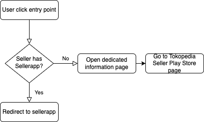
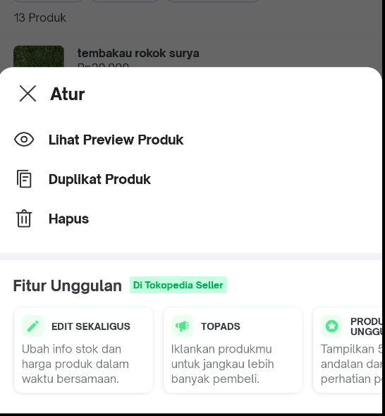

| **Status** | <!--start status:GREEN-->RELEASE<!--end status--> |
| --- | --- |
| Module type<br/> | <!--start status:BLUE-->COMMON<!--end status--> |
| Module Location<br/> | `features.merchant.seller_migration_common` |
| Module | `implementation projectOrAar(rootProject.ext.features.sellerMigrationCommon)` |
| Release date | <!--start status:GREY-->MA-3.87<!--end status--> <!--start status:GREY-->SA-2.17<!--end status--> |
| Team | [Minion Stuart](https://tokopedia.atlassian.net/people/team/eeba862a-bd9d-472c-b901-415b15b1a37e) |
| Contributors | [REIVIN OKTAVIANUS](https://tokopedia.atlassian.net/wiki/people/5dae89dab86cd40c2da5ad2f?ref=confluence) [Ilham .](https://tokopedia.atlassian.net/wiki/people/5de4d2148743750d00b7cc12?ref=confluence) [Yusuf Hendrawan](https://tokopedia.atlassian.net/wiki/people/5df336f3f4ab290ecfc64169?ref=confluence) [Rizqi Aryansa](https://tokopedia.atlassian.net/wiki/people/5e25ee87006fae0ca232e1ac?ref=confluence) [Reza Gama Hidayat](https://tokopedia.atlassian.net/wiki/people/5def15952702bc0ec7e775c5?ref=confluence)  |
| Product Manager | [Falih Hermon Putra (Unlicensed)](https://tokopedia.atlassian.net/wiki/people/5d092faf11233f0c4ca08f00?ref=confluence)  |

## Table of Contents

- [Table of Contents](https://tokopedia.atlassian.net/wiki/spaces/PA/pages/2183631314/Template+Module+Name+A+Short+description+highlight#Table-of-Contents)
- [Release Notes](https://tokopedia.atlassian.net/wiki/spaces/PA/pages/2183631314/Template+Module+Name+A+Short+description+highlight#Release-Notes)
- [Overview](https://tokopedia.atlassian.net/wiki/spaces/PA/pages/2183631314/Template+Module+Name+A+Short+description+highlight#Overview)
- [Flow Diagram](https://tokopedia.atlassian.net/wiki/spaces/PA/pages/2183631314/Template+Module+Name+A+Short+description+highlight#Flow-Diagram)
- [Navigation](https://tokopedia.atlassian.net/wiki/spaces/PA/pages/2183631314/Template+Module+Name+A+Short+description+highlight#Navigation)
- [How-to](https://tokopedia.atlassian.net/wiki/spaces/PA/pages/2183631314/Template+Module+Name+A+Short+description+highlight#How-to)
- [Useful Links](https://tokopedia.atlassian.net/wiki/spaces/PA/pages/2183631314/Template+Module+Name+A+Short+description+highlight#Useful-Links)

## Release Notes

<!--start expand:Phase 2: 7 August 2020 (MA-3.87, SA-2.17)-->
[AN-18745](https://tokopedia.atlassian.net/browse/AN-18745)
 -
<!--end expand-->

<!--start expand:Phase 3: 7 August 2020 (MA-3.96)-->
[AN-19754](https://tokopedia.atlassian.net/browse/AN-19754)
 -
<!--end expand-->

## Overview

Seller Migration Common is a common module that handle redirection from Main app to Sellerapp. The term migration is used to emphasize its purpose, which is to nudge sellers which still uses main app only to use Tokopedia Seller instead. This aligned to our mission to reduce application size in mainapp and put other niche seller features in Tokopedia Seller instead. However, there will still be seller features in main app, which are the main and important ones.

This module serve two purposes, which are:

- For sellers without Tokopedia Seller installed, it provides a dedicated page that displays advantages of using sellerapp. It also provides entry point into Tokopedia Seller Play Store page.
- For sellers with Tokopedia Seller installed, it will handle redirection to those specific pages in sellerapp.


|  Seller Migration Dedicated Page (Top Cut) <br/> |  Seller Migration Dedicated Page (Bottom Cut) <br/> |
|---------------------------------------------------------------------------------------|---------------------------------------------------------------------------------------------|

## Flow Diagram



## Navigation

There are numerous ways to activate seller migration function. These often found on the seller related pages that still exist in Tokopedia Main App, such as Seller chat, product manage, etc.


Entry point to seller migration in Chat Setting



Entry point to seller migration in Product Manage

## How-to

### Using Intent

To access or use Seller Migration feature using intent, please import this module into your build.gradle 


```
implementation projectOrAar(rootProject.ext.features.sellerMigrationCommon)
```

After that, create the intent using 


```
SellerMigrationActivity.createIntent(context, featureName, screenName, appLinks)
```


| **Param Name** | **Mandatory** | **Description** | **Example** |
| --- | --- | --- | --- |
| `context` | Yes | Context of the calling intent |  |
| `featureName` | Yes | Name of the feature that this applink will redirect to. Mainly it only used as requirement for tracker. However, you can include extra handling logic. | `template_chat` |
| `screenName` | Yes | Name of the screen name of the origin page that call this intent. Mainly it only used as requirement for tracker. However, you can include extra handling logic. | `broadcast_chat` |
| `appLinks` | Yes | List of multiple applink stack that should be redirected using this intent. This is used to preserve natural flow of user journey. | `[ApplinkConst.Seller.HOME, ApplinkConst.Seller.PRODUCT_MANAGE]` |

### Using Applink

If you don’t want to import this module, you can always use Seller Migration applink. 

`tokopedia://seller/seller-migration`


| **Param Name** | **Mandatory** | **Description** | **Example** |
| --- | --- | --- | --- |
| `feature_name` | No | Name of the feature that this applink will redirect to. Mainly it only used as requirement for tracker. However, you can include extra handling logic. | `template_chat` |

## Useful Links

- [Figma](https://www.figma.com/file/gfPH8X33xtuOAkg7apU8I1/Seller-App-Migration-v.2?node-id=696%3A1)
- [PRD](https://docs.google.com/presentation/d/1xisbKtxyaATcj2vv7Dx-os7USeafD7dbwYWE-oM1yx0/edit#slide=id.g8c352a1d7e_5_23)
- [Data Layer](https://docs.google.com/spreadsheets/d/1AZjuQ_dg25EvEEWmE8MPMo0f1_DT4IyZPaNpt4cxidA/edit#gid=868838969)
- [Test Case](https://docs.google.com/spreadsheets/d/1VzUnTjrbXMDcwfk5jMq0CXz-TE9tQJVu7Vs7qmUcyE0/edit#gid=1777964216)
