| **Status** | <!--start status:PURPLE-->DEVELOPMENT<!--end status--> |
| --- | --- |
| **Project Lead** | [Yogie Susdyastama Putra](https://tokopedia.atlassian.net/wiki/people/5c6bf2e6f1a05835f933bf30?ref=confluence) [CALVYN JULIAN](https://tokopedia.atlassian.net/wiki/people/5d1adf49cdf26a0d349c76ec?ref=confluence)  |
| Contributor | [Yuda Eka Putra](https://tokopedia.atlassian.net/wiki/people/6253583e9770e600716830da?ref=confluence) [Fajar Chaeril Azhar](https://tokopedia.atlassian.net/wiki/people/618873e3c23a4f006969b0de?ref=confluence) [Faisal Ramdani](https://tokopedia.atlassian.net/wiki/people/5def016f73b0bd0e4d82fa6e?ref=confluence) [CALVYN JULIAN](https://tokopedia.atlassian.net/wiki/people/5d1adf49cdf26a0d349c76ec?ref=confluence) [Yogie Susdyastama Putra](https://tokopedia.atlassian.net/wiki/people/5c6bf2e6f1a05835f933bf30?ref=confluence)  |
| Product Manager | [Ike Agustine Rintami](https://tokopedia.atlassian.net/wiki/people/60bdafd1a01e11006aa716c8?ref=confluence)  |
| Team | [Minion Ken](https://tokopedia.atlassian.net/people/team/0ac7bdd0-19b2-4196-8711-b1a0a4b07178?ref=directory&src=peopleMenu)  |
| Release date | 17 Feb 2023 / <!--start status:GREY-->MA-3.XXX<!--end status--> <!--start status:GREY-->SA-2.XXX<!--end status-->  |
| Module type | <!--start status:YELLOW-->FEATURE<!--end status-->  |
| Product PRD | <https://docs.google.com/document/d/1fFlqka9Sf60mnG2PlsDYG5XGXNCF0hNmn-NH4OaV91k/edit>  |
| Module Location | `features/merchant/seller_mvc_creation` |

## Table of Contents

<!--toc-->

## Release Notes

<!--start expand:12 Oct (MA-1.391/SA-2.91)-->

<!--end expand-->

## Overview

### Background

By using this feature, seller can create a coupon (Discount, Gratis Ongkir, Cashback) for their shop buyers. The sellers outside Jabodetabek area tends to use SellerApp rather than Seller Desktop version, so this feature can answer that statements to provides all of our sellers capability to create coupon by using their MobileApp.


---

### Project Description

Merchant Voucher Creation (MVC) module provides feature for seller that can be accessed through various pages and steps, starting from see list of created voucher, detail, edit & create voucher.


| **Page Name** | **Screenshot** | **Description** |
| --- | --- | --- |
| Voucher List Page | 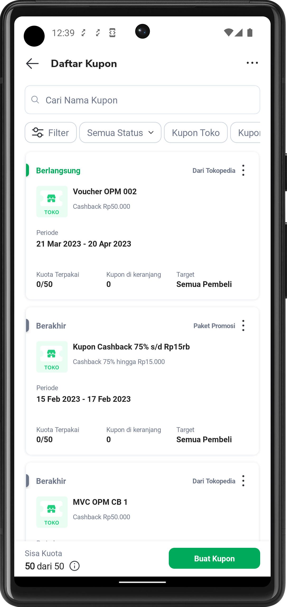<br/> | In the **voucher list page**, seller can see their created voucher along with the status of the voucher. Seller can also search, filter and execute various action for selected items. |
| Voucher Detail Page | 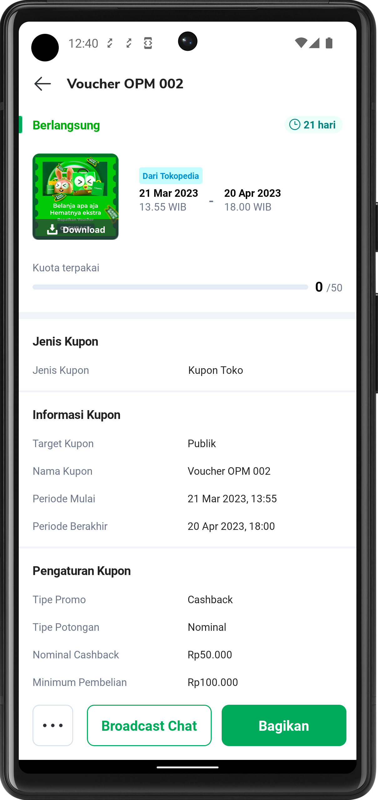<br/> | When clicking one of the voucher, seller will be navigated to the **voucher detail page**, where information about the selected voucher is shown in a more detailed manner. Seller also can do various action based on the voucher status. |
| Voucher Creation Step 1 | <br/> | When seller want to create a voucher, they have to go through **voucher creation page**. The voucher creation page consist of 3 to 4 steps, depends on what type of voucher they want to create (indicated by “Langkah 1 dari 3”) on top of the page. First thing first when entering the voucher creation page, seller will be navigated tothe **voucher creation step 1**, in this step seller need to choose the voucher type before continuing to the next step. |
| Voucher Creation Step 2 | 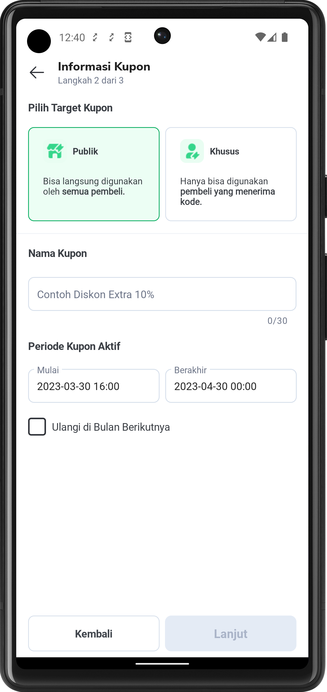<br/> | In **voucher creation step 2** seller need to fill out the voucher information consist of a few mandatory fields. Each of the input given will be validated and show the error message under the corresponding input field. The button **Lanjut** will not be enabled until all input are correctly inserted. |
| Voucher Creation Step 3 | 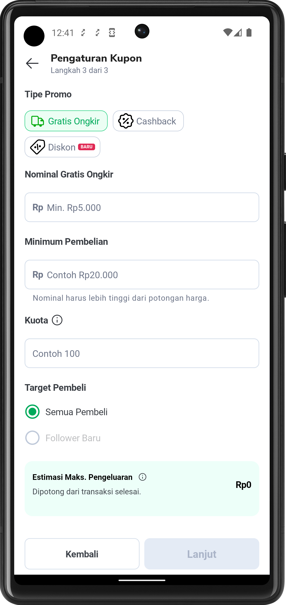<br/> | In **voucher creation step 3** seller is required to fill out the voucher settings. Various field and input condition will be adjusted based on data inserted by seller from the previous steps. Input validation is also implemented, Button **Lanjut** will not be enabled until all corresponding field are correctly filled out. |
| Tambah Produk Page | 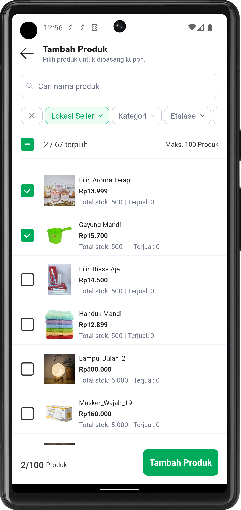<br/> | If seller is choosing **Kupon Produk** at the **voucher creation step 1,** the last step before finishing create voucher is to go through **voucher creation step 4.** In this step seller need to add the product they want to attach the voucher to. |
| Daftar Produk Page | 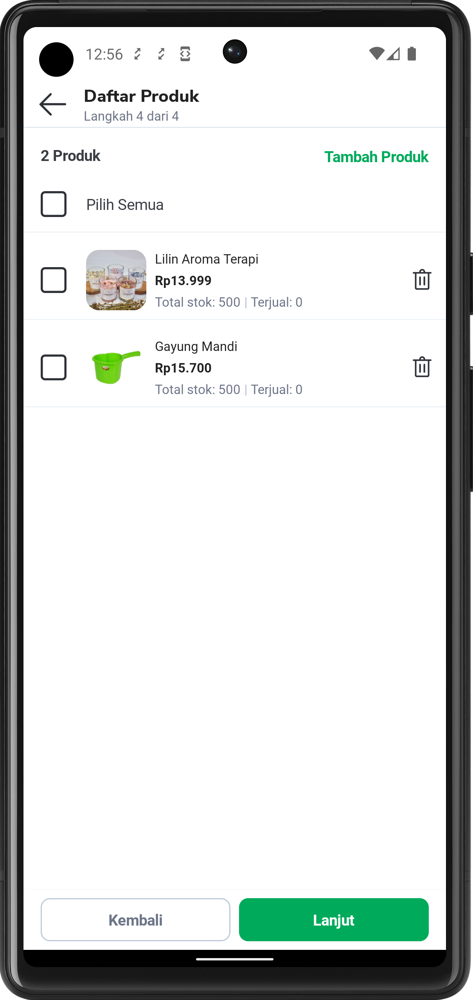<br/> | After adding the product, seller need to register the product that they have added. In this page seller can add or delete the listed product. |
| Voucher Summary Page | 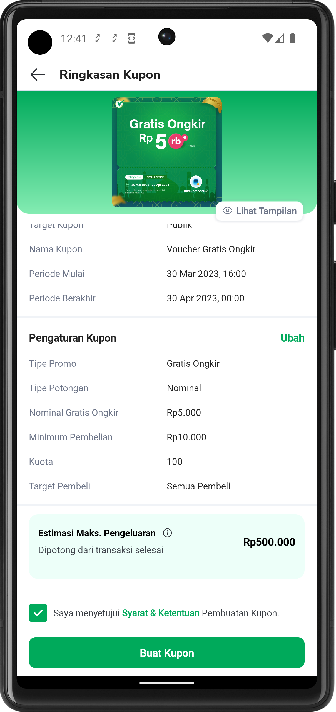<br/> | After finishing all the voucher creation steps, seller will be navigated to the **voucher summary page.** This page will show and summarize the voucher data that seller will create based on the inserted data in **voucher creation page**. Seller still can change the data from each step just by clicking “**ubah**” from the corresponding section or if seller has ensure that all data is correct, voucher will be validated & created when button “**Buat Kupon**“ is clicked. |


---

## Tech Stack

- Dagger
- Kotlin
- MVVM
- Flow
- GQL
- Mockk


---

## GQL List


| **GQL Name** | **Link** |
| --- | --- |
| getInitiateVoucherPage | [getInitiateVoucherPage](/wiki/spaces/OS/pages/1046259851/getInitiateVoucherPage)  |
| merchantPromotionCreateMV |  [merchantPromotionCreateMV](/wiki/spaces/OS/pages/1046257450/merchantPromotionCreateMV)  |
| merchantPromotionUpdateMV | [MerchantPromotionUpdateMV](/wiki/spaces/OS/pages/1048514352/MerchantPromotionUpdateMV)  |
| merchantPromotionUpdateStatusMV | [merchantPromotionUpdateStatusMV](/wiki/spaces/OS/pages/1958876943/merchantPromotionUpdateStatusMV)  |
| merchantPromotionGetMVList | [MerchantPromotionGetMVList](/wiki/spaces/OS/pages/1048514211/MerchantPromotionGetMVList)  |
| merchantPromotionGetChildMVList | [MerchantPromotionGetChildMVList](/wiki/spaces/OS/pages/2003961238/MerchantPromotionGetChildMVList)  |
| merchantPromotionGetMVDataByID | [merchantPromotionGetMVDataByID](/wiki/spaces/OS/pages/1046257338/merchantPromotionGetMVDataByID)  |
| merchantPromotionGetQuotaUsage | [MerchantPromotionGetQuotaUsage](/wiki/spaces/OS/pages/2049446085/MerchantPromotionGetQuotaUsage)  |
| voucherValidationPartial | [VoucherValidationPartial](/wiki/spaces/OS/pages/1046708640/VoucherValidationPartial)  |
| merchantVoucher | [Merchant Voucher](/wiki/spaces/OS/pages/1046708970/Merchant+Voucher)  |
| GQLProductList | [GQL ProductList](/wiki/spaces/MC/pages/656903551/GQL+ProductList)  |
| getProductV3 | [[Query] getProductV3](/wiki/spaces/MC/pages/702482912)  |
| GQLProductListMeta | [GQL ProductListMeta](/wiki/spaces/MC/pages/669877876/GQL+ProductListMeta)  |
| shopShowcaseGQL | [Shop Showcase GQL](/wiki/spaces/MC/pages/738857426/Shop+Showcase+GQL)  |
| getShopByID | [Get By Shop ID](/wiki/spaces/LG/pages/978093820/Get+By+Shop+ID)  |


---

## Flow Diagram

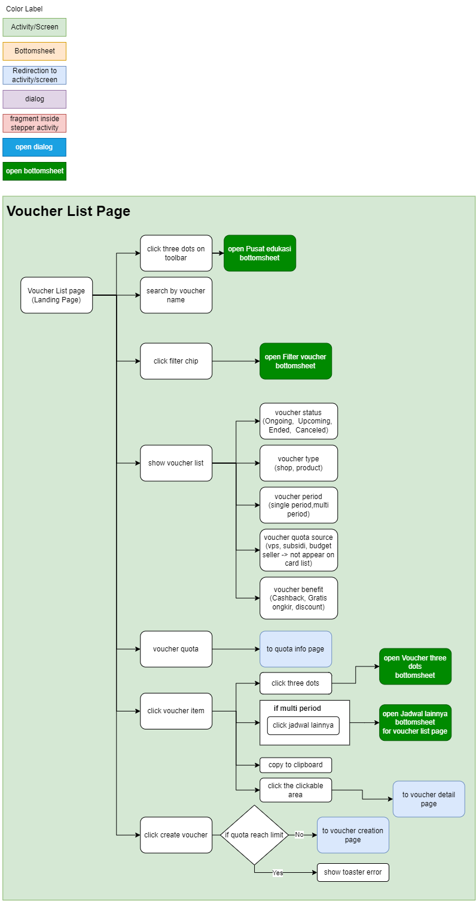

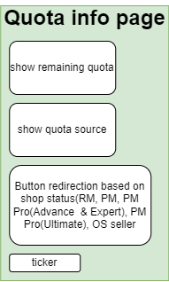

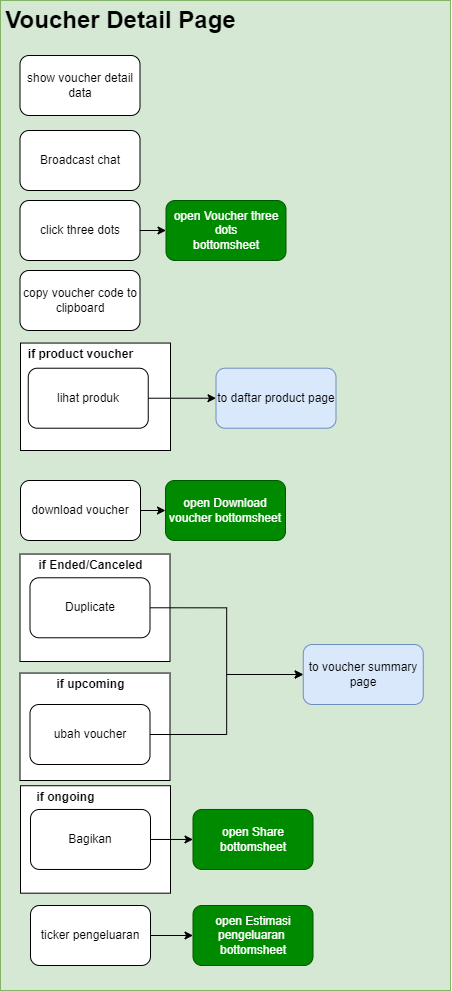

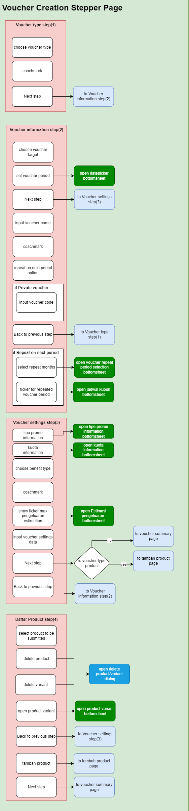

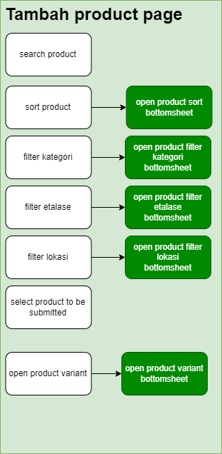

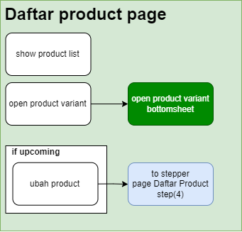


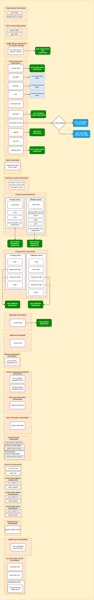

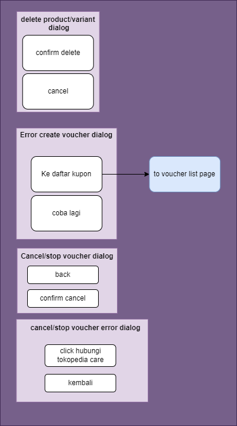


---

## Navigation

There are two ways to access the ***Merchant Voucher Creation (MVC)*** menu, here’s how you can access it 

1. **Applink**  
The first way is by using applink, Merchant Voucher Creation (MVC) can be accessed using this applink 


```
**Will redirect to Voucher List Page**
sellerapp://seller-mvc/list

**Will redirect to Voucher creation step 1 and choosing voucher product**
sellerapp://seller-mvc/create/product

**Will redirect to Voucher creation step 1 and choosing voucher shop**
sellerapp://seller-mvc/create/shop

**Will redirect to Intro Page**
sellerapp://seller-mvc/intro
```
2. **Menu**

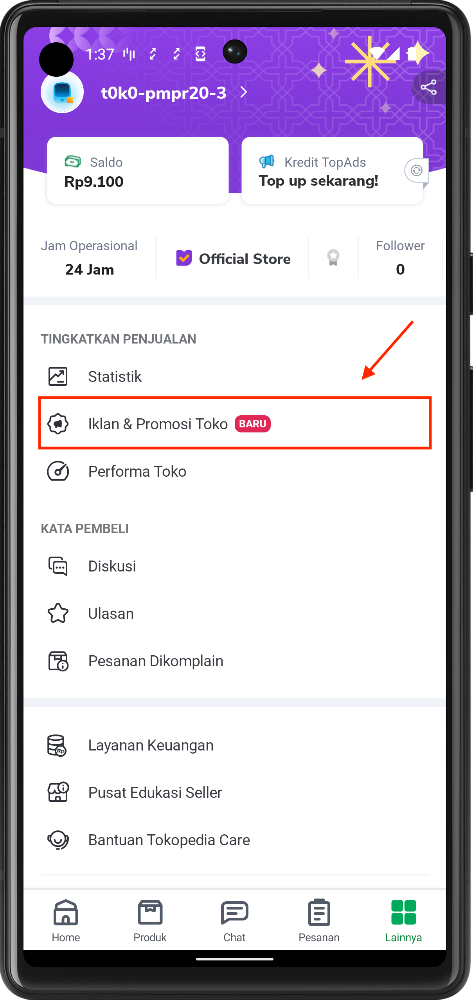

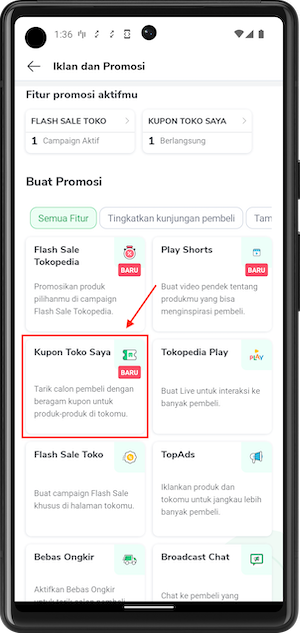

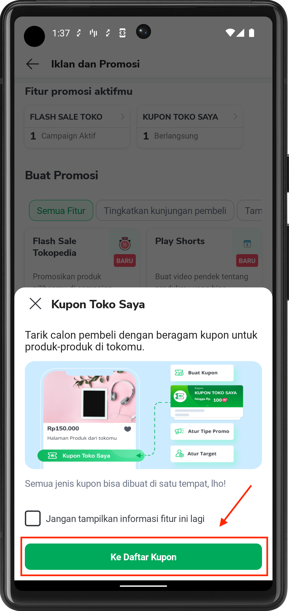


---

## How-to

- Open the page via Applink → use [RouteManager](https://tokopedia.atlassian.net/wiki/spaces/PA/pages/1419983437/Applink+Library#How-to-use-library) class. You can also test the AppLink via the [Developer Options](#) page.
- Compile this module → just choose the `features:merchant:seller_mvc_creation` module from [Switch to Testapp](https://tokopedia.atlassian.net/wiki/spaces/PA/pages/1428784251/Testapp+Build+Plugin) menu (please install the Switch to Testapp plugin first, find the plugin on [Testapp Build & Plugin](#)).


---

## Action Items

- Create `.toLongOrString()`
- Increase UT coverage


---

## Useful Links

- [Tech Plan](https://docs.google.com/document/d/1Yyqcr_i3VbMUigoX-HYNpzBo8-kHhPbiKVbmBW6sxus/edit)
- [Flow diagram](https://drive.google.com/file/d/10H6xA93hK077_LArIDhq-InWs-hchG1_/view)
- [Figma](https://www.figma.com/file/s7tCl4koVvbe8iO8hjYsId/%5BM%5D-MVC-Revamp-2022?node-id=1%3A5983)
- [Test Case](https://docs.google.com/spreadsheets/d/1Pnr_zj4qv8rpW6s9Gha7e1E4Vu4IPjC9G7JPWmKsweE/edit#gid=0)
- [Thanos](https://mynakama.tokopedia.com/datatracker/requestdetail/view/3597)
- [RouteManager](https://tokopedia.atlassian.net/wiki/spaces/PA/pages/1419983437/Applink+Library#How-to-use-library)
- [Switch to Testapp](https://tokopedia.atlassian.net/wiki/spaces/PA/pages/1428784251/Testapp+Build+Plugin)
- [Testapp Build & Plugin](#)
