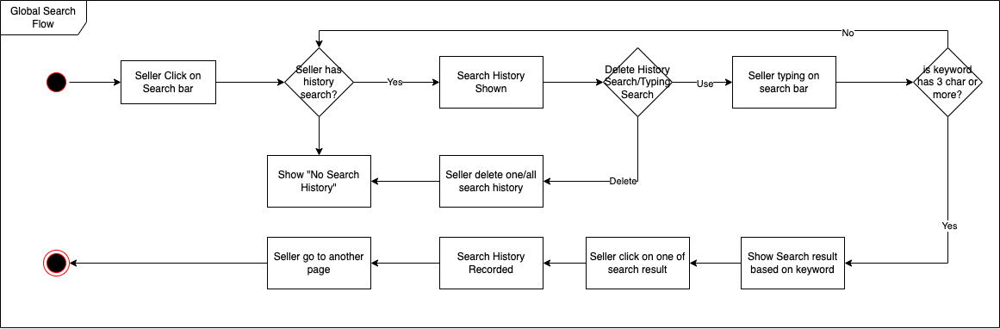
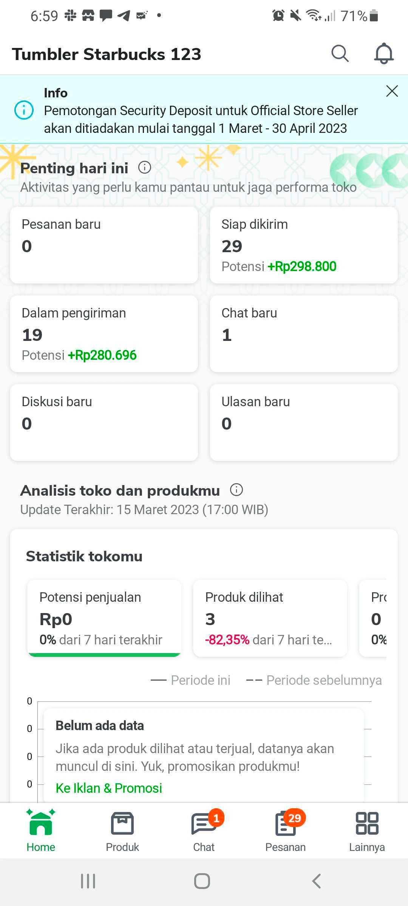
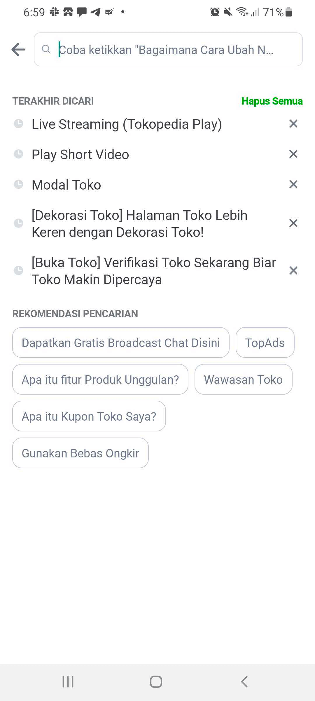
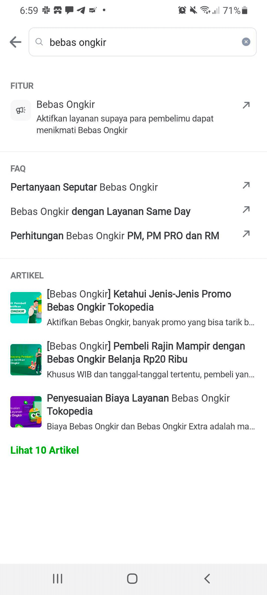

| **Status**      | <!--start status:GREEN-->RELEASE<!--end status-->                                                                                                                                                             |
|-----------------|---------------------------------------------------------------------------------------------------------------------------------------------------------------------------------------------------------------|
| Contributors    | [M Ilham Jamaludin](https://tokopedia.atlassian.net/wiki/people/5c87306ea329a40b8555c1ca?ref=confluence) [Rizqi Aryansa](https://tokopedia.atlassian.net/wiki/people/5e25ee87006fae0ca232e1ac?ref=confluence) |
| Product Manager | [Joshua Ghibran](https://tokopedia.atlassian.net/wiki/people/70121:7d12fd85-be0a-4d0c-a14e-8279fe20ff69?ref=confluence)                                                                                       |
| Team            | [Minion Stuart](https://tokopedia.atlassian.net/people/team/eeba862a-bd9d-472c-b901-415b15b1a37e?ref=directory&src=peopleMenu)                                                                                |
| Release date    | 17 Jul 2020 / <!--start status:GREY-->SA-2.14<!--end status-->                                                                                                                                                |
| Module type     | <!--start status:YELLOW-->FEATURE<!--end status-->                                                                                                                                                            |
| Product PRD     | [[Merchant Platform] Global Search (MVP)](/wiki/spaces/~354932339/pages/754942179)  [[Merchant Platform] Global Search v2](/wiki/spaces/~354932339/pages/754942191)                                       |
| Module Location | `features/merchant/seller_search`                                                                                                                                                                             |

## Table of Contents

- [Table of Contents](https://tokopedia.atlassian.net/wiki/spaces/PA/pages/2194474435/Seller+Search#Table-of-Contents)
- [Overview](https://tokopedia.atlassian.net/wiki/spaces/PA/pages/2194474435/Seller+Search#Overview)
	- [Background](https://tokopedia.atlassian.net/wiki/spaces/PA/pages/2194474435/Seller+Search#Background)
	- [Solution](https://tokopedia.atlassian.net/wiki/spaces/PA/pages/2194474435/Seller+Search#Solution)
- [Release Notes](https://tokopedia.atlassian.net/wiki/spaces/PA/pages/2194474435/Seller+Search#Release-Notes)
- [Flow Chart](https://tokopedia.atlassian.net/wiki/spaces/PA/pages/2194474435/Seller+Search#Flow-Chart)
- [Pages](https://tokopedia.atlassian.net/wiki/spaces/PA/pages/2194474435/Seller+Search#Pages)
- [Tech Stack](https://tokopedia.atlassian.net/wiki/spaces/PA/pages/2194474435/Seller+Search#Tech-Stack)
- [Navigation](https://tokopedia.atlassian.net/wiki/spaces/PA/pages/2194474435/Seller+Search#Navigation)
- [Useful Links](https://tokopedia.atlassian.net/wiki/spaces/PA/pages/2194474435/Seller+Search#Useful-Links)

## Overview

Global Search is a feature that would enable sellers that access the seller dashboard to search for any seller-related terms/aspects that are available (ex: navigations, products, orders). Within Global Search has some use cases which are:

- Sellers are able to see search history with blank keywords or keywords that are less than three characters.
- Sellers are able to see search results with keywords that have three or more characters.
- Sellers are able to click on one of the search result items to be redirected to another page.
- Sellers are able to click "Lihat Semua" to see more search results.
- Sellers are able to click "Hapus Semua" to remove their entire search history.
- Sellers are able to click the close [x] icon to remove individual search history items.

### Background

As seller's awareness of the seller dashboard is [very low](https://docs.google.com/presentation/d/1yWs_0E8IPfKofjCLsN3DVDyrgVZjkJSJ0IrfifQEgkc/edit#slide=id.g507b4b1a77_0_156), navigating through its pages and exploring its capability could be overwhelming since:

1. There are [30+ pages](https://docs.google.com/spreadsheets/d/1wT2moKVNw9MaNDAlyn4LUqXape9GRo6BtNmYrmoV3S4/edit#gid=2002533239) (even more features) in the seller dashboard
2. Each page may have more than 1 entry point in the seller dashboard
3. Each feature may have multiple steps to access

With the Global Search feature being available, sellers could:

1. Find things on the seller dashboard faster (orders, products, navigations, etc.)
2. Get exposed to various features that they may haven't used before.

### Solution

Global Search's goal is to improve sellers' navigation experience by finding things faster. and also helpful for new seller who doesn’t have experience using the Seller App because sometimes they don’t know access navigation or feature within Seller App.

## Release Notes

<!--start expand:July, 17th 2020 (SA-2.14)-->
###### Global Search Release
PR: <https://github.com/tokopedia/android-tokopedia-core/pull/12655> 

Ticket: [AN-16750](https://tokopedia.atlassian.net/browse/AN-16750)
<!--end expand-->

## Flow Chart

Seller Search - Flow Chart

## Pages

Seller Search - Entry Point

Seller Search - History

Seller Search - Suggestion

## Tech Stack

1. MVVM + Use Case
2. Kotlin
3. Visitable Adapter + Diffutil
4. Coroutine Flow

## Navigation

| External Applink - Seller Search | `sellerapp://seller-search`                            |
|----------------------------------|--------------------------------------------------------|
| Internal Applink - Seller Search | `tokopedia-android-internal://sellerapp/seller-search` |

## Useful Links

| Supporting docs | Links                                                                                                                                                                                                                                                                                                                                                                                                                                                                                          |
|-----------------|------------------------------------------------------------------------------------------------------------------------------------------------------------------------------------------------------------------------------------------------------------------------------------------------------------------------------------------------------------------------------------------------------------------------------------------------------------------------------------------------|
| Figma           | <https://www.figma.com/file/NPfPyGl4ll4crrcpuhdUTL/%5BSeller-App%5D-All-screens?node-id=5632%3A29354&t=Szcf3vkJoaF1xvnW-0>                                                                                                                                                                                                                                                                                                                                                                     |
| GQL             | [GQL QUERIES](/wiki/spaces/CT/pages/702450818/GQL+QUERIES)  - `query sellerSearch`: [Search API](/wiki/spaces/CT/pages/697258223/Search+API) - `mutation deleteHistory` : [Remove History API](/wiki/spaces/CT/pages/696902205/Remove+History+API) - `mutation successSearch`: [Register Success Search API](/wiki/spaces/CT/pages/697908026/Register+Success+Search+API) - `query searchPlaceholder`: [Placeholder API](/wiki/spaces/CT/pages/819204256/Placeholder+API)  |
| Trackers        | <https://docs.google.com/spreadsheets/d/1AZjuQ_dg25EvEEWmE8MPMo0f1_DT4IyZPaNpt4cxidA/edit#gid=312411040>                                                                                                                                                                                                                                                                                                                                                                                       |

