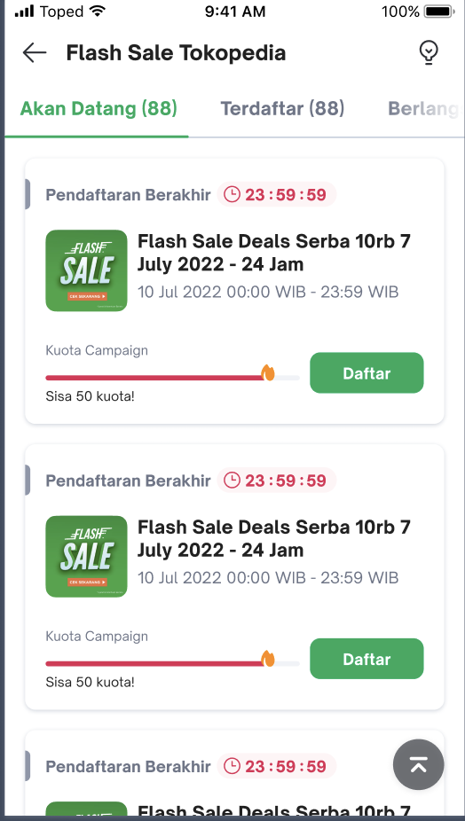
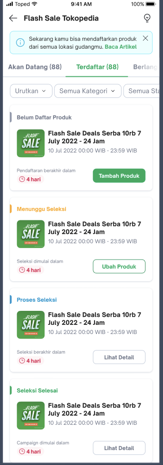
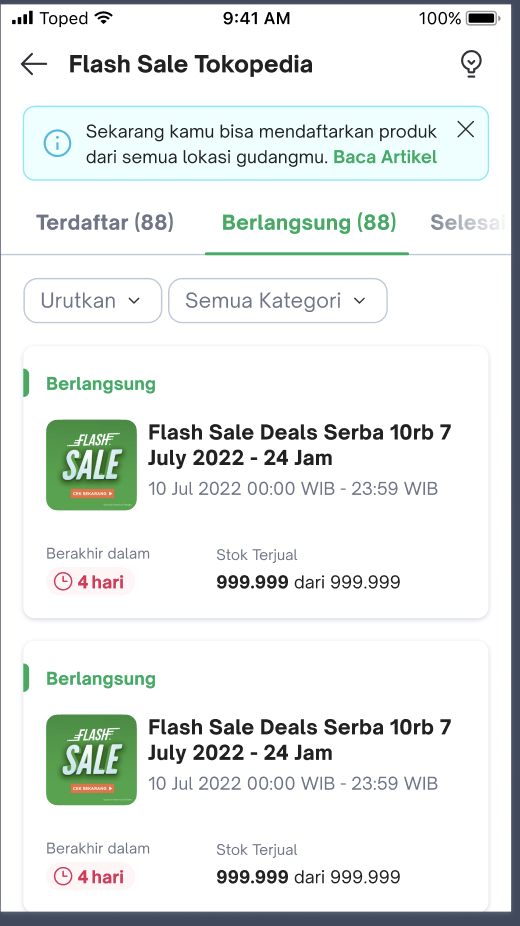
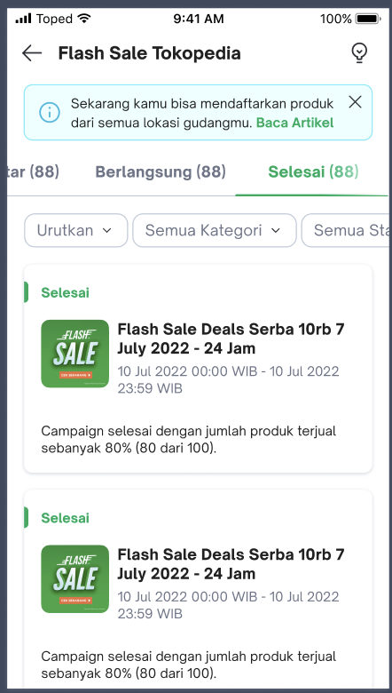
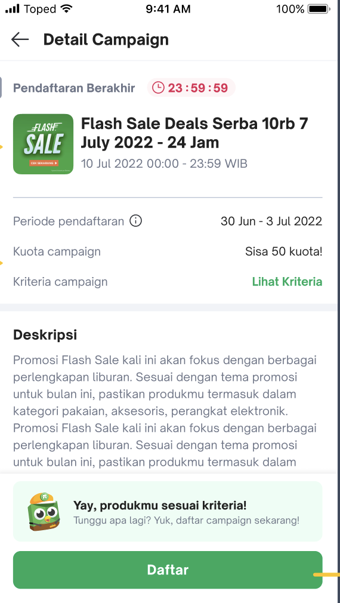
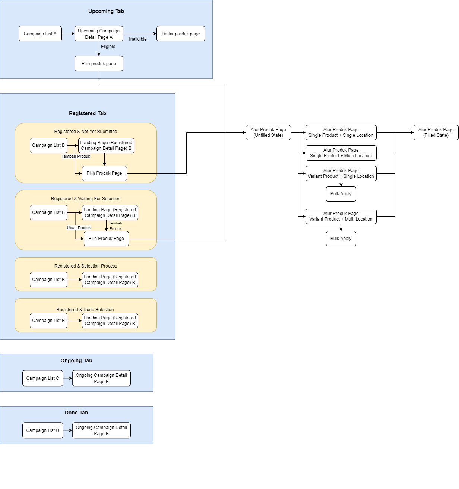

| **Status** |  <!--start status:GREEN-->RELEASE<!--end status-->  |
| --- | --- |
| Contributors | [Faisal Ramdani](https://tokopedia.atlassian.net/wiki/people/5def016f73b0bd0e4d82fa6e?ref=confluence) [Fajar Chaeril Azhar](https://tokopedia.atlassian.net/wiki/people/618873e3c23a4f006969b0de?ref=confluence) [Yuda Eka Putra](https://tokopedia.atlassian.net/wiki/people/6253583e9770e600716830da?ref=confluence) [Willybrodus Rangga Khaisar Purnama](https://tokopedia.atlassian.net/wiki/people/62cb5c393d382dfc9c5f11d2?ref=confluence) [CALVYN JULIAN](https://tokopedia.atlassian.net/wiki/people/5d1adf49cdf26a0d349c76ec?ref=confluence)  |
| Product Manager | [Ridaul Qibriya](https://tokopedia.atlassian.net/wiki/people/70121:c44a1920-6c97-4eba-82c4-25d0fe0047a7?ref=confluence)  |
| Team | [Minion Ken](https://tokopedia.atlassian.net/people/team/0ac7bdd0-19b2-4196-8711-b1a0a4b07178)  |
| Release date | - |
| Module type |  <!--start status:YELLOW-->FEATURE<!--end status-->  |
| Product PRD | [PRD](https://docs.google.com/document/d/1wx-WOEGCfwJKPkBkAPTAGnS_g179nSD0jQG-Jf_v6f4/edit#heading=h.i3gmugcvx478 ) |
| Module Location | `features.merchant` | `features/merchant/seller_tokopedia_flash_sale` |

## Table of Contents

<!--toc-->

## Overview

### Background

Accelerating hyperlocal expansion through localized campaign experiences and seller app parity

Throughout 2021, several “hyperlocal campaigns” have been carried out to provide local buyers with more selections of campaign products (e.g. Kejar Diskon for New Buyer, local Kejar Diskon, etc.), considering 73% of campaign products are still coming from Jabodetabek. The local campaign supply is mainly coming from RGX. Within 10 months, the number of campaign products in 14 hyperlocal cities have increased by 3x from 8k in Jan’21 to 27k in Oct’21 and orders have increased by 7x from 50k orders to 327k orders (~22% of overall KD orders). Seeing good traction from local sellers and buyers, in H1 we will accelerate the availability of good campaign products in hyperlocal areas by: 

Adding promotion tools in Seller App, starting with Slash Price and Flash Sale Toko in H1, considering 75% of active sellers outside Jabodetabek use Android with avg. time spent of 20 mins vs 13 mins on the Desktop. With this, we aim to increase participation from local sellers and available campaign products by 3x. To ensure these campaign products can be easily discovered by local buyers, we will combine these seller-side improvements with hyperlocal initiative from the front funnel to target campaign page entry points ‘based on the buyers’ location, boost campaign products from nearby locations and direct buyers to location/warehouse with the lowest Total Cost of Ownership (“TCO”)*.*

### Project Description

In **Flash Sale Tokopedia**, Invited Seller can join and register to the available flash sale from Tokopedia.  
In this feature seller can explore and navigate through various pages, that consist of : 


| **Tab Name** | **Screenshot** | **Description** |
| --- | --- | --- |
| **Campaign List (Upcoming)** | <br/> | seller can see the list of campaign that they can register to, inside the upcoming tab along with information such as remaining time that they have to submit the product and the campaign quota. |
| Campaign List (Registered) | <br/> | seller can see the list of campaign that they’ve submitted during in submission period (Terdaftar)  and see the status progress |
| Campaign List (Ongoing) | <br/> | seller can see the list of ongoing campaigns (Berlangsung) along with the information of stock sold and the countdown timer |
| Campaign List (Finished) | <br/> | Seller can see the list of finished campaign (Selesai) along with the status information |
| Campaign Detail | <br/> | In this page, seller will be given a more complete information about the campaign they choose from the campaign list page. Each of data shown inside the Campaign detail page will be vary, based on the campaign status. |
| Pilih Produk | <br/> | Pilih produk page will be opened when seller register to a campaign, in this page seller can choose products and its variant that they want to register to the campaign. |
| Atur Produk | <br/> | 1. Inside the atur produk page, list of product that the seller selected will be shown in a list. In order to register their product, seller have to fill the product and its variant data<br/> |


---

## Tech Stack

- Dagger
- Livedata
- Flow
- mockk
- GQL
- REST
- MVVM
- KOTLIN


---

## GQL List


| **Page** | **GQL Name** |
| --- | --- |
| Campaign List | - `getFlashSaleListForSellerMeta`<br/>- `getFlashSaleSellerStatus`<br/>- `getFlashSaleProductSubmissionProgress`<br/>- `getFlashSaleListForSeller`<br/>- `getFlashSaleForSellerCategoryList`<br/> |
| Campaign Detail Page | - `getFlashSaleSubmittedProductList`<br/>- `getFlashSaleListForSeller`<br/>- `getFlashSaleSellerStatus`<br/>- `doFlashSaleProductReserve`<br/>- `doFlashSaleProductDelete`<br/>- `doFlashSaleSellerRegistration`<br/>- `getFlashSaleProductSubmissionProgress`<br/>- `doFlashSaleProductSubmitAcknowledge`<br/> |
| Pilih Produk Page | - `getFlashSaleProductListToReserve`<br/>- `getFlashSaleProductPerCriteria`<br/>- `doFlashSaleProductReserve`<br/>- `getFlashSaleProductCriteriaChecking`<br/>- `getFlashSaleListForSeller`<br/> |
| Atur Produk Page | - `getFlashSaleReservedProductList`<br/>- `getFlashSaleListForSeller`<br/>- `doFlashSaleProductDelete`<br/>- `doFlashSaleProductSubmission`<br/>- `getFlashSaleProductSubmissionProgress`<br/>- `doFlashSaleProductSubmitAcknowledge`<br/>- `getFlashSaleProductCriteriaChecking`<br/> |


---

## Flow Diagram




---

## Navigation

There are two ways to access the ***Flash Sale Tokopedia*** menu, here’s how you can access it

1. **Applink**  
The first way is by using applink, ***Flash Sale Tokopedia*** have this 5 applinks, that can be used to navigate you directly to the flash sale list page or flash sale detail page.  
Here are the applink to access each respective page :


	1. ```
	sellerapp://tokopedia-flash-sale/upcoming
	```
	2. ```
	sellerapp://tokopedia-flash-sale/registered
	```
	3. ```
	sellerapp://tokopedia-flash-sale/ongoing
	```
	4. ```
	sellerapp://tokopedia-flash-sale/finished
	```
	5. ```
	sellerapp://tokopedia-flash-sale/detail/{campaignId}
	```
2. **Menu**


If you tick the checkbox, this prompt will not showing again

If no flash sale is available, than this list page will show an empty state, but if there's any flash sale available than the list will be shown in a form of card


---

## How-to

- Open the page via Applink → use [RouteManager](https://tokopedia.atlassian.net/wiki/spaces/PA/pages/1419983437/Applink+Library#How-to-use-library) class. You can also test the AppLink via the [Developer Options](#) page.
- Compile this module → just choose the `features:merchant:seller_tokopedia_flash_sale` module from [Switch to Testapp](https://tokopedia.atlassian.net/wiki/spaces/PA/pages/1428784251/Testapp+Build+Plugin) menu (please install the Switch to Testapp plugin first, find the plugin on [Testapp Build & Plugin](#)).


---

## Action Items

- Improve & maintain UT Coverage to above 96%


---

## Useful Links

- [Seller App Survey](https://docs.google.com/presentation/d/1yiTbKR_mnw7tG0xw1sdy_fgE19WrF79CRZOFYUfE2ao/edit#slide=id.g860c8fbf0b_0_164)
- [Figma](https://www.figma.com/file/d2tZnJfyTFdb4gnEtnlQke/%5BUI%2FUX-M%5D-Flash-Sale-Tokopedia-at-Seller-App?node-id=848%3A146311 )
- [Thanos](https://mynakama.tokopedia.com/datatracker/product/requestdetail/view/3486 )
- [PRD](https://docs.google.com/document/d/1wx-WOEGCfwJKPkBkAPTAGnS_g179nSD0jQG-Jf_v6f4/edit#heading=h.i3gmugcvx478)
- [RouteManager](https://tokopedia.atlassian.net/wiki/spaces/PA/pages/1419983437/Applink+Library#How-to-use-library)
- [Switch to Testapp](https://tokopedia.atlassian.net/wiki/spaces/PA/pages/1428784251/Testapp+Build+Plugin)
- [Testapp Build & Plugin](#)


---

