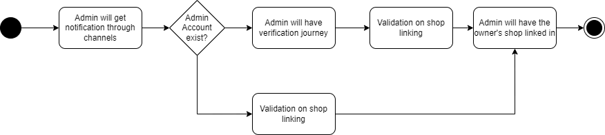
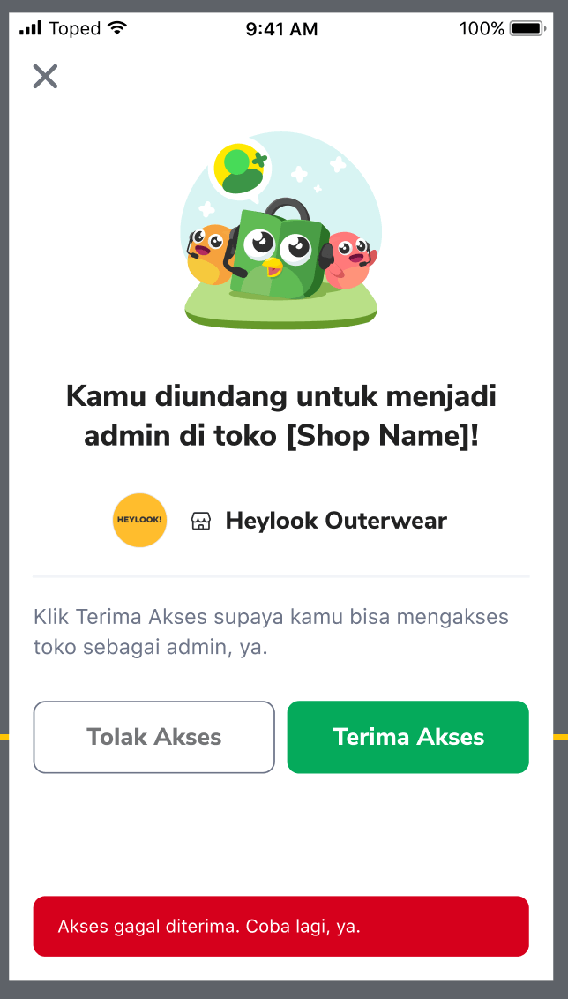
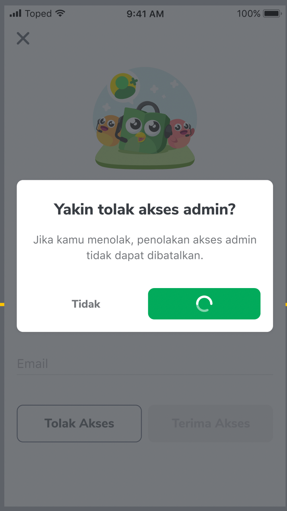
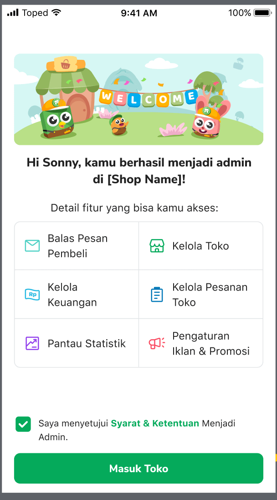

| **Status**      | <!--start status:GREEN-->RELEASE<!--end status-->                                                                              |
|-----------------|--------------------------------------------------------------------------------------------------------------------------------|
| Contributors    | [Rizqi Aryansa](https://tokopedia.atlassian.net/wiki/people/5e25ee87006fae0ca232e1ac?ref=confluence)                           |
| Product Manager | [Bradley Gunawan](https://tokopedia.atlassian.net/wiki/people/60d023f018e9f60071fa77ce?ref=confluence)                         |
| Team            | [Minion Stuart](https://tokopedia.atlassian.net/people/team/eeba862a-bd9d-472c-b901-415b15b1a37e?ref=directory&src=peopleMenu) |
| Release date    | 15 Jul 2022 / <!--start status:GREY-->MA-3.183<!--end status--> <!--start status:GREY-->SA-2.113<!--end status-->              |
| Module type     | <!--start status:YELLOW-->FEATURE<!--end status-->                                                                             |
| Product PRD     | <https://docs.google.com/document/d/1ePl4GWoiI2qFVLCu5ei-dl7HtpiBR4Q9lsxA-GERmH4/edit#>                                        |
| Module Location | `features/merchant/shop_admin`                                                                                                 |

## Table of Contents

- [Table of Contents](https://tokopedia.atlassian.net/wiki/spaces/PA/pages/2206663252/Shop+Admin+Mobile+Number+in+Admin+Journey#Table-of-Contents)
- [Overview](https://tokopedia.atlassian.net/wiki/spaces/PA/pages/2206663252/Shop+Admin+Mobile+Number+in+Admin+Journey#Overview)
	- [Background](https://tokopedia.atlassian.net/wiki/spaces/PA/pages/2206663252/Shop+Admin+Mobile+Number+in+Admin+Journey#Background)
- [Release Notes](https://tokopedia.atlassian.net/wiki/spaces/PA/pages/2206663252/Shop+Admin+Mobile+Number+in+Admin+Journey#Release-Notes)
- [Flow Chart](https://tokopedia.atlassian.net/wiki/spaces/PA/pages/2206663252/Shop+Admin+Mobile+Number+in+Admin+Journey#Flow-Chart)
- [Pages](https://tokopedia.atlassian.net/wiki/spaces/PA/pages/2206663252/Shop+Admin+Mobile+Number+in+Admin+Journey#Pages)
- [Tech Stack](https://tokopedia.atlassian.net/wiki/spaces/PA/pages/2206663252/Shop+Admin+Mobile+Number+in+Admin+Journey#Tech-Stack)
- [Navigation](https://tokopedia.atlassian.net/wiki/spaces/PA/pages/2206663252/Shop+Admin+Mobile+Number+in+Admin+Journey#Navigation)
- [Useful Links](https://tokopedia.atlassian.net/wiki/spaces/PA/pages/2206663252/Shop+Admin+Mobile+Number+in+Admin+Journey#Useful-Links)

## Overview

The Mobile Number in Admin Journey is a feature that allows the admin to receive confirmation invitations from owners submitted via mobile phone, previously the invitation via email. The basic flow of the feature is as follows: the admin receives an invitation within the notification center of the customer app, and upon clicking the invitation, is redirected to an invitation confirmation page. Here, the admin can choose to accept or reject the invitation. If the admin accepts the invitation, they will be redirected to the admin onboarding page.

### Background

The current admin onboarding journey for new accounts in Tokopedia is broken in terms of mobile number validation. Despite requiring the activation of accounts, the current landing page doesn’t pass the mobile number validation into the current state, making it difficult for admins to add their mobile numbers to their accounts. This is creating a pain point for new accounts that will be admins. Additionally, the current mobile number verification page will be deprecated soon, which could potentially affect the admin creation journey. It’s important to ensure that the admin creation journey is not affected so that shop owners can continue to create new accounts for their admins in their shops.

## Release Notes

<!--start expand:July, 15th 2022 (MA-3.183/SA-2.113)-->
###### Admin Mobile Journey
PR: <https://github.com/tokopedia/android-tokopedia-core/pull/25449> 

Tickets: 
- [AN-35194](https://tokopedia.atlassian.net/browse/AN-35194)
- [AN-35195](https://tokopedia.atlassian.net/browse/AN-35195)
- [AN-35198](https://tokopedia.atlassian.net/browse/AN-35198)
- [AN-35199](https://tokopedia.atlassian.net/browse/AN-35199)
- [AN-35201](https://tokopedia.atlassian.net/browse/AN-35201)
- [AN-35204](https://tokopedia.atlassian.net/browse/AN-35204)
- [AN-35205](https://tokopedia.atlassian.net/browse/AN-35205)
- [AN-35257](https://tokopedia.atlassian.net/browse/AN-35257)
- [AN-35927](https://tokopedia.atlassian.net/browse/AN-35927)
- [AN-36246](https://tokopedia.atlassian.net/browse/AN-36246)
- [AN-38551](https://tokopedia.atlassian.net/browse/AN-38551)
<!--end expand-->

## Flow Chart

Admin View Journey

## Pages

Admin Invitation Confirmation - Input Email

Admin Invitation Confirmation - No Input Email

Admin Invitation Confirmation - Reject Dialog

Admin Invitation Accepted - Onboarding

## Tech Stack

1. MVVM + Use Case
2. Kotlin
3. Visitable Adapter
4. Coroutine Flow

## Navigation

| External Applink - Admin Invitation | - CustomerApp: `tokopedia://shop-admin/invitation-page` - SellerApp: `sellerapp://shop-admin/invitation-page`  |
| --- | --- |
| Internal Applink - Admin Invitation | `tokopedia-android-internal://marketplace/shop-admin/invitation-page` |
| External Applink - Admin Accepted | - CustomerApp: `tokopedia://shop-admin/accepted-page?shop_name={shop_name}` - SellerApp: `sellerapp://shop-admin/accepted-page?shop_name={shop_name}`  |
| Internal Applink - Admin Accepted | `tokopedia-android-internal://marketplace/shop-admin/accepted-page?shop_name={shop_name}` |

## Useful Links

| Supporting docs | Links |
| --- | --- |
| Figma | <https://www.figma.com/file/YmjL6GovOHqNQLX9GRxQSg/%E2%9C%85-Pengaturan-Admin?node-id=10703-314878&t=ykqYtIOTk1ir2LuG-0>  |
| GQL | - <https://tokopedia.atlassian.net/wiki/spaces/OS/pages/963324403/GQL+Admin#AdminConfirmationReg> - <https://tokopedia.atlassian.net/wiki/spaces/OS/pages/963324403/GQL+Admin#ValidateEmail> - <https://tokopedia.atlassian.net/wiki/spaces/OS/pages/963324403/GQL+Admin#GetAdminInfo> - <https://tokopedia.atlassian.net/wiki/spaces/OS/pages/963324403/GQL+Admin#GetAdminmanagementInfoList> - [Article Details](/wiki/spaces/PES/pages/939266209/Article+Details) - <https://tokopedia.atlassian.net/wiki/spaces/OS/pages/963324403/GQL+Admin#AdminConfirmationReg> - [Shop Info GQL](/wiki/spaces/MC/pages/578519558/Shop+Info+GQL)  |
| Trackers | <https://mynakama.tokopedia.com/datatracker/product/requestdetail/view/3175>  |

