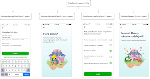
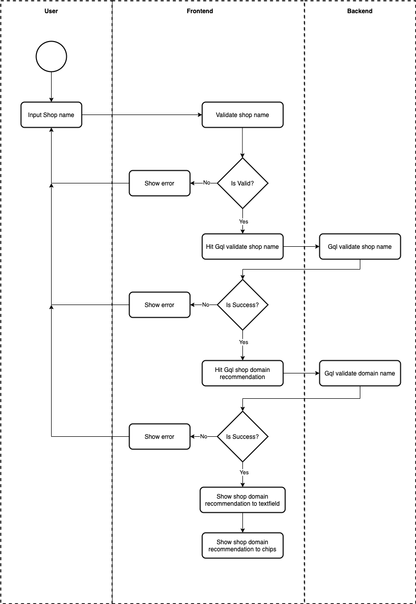
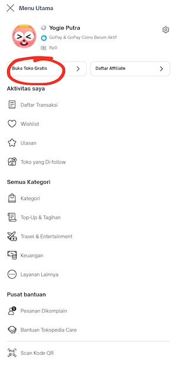

| **Status** | <!--start status:BLUE-->DEVELOPMENT<!--end status--> |
| --- | --- |
| **Project Lead** | [Yogie Susdyastama Putra](https://tokopedia.atlassian.net/wiki/people/5c6bf2e6f1a05835f933bf30?ref=confluence)  |
| Product Manager | [Bradley Gunawan](https://tokopedia.atlassian.net/wiki/people/60d023f018e9f60071fa77ce?ref=confluence) [Monica Marianes](https://tokopedia.atlassian.net/wiki/people/613e9e4fe057c6006a0fd233?ref=confluence)  |
| Team | [Minion Ken](https://tokopedia.atlassian.net/people/team/0ac7bdd0-19b2-4196-8711-b1a0a4b07178?ref=directory&src=peopleMenu)  |
| Release date |  /  |
| Module type | <!--start status:YELLOW-->FEATURE<!--end status-->  |
| Product PRD | [Merchant Onboarding](/wiki/spaces/TMA/pages/588055151/Merchant+Onboarding)  |
| Module Location | `features/merchant/shop_open` |

## Table of Contents

<!--toc-->

## Release Notes (max 5 latest release notes)

<!--start expand:12 Oct (MA-1.391/SA-2.91)-->
###### *You can describe the release notes according to the app version that shipped your updates. Let’s make it descending based on the date and please define the app version for both MA and SA.*
<!--end expand-->

## Overview

By using this feature, user can create shop account. 

### Background

We need this feature to accommodate our user to create a shop using their account. So by using this feature, our user can create a shop account & set their address for their shop.

### Project Description

This is a collaboration project between Shop tribe, User Tribe & Logistic Tribe. This documentation only focus on shop tribe scope.

## Tech Stack

- Dagger
- Coroutine
- Lottie

## Flow Diagram

`ShopOpenRevampActivity`

`1. ShopOpenRevampInputShopFragment`

`2. ShopOpenRevampSplashScreenFragment`

`3. ShopOpenRevampQuisionerFragment`

`4. ShopOpenRevampFinishFragment`

Diagram Flow:

## Navigation

**Using MA:**

1. Login use Account that doesn’t have Shop
2. Click Buka Toko Gratis
3. 
4. It will automatically redirected to the feature
5. 

**Using SA:**

1. Login use Account that doesn’t have Shop
2. After login successfully, it should be automatically redirected to the feature

**Using Applink:**

1. MA: 

	1. Open the landing page:
	
	
		1. External Applink: `tokopedia://buka-toko-online-gratis`
		2. Internal Applink: `tokopedia-android-internal://user/landing-shop-creation`
	2. Open the `ShopOpenRevampInputShopFragment` 
	
	
		1. Internal Applink: `tokopedia-android-internal://marketplace/shop-open`
2. SA: 

	1. Open the landing page:
	
	
		1. External Applink: `tokopedia://buka-toko-online-gratis`
		2. Internal Applink: `tokopedia-android-internal://user/landing-shop-creation`
	2. Open the `ShopOpenRevampInputShopFragment`
	
	
		1. Internal Applink: `tokopedia-android-internal://marketplace/shop-open`

---

## Action Items

- Implement DF for MainApp

## Useful Links

- Tech Plan: -
- Figma: <https://app.zeplin.io/project/5dd6662b9ef4c205df9984da/screen/5ddd20a166c5511f81ba6c23>   
<https://www.figma.com/file/b3NSDkg5WWBQAXzmU2L6oI/%5BM%5D---UI-Shop-Onboarding?node-id=0%3A1>
- Thanos: -
- Datalayer: <https://docs.google.com/spreadsheets/d/1kLO0Afu8qIZS1GAbZLvD_4kr2zfdIcyjo_R5UW2BFWI/edit#gid=1768868047>

## FAQ

<!--start expand:How can I test the complete journey of this feature?-->
First, You need to have a testing account that still have no shop. The flow will be like this:  
Create a new testing account → Create a new shop → Success (Now your testing account already have shop, you need to create a new testing account that don’t have any shop account whenever you want to test the journey).
<!--end expand-->

<!--start expand:Can I create the testing account?-->
Yes, you can go to [tokopedia.com](http://tokopedia.com) (both staging & production works fine) then create new testing account as much as you want, like these [yogie.putra+01@tokopedia.com](mailto:yogie.putra+01@tokopedia.com), [yogie.putra+02@tokopedia.com](mailto:yogie.putra+02@tokopedia.com)
<!--end expand-->

<!--start expand:Something needs to be aware of this testing account?-->
1 Phone number only limited to maximum 5 testing account. So, if you need to create more testing account & you already have 5 accounts linked to your existing phone number, then you need to link to another phone number or unlink/ delete your

 existing shop account
<!--end expand-->

<!--start expand:May I know the scope for User Tribe?-->
You may check the image below to get better understanding

<!--end expand-->

<!--start expand:What about the scope for Logistic tribe?-->
Again, it’s better to check this image

<!--end expand-->

<!--start expand:What will happen if I already created a shop and try to access the shop creation feature again?-->
In several entry points we already put some logic to validate whether the user already have shop or not. Incase the user already have shop account, then no entry point to this feature will be shown to the user, but you can still access the feature using applink (***see Navigation section***)
<!--end expand-->

